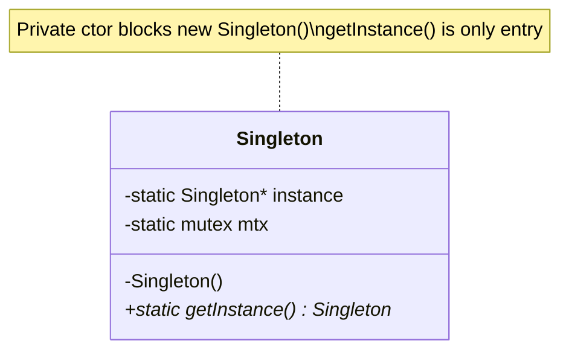
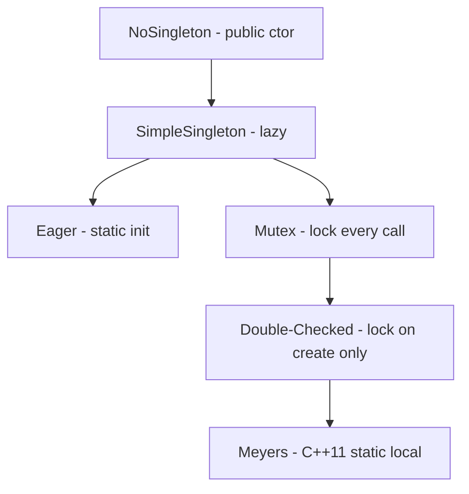

# Singleton Design Pattern — Detailed Guide

> **Creational Design Pattern** jo guarantee karta hai ki ek class ka **poori application lifecycle mein sirf ek hi instance** exist kare — aur us instance tak **global access point** (`getInstance()`) ho. Database pool, config manager, logger jaisi cheezein jahan **ek shared resource** chahiye wahan use hota hai.

**Domain example (is repo mein):** Progressive implementations — `NoSingleton` (problem demo) se lekar **lazy**, **eager**, **mutex locking**, aur **double-checked locking** tak.

**Core problem jo solve hota hai:** Client `new` se **multiple objects** bana de → memory waste, inconsistent state, shared resource conflicts.

---

## Table of Contents

1. [Problem kya hai? (Bina Singleton)](#1-problem-kya-hai-bina-singleton)
2. [Singleton Pattern kya hai?](#2-singleton-pattern-kya-hai)
3. [Real-World Analogy](#3-real-world-analogy)
4. [Key Participants (Three Pillars)](#4-key-participants-three-pillars)
5. [Implementation Variants (Is Repo)](#5-implementation-variants-is-repo)
6. [Eager vs Lazy vs Double-Checked](#6-eager-vs-lazy-vs-double-checked)
7. [Meyers' Singleton (C++11+)](#7-meyers-singleton-c11)
8. [Kab use karein / Kab na karein](#8-kab-use-karein--kab-na-karein)
9. [Fayde aur Nuksan](#9-fayde-aur-nuksan)
10. [SOLID & Testing — Interview Warnings](#10-solid--testing--interview-warnings)
11. [Folder Structure](#11-folder-structure)
12. [Code Implementation — File-by-File Walkthrough](#12-code-implementation--file-by-file-walkthrough)
13. [Execution Flow & Expected Output](#13-execution-flow--expected-output)
14. [Architecture Diagrams](#14-architecture-diagrams)
15. [Build & Run](#15-build--run)
16. [Singleton vs Related Patterns](#16-singleton-vs-related-patterns)
17. [Interview Talking Points](#17-interview-talking-points)
18. [Summary](#18-summary)

---

## 1. Problem kya hai? (Bina Singleton)

Jab constructor **public** ho, client jitne chahe objects bana sakta hai:

```cpp
// ❌ NoSingleton — har new par naya object
NoSingleton* s1 = new NoSingleton();  // Constructor called
NoSingleton* s2 = new NoSingleton();  // Constructor called AGAIN
cout << (s1 == s2);  // → 0 (false) — alag objects
```

| Problem | Detail |
| ------- | ------ |
| **Resource wastage** | Har object = nayi DB connection / file handle |
| **Data inconsistency** | Alag objects alag state — app-wide sync nahi |
| **Shared resource conflict** | Do loggers / config objects → race, corruption |
| **No central control** | Kaunsa object "official" hai — unclear |

**Singleton** instantiation **control** karta hai — sirf ek door (`getInstance()`).

---

## 2. Singleton Pattern kya hai?

**Singleton** teen cheezein enforce karta hai:

1. **Private constructor** — bahar se `new Singleton()` block
2. **Static instance holder** — memory mein ek hi object ka reference
3. **Static `getInstance()`** — wahi instance return, pehli baar create (variant par depend)

```cpp
// ✅ Singleton — dono pointers same object
Singleton* s1 = Singleton::getInstance();
Singleton* s2 = Singleton::getInstance();
cout << (s1 == s2);  // → 1 (true)
// Constructor sirf EK baar print hoga
```

> **Ek class, ek object, ek global access point.**

---

## 3. Real-World Analogy

### A. President / PM Office

Desh mein ek hi PM chair — sab policies usi office se. Do PM objects nahi.

### B. Database Connection Pool

App-wide **ek pool manager** — har request alag pool na banaye.

### C. Logger

Saari files/modules **ek hi logger** use karein — logs ek jagah, level consistent.

### D. Game Manager (Is repo — L23 Tic-Tac-Toe)

`GameManager` singleton — match queue, user pairing — ek hi coordinator.

### E. Printer Spooler (Classic GOF example)

Office mein **ek spooler** — saari print jobs usi queue se.

---

## 4. Key Participants (Three Pillars)

| Pillar | Role | Is Code Mein |
| ------ | ---- | ------------ |
| **Private Constructor** | Direct instantiation rokna | `Singleton() { ... }` in `private:` |
| **Static Instance** | Single object store | `static Singleton* instance` |
| **Static Access Method** | Global entry point | `static Singleton* getInstance()` |

```
Client
  │
  │  Singleton::getInstance()  (only way in)
  ▼
┌─────────────────┐
│    Singleton     │  ← exactly ONE object in memory
│  (private ctor)  │
└─────────────────┘
```

**Optional (thread-safe variants):**

| Extra | Purpose |
| ----- | ------- |
| `static mutex mtx` | Race condition avoid — multi-threaded lazy init |
| Double-check | Lock sirf jab `instance == nullptr` |

---

## 5. Implementation Variants (Is Repo)

Is folder mein **evolution order** mein 5 files hain:

| # | File | Type | Thread-Safe? | Kab seekho |
| - | ---- | ---- | ------------ | ---------- |
| 1 | `NoSingleton.cpp` | Anti-pattern demo | N/A | Problem samajhne ke liye |
| 2 | `SimpleSingleton.cpp` | **Lazy** (basic) | ❌ Single-thread only | Pehla working Singleton |
| 3 | `ThreadSafeEagerSingleton.cpp` | **Eager** | ✅ (static init) | Startup pe hi chahiye |
| 4 | `ThreadSafeLockingSingleton.cpp` | **Lazy + mutex** | ✅ Har call par lock | Safe but slower |
| 5 | `ThreadSafeDoubleLockingSingleton.cpp` | **Lazy + DCL** | ✅ Optimized | Production-style lazy |

```
NoSingleton          →  Problem (public ctor, 2 objects)
       ↓
SimpleSingleton      →  Private ctor + lazy getInstance
       ↓
ThreadSafeEager      →  Instance program start pe ban jata hai
       ↓
ThreadSafeLocking    →  Mutex har getInstance() par
       ↓
DoubleLocking        →  Lock sirf first creation par (mostly)
```

---

## 6. Eager vs Lazy vs Double-Checked

| Feature | **Eager** | **Lazy (Simple)** | **Lazy + Mutex** | **Double-Checked** |
| ------- | --------- | ----------------- | ---------------- | ------------------ |
| **Creation time** | Program startup | First `getInstance()` | First call (locked) | First call (minimal lock) |
| **Thread safety** | ✅ Static init | ❌ Race possible | ✅ | ✅ (with correct memory barriers) |
| **Runtime lock cost** | None | None | **Har call** par lock | Sirf creation time |
| **Memory** | Hamesha allocated | Jab tak call nahi, null | Same as lazy | Same as lazy |
| **Use when** | Small, always needed | Single-threaded apps | Simple MT safety | Heavy object, MT, lazy |

### Race Condition (Simple Lazy — kyun unsafe?)

```
Thread A: if (instance == nullptr)  → true
Thread B: if (instance == nullptr)  → true  (dono andar!)
Thread A: instance = new Singleton()
Thread B: instance = new Singleton()  → DO instances possible!
```

**Mutex** ya **eager init** ya **Meyers' Singleton** se fix.

### Double-Checked Locking Flow

```
getInstance():
  1. if (instance == nullptr)     ← bina lock (fast path after init)
  2.     lock(mutex)
  3.     if (instance == nullptr) ← doosri thread ne bana diya ho to skip
  4.         instance = new Singleton()
  5. return instance
```

Pehli creation ke baad step 1 fail → lock skip → **fast**.

---

## 7. Meyers' Singleton (C++11+)

Is repo ke demos **pointer-based** hain; modern C++ mein **Meyers' Singleton** prefer hota hai:

```cpp
class Singleton {
    Singleton() = default;
public:
    static Singleton& getInstance() {
        static Singleton instance;  // C++11: thread-safe lazy init
        return instance;
    }
    Singleton(const Singleton&) = delete;
    Singleton& operator=(const Singleton&) = delete;
};
```

| Fayda | Detail |
| ----- | ------ |
| **Implicit thread safety** | Compiler static local init guarantee |
| **No manual `new`/`delete`** | Memory leak risk kam |
| **Cleaner API** | Reference return — null pointer nahi |

> Interview mein bol sakte ho: "Production C++ mein Meyers' prefer; repo mein pointer variants pedagogy ke liye hain."

---

## 8. Kab use karein / Kab na karein

### ✅ Kab use karein

| Scenario | Example |
| -------- | ------- |
| **Exactly one instance** zaroori ho | Config, logger, connection pool |
| **Shared global state** controlled ho | Game manager, notification dispatcher |
| **Expensive object** ek baar banao | DB pool, cache manager |
| **Coordinate access** to shared resource | File spooler, hardware driver wrapper |

### ❌ Kab na karein

| Scenario | Reason |
| -------- | ------ |
| **Testing** important ho | Global state — unit tests interfere |
| **Multiple implementations** chahiye | DI / Factory better |
| **Hidden dependencies** problem ho | `getInstance()` everywhere = tight coupling |
| **Distributed system** | "One instance" per JVM/process alag — cluster mein Singleton illusion |
| **Overuse** | Har class ko Singleton mat banao — sirf jahan **sach mein ek** chahiye |

---

## 9. Fayde aur Nuksan

### Fayde (Pros)

| Fayda | Detail |
| ----- | ------ |
| **Controlled access** | Sirf `getInstance()` — instantiation ek jagah |
| **Lazy variants** | Heavy object jab tak use na ho, create nahi |
| **Memory save** | Ek hi instance — duplicate resources nahi |
| **Global consistency** | Ek config / ek logger state |
| **Eager simplicity** | No locks, thread-safe by static init |

### Nuksan (Cons)

| Nuksan | Detail |
| ------ | ------ |
| **Global state** | Kahi se bhi change — side effects |
| **Testing mushkil** | Mock inject karna hard — tests order-dependent |
| **Hidden coupling** | `Singleton::getInstance()` har jagah — DIP violate |
| **SRP violation risk** | God object ban sakta hai |
| **Multi-thread subtle bugs** | Naive lazy init, DCL without barriers (older C++) |
| **Lifetime / leak** | `new` in `getInstance()` without `delete` — leak unless careful |

---

## 10. SOLID & Testing — Interview Warnings

### SOLID tension

| Principle | Singleton impact |
| --------- | ---------------- |
| **SRP** | Often god object — logging + config + DB ek class mein |
| **DIP** | Client concrete `Singleton` par depend — interface + DI better for tests |
| **OCP** | Subclassing singleton awkward — extension hard |

### Testing problem

```cpp
// Test A
Singleton::getInstance()->setConfig("test");

// Test B (same process) — polluted!
Singleton::getInstance()->getConfig();  // still "test" from A
```

**Mitigation:** Interface inject karo, test double use karo, ya Meyers' + reset hook (careful in prod).

### Interview one-liner warning

> "Singleton = **global variable in disguise**. Use only when you **truly** need one instance — logger, config — not as default for every class."

---

## 11. Folder Structure

```
L10 Singleton_Design_Pattern/
├── README.md                                    ← Ye file — complete guide
└── C++ Code/
    ├── NoSingleton.cpp                          ← Problem: 2 objects (s1 != s2)
    ├── SimpleSingleton.cpp                      ← Basic lazy singleton
    ├── ThreadSafeEagerSingleton.cpp             ← Eager init at startup
    ├── ThreadSafeLockingSingleton.cpp           ← Mutex on every getInstance()
    ├── ThreadSafeDoubleLockingSingleton.cpp       ← Double-checked locking
    └── Markdown.md                              ← Variants summary (Hindi/English)
```

---

## 12. Code Implementation — File-by-File Walkthrough

### 12.1 `NoSingleton.cpp` — Problem Demo

Source: [`C++ Code/NoSingleton.cpp`](./C%20%2B%2B%20Code/NoSingleton.cpp)

```cpp
class NoSingleton {
public:
    NoSingleton() {
        cout << "Singleton Constructor called. New Object created." << endl;
    }
};

NoSingleton* s1 = new NoSingleton();
NoSingleton* s2 = new NoSingleton();
cout << (s1 == s2);  // 0 — DIFFERENT objects
```

**Point:** Public constructor → **no control** — anti-pattern baseline.

---

### 12.2 `SimpleSingleton.cpp` — Basic Lazy

Source: [`C++ Code/SimpleSingleton.cpp`](./C%20%2B%2B%20Code/SimpleSingleton.cpp)

```cpp
class Singleton {
private:
    static Singleton* instance;
    Singleton() { cout << "Singleton Constructor called" << endl; }

public:
    static Singleton* getInstance() {
        if (instance == nullptr)
            instance = new Singleton();
        return instance;
    }
};

Singleton* Singleton::instance = nullptr;
```

| Element | Role |
| ------- | ---- |
| `private` ctor | `new Singleton()` compile error |
| `static instance` | Holds the one object |
| `if (nullptr)` | **Lazy** — pehli `getInstance()` par create |

**Warning:** Multi-threaded program mein **unsafe** — do threads do instance bana sakte hain.

---

### 12.3 `ThreadSafeEagerSingleton.cpp` — Eager Init

Source: [`C++ Code/ThreadSafeEagerSingleton.cpp`](./C%20%2B%2B%20Code/ThreadSafeEagerSingleton.cpp)

```cpp
static Singleton* getInstance() {
    return instance;  // already created — no null check
}

Singleton* Singleton::instance = new Singleton();  // BEFORE main runs
```

**Kya hota hai:** Static initializer **program load** pe object bana deta hai — `main()` se pehle.

| Pros | Cons |
| ---- | ---- |
| No runtime lock | Object hamesha memory mein — use na ho tab bhi |
| Thread-safe (static init) | Startup time thoda badh sakta hai |

---

### 12.4 `ThreadSafeLockingSingleton.cpp` — Mutex Every Call

Source: [`C++ Code/ThreadSafeLockingSingleton.cpp`](./C%20%2B%2B%20Code/ThreadSafeLockingSingleton.cpp)

```cpp
static Singleton* getInstance() {
    lock_guard<mutex> lock(mtx);  // critical section
    if (instance == nullptr)
        instance = new Singleton();
    return instance;
}
```

**Safe** — lekin instance ban chuka hone ke **baad bhi** har `getInstance()` par lock → overhead.

---

### 12.5 `ThreadSafeDoubleLockingSingleton.cpp` — Optimized Lazy

Source: [`C++ Code/ThreadSafeDoubleLockingSingleton.cpp`](./C%20%2B%2B%20Code/ThreadSafeDoubleLockingSingleton.cpp)

```cpp
static Singleton* getInstance() {
    if (instance == nullptr) {              // 1st check — no lock
        lock_guard<mutex> lock(mtx);
        if (instance == nullptr) {          // 2nd check — inside lock
            instance = new Singleton();
        }
    }
    return instance;
}
```

**Idea:** Creation ke baad outer `if` false → lock skip → **fast path**.

> Production C++: prefer **Meyers'** over raw DCL + `new`; agar pointer chahiye to `std::call_once` bhi common hai.

---

## 13. Execution Flow & Expected Output

### NoSingleton

| Step | Output |
| ---- | ------ |
| `new NoSingleton()` × 2 | Constructor **2 baar** |
| `s1 == s2` | `0` |

```
Singleton Constructor called. New Object created.
Singleton Constructor called. New Object created.
0
```

### All Singleton variants (Simple, Eager, Locking, DCL)

| Step | Output |
| ---- | ------ |
| First `getInstance()` | Constructor **1 baar** |
| Second `getInstance()` | Constructor **nahi** |
| `s1 == s2` | `1` |

```
Singleton Constructor called    // (wording varies per file)
1
```

---

## 14. Architecture Diagrams

### Class Structure (Typical Singleton)



### Evolution Flow



### getInstance() — Double-Checked (First Call)

```
Thread 1                          Thread 2
   │                                 │
   ├─ instance == nullptr? YES       │
   ├─ acquire lock                   ├─ instance == nullptr? YES
   ├─ instance == nullptr? YES       ├─ wait for lock...
   ├─ create instance                │
   ├─ release lock                   ├─ acquire lock
   │                                 ├─ instance == nullptr? NO → skip
   └─ return instance                └─ return same instance
```

---

## 15. Build & Run

Har file alag compile hoti hai (same class name — ek saath link mat karo):

```bash
cd "L10 Singleton_Design_Pattern/C++ Code"

# Problem demo
g++ -std=c++17 -o no_singleton_demo NoSingleton.cpp && ./no_singleton_demo

# Basic lazy
g++ -std=c++17 -o simple_singleton_demo SimpleSingleton.cpp && ./simple_singleton_demo

# Eager
g++ -std=c++17 -o eager_singleton_demo ThreadSafeEagerSingleton.cpp && ./eager_singleton_demo

# Mutex every call
g++ -std=c++17 -o locking_singleton_demo ThreadSafeLockingSingleton.cpp && ./locking_singleton_demo

# Double-checked
g++ -std=c++17 -o dcl_singleton_demo ThreadSafeDoubleLockingSingleton.cpp && ./dcl_singleton_demo
```

> Kuch files `#include <bits/stdc++.h>` use karti hain — portable build ke liye `<iostream>`, `<mutex>` enough hain.

---

## 16. Singleton vs Related Patterns

| Approach | Focus | Singleton se Farq |
| -------- | ----- | ----------------- |
| **Static class / namespace** | No instance, only static methods | No object lifecycle; Singleton **object** behaviors allow |
| **Factory** | **Kaunsa class** instantiate | Singleton **kitne objects** — orthogonal |
| **Dependency Injection** | Dependencies **inject** | Testable; Singleton often **hidden global** |
| **Monostate** | Shared static data, **multiple objects** | Same data, different instances — rare pattern |
| **Service Locator** | Registry se service lookup | Similar global access smell — DI preferred |

### When NOT to confuse

| Need | Use |
| ---- | --- |
| Sirf utility functions, no state | Static class / namespace |
| Multiple types, one creation point | Factory |
| One instance + testability | Interface + DI container, instance lifetime managed |
| One instance + C++ simplicity | **Meyers' Singleton** |

### Is Repo Mein Singleton Kahan Use Hota Hai

| Project | Example |
| ------- | ------- |
| **L10 (ye folder)** | All thread-safe variants |
| **L14 Notification_Engine** | Central engine / config |
| **L23 Tic-Tac-Toe** | `GameManager` |
| **L26** | Shared coordinator |
| **Logger LLD** | Single logger instance |

---

## 17. Interview Talking Points

1. **One-liner:** "Singleton ensures one instance and global access — private ctor, static instance, getInstance."

2. **Three pillars:** Private constructor, static holder, static accessor.

3. **Lazy vs Eager:** "Lazy = on first use; Eager = at startup — trade memory vs lock complexity."

4. **Thread safety:** "Naive lazy unsafe; mutex safe but slow; DCL optimizes; Meyers' best in modern C++."

5. **Anti-pattern warning:** "Global state hurts tests — don't Singleton everything."

6. **vs static class:** "Singleton is an object — inheritance, polymorphism possible; static class isn't."

7. **Double-checked:** "Two null checks — lock only when creating; know Meyers' is simpler in C++11."

8. **Distributed:** "Singleton per process — not cluster-wide one instance."

---

## 18. Summary

| Pehlu | Detail |
| ----- | ------ |
| **Pattern Type** | Creational |
| **Core Idea** | Ek class → ek instance → `getInstance()` |
| **Is Repo ka Path** | 5 C++ files — problem → lazy → eager → mutex → DCL |
| **Main Problem Solved** | Multiple instances, resource waste, inconsistent state |
| **Main Fayda** | Controlled global access, one expensive resource |
| **Main Risk** | Global state, testing pain, overuse |
| **Production C++ tip** | Prefer **Meyers' Singleton** over manual `new` + DCL |
| **Key Files** | [`SimpleSingleton.cpp`](./C%20%2B%2B%20Code/SimpleSingleton.cpp), [`ThreadSafeDoubleLockingSingleton.cpp`](./C%20%2B%2B%20Code/ThreadSafeDoubleLockingSingleton.cpp) |

> **Yaad rakho:** Singleton **office ka ek hi master key** hai — sab same door se andar; duplicate keys (objects) se lock system bigad jata hai. 🔑

---

## Further Reading (Is Folder Mein)

| File | Content |
| ---- | ------- |
| [`C++ Code/Markdown.md`](./C%20%2B%2B%20Code/Markdown.md) | Variants, eager vs lazy table, Meyers' note — Hindi/English summary |
