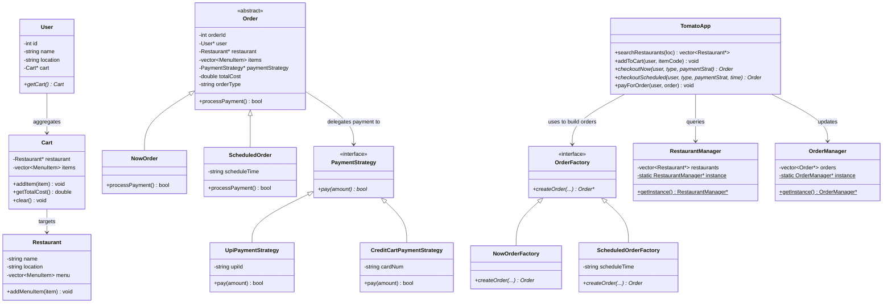

# Tomato App (Food Delivery System): Design Patterns Analysis

Is document me `/Users/shubham/Desktop/LLD/L11 Food_Delivery_LLD/C++ Code/Tomato` codebase me use hone wale sabhi design patterns ko detail me explain kiya gaya hai.

---

## Quick Summary (Overview of Patterns)

Tomato (Zomato/Swiggy clone) application me structural scalability aur operational decoupling achieve karne ke liye **4 major Design Patterns** ka use kiya gaya hai:

| Pattern Name | Category | Purpose in Tomato App |
| :--- | :--- | :--- |
| **1. Facade Pattern** | Structural | Complex subsystems (Restaurant Manager, Order Manager, Factories, and Payment Strategies) ko hide karke ek unified simplified wrapper interface (`TomatoApp`) provide karne ke liye. |
| **2. Factory Method Pattern** | Creational | Execution type ke basis par dynamic orders (`NowOrder` ya `ScheduledOrder`) initialize karne ke liye. |
| **3. Strategy Pattern** | Behavioral | Runtime par flexible payment modes check-ins (UPI, Credit Card) dynamic run karne ke liye. |
| **4. Singleton Pattern** | Creational | Central databases registries (`RestaurantManager`, `OrderManager`) ke dynamic single instances maintain karne ke liye. |

---

## Architectural Interaction Diagram



---

## Detailed Analysis of Design Patterns

### 1. Facade Design Pattern (Structural)

#### Intent
Unified interface provide karna subsystem interfaces ke group ke liye. Facade higher-level wrapper interface define karta hai jo subsystem ko easier-to-use banata hai.

#### Tomato me implementation
* `TomatoApp` class acts as the **Facade**.
* Subsystems:
  * `RestaurantManager` (Restaurant indexing/searching logic)
  * `OrderManager` (Order database mapping storage)
  * `OrderFactory` (Order instantiation workflow)
  * `NotificationService` (Receipt reporting notifications)
* Client code (`main.cpp`) ko internal factories ya manager mutex systems ko manage nahi karna padta. Client simple `tomato->searchRestaurants()`, `tomato->addToCart()`, aur `tomato->payForOrder()` call karta hai aur Facade internally steps coordinate karta hai.

---

### 2. Factory Method Design Pattern (Creational)

#### Intent
Define an interface for creating an object, but let subclasses decide which class to instantiate. Factory Method lets a class defer instantiation to subclasses.

#### Tomato me implementation
* **Abstract Creator**: `OrderFactory` interface defines `createOrder()`.
* **Concrete Creators**:
  * `NowOrderFactory`: Creates a `NowOrder` subclass instance.
  * `ScheduledOrderFactory`: Creates a `ScheduledOrder` subclass instance with custom dynamic delivery coordinates.
* **Abstract Product**: `Order` base class.
* **Concrete Products**: `NowOrder` and `ScheduledOrder`.
* `TomatoApp::checkout()` methods me factory objects parameter inject hote hain (Dependency Injection) to dynamically compile desired orders.

```cpp
Order* checkoutNow(User* user, const string& orderType, PaymentStrategy* paymentStrategy) {
    return checkout(user, orderType, paymentStrategy, new NowOrderFactory()); // Now factory passed
}
```

---

### 3. Strategy Design Pattern (Behavioral)

#### Intent
Family of algorithms/logics ko wrap karna aur runtime par interchangeability enable karna.

#### Tomato me implementation
* **Strategy Interface**: `PaymentStrategy` with `pay(double amount)`.
* **Concrete Strategies**:
  * `UpiPaymentStrategy` (UPI ID validation checks)
  * `CreditCartPaymentStrategy` (Card configuration rules)
* Jab checkouts run hote hain, client specific strategy passes karta hai. `Order` object dynamic runtime logic select karke payment run trigger karta hai:
```cpp
bool Order::processPayment() {
    return paymentStrategy->pay(totalCost);
}
```

---

### 4. Singleton Design Pattern (Creational)

#### Intent
Class ke single instance ko guarantee karna aur system endpoints me constant values protect karna.

#### Tomato me implementation
* `RestaurantManager` and `OrderManager` are Singletons.
* Thread safety ensure karne ke liye code me **Double-Checked Locking (DCL)** with `std::mutex` follow kiya gaya hai:
```cpp
static RestaurantManager* getInstance() {
    if (instance == nullptr) { // 1st Check (lock avoided if initialized)
        lock_guard<mutex> lock(mtx);
        if (instance == nullptr) { // 2nd Check
            instance = new RestaurantManager();
        }
    }
    return instance;
}
```
Isse concurrent requests me data corruption/duplicate initialization handle ho jati hai.
