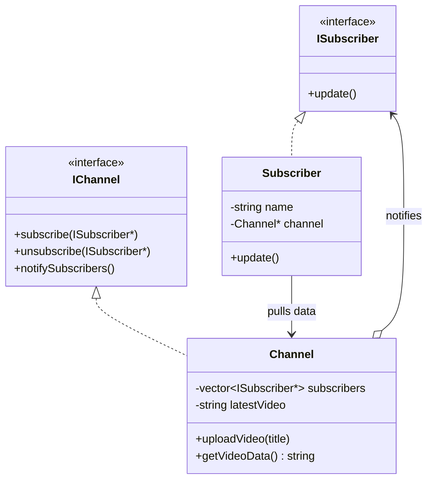
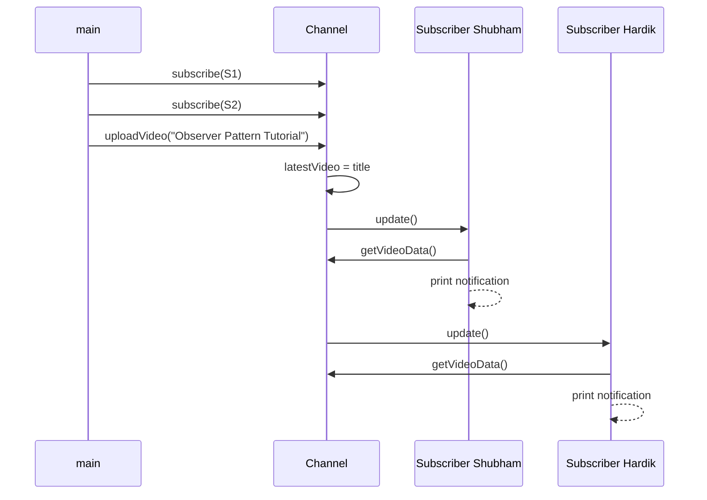

# Observer Design Pattern — Detailed Guide

> **Behavioral Design Pattern** jo **one-to-many dependency** define karta hai — jab **Subject** (YouTube channel) ka state change hota hai, saare registered **Observers** (subscribers) automatically notify ho jaate hain. Subject ko har observer ki concrete class ki zaroorat nahi — sirf `ISubscriber` interface chahiye.

**Domain example (is repo mein):** YouTube-style notification — `Channel` par `Subscriber` subscribe karte hain; naya video upload hone par sabko alert.

**Core problem jo solve hota hai:** **Polling** — observer baar-baar subject se poochta rehta hai _"kuch naya aaya?"_ — wasteful CPU/network, delayed updates.

---

## Table of Contents

1. [Problem kya hai? (Polling / Bina Observer)](#1-problem-kya-hai-polling--bina-observer)
2. [Observer Pattern kya hai?](#2-observer-pattern-kya-hai)
3. [Real-World Analogy](#3-real-world-analogy)
4. [Key Participants (UML Roles)](#4-key-participants-uml-roles)
5. [Push vs Pull Model](#5-push-vs-pull-model)
6. [Kab use karein / Kab na karein](#6-kab-use-karein--kab-na-karein)
7. [Fayde aur Nuksan](#7-fayde-aur-nuksan)
8. [SOLID Principles se Connection](#8-solid-principles-se-connection)
9. [Folder Structure](#9-folder-structure)
10. [Code Implementation — Detailed Walkthrough](#10-code-implementation--detailed-walkthrough)
11. [Execution Flow — Subscribe → Notify → Unsubscribe](#11-execution-flow--subscribe--notify--unsubscribe)
12. [Architecture Diagrams](#12-architecture-diagrams)
13. [Build & Run](#13-build--run)
14. [Observer vs Related Patterns](#14-observer-vs-related-patterns)
15. [Interview Talking Points](#15-interview-talking-points)
16. [Summary](#16-summary)

---

## 1. Problem kya hai? (Polling / Bina Observer)

Agar notification system **polling** se banayein:

```cpp
// ❌ Polling — subscriber har second check karta hai
while (true) {
    if (channel->hasNewVideo()) {
        showNotification(channel->getLatestVideo());
    }
    sleep(1);  // wasteful even when kuch nahi hua
}
```

| Problem | Detail |
| ------- | ------ |
| **Wasteful requests** | Change na ho tab bhi check hota rehta hai |
| **CPU & network load** | Har observer alag-alag poll kare — scale nahi hota |
| **Real-time nahi** | Poll interval ke beech delay |
| **Tight coupling** | Observer ko subject ki internal check logic samajhni padti hai |
| **N subscribers × M polls** | Load multiply hota hai |

**Observer** mein subject **khud push** karta hai jab **actually** state change hoti hai — event-driven, efficient.

---

## 2. Observer Pattern kya hai?

**Observer** ek **publish–subscribe** relationship hai:

1. **Subject** observers ki list maintain karta hai (`subscribe` / `unsubscribe`)
2. State change par subject **`notifySubscribers()`** call karta hai
3. Har **Observer** apna `update()` implement karta hai — alag reaction (email, SMS, console log)
4. Subject sirf **interface** se baat karta hai — concrete subscriber class ki dependency nahi

```cpp
// ✅ Observer — subject change par sabko ek shot mein alert
channel->subscribe(subs1);
channel->subscribe(subs2);
channel->uploadVideo("Observer Pattern Tutorial");  // → notify all subscribers
```

> **One change → many reactions** — loosely coupled broadcast.

---

## 3. Real-World Analogy

### A. YouTube Subscribe (Is repo ka example)

Channel video upload karta hai → saare subscribers ko notification. Unsubscribe karoge to agli video par alert nahi.

### B. Stock Market Alerts

Broker (subject) price change par sab registered apps (observers) ko update bhejta hai — har app apna UI update karta hai.

### C. MVC Architecture

**Model** = Subject, **View** = Observer. Data change → View automatically refresh.

### D. GUI Event Listeners

Button click = event; multiple listeners (observers) react — logging, analytics, UI update.

### E. Newsletter / RSS

Publisher ek baar publish karta hai; saare subscribers ko feed milti hai — central source, many consumers.

---

## 4. Key Participants (UML Roles)

| Role | Is Code Mein | Responsibility |
| ---- | ------------ | -------------- |
| **Subject (interface)** | `IChannel` | `subscribe`, `unsubscribe`, `notifySubscribers` contract |
| **Concrete Subject** | `Channel` | Subscriber list + state (`latestVideo`) + change par notify |
| **Observer (interface)** | `ISubscriber` | `update()` — notification receive karna |
| **Concrete Observer** | `Subscriber` | `update()` mein apna message print; subject se data pull |
| **Client** | `main()` | Channel/subscribers create, subscribe, trigger events |

```
Client
  │
  ▼
IChannel ◄────── Channel (Concrete Subject)
  │                  │
  │                  │ maintains list of
  ▼                  ▼
ISubscriber ◄── Subscriber (Concrete Observer)
                      │
                      └── holds reference → Channel*
```

---

## 5. Push vs Pull Model

| Model | Kaise kaam karta hai | Is code mein |
| ----- | -------------------- | ------------ |
| **Push** | Subject notification ke saath **poora data** bhejta hai | `notifySubscribers()` → `update()` call (minimal push — "kuch hua") |
| **Pull** | Subject sirf signal deta hai; Observer **khud data fetch** karta hai | `Subscriber::update()` → `channel->getVideoData()` |
| **Hybrid** | Signal push + data pull | ✅ Ye implementation — efficient + flexible |

```cpp
// Push part — Subject
void notifySubscribers() override {
    for (ISubscriber* sub : subscribers)
        sub->update();   // "something changed"
}

// Pull part — Observer
void update() override {
    cout << "Hey " << name << "," << channel->getVideoData();  // fetch latest
}
```

**Kab Push prefer karein:** Sab observers ko same data chahiye, subject data prepare kar sakta hai.  
**Kab Pull prefer karein:** Har observer alag slice chahta ho — subject ko detail bhejne ki zaroorat nahi.

---

## 6. Kab use karein / Kab na karein

### ✅ Kab use karein

| Scenario | Example |
| -------- | ------- |
| **Ek source, bahut saare listeners** | YouTube channel, stock ticker |
| **State change par auto-sync** | MVC View updates Model |
| **Runtime pe listeners add/remove** | Subscribe / unsubscribe |
| **Subject ko observers ki detail nahi chahiye** | Sirf `ISubscriber*` list |
| **Event-driven architecture** | Notifications, logging appenders |

### ❌ Kab na karein

| Scenario | Reason |
| -------- | ------ |
| **Sirf ek listener** | Direct callback / simple method call kaafi |
| **Bahut zyada observers + frequent updates** | `notify` loop bottleneck — batching / async queue chahiye |
| **Order of notification critical** | Observer order guarantee nahi — explicit pipeline use karo |
| **Complex many-to-many routing** | **Mediator** ya message **broker** (Pub/Sub) better |
| **Observers bhool kar unsubscribe na karein** | Memory leak ("lapsed listener") — weak refs / RAII |

---

## 7. Fayde aur Nuksan

### Fayde (Pros)

| Fayda | Detail |
| ----- | ------ |
| **Loose coupling** | Subject concrete `Subscriber` class se independent |
| **Dynamic subscription** | Runtime pe add/remove — code change nahi |
| **Open/Closed** | Naya observer type — `Channel` touch nahi |
| **Broadcast** | Ek `uploadVideo` → sab subscribers |
| **Polling se efficient** | Sirf change par work — event-driven |

### Nuksan (Cons)

| Nuksan | Detail |
| ------ | ------ |
| **Memory leaks** | Unsubscribe na kiya → subject list mein pointer reh jata hai |
| **Notification order** | Generally undefined — design accordingly |
| **Cascade updates** | Observer subject ko modify kare → infinite loop risk |
| **Performance** | Thousands of observers + frequent notify → slow |
| **Debugging** | Kaun trigger hua, kis order mein — trace mushkil |

---

## 8. SOLID Principles se Connection

### Open/Closed Principle (OCP)

- `Channel` **closed** — upload/notify logic stable
- `PremiumSubscriber` **open** — naya class `ISubscriber` implement, `Channel` edit nahi

### Single Responsibility Principle (SRP)

| Class | Ek responsibility |
| ----- | ----------------- |
| `Channel` | Video state + subscriber list + broadcast |
| `Subscriber` | User ko notification dikhana |

### Dependency Inversion Principle (DIP)

`Channel` high-level `ISubscriber*` par depend — concrete `Subscriber` par nahi.

### Interface Segregation (related)

`IChannel` aur `ISubscriber` alag interfaces — observer ko subscribe/unsubscribe methods nahi chahiye.

---

## 9. Folder Structure

```
L12 Observer_Design_Pattern/
├── README.md                              ← Ye file — complete guide
└── C++ Code/
    ├── ObserverDesignPattern.cpp          ← YouTube channel demo
    └── Markdown.md                        ← Pattern theory + workflow (English)
```

---

## 10. Code Implementation — Detailed Walkthrough

Source: [`C++ Code/ObserverDesignPattern.cpp`](./C%20%2B%2B%20Code/ObserverDesignPattern.cpp)

### 10.1 Observer Interface — `ISubscriber`

```cpp
class ISubscriber {
public:
    virtual void update() = 0;
    virtual ~ISubscriber() {}
};
```

**Kya hai:** Har listener ka contract — subject sirf `update()` call karega.  
**Note:** Pure virtual methods → C++ mein ise **interface** bhi bolte hain.

---

### 10.2 Subject Interface — `IChannel`

```cpp
class IChannel {
public:
    virtual void subscribe(ISubscriber* subscriber) = 0;
    virtual void unsubscribe(ISubscriber* subscriber) = 0;
    virtual void notifySubscribers() = 0;
    virtual ~IChannel() {}
};
```

**Kya hai:** Koi bhi "observable" entity ka blueprint — attach, detach, notify.

---

### 10.3 Concrete Subject — `Channel`

```cpp
class Channel : public IChannel {
private:
    vector<ISubscriber*> subscribers;
    string name;
    string latestVideo;

public:
    void subscribe(ISubscriber* subscriber) override {
        if (find(subscribers.begin(), subscribers.end(), subscriber) == subscribers.end())
            subscribers.push_back(subscriber);  // duplicate avoid
    }

    void unsubscribe(ISubscriber* subscriber) override {
        auto it = find(subscribers.begin(), subscribers.end(), subscriber);
        if (it != subscribers.end())
            subscribers.erase(it);
    }

    void notifySubscribers() override {
        for (ISubscriber* sub : subscribers)
            sub->update();
    }

    void uploadVideo(const string& title) {
        latestVideo = title;
        cout << "\n[" << name << " uploaded \"" << title << "\"]\n";
        notifySubscribers();   // state change → broadcast
    }

    string getVideoData() {
        return "\nCheckout our new Video : " + latestVideo + "\n";
    }
};
```

**Key points:**

- **`subscribers` vector** — observer registry
- **`uploadVideo`** — state change + automatic notify (template method style)
- **Duplicate check** on subscribe — same pointer do baar add nahi

---

### 10.4 Concrete Observer — `Subscriber`

```cpp
class Subscriber : public ISubscriber {
private:
    string name;
    Channel* channel;

public:
    Subscriber(const string& name, Channel* channel) { ... }

    void update() override {
        cout << "Hey " << name << "," << channel->getVideoData();
    }
};
```

**Kya hai:** User-specific reaction — subject se **pull** karke latest video title print.

**Coupling note:** `Subscriber` concrete `Channel*` hold karta hai (pull ke liye). Production mein `IChannel` interface ya event payload se loose kar sakte ho.

---

### 10.5 Client — `main()`

```cpp
Channel* channel = new Channel("Bhai_ki_padhai");
Subscriber* subs1 = new Subscriber("Shubham", channel);
Subscriber* subs2 = new Subscriber("Hardik", channel);

channel->subscribe(subs1);
channel->subscribe(subs2);
channel->uploadVideo("Observer Pattern Tutorial");

channel->unsubscribe(subs1);   // Shubham ab list mein nahi
channel->uploadVideo("Decorator Pattern Tutorial");
```

**Flow:** Do subscribers → pehli video dono ko → unsubscribe subs1 → doosri video sirf Hardik ko.

---

## 11. Execution Flow — Subscribe → Notify → Unsubscribe

### Phase 1: Setup & First Upload

| Step | Action | Result |
| ---- | ------ | ------ |
| 1 | `new Channel("Bhai_ki_padhai")` | Empty subscriber list |
| 2 | `subscribe(subs1)`, `subscribe(subs2)` | Vector mein 2 pointers |
| 3 | `uploadVideo("Observer Pattern Tutorial")` | `latestVideo` update → `notifySubscribers()` |
| 4 | Loop: `subs1->update()`, `subs2->update()` | Dono ko personalized message |

### Phase 2: Unsubscribe & Second Upload

| Step | Action | Result |
| ---- | ------ | ------ |
| 5 | `unsubscribe(subs1)` | Shubham pointer list se remove |
| 6 | `uploadVideo("Decorator Pattern Tutorial")` | Sirf `subs2->update()` — Hardik only |

### Sequence (Conceptual)

```
main → Channel::subscribe(Subscriber*)
main → Channel::uploadVideo(title)
         → latestVideo = title
         → notifySubscribers()
              → for each ISubscriber*: update()
                   → Subscriber::update()
                        → Channel::getVideoData()  [pull]
                        → print to console
```

### Expected Output

```

[Bhai_ki_padhai uploaded "Observer Pattern Tutorial"]
Hey Shubham,
Checkout our new Video : Observer Pattern Tutorial
Hey Hardik,
Checkout our new Video : Observer Pattern Tutorial

[Bhai_ki_padhai uploaded "Decorator Pattern Tutorial"]
Hey Hardik,
Checkout our new Video : Decorator Pattern Tutorial
```

---

## 12. Architecture Diagrams

### Class Diagram



### Sequence Diagram (First Upload)



### High-Level Architecture

```
┌─────────────┐
│   Client    │  subscribe / uploadVideo / unsubscribe
└──────┬──────┘
       │
       ▼
┌─────────────────┐
│     Channel      │  ← Concrete Subject
│  subscribers[]   │
│  latestVideo       │
└────────┬─────────┘
         │ notifySubscribers() → update()
         ▼
┌─────────────────┐     ┌─────────────────┐
│  Subscriber 1    │     │  Subscriber 2    │  ← Concrete Observers
│  (Shubham)       │     │  (Hardik)        │
└─────────────────┘     └─────────────────┘
```

---

## 13. Build & Run

```bash
cd "L12 Observer_Design_Pattern/C++ Code"
g++ -std=c++17 -o observer_demo ObserverDesignPattern.cpp
./observer_demo
```

---

## 14. Observer vs Related Patterns

| Pattern / Approach | Focus | Observer se Farq |
| ------------------ | ----- | ---------------- |
| **Polling** | Client baar-baar check karta hai | Wasteful; Observer **push on change** |
| **Mediator** | Objects ek **mediator** se baat karte hain | Observer: subject → observers direct broadcast |
| **Pub/Sub (Message Broker)** | Topic-based, often **async**, decoupled | Observer: usually in-process, subject knows observer list |
| **Chain of Responsibility** | Request ek chain mein pass — **ek** handler process kare | Observer: **sab** listeners notify hote hain |
| **Strategy** | Algorithm **replace** | Observer: **multiple** reactions same event par |
| **Event Bus** | Global dispatcher — sender ko receivers nahi pata | Observer: subject apni list maintain karta hai |

### Polling vs Observer

| Approach | Efficiency | Real-time | Coupling |
| -------- | ---------- | ----------- | -------- |
| **Polling** | ❌ Low (idle checks) | Delayed | Observer polls subject internals |
| **Observer** | ✅ Change-only work | Immediate on notify | Subject knows interface only |

### Is Repo Mein Observer Kahan Use Hota Hai

| Project | Example |
| ------- | ------- |
| **L12 (ye folder)** | YouTube channel subscribers |
| **L14 Notification_Engine** | Observers on notification events |
| **L31 / L33–34** | Group / system notifications |
| **WhatsApp / Job Scheduler LLD** | Status updates, job completion |
| **Logger** | Multiple appenders on log event |

---

## 15. Interview Talking Points

1. **One-liner:** "Observer one-to-many hai — subject state change par saare registered observers ko notify, loosely coupled."

2. **vs Polling:** "Polling wasteful; Observer event-driven push — sirf jab change ho."

3. **Push vs Pull:** "Push = data notification mein; Pull = observer khud fetch — is code mein hybrid."

4. **OCP:** "Naya `EmailSubscriber` add — `Channel` class change nahi."

5. **Memory leak:** "Unsubscribe zaroori — lapsed listener problem."

6. **Order:** "Notification order generally undefined — design mat depend karo."

7. **MVC:** "Model = Subject, View = Observer — quick real-world hook."

8. **Scale:** "Bahut observers + frequent notify → async queue / Pub-Sub consider karo."

---

## 16. Summary

| Pehlu | Detail |
| ----- | ------ |
| **Pattern Type** | Behavioral |
| **Core Idea** | Subject maintains observers; state change → `notify` → `update()` |
| **Is Repo ka Example** | `Channel` + `Subscriber` — YouTube-style alerts |
| **Main Problem Solved** | Polling waste — efficient event-driven notification |
| **Main Fayda** | Loose coupling, dynamic subscribe/unsubscribe, OCP |
| **Model in Code** | Hybrid Push (signal) + Pull (`getVideoData`) |
| **Key File** | [`C++ Code/ObserverDesignPattern.cpp`](./C%20%2B%2B%20Code/ObserverDesignPattern.cpp) |

> **Yaad rakho:** Observer **newsletter** jaisa hai — ek publisher, kitne chahe utne subscribers; unsubscribe kiya to agli edition nahi milegi. 📬

---

## Further Reading (Is Folder Mein)

| File | Content |
| ---- | ------- |
| [`C++ Code/Markdown.md`](./C%20%2B%2B%20Code/Markdown.md) | Polling vs Observer, lifecycle, push/pull, pitfalls — English deep dive |
