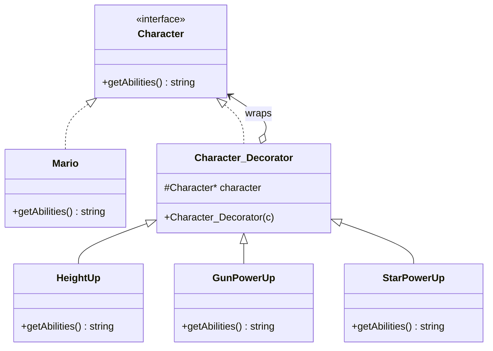

# Decorator Design Pattern — Detailed Guide

> **Structural Design Pattern** jo **runtime pe dynamically** kisi object par naye behavior/responsibilities add karta hai — bina uski existing class modify kiye. Ek hi base object (`Mario`) par multiple decorators stack karke unlimited combinations ban sakti hain.

**Domain example (is repo mein):** Mario game power-ups — `HeightUp`, `GunPowerUp`, `StarPowerUp` ko layer-by-layer `Mario` par wrap karna.

**Core problem jo solve hota hai:** Inheritance se **class explosion** — `n` features ke liye theoretically `2^n` subclasses (`MarioWithGun`, `MarioWithStarAndGun`, …).

---

## Table of Contents

1. [Problem kya hai? (Inheritance / Bina Decorator)](#1-problem-kya-hai-inheritance--bina-decorator)
2. [Decorator Pattern kya hai?](#2-decorator-pattern-kya-hai)
3. [Real-World Analogy](#3-real-world-analogy)
4. [Key Participants (UML Roles)](#4-key-participants-uml-roles)
5. [Is-A + Has-A — Decorator ka Core Logic](#5-is-a--has-a--decorator-ka-core-logic)
6. [Kab use karein / Kab na karein](#6-kab-use-karein--kab-na-karein)
7. [Fayde aur Nuksan](#7-fayde-aur-nuksan)
8. [SOLID Principles se Connection](#8-solid-principles-se-connection)
9. [Folder Structure](#9-folder-structure)
10. [Code Implementation — Detailed Walkthrough](#10-code-implementation--detailed-walkthrough)
11. [Execution Flow — Onion Layer Effect](#11-execution-flow--onion-layer-effect)
12. [Architecture Diagrams](#12-architecture-diagrams)
13. [Build & Run](#13-build--run)
14. [Decorator vs Related Patterns](#14-decorator-vs-related-patterns)
15. [Interview Talking Points](#15-interview-talking-points)
16. [Summary](#16-summary)

---

## 1. Problem kya hai? (Inheritance / Bina Decorator)

Mario game mein power-ups hain: **HeightUp**, **Gun**, **Star**. Agar **sirf inheritance** use karein:

```
Mario
MarioWithHeight
MarioWithGun
MarioWithStar
MarioWithHeightAndGun
MarioWithHeightAndStar
MarioWithGunAndStar
MarioWithHeightGunAndStar
... (aur bhi combinations)
```

**`n` power-ups → theoretically `2^n` subclasses** — class explosion!

| Problem | Detail |
| ------- | ------ |
| **Combinatorial explosion** | Har combination ke liye alag class |
| **Compile-time binding** | Runtime pe "sirf Gun add karo" mushkil |
| **Code duplication** | `MarioWithGun` aur `MarioWithGunAndStar` dono mein gun logic repeat |
| **Rigid hierarchy** | Naya power-up = bahut saari existing classes affect |
| **Open/Closed violate** | `Mario` class bar-bar edit hoti rehti |

```cpp
// ❌ Inheritance approach — 3 power-ups = 8 classes minimum
class MarioWithHeightAndGun : public Mario { ... };
```

---

## 2. Decorator Pattern kya hai?

**Decorator** ek **wrapper** hai jo:

1. **Same interface** implement karta hai jo base object karta hai (`Character`) — **Is-A**
2. **Andar ek reference** hold karta hai wrapped object ka — **Has-A**
3. Call aane par pehle **inner object** ko delegate karta hai, phir **apna behavior add** karta hai
4. **Runtime pe stack** ho sakta hai — onion ki tarah layers

```cpp
// ✅ Decorator — sirf n+1 classes for n power-ups
Character* mario = new Mario();
mario = new HeightUp(mario);
mario = new GunPowerUp(mario);
mario = new StarPowerUp(mario);
// → "Mario with HeightUp with Gun with Star Power (Limited Time)"
```

> **`n` power-ups = `1` base + `n` decorators = `n+1` classes** — scalable!

---

## 3. Real-World Analogy

### A. Coffee Shop (Sabse common)

- **Base:** Simple coffee (`Espresso`)
- **Decorators:** Milk add, Sugar add, Whipped cream add
- Order: `"Espresso + Milk + Sugar + Whip"`
- Har add-on ek **wrapper** — coffee object change nahi, layers add hoti hain

### B. Pizza Toppings

Base pizza → cheese layer → pepperoni layer → olives layer. Har topping **decorate** karti hai, nayi pizza class nahi banati.

### C. Stream I/O (Java / C++ iostream)

`fstream` = file stream decorated with buffering, encryption, compression layers — same `read/write` interface.

### D. UI Components

Button → `BorderDecorator` → `ScrollDecorator` → `ShadowDecorator`. Visual effects stack, base button same.

### E. Notification Pipeline (Is repo — L14)

Base notification → `EncryptionDecorator` → `RetryDecorator` → `RateLimitDecorator`. Har layer ek responsibility.

---

## 4. Key Participants (UML Roles)

| Role | Is Code Mein | Responsibility |
| ---- | ------------ | -------------- |
| **Component** | `Character` (interface) | Common interface — `getAbilities()` |
| **Concrete Component** | `Mario` | Base object — bina decoration ke |
| **Decorator** | `Character_Decorator` | Abstract wrapper — Is-A `Character`, Has-A `Character*` |
| **Concrete Decorator** | `HeightUp`, `GunPowerUp`, `StarPowerUp` | Specific behavior add karna |
| **Client** | `main()` | Objects create karke decorators stack karna |

```
Client
  │
  ▼
Character ◄────── Mario (Concrete Component)
  ▲
  │ implements
Character_Decorator (Decorator)
  ▲
  ├── HeightUp
  ├── GunPowerUp
  └── StarPowerUp
        │
        └── wraps → Character* (Mario OR another Decorator)
```

---

## 5. Is-A + Has-A — Decorator ka Core Logic

Decorator pattern **do relationships** par tikta hai:

### Is-A (Inheritance)

```cpp
class Character_Decorator : public Character { ... };
class HeightUp : public Character_Decorator { ... };
```

Decorator ko **kahin bhi `Character*` expect ho**, wahan use kar sakte ho — polymorphism.

### Has-A (Composition)

```cpp
class Character_Decorator : public Character {
protected:
    Character* character;   // wrapped object
};
```

Decorator **andar wrapped object** hold karta hai — `Mario` ho sakta hai ya `HeightUp` (already decorated).

### Call Flow (Delegation + Extension)

```cpp
string HeightUp::getAbilities() const override {
    return character->getAbilities() + " with HeightUp";
    //     ^^^^^^^^^^^^^^^^^^^^^^^^^ inner (delegate)
    //                               ^^^^^^^^^^^^^^ own addition
}
```

**Onion model:**

```
StarPowerUp
  └── GunPowerUp
        └── HeightUp
              └── Mario  →  "Mario"
```

`getAbilities()` call **andar se bahar** bubble hoti hai — pehle Mario, phir HeightUp append, phir Gun, phir Star.

---

## 6. Kab use karein / Kab na karein

### ✅ Kab use karein

| Scenario | Example |
| -------- | ------- |
| **Runtime pe behavior add** karna ho | Game power-ups, coffee toppings |
| **Inheritance se class explosion** ho rahi ho | `2^n` combinations |
| **Features independently on/off** ho sakti hon | User chooses toppings |
| **Single Responsibility** — har decorator ek feature | `GunPowerUp` sirf gun |
| **Same interface** chahiye decorated + undecorated | `Character*` everywhere |
| **Cross-cutting layers** | Logging, encryption, caching wrappers |

### ❌ Kab na karein

| Scenario | Reason |
| -------- | ------ |
| **Sirf ek fixed combination** | Simple subclass ya config kaafi |
| **Order of decorators matter nahi, sirf set** | Composite / bitmask better ho sakta hai |
| **Core object identity change** honi chahiye | Decorator same type return karta hai — different pattern chahiye |
| **Bahut deep nesting** | Debugging mushkil — limit depth, document order |
| **Decorators ko alag treat** karna ho client mein | Interface same hai — type check se bachna |

---

## 7. Fayde aur Nuksan

### Fayde (Pros)

| Fayda | Detail |
| ----- | ------ |
| **Class explosion solve** | `n+1` classes instead of `2^n` |
| **Runtime flexibility** | Decorators dynamically add/remove |
| **Open/Closed** | `Mario` closed for modification, open for extension |
| **Single Responsibility** | Har decorator ek feature |
| **Composable** | `new GunPowerUp(new HeightUp(mario))` — any order/stack |
| **Same interface** | Client code `Character*` se kaam kare — decorated ya not |

### Nuksan (Cons)

| Nuksan | Detail |
| ------ | ------ |
| **Many small classes** | Har feature = ek decorator class |
| **Object identity** | `mario == decoratedMario` false — wrapped object alag |
| **Debugging complexity** | Deep stack — kaunsa layer kya karta hai trace karna padta hai |
| **Order matters** | `HeightUp(Gun(mario))` vs `Gun(HeightUp(mario))` — design document karo |
| **Destructor chain** | Manual `new` chain mein sahi cleanup design karna zaroori |

---

## 8. SOLID Principles se Connection

### Open/Closed Principle (OCP)

- `Mario` **closed** — code change nahi
- `FireFlowerPowerUp` **open** — naya decorator class add, `Mario` touch nahi

### Single Responsibility Principle (SRP)

| Class | Ek responsibility |
| ----- | ----------------- |
| `Mario` | Base character represent karna |
| `GunPowerUp` | Gun ability add karna |
| `StarPowerUp` | Star power add karna |

### Liskov Substitution Principle (LSP)

`HeightUp` kahin bhi `Character*` ki jagah use ho sakta hai — client ko pata nahi chalna chahiye decorated hai ya base Mario.

---

## 9. Folder Structure

```
L13 Decorator_Design_Pattern/
├── README.md                              ← Ye file — complete guide
└── C++ Code/
    ├── DecoratorPattern.cpp               ← Mario power-ups demo
    └── Markdown.md                          ← Pattern theory summary
```

---

## 10. Code Implementation — Detailed Walkthrough

Source: [`C++ Code/DecoratorPattern.cpp`](./C%20%2B%2B%20Code/DecoratorPattern.cpp)

### 10.1 Component — `Character`

```cpp
class Character {
public:
    virtual string getAbilities() const = 0;
    virtual ~Character() {}
};
```

**Kya hai:** Common interface — Mario aur saare decorators isi type ke hain.  
**Method:** `getAbilities()` — character ki current abilities string mein return.

---

### 10.2 Concrete Component — `Mario`

```cpp
class Mario : public Character {
public:
    string getAbilities() const override {
        return "Mario";
    }
};
```

**Kya hai:** Base object — **zero decoration**.  
**Output:** `"Mario"` — onion ki sabse andar ki layer.

---

### 10.3 Abstract Decorator — `Character_Decorator`

```cpp
class Character_Decorator : public Character {
protected:
    Character* character;   // Has-A: wrapped component

public:
    Character_Decorator(Character* c) {
        this->character = c;
    }
};
```

**Design:**

| Aspect | Detail |
| ------ | ------ |
| `public Character` | **Is-A** — decorator bhi Character hai |
| `Character* character` | **Has-A** — kisi bhi Character ko wrap (Mario ya decorator) |
| `getAbilities()` not implemented | Abstract — concrete decorators implement karenge |
| `protected character` | Subclasses (`HeightUp`, etc.) inner object access karein |

**Flexibility:** `HeightUp` ke andar `Mario` ho sakta hai **ya** `GunPowerUp(Mario)` — infinite stacking.

---

### 10.4 Concrete Decorators

#### `HeightUp`

```cpp
class HeightUp : public Character_Decorator {
public:
    HeightUp(Character* c) : Character_Decorator(c) {}

    string getAbilities() const override {
        return character->getAbilities() + " with HeightUp";
    }
};
```

#### `GunPowerUp`

```cpp
class GunPowerUp : public Character_Decorator {
public:
    GunPowerUp(Character* c) : Character_Decorator(c) {}

    string getAbilities() const override {
        return character->getAbilities() + " with Gun";
    }
};
```

#### `StarPowerUp`

```cpp
class StarPowerUp : public Character_Decorator {
public:
    StarPowerUp(Character* c) : Character_Decorator(c) {}

    string getAbilities() const override {
        return character->getAbilities() + " with Star Power (Limited Time)";
    }

    ~StarPowerUp() {
        cout << "Destroying StarPowerUp Decorator" << endl;
    }
};
```

**Pattern har decorator mein same:**

1. Constructor — inner `Character*` pass (base decorator ko)
2. `getAbilities()` — inner call + apna text append
3. Optional — custom destructor (`StarPowerUp` demo ke liye)

---

### 10.5 Client — `main()` — Layer-by-Layer Wrapping

```cpp
Character* mario = new Mario();
cout << mario->getAbilities();                    // Mario

mario = new HeightUp(mario);
cout << mario->getAbilities();                    // Mario with HeightUp

mario = new GunPowerUp(mario);
cout << mario->getAbilities();                    // ... with Gun

mario = new StarPowerUp(mario);
cout << mario->getAbilities();                    // ... with Star Power

// Nested construction (same idea, ek line mein):
mario = new StarPowerUp(new GunPowerUp(new HeightUp(mario)));
```

**Pointer reassignment:** `mario` hamesha **outermost decorator** point karta hai — client ko andar ki chain ki knowledge nahi chahiye.

> **Learning line (line 97):** Code mein pehle se decorated `mario` ko dubara wrap kiya — isliye abilities **duplicate** print hoti hain. Ye intentional learning demo hai; production mein fresh `Mario` se start karo ya decorators alag manage karo.

---

## 11. Execution Flow — Onion Layer Effect

### Sequential Wrapping (main flow)

| Step | Code | Object Stack (outer → inner) | Output |
| ---- | ---- | ---------------------------- | ------ |
| 1 | `new Mario()` | Mario | `Mario` |
| 2 | `new HeightUp(mario)` | HeightUp → Mario | `Mario with HeightUp` |
| 3 | `new GunPowerUp(mario)` | Gun → HeightUp → Mario | `Mario with HeightUp with Gun` |
| 4 | `new StarPowerUp(mario)` | Star → Gun → HeightUp → Mario | `... with Star Power (Limited Time)` |

### `getAbilities()` Call Chain (Step 4)

```
StarPowerUp::getAbilities()
  → character->getAbilities()   // GunPowerUp
      → character->getAbilities()   // HeightUp
          → character->getAbilities()   // Mario → "Mario"
          ← "Mario" + " with HeightUp"
      ← "Mario with HeightUp" + " with Gun"
  ← "Mario with HeightUp with Gun" + " with Star Power (Limited Time)"
```

### Expected Output

```
Basic Character: Mario
After HeightUp: Mario with HeightUp
After GunPowerUp: Mario with HeightUp with Gun
After StarPowerUp: Mario with HeightUp with Gun with Star Power (Limited Time)

Just for learning :Mario with HeightUp with Gun with Star Power (Limited Time) with HeightUp with Gun with Star Power (Limited Time)
Destroying StarPowerUp Decorator
```

---

## 12. Architecture Diagrams

### Class Diagram



### Object Structure (After Full Stack)


### High-Level Architecture

```
┌─────────────┐
│   Client    │  Character* mario = new StarPowerUp(new GunPowerUp(...));
└──────┬──────┘
       │ getAbilities()
       ▼
┌─────────────────┐
│  StarPowerUp     │  ← Concrete Decorator (outer)
│  + Star behavior │
└────────┬────────┘
         ▼
┌─────────────────┐
│  GunPowerUp      │
└────────┬────────┘
         ▼
┌─────────────────┐
│  HeightUp        │
└────────┬────────┘
         ▼
┌─────────────────┐
│  Mario           │  ← Concrete Component (core)
└─────────────────┘
```

---

## 13. Build & Run

```bash
cd "L13 Decorator_Design_Pattern/C++ Code"
g++ -std=c++17 -o decorator_demo DecoratorPattern.cpp
./decorator_demo
```

> Code `#include <bits/stdc++.h>` use karta hai — portable builds ke liye specific headers (`<iostream>`, `<string>`) prefer karo.

---

## 14. Decorator vs Related Patterns

| Pattern | Focus | Decorator se Farq |
| ------- | ----- | ----------------- |
| **Adapter** | **Incompatible interface** convert karna | Adapter interface **badalta** hai; Decorator **same interface** extend karta hai |
| **Proxy** | Access control, lazy load, caching | Proxy **same interface**, control karta hai; Decorator **behavior add** karta hai |
| **Composite** | Tree structure — part-whole hierarchy | Composite **children manage** karta hai; Decorator **single wrapped object** |
| **Chain of Responsibility** | Request ko chain mein pass — handler choose | Chain mein ek handler process kare; Decorator **sab layers** contribute karte hain |
| **Strategy** | Algorithm **replace** karna | Strategy **ek** behavior swap; Decorator **multiple layers stack** |

### Inheritance vs Decorator

| Approach | `n` features | Runtime change | Classes |
| -------- | ------------ | -------------- | ------- |
| **Inheritance** | `2^n` combinations | ❌ Compile-time | Explosion |
| **Decorator** | Any combination | ✅ Runtime stack | `n + 1` |

### Is Repo Mein Decorator Kahan Use Hota Hai

| Project | Example |
| ------- | ------- |
| **L13 (ye folder)** | Mario power-ups |
| **L14 Notification_Engine** | Notification decorators (encryption, retry, …) |
| **WhatsApp LLD** | Notification pipeline decorators |
| **LRU Cache** | `ThreadSafeLRUCache` as decorator layer |

---

## 15. Interview Talking Points

1. **One-liner:** "Decorator runtime pe object par responsibilities add karta hai — same interface, wrapper layers, inheritance explosion avoid."

2. **Is-A + Has-A:** "Decorator Component inherit karta hai (substitutable) aur andar Component hold karta hai (delegate + extend)."

3. **vs Adapter:** "Adapter interface convert; Decorator same interface par layers add."

4. **vs Proxy:** "Proxy control/access; Decorator feature add — intent different."

5. **Class explosion math:** "`n` power-ups → inheritance `2^n`, decorator `n+1`."

6. **OCP example:** "Naya `FireFlowerPowerUp` — `Mario` touch nahi."

7. **Coffee shop:** Quick real-world example interview mein.

8. **Trade-off:** "Deep decorator chains debugging hard — document order, limit depth."

---

## 16. Summary

| Pehlu | Detail |
| ----- | ------ |
| **Pattern Type** | Structural |
| **Core Idea** | Wrap object → delegate + add behavior |
| **Key Relationships** | Is-A (`Character`) + Has-A (`Character*`) |
| **Is Repo ka Example** | Mario + `HeightUp` / `GunPowerUp` / `StarPowerUp` |
| **Main Problem Solved** | Class explosion (`2^n` → `n+1`) |
| **Main Fayda** | Runtime flexible stacking, OCP, SRP |
| **Key File** | [`C++ Code/DecoratorPattern.cpp`](./C%20%2B%2B%20Code/DecoratorPattern.cpp) |

> **Yaad rakho:** Decorator pizza ki **toppings** hai — base pizza same, har topping ek layer add karti hai, jitni chaho utni stack karo. 🍕

---

## Further Reading (Is Folder Mein)

| File | Content |
| ---- | ------- |
| [`C++ Code/Markdown.md`](./C%20%2B%2B%20Code/Markdown.md) | Is-A/Has-A, class explosion, OCP/SRP — English summary |
