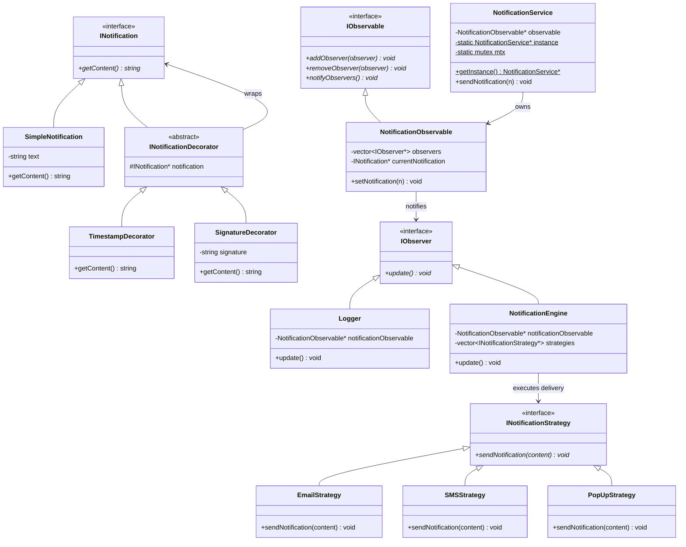

# Notification Engine: Design Patterns Analysis

Is document me `/Users/shubham/Desktop/LLD/L14 Notification_Engine_LLD/C++ Code/` directory me use hone wale sabhi design patterns aur unke variations ko detail me explain kiya gaya hai.

---

## Quick Summary (Overview of Patterns)

Notification Engine application me extensibility, runtime customization aur multithread safety achieve karne ke liye **4 major Design Patterns** ka use kiya gaya hai:

| Pattern Name | Category | Purpose in Notification Engine |
| :--- | :--- | :--- |
| **1. Decorator Pattern** | Structural | Raw notification contents ko dynamically wrapper elements (Timestamps, Signatures) ke sath enhance/modify karne ke liye. |
| **2. Observer Pattern** | Behavioral | Naya notification standard generate hone par registers systems (Logger records, Engine dispatchers) ko dynamically alert dispatch karne ke liye. |
| **3. Strategy Pattern** | Behavioral | Notification delivery channels (Email, SMS, PopUp) ko dynamic interchangeable methods ke details me handle karne ke liye. |
| **4. Singleton Pattern** | Creational | Pure system layout run configurations check me `NotificationService` ka unified access points single object maintain karne ke liye. |

---

## Architectural Interaction Diagram



---

## Detailed Analysis of Design Patterns

### 1. Decorator Design Pattern (Structural)

#### Intent
Attach additional responsibilities to an object dynamically. Decorators provide a flexible alternative to subclassing for extending functionality.

#### Implementation
* **Component Interface**: `INotification` defines the basic signature `getContent()`.
* **Concrete Component**: `SimpleNotification` contains the raw message string (e.g. `"Your order has been shipped!"`).
* **Decorator Base**: `INotificationDecorator` wraps a pointer to an `INotification` object.
* **Concrete Decorators**:
  * `TimestampDecorator` wraps another `INotification` and prepends static date-time formatting to `getContent()`.
  * `SignatureDecorator` wraps another `INotification` and appends signature suffix parameters to `getContent()`.

> [!NOTE]
> Since concrete decorators also implement the `INotification` interface, they can be stacked recursively to add both timestamps and signatures:
> `INotification* n = new SignatureDecorator(new TimestampDecorator(new SimpleNotification("msg")), "Sig");`

---

### 2. Observer Design Pattern (Behavioral)

#### Intent
Define a one-to-many dependency between objects so that when one object changes state, all its dependents are notified and updated automatically.

#### Implementation
* **Observable (Subject)**: `NotificationObservable` manages registered subscribers and holds `currentNotification`.
* **Observer Interface**: `IObserver` defines `update()`.
* **Concrete Observers**:
  * `Logger`: Prints incoming messages to console and appends detailed log metrics to `logs.txt` persistently.
  * `NotificationEngine`: Dispatches incoming notifications to multiple channel strategy configurations.

#### Refinement (Self-Registration in Updated Version)
In `NotificationSystem.cpp`, observers were attached manually in `main()` using:
```cpp
notificationObservable->addObserver(logger);
notificationObservable->addObserver(notificationEngine);
```
In `NotificationSystemUpdated.cpp`, concrete observer constructors automatically fetch the observable from the `NotificationService` singleton and register themselves:
```cpp
Logger() {
   this->notificationObservable = NotificationService::getInstance()->getObservable();
   notificationObservable->addObserver(this); // Self-Registration
}
```

---

### 3. Strategy Design Pattern (Behavioral)

#### Intent
Define a family of algorithms, encapsulate each one, and make them interchangeable. Strategy lets the algorithm vary independently from clients that use it.

#### Implementation
* **Strategy Interface**: `INotificationStrategy` defines `sendNotification(string content)`.
* **Concrete Strategies**: `EmailStrategy`, `SMSStrategy`, and `PopUpStrategy` encapsulate different transport APIs.
* **Context**: `NotificationEngine` holds a list of strategy pointers (`notificationStrategies`). When notified by Observable, it iterates and runs all configured channel strategy workflows dynamically.

---

### 4. Singleton Design Pattern (Creational)

#### Intent
Ensure a class has only one instance and provide a global point of access to it.

#### Thread-Safe DCLP (Double-Checked Locking Pattern)
In a multithreaded system, if two threads query `getInstance()` concurrently, both could see `instance == nullptr` and instantiate duplicate service objects. 
To prevent this, `dclp_multithreading_safe_notification_system.cpp` uses Double-Checked Locking (DCLP) with `std::mutex`:
```cpp
static NotificationService *getInstance()
{
    if (instance == nullptr) // 1st Check (Lock-free optimization)
    {
        lock_guard<mutex> lock(mtx); // Thread Block Lock
        if (instance == nullptr) // 2nd Check (Security double verify)
            instance = new NotificationService();
    }
    return instance;
}
```
This guarantees thread-safety during lazy initialization with minimal locking overhead.

---

## Design Pattern Summary Matrix

| Design Pattern | Category | Role in this System | Key Class / Method |
|---|---|---|---|
| **Decorator** | Structural | Dynamically prepend timestamps or append signatures to raw notifications at runtime. | `INotificationDecorator` subclasses |
| **Observer** | Behavioral | Notify independent sub-modules (logging, dispatch engines) immediately when a new notification is generated. | `NotificationObservable` & `IObserver` |
| **Strategy** | Behavioral | Enable dynamic dispatching of notifications across different platforms (Email, SMS, Popups). | `INotificationStrategy` subclasses |
| **Singleton** | Creational | Maintain a single, globally accessible pipeline manager class, synchronized via DCLP locks. | `NotificationService::getInstance()` |
