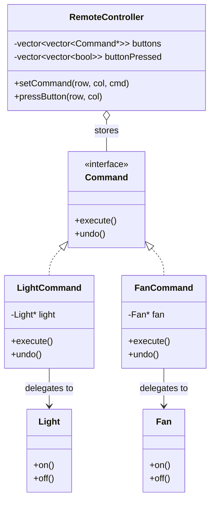
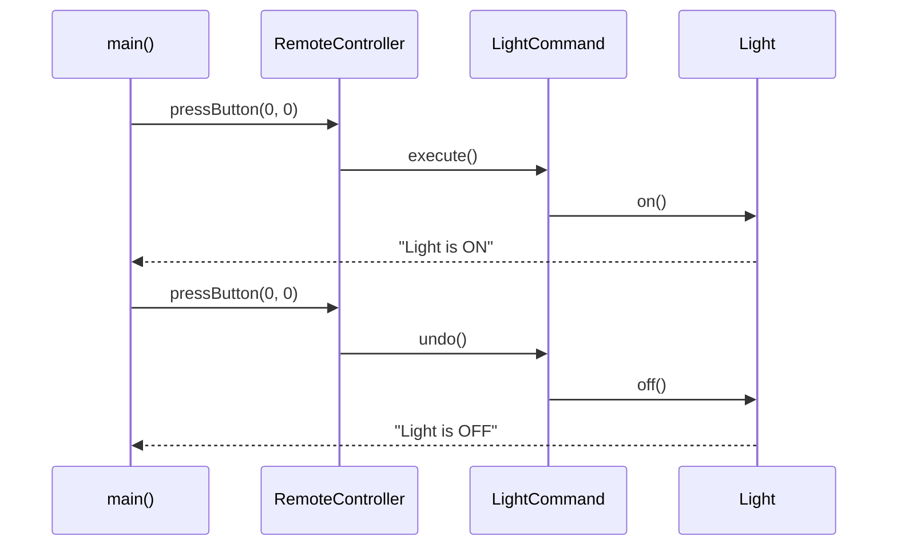

# Command Design Pattern — Detailed Guide

> **Behavioral Design Pattern** jo ek **request ko object** mein wrap karta hai — taaki request ko parameterize, queue, log, aur **undo/redo** kiya ja sake. Invoker (remote) ko receiver (light/fan) ki internal details ki zaroorat nahi; wo sirf `Command::execute()` / `undo()` call karta hai.

**Domain example (is repo mein):** Home automation remote — `LightCommand`, `FanCommand` ko `RemoteController` ke buttons se map karna, toggle press se ON/OFF + undo.

---

## Table of Contents

1. [Problem kya hai? (Bina Command ke)](#1-problem-kya-hai-bina-command-ke)
2. [Command Pattern kya hai?](#2-command-pattern-kya-hai)
3. [Real-World Analogy](#3-real-world-analogy)
4. [Key Participants (UML Roles)](#4-key-participants-uml-roles)
5. [Kab use karein / Kab na karein](#5-kab-use-karein--kab-na-karein)
6. [Fayde aur Nuksan](#6-fayde-aur-nuksan)
7. [SOLID Principles se Connection](#7-solid-principles-se-connection)
8. [Folder Structure](#8-folder-structure)
9. [Code Implementation — Detailed Walkthrough](#9-code-implementation--detailed-walkthrough)
10. [Execution Flow (Step-by-Step)](#10-execution-flow-step-by-step)
11. [Architecture Diagrams](#11-architecture-diagrams)
12. [Build & Run](#12-build--run)
13. [Command vs Related Patterns](#13-command-vs-related-patterns)
14. [Advanced Extensions (Undo Stack, Macro, Queue)](#14-advanced-extensions-undo-stack-macro-queue)
15. [Interview Talking Points](#15-interview-talking-points)
16. [Summary](#16-summary)

---

## 1. Problem kya hai? (Bina Command ke)

Home automation remote socho — har button ek device control karta hai (Light, Fan). **Bina Command pattern** ke Invoker directly Receiver se baat kare:

```cpp
// ❌ Bina Command — Remote har device type jaanta hai
class RemoteControl {
    Light* light;
    Fan* fan;

    void pressLightButton() {
        if (lightOn) { light->off(); lightOn = false; }
        else         { light->on();  lightOn = true;  }
    }
    void pressFanButton() {
        if (fanOn) { fan->off(); fanOn = false; }
        else       { fan->on();  fanOn = true;  }
    }
};
```

**Problems:**

| Problem | Detail |
| ------- | ------ |
| **Tight coupling** | Remote ko har device class (`Light`, `Fan`, `AC`, …) pata honi chahiye |
| **No undo abstraction** | Har button ke liye alag toggle/undo logic duplicate |
| **Buttons fixed at compile time** | Runtime pe button reassign nahi kar sakte |
| **No command history** | Undo/redo, logging, replay mushkil |
| **New device = Remote change** | Open/Closed Principle violate — har naye device ke liye Remote edit |
| **Macro / batch actions nahi** | "Movie mode" (dim lights + fan on + AC off) ek object nahi bana sakte |

---

## 2. Command Pattern kya hai?

**Command** ek **request ko object** banata hai jisme hota hai:

1. **Command interface** — `execute()` aur optionally `undo()`
2. **Concrete Command** — specific action + receiver reference hold karta hai
3. **Receiver** — asli kaam karta hai (`Light::on()`, `Fan::off()`)
4. **Invoker** — command ko trigger karta hai, receiver ko **directly nahi jaanta**

```cpp
// ✅ Command ke saath — Remote sirf Command interface jaanta hai
remote->setCommand(0, 0, new LightCommand(livingRoomLight));
remote->pressButton(0, 0);  // execute → Light ON
remote->pressButton(0, 0);  // undo   → Light OFF
```

> Request ab **first-class object** hai — store, queue, log, undo, redo sab possible.

---

## 3. Real-World Analogy

### A. Restaurant Order Slip (Classic)

- **Customer (Client)** order deta hai
- **Waiter (Invoker)** order slip leta hai, kitchen ko deta hai — khana kaise banta hai nahi jaanta
- **Order Slip (Command)** — "2 pizza, 1 pasta" likha hota hai
- **Chef (Receiver)** asli khana banata hai

Order slip **request ko object** mein capture karta hai — baad mein cancel (undo) ya modify bhi ho sakta hai.

### B. TV / AC Remote Control

Remote buttons **commands** hain — har button ek action object represent karta hai. Remote ko TV ke andar ka circuit nahi pata; sirf "power on" signal bhejta hai.

### C. Text Editor (Ctrl+Z / Ctrl+Y)

Har edit (type, delete, format) ek **Command object** hai. Undo stack mein push hota hai — `undo()` se revert. Ye Command pattern ka sabse famous real-world use case hai.

### D. Transaction Log (Database)

Har SQL statement-label/UPDATE ek command — replay se database rebuild, rollback se undo.

---

## 4. Key Participants (UML Roles)

| Role | Is Code Mein | Responsibility |
| ---- | ------------ | -------------- |
| **Command** | `Command` (interface) | `execute()` + `undo()` contract define karna |
| **Concrete Command** | `LightCommand`, `FanCommand` | Specific action implement; Receiver ko hold karke delegate |
| **Receiver** | `Light`, `Fan` | Asli business logic — device ON/OFF |
| **Invoker** | `RemoteController` | Command store karna, button press pe `execute()` / `undo()` call |
| **Client** | `main()` | Receivers, Commands, Invoker setup karna; buttons map karna |

**Relationships:**

```
Client ──creates──▶ Receiver, ConcreteCommand, Invoker
                         │
Invoker ──stores──▶ Command*  (doesn't know Receiver type)
                         │
ConcreteCommand ──delegates──▶ Receiver
```

**Invoker Receiver se decouple** hai — sirf `Command` interface dekhta hai.

---

## 5. Kab use karein / Kab na karein

### ✅ Kab use karein

| Scenario | Example |
| -------- | ------- |
| **Undo / Redo** chahiye | Text editor, drawing app, form wizards |
| **Request ko queue / schedule** karna ho | Job scheduler, task queue, thread pool |
| **Request ko log / audit** karna ho | Transaction history, replay, event sourcing |
| **Macro / composite commands** | "Movie mode" — multiple devices ek saath |
| **Invoker ko receiver se decouple** karna ho | Remote, menu system, button bar |
| **Runtime pe operations bind** karna ho | Configurable keyboard shortcuts |
| **Callback / action parameterization** | UI buttons ko dynamic actions assign |

### ❌ Kab na karein

| Scenario | Reason |
| -------- | ------ |
| **Sirf ek simple function call** | Command object banana overkill |
| **Undo ki koi zaroorat nahi** aur koi queue/logging bhi nahi | Simple method call kaafi |
| **Bahut saare command classes** har chhoti action ke liye | Class explosion — balance karo |
| **Performance-critical hot path** | Object allocation overhead (usually negligible) |

---

## 6. Fayde aur Nuksan

### Fayde (Pros)

| Fayda | Detail |
| ----- | ------ |
| **Decoupling** | Invoker ko Receiver ki class pata nahi — sirf Command |
| **Undo / Redo** | Har command apna inverse action define kar sakta hai |
| **Extensibility** | Naya device = naya `XxxCommand` — Invoker same rehta hai (OCP) |
| **Macro Commands** | Multiple commands ek composite command mein wrap |
| **Queue & Schedule** | Commands ko list mein daal ke baad mein run karo |
| **Logging & Replay** | Command history se actions replay karo |
| **Runtime binding** | `setCommand(row, col, cmd)` — buttons dynamically assign |

### Nuksan (Cons)

| Nuksan | Detail |
| ------ | ------ |
| **Extra classes** | Har action ke liye Concrete Command class |
| **Complexity** | Simple ON/OFF ke liye bhi Command + Receiver + Invoker |
| **Undo design effort** | Har command ko reversible banana padta hai — hamesha possible nahi |
| **Memory** | Command history / undo stack memory use karta hai |

---

## 7. SOLID Principles se Connection

### Single Responsibility Principle (SRP)

| Class | Responsibility |
| ----- | -------------- |
| `Light` / `Fan` | Device state manage karna |
| `LightCommand` | "Light ON" request encapsulate + undo define |
| `RemoteController` | Button press handle karna, command invoke karna |

### Open/Closed Principle (OCP)

Naya `ACCommand` add karo — `RemoteController` **change nahi hota**, bas naya button map karo:

```cpp
remote->setCommand(1, 0, new ACCommand(ac));  // existing Invoker, new Command
```

### Dependency Inversion Principle (DIP)

`RemoteController` **concrete** `Light`/`Fan` par nahi, **abstract `Command*`** par depend karta hai.

---

## 8. Folder Structure

```
L15 Command_Design_Pattern/
├── README.md                              ← Ye file — complete guide
└── C++ Code/
    └── CommandPattern.cpp                 ← Home automation remote demo
```

---

## 9. Code Implementation — Detailed Walkthrough

Source: [`C++ Code/CommandPattern.cpp`](./C%20%2B%2B%20Code/CommandPattern.cpp)

### 9.1 Command Interface

```cpp
class Command {
public:
    virtual void execute() = 0;
    virtual void undo() = 0;
    virtual ~Command() {}
};
```

**Kya hai:** Sab commands ka common contract.  
**Kyun `undo()`:** Toggle / undo-redo support — har concrete command apna inverse define karega.  
**Virtual destructor:** Polymorphic delete safe ho.

---

### 9.2 Receivers — `Light` aur `Fan`

```cpp
class Light {
public:
    void on()  { cout << "Light is ON" << endl; }
    void off() { cout << "Light is OFF" << endl; }
};

class Fan {
public:
    void on()  { cout << "Fan is ON" << endl; }
    void off() { cout << "Fan is OFF" << endl; }
};
```

**Kya hai:** Wo classes jo **asli kaam** karte hain — device control.  
**Important:** Receivers **Command ke baare mein nahi jaante**. Unhe sirf apne methods (`on`/`off`) se matlab hai.  
**Real system mein:** State track hoga (already on hai ya off), hardware API call hogi, etc.

---

### 9.3 Concrete Commands — `LightCommand`, `FanCommand`

```cpp
class LightCommand : public Command {
private:
    Light* light;                    // Receiver reference

public:
    LightCommand(Light* l) { light = l; }

    void execute() override { light->on(); }
    void undo()    override { light->off(); }
};
```

**Pattern:** Command **Has-A Receiver** — request ko receiver par delegate karta hai.

| Command | execute() | undo() | Matlab |
| ------- | --------- | ------ | ------ |
| `LightCommand` | `light->on()` | `light->off()` | Toggle: ON ↔ OFF |
| `FanCommand` | `fan->on()` | `fan->off()` | Toggle: ON ↔ OFF |

**Design note:** Yahan `execute` = ON, `undo` = OFF. Invoker toggle state track karke decide karta hai kaunsa call karna hai (next section).

---

### 9.4 Invoker — `RemoteController`

Ye is implementation ka **sabse interesting** part hai — dynamic 2D button grid.

```cpp
class RemoteController {
private:
    vector<vector<Command*>> buttons;       // har button ek Command hold karta hai
    vector<vector<bool>> buttonPressed;      // toggle state track

public:
    RemoteController(int rows, int cols) {
        buttons.resize(rows, vector<Command*>(cols, nullptr));
        buttonPressed.resize(rows, vector<bool>(cols, false));
    }

    void setCommand(int row, int col, Command* cmd) {
        if (row < buttons.size() && col < buttons[row].size()) {
            if (buttons[row][col] != nullptr)
                delete buttons[row][col];    // purana command replace
            buttons[row][col] = cmd;
            buttonPressed[row][col] = false;
        }
    }

    void pressButton(int row, int col) {
        if (row < buttons.size() && col < buttons[row].size()
            && buttons[row][col] != nullptr) {
            if (buttonPressed[row][col] == false)
                buttons[row][col]->execute();   // pehli press → ON
            else
                buttons[row][col]->undo();      // doosri press → OFF
            buttonPressed[row][col] = !buttonPressed[row][col];
        } else {
            cout << "Invalid button or no command at [" << row << "][" << col << "]\n";
        }
    }

    ~RemoteController() {
        for (auto& row : buttons)
            for (auto& cmd : row)
                if (cmd != nullptr) delete cmd;
    }
};
```

**Design decisions explained:**

| Decision | Kyun? |
| -------- | ----- |
| `vector<vector<Command*>>` | Dynamic grid — koi bhi size ka remote (2×2, 3×4, …) |
| `buttonPressed` toggle flag | Ek hi button se ON/OFF — pehli press `execute`, doosri `undo` |
| `setCommand` purana command delete | Button reassign — memory leak na ho |
| Invoker sirf `Command*` use karta hai | `Light`/`Fan` type nahi jaanta — decoupling |
| Destructor commands delete karta hai | RAII-style cleanup — client ko individual delete nahi |
| Invalid button check | `[1][1]` unassigned — graceful error message |

**Invoker ka kaam:** Command **store** karna + **invoke** karna. Device logic **nahi** jaanta.

---

### 9.5 Client — `main()`

```cpp
int main() {
    Light* livingRoomLight = new Light();
    Fan* ceilingFan = new Fan();

    RemoteController* remote = new RemoteController(2, 2);

    remote->setCommand(0, 0, new LightCommand(livingRoomLight));
    remote->setCommand(0, 1, new FanCommand(ceilingFan));

    remote->pressButton(0, 0);  // Light ON
    remote->pressButton(0, 0);  // Light OFF

    remote->pressButton(0, 1);  // Fan ON
    remote->pressButton(0, 1);  // Fan OFF

    remote->pressButton(1, 1);  // Unassigned → error

    delete remote;              // commands bhi delete
    delete livingRoomLight;
    delete ceilingFan;
    return 0;
}
```

**Client responsibilities:**
1. Receivers create karna
2. Invoker create karna
3. Concrete Commands bana ke buttons pe map karna
4. Button presses simulate karna

> **Production note:** `unique_ptr` use karo; `#include <vector>` explicitly add karo (code mein `vector` use hai).

---

## 10. Execution Flow (Step-by-Step)

### Light Button [0][0] — Double Press (Toggle)

```
pressButton(0, 0)  [buttonPressed=false]
  └── LightCommand::execute()
        └── Light::on()  → "Light is ON"
  └── buttonPressed[0][0] = true

pressButton(0, 0)  [buttonPressed=true]
  └── LightCommand::undo()
        └── Light::off()  → "Light is OFF"
  └── buttonPressed[0][0] = false
```

### Fan Button [0][1] — Same Toggle Flow

```
pressButton(0, 1) → FanCommand::execute() → Fan::on()
pressButton(0, 1) → FanCommand::undo()    → Fan::off()
```

### Unassigned Button [1][1]

```
pressButton(1, 1)
  └── buttons[1][1] == nullptr
  └── "Invalid button or no command at [1][1]"
```

### Expected Output

```
--- Toggling Light Button [0][0] ---
Light is ON
Light is OFF
--- Toggling Fan Button [0][1] ---
Fan is ON
Fan is OFF
--- Pressing Unassigned Button [1][1] ---
Invalid button or no command at [1][1]
```

---

## 11. Architecture Diagrams

### Class Diagram



### Sequence Diagram — Light Toggle



### High-Level Architecture

```
┌─────────────┐
│   Client    │  ← Commands + Receivers setup
│   (main)    │
└──────┬──────┘
       │ setCommand(0,0, LightCommand)
       │ pressButton(0,0)
       ▼
┌─────────────────────────────┐
│     RemoteController         │  ← Invoker (button grid)
│  buttons[row][col] → Command*│
└──────────────┬──────────────┘
               │ execute() / undo()
               ▼
┌─────────────────────────────┐
│  LightCommand / FanCommand   │  ← Concrete Command
└──────────────┬──────────────┘
               │ light->on() / fan->off()
               ▼
┌─────────────────────────────┐
│       Light / Fan            │  ← Receiver (actual device)
└─────────────────────────────┘
```

---

## 12. Build & Run

```bash
cd "L15 Command_Design_Pattern/C++ Code"
g++ -std=c++17 -o command_demo CommandPattern.cpp
./command_demo
```

Expected output:

```
--- Toggling Light Button [0][0] ---
Light is ON
Light is OFF
--- Toggling Fan Button [0][1] ---
Fan is ON
Fan is OFF
--- Pressing Unassigned Button [1][1] ---
Invalid button or no command at [1][1]
```

---

## 13. Command vs Related Patterns

| Pattern | Focus | Command se Farq |
| ------- | ----- | --------------- |
| **Strategy** | Algorithm **choose** karna ( interchangeable behavior) | Strategy client ko algorithm deta hai; Command **request ko object** banata hai (undo, queue, log) |
| **State** | Object ka **internal state** change → behavior change | State object khud transition handle karta hai; Command **external request** trigger karta hai |
| **Observer** | One-to-many **notification** | Observer event broadcast; Command **action encapsulate** karta hai |
| **Memento** | State **snapshot** save/restore | Memento state store karta hai; Command **action** store karta hai — aksar saath use (undo stack + memento) |
| **Chain of Responsibility** | Request ko **chain** mein pass karna | Chain handler choose karta hai; Command **specific** action bind karta hai |

### Quick Decision Guide

```
Kya chahiye?
│
├─ Request ko object banana + undo/queue/log?
│   └── Command ✅
│
├─ Runtime pe algorithm swap karna (sort, pay, discount)?
│   └── Strategy
│
├─ Object ke state ke hisaab se behavior badalna?
│   └── State
│
└─ Event pe multiple listeners notify?
    └── Observer
```

---

## 14. Advanced Extensions (Undo Stack, Macro, Queue)

Is demo mein **per-button toggle** hai. Production systems mein ye common extensions hote hain:

### A. Undo / Redo Stack (Text Editor style)

```cpp
stack<Command*> undoStack;
stack<Command*> redoStack;

void run(Command* cmd) {
    cmd->execute();
    undoStack.push(cmd);
    redoStack = stack<Command*>();  // redo clear
}

void undo() {
    if (!undoStack.empty()) {
        Command* cmd = undoStack.top(); undoStack.pop();
        cmd->undo();
        redoStack.push(cmd);
    }
}
```

### B. Macro Command (Composite)

```cpp
class MacroCommand : public Command {
    vector<Command*> commands;
public:
    void add(Command* c) { commands.push_back(c); }
    void execute() override {
        for (auto c : commands) c->execute();
    }
    void undo() override {
        for (auto it = commands.rbegin(); it != commands.rend(); ++it)
            (*it)->undo();  // reverse order undo
    }
};

// "Movie Mode": dim light + fan on + close blinds
```

### C. Command Queue (Scheduler / Thread Pool)

```cpp
queue<Command*> jobQueue;
// Producer threads push, worker thread pop + execute()
```

---

## 15. Interview Talking Points

1. **One-liner:** "Command request ko object mein encapsulate karta hai — execute, undo, queue, log sab possible."

2. **Four roles:** Command (interface), ConcreteCommand, Receiver, Invoker — Client inhe wire karta hai.

3. **Undo/redo:** Har command reversible hona chahiye ya Memento se state restore karo.

4. **Strategy se difference:** Strategy = *kaise* karna (algorithm); Command = *kya* karna (action as object with lifecycle).

5. **Real examples:** Text editor undo, GUI button actions, transaction logs, job queues, smart home remote.

6. **OCP:** Naya `ACCommand` — Invoker same, bas naya command assign karo.

7. **Trade-off:** Har action ke liye class — chhote apps mein overkill, complex UI/automation mein essential.

---

## 16. Summary

| Pehlu | Detail |
| ----- | ------ |
| **Pattern Type** | Behavioral |
| **Core Idea** | Request → object (`execute` / `undo`) |
| **Is Repo ka Example** | `RemoteController` + `LightCommand` / `FanCommand` |
| **Main Fayda** | Decoupling + undo + runtime binding + extensibility |
| **Key Classes** | `Command`, `LightCommand`, `FanCommand`, `Light`, `Fan`, `RemoteController` |
| **Key File** | [`C++ Code/CommandPattern.cpp`](./C%20%2B%2B%20Code/CommandPattern.cpp) |

> **Yaad rakho:** Command restaurant ka **order slip** hai — waiter (Invoker) slip leke kitchen (Receiver) ko deta hai, slip par likha action (Concrete Command) baad mein cancel (undo) bhi ho sakta hai. 📝
