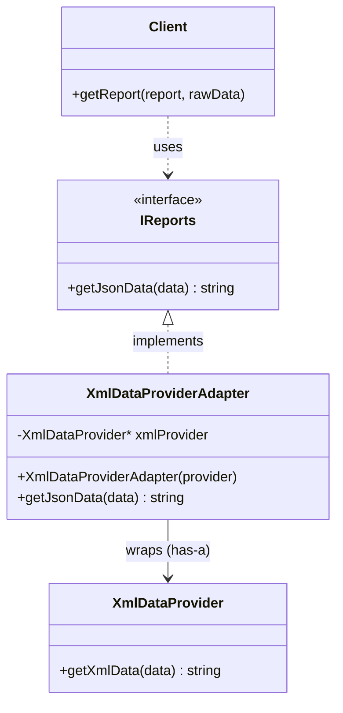
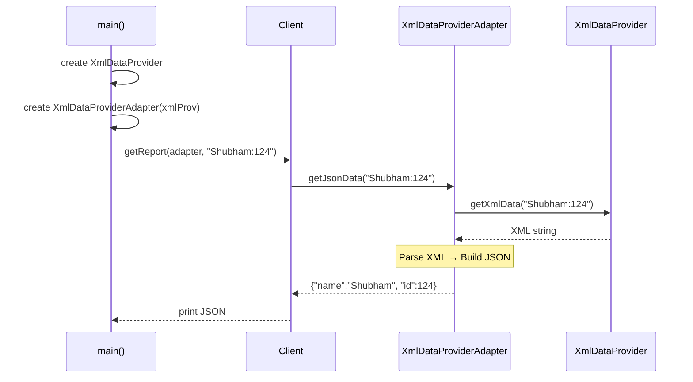

# Adapter Design Pattern — Detailed Guide

> **Structural Design Pattern** jo **incompatible interfaces** ko compatible banata hai — bina purani (legacy) code ko modify kiye. Client jo interface expect karta hai (`IReports::getJsonData`), wo milta hai; andar purani class (`XmlDataProvider::getXmlData`) apna kaam karti rehti hai.

**Domain example (is repo mein):** Legacy `XmlDataProvider` (XML output) ko `XmlDataProviderAdapter` ke through JSON interface mein wrap karna — client ko pata bhi nahi chalta ki data pehle XML mein tha.

---

## Table of Contents

1. [Problem kya hai? (Bina Adapter ke)](#1-problem-kya-hai-bina-adapter-ke)
2. [Adapter Pattern kya hai?](#2-adapter-pattern-kya-hai)
3. [Real-World Analogy](#3-real-world-analogy)
4. [Key Participants (UML Roles)](#4-key-participants-uml-roles)
5. [Object Adapter vs Class Adapter](#5-object-adapter-vs-class-adapter)
6. [Kab use karein / Kab na karein](#6-kab-use-karein--kab-na-karein)
7. [Fayde aur Nuksan](#7-fayde-aur-nuksan)
8. [SOLID Principles se Connection](#8-solid-principles-se-connection)
9. [Folder Structure](#9-folder-structure)
10. [Code Implementation — Detailed Walkthrough](#10-code-implementation--detailed-walkthrough)
11. [Execution Flow (Step-by-Step)](#11-execution-flow-step-by-step)
12. [Architecture Diagrams](#12-architecture-diagrams)
13. [Build & Run](#13-build--run)
14. [🧹 Memory & Ownership](#14--memory--ownership)
15. [🐛 Do bugs jo mile (fix ho chuke)](#15--do-bugs-jo-mile-fix-ho-chuke)
16. [Adapter vs Related Patterns](#16-adapter-vs-related-patterns)
17. [Interview Talking Points](#17-interview-talking-points)
18. [Summary](#18-summary)

---

## 1. Problem kya hai? (Bina Adapter ke)

Socho aapka **naya system JSON** mein data expect karta hai:

```cpp
// Client expects this interface
class IReports {
    virtual string getJsonData(const string& data) = 0;
};
```

Lekin aapke paas ek **purani legacy library** hai jo sirf **XML** deti hai:

```cpp
// Legacy code — change nahi kar sakte (risky, tested, third-party)
class XmlDataProvider {
    string getXmlData(const string& data) { ... }  // returns XML string
};
```

Agar client directly legacy class use kare:

```cpp
// ❌ Bina Adapter — Interface mismatch
XmlDataProvider* xmlProv = new XmlDataProvider();
string xml = xmlProv->getXmlData("Shubham:124");
// Ab client ko khud XML parse karke JSON banana padega — har jagah duplicate logic!
```

**Problems:**

| Problem | Detail |
| ------- | ------ |
| **Interface mismatch** | Client `getJsonData()` chahta hai, legacy `getXmlData()` deta hai |
| **Legacy code touch nahi kar sakte** | Third-party / production-tested code modify karna risky |
| **Duplicate conversion logic** | Har client khud XML → JSON convert karega |
| **Tight coupling** | Client legacy class ke format par depend ho jata hai |
| **Testing mushkil** | Mock karne ke liye har client ko XML logic samajhna padega |

---

## 2. Adapter Pattern kya hai?

**Adapter** ek **middleman / translator** class hoti hai jo:

1. **Target interface** implement karti hai (jo client expect karta hai) — `IReports`
2. **Adaptee (legacy class)** ko apne andar **wrap** karti hai — `XmlDataProvider`
3. Client ke call ko receive karke **translate** karti hai — XML → JSON
4. Purani class ka **ek bhi line code change nahi hota**

```cpp
// ✅ Adapter ke saath — Client sirf IReports jaanta hai
IReports* adapter = new XmlDataProviderAdapter(xmlProv);
client->getReport(adapter, "Shubham:124");
// → Processed JSON: {"name":"Shubham", "id":124}
```

> Adapter ek **plug converter** ki tarah hai — purana device (XML), naya socket (JSON), beech mein adapter dono ko compatible banata hai.

---

## 3. Real-World Analogy

### A. Power Plug Converter (Sabse common analogy)

India ka plug (Type D) US ke socket (Type A) mein fit nahi hota. **Adapter** beech mein lagta hai — device same rehta hai, socket same rehta hai, adapter dono ko connect karta hai.

```
[Indian Charger] ──→ [Plug Adapter] ──→ [US Wall Socket]
   (Adaptee)           (Adapter)            (Target/System)
```

### B. HDMI to VGA Adapter

Naya laptop HDMI output deta hai, purana monitor sirf VGA input leta hai. Adapter signal convert karta hai — laptop ya monitor change karne ki zaroorat nahi.

### C. Language Translator

English bolne wala client (Target) aur Hindi bolne wala server (Adaptee) — **translator (Adapter)** beech mein message convert karta hai. Dono apni language mein comfortable rehte hain.

### D. Credit Card Reader

Purani cash register sirf cash handle karti thi. Card reader **adapter** lagaya — register ko lagta hai payment aa gayi, andar card network se transaction hua.

---

## 4. Key Participants (UML Roles)

| Role | Is Code Mein | Responsibility |
| ---- | ------------ | -------------- |
| **Target** | `IReports` | Interface jo **client expect** karta hai — `getJsonData()` |
| **Adaptee** | `XmlDataProvider` | **Legacy / existing** class — incompatible interface — `getXmlData()` |
| **Adapter** | `XmlDataProviderAdapter` | Target implement karta hai, Adaptee ko wrap karke calls translate karta hai |
| **Client** | `Client` + `main()` | Sirf **Target interface** se kaam karta hai — Adaptee ka naam bhi nahi jaanta |

**Important relationships:**

```
Client ──uses──▶ IReports (Target)
                    ▲
                    │ implements
              XmlDataProviderAdapter (Adapter)
                    │
                    │ has-a (composition)
                    ▼
              XmlDataProvider (Adaptee)
```

Client **Adaptee se kabhi directly baat nahi karta** — sirf Target interface dekhta hai.

---

## 5. Object Adapter vs Class Adapter

Is repo mein **Object Adapter** (composition) use hua hai — ye zyada common aur flexible hai.

| Pehlu | Object Adapter (Is repo mein) | Class Adapter |
| ----- | ------------------------------ | ------------- |
| **Mechanism** | Adapter **has-a** Adaptee (composition) | Adapter **is-a** Adaptee (multiple inheritance) |
| **Code** | `XmlDataProvider* xmlProvider;` | `class Adapter : public Target, public Adaptee` |
| **Flexibility** | Runtime pe Adaptee swap kar sakte ho | Compile-time binding |
| **C++ mein** | Preferred — multiple inheritance messy | Kam use hota hai |
| **Adaptee modification** | Bina touch kiye reuse | Adaptee ko inherit karna padta hai |

### Object Adapter (Hamara Code)

```cpp
class XmlDataProviderAdapter : public IReports {   // Is-A Target
private:
    XmlDataProvider* xmlProvider;                 // Has-A Adaptee
public:
    string getJsonData(const string& data) override {
        string xml = xmlProvider->getXmlData(data);  // delegate to Adaptee
        // ... convert XML → JSON ...
    }
};
```

### Class Adapter (Alternative — reference ke liye)

```cpp
class XmlDataProviderAdapter : public IReports, public XmlDataProvider {
public:
    string getJsonData(const string& data) override {
        string xml = getXmlData(data);  // directly inherited method
        // ... convert ...
    }
};
```

> **Interview tip:** Object Adapter prefer karo jab Adaptee ko inherit nahi kar sakte (final class, third-party, ya inheritance hierarchy messy ho).

---

## 6. Kab use karein / Kab na karein

### ✅ Kab use karein

| Scenario | Example |
| -------- | ------- |
| **Incompatible interfaces** | Legacy XML API ko naye JSON-based client ke saath connect karna |
| **Third-party library** | Library ka code change nahi kar sakte, apna interface chahiye |
| **Legacy integration** | Purana "sarkari" codebase naye microservice se baat kare |
| **Data format translation** | XML ↔ JSON, Celsius ↔ Fahrenheit, miles ↔ km |
| **External API wrapping** | Stripe/PayPal SDK ko apne `IPaymentGateway` interface mein wrap karna |
| **Reuse without modification** | Open/Closed — purani class closed for modification, adapter se extend |

### ❌ Kab na karein

| Scenario | Reason |
| -------- | ------ |
| **Interface already compatible hai** | Adapter unnecessary indirection |
| **Adaptee code modify kar sakte ho safely** | Direct refactor better ho sakta hai |
| **Sirf 1–2 method calls, ek jagah** | Simple wrapper function kaafi hai, full pattern overkill |
| **Performance-critical, zero-copy chahiye** | Conversion layer overhead (usually negligible) |
| **Bahut saare adapters** bina common Target ke | Interface design rethink karo |

---

## 7. Fayde aur Nuksan

### Fayde (Pros)

| Fayda | Detail |
| ----- | ------ |
| **Legacy code safe** | Purani class ek line bhi change nahi — production bugs ka risk zero |
| **Single Responsibility** | Conversion logic ek jagah (Adapter) — client clean rehta hai |
| **Reusability** | Ek Adaptee ke liye multiple adapters: `XmlToJsonAdapter`, `XmlToCsvAdapter` |
| **Loose Coupling** | Client sirf Target interface par depend — Adaptee swap ho sakta hai |
| **Testability** | Mock `IReports` se client test karo — XML logic alag test |
| **Gradual Migration** | Purana system chalta rahe, naya system adapter se connect ho |

### Nuksan (Cons)

| Nuksan | Detail |
| ------ | ------ |
| **Extra class** | Chhote projects mein complexity badh sakti hai |
| **Conversion overhead** | Beech mein translate — usually negligible, lekin high-throughput mein profile karo |
| **Maintenance** | Naya adapter har naye format ke liye — lekin ye controlled complexity hai |
| **Over-adapter smell** | Agar har class ke liye adapter banao to design smell — common Target interface banao |

---

## 8. SOLID Principles se Connection

### Open/Closed Principle (OCP)

> *"Open for extension, closed for modification."*

- `XmlDataProvider` **closed** hai — modify nahi kiya
- `XmlDataProviderAdapter` **extension** hai — naya behavior bina purani class badle

Kal agar CSV chahiye ho:

```cpp
class XmlToCsvAdapter : public IReports { ... };  // naya adapter, purani class same
```

### Single Responsibility Principle (SRP)

| Class | Single Responsibility |
| ----- | --------------------- |
| `XmlDataProvider` | Raw data se XML banana |
| `XmlDataProviderAdapter` | XML ko JSON mein convert karna |
| `Client` | Report display karna |

Har class ka **ek hi reason to change** hai.

### Dependency Inversion Principle (DIP)

Client **concrete class** par nahi, **abstraction (`IReports`)** par depend karta hai:

```cpp
void getReport(IReports* report, string rawData);  // interface, not concrete
```

---

## 9. Folder Structure

```
L16 Adapter_Design_Pattern/
├── README.md                              ← Ye file — complete guide
└── C++ Code/
    ├── AdpaterPattern.cpp                 ← Working C++ implementation
    │                                      (note: filename mein "Adpater" spelling)
    └── markdown.md                        ← Pattern theory summary (Hindi)
```

---

## 10. Code Implementation — Detailed Walkthrough

Source: [`C++ Code/AdpaterPattern.cpp`](./C%20%2B%2B%20Code/AdpaterPattern.cpp)

### 10.1 Target — `IReports` (Client ki expectation)

```cpp
class IReports {
public:
    virtual string getJsonData(const string& data) = 0;
    virtual ~IReports() {}
};
```

**Kya hai:** Abstract interface jo **client expect** karta hai.  
**Contract:** Raw string input do (`"name:id"`), JSON string wapas lo.  
**Kyun interface:** Client ko concrete implementation ki knowledge nahi — polymorphism se koi bhi `IReports` implementer chalega.

---

### 10.2 Adaptee — `XmlDataProvider` (Legacy class)

```cpp
class XmlDataProvider {
public:
    string getXmlData(const string& data) {
        size_t sep = data.find(':');
        string name = data.substr(0, sep);
        string id   = data.substr(sep + 1);
        return "<user>"
               "<name>" + name + "</name>"
               "<id>"   + id   + "</id>"
               "</user>";
    }
};
```

**Kya hai:** Purani / legacy class — **incompatible interface** (`getXmlData` returns XML).  
**Input format:** `"Shubham:124"` (name:id colon-separated).  
**Output:** XML string — `<user><name>Shubham</name><id>124</id></user>`.  
**Important:** Is class ko **modify nahi kiya** — ye third-party ya production-tested maan ke chalo.

---

### 10.3 Adapter — `XmlDataProviderAdapter` (Translator)

```cpp
class XmlDataProviderAdapter : public IReports {
private:
    XmlDataProvider* xmlProvider;   // Has-A: wraps the Adaptee

public:
    XmlDataProviderAdapter(XmlDataProvider* provider) {
        this->xmlProvider = provider;
    }

    string getJsonData(const string& data) override {
        // Step 1: Delegate to Adaptee — get XML
        string xml = xmlProvider->getXmlData(data);

        // Step 2: Parse XML (naïve string parsing for demo)
        size_t startName = xml.find("<name>") + 6;
        size_t endName   = xml.find("</name>");
        string name      = xml.substr(startName, endName - startName);

        size_t startId = xml.find("<id>") + 4;
        size_t endId   = xml.find("</id>");
        string id      = xml.substr(startId, endId - startId);

        // Step 3: Build JSON and return
        return "{\"name\":\"" + name + "\", \"id\":" + id + "}";
    }
};
```

**Design decisions explained:**

| Decision | Kyun? |
| -------- | ----- |
| `public IReports` | Target interface implement — client ko compatible lage |
| `XmlDataProvider*` private member | Object Adapter — composition, Adaptee ko wrap |
| Constructor mein Adaptee inject | Dependency injection — same Adaptee, multiple adapters possible |
| XML parse + JSON build Adapter mein | SRP — conversion logic ek jagah |
| Naïve string parsing | Demo simplicity — production mein proper XML/JSON library use karo |

**Adapter ka 3-step flow:**

```
Client call: getJsonData("Shubham:124")
    │
    ├─ 1. Delegate → xmlProvider->getXmlData("Shubham:124")
    │       returns: "<user><name>Shubham</name><id>124</id></user>"
    │
    ├─ 2. Translate → parse <name> and <id> from XML
    │
    └─ 3. Return → {"name":"Shubham", "id":124}
```

---

### 10.4 Client — `Client` + `main()`

```cpp
class Client {
public:
    void getReport(IReports* report, string rawData) {
        cout << "Processed JSON: "
             << report->getJsonData(rawData)
             << endl;
    }
};

int main() {
    XmlDataProvider* xmlProv = new XmlDataProvider();           // Adaptee
    IReports* adapter = new XmlDataProviderAdapter(xmlProv);    // Adapter as Target
  string rawData = "Shubham:124";
    Client* client = new Client();
    client->getReport(adapter, rawData);

    delete adapter;
    delete xmlProv;
    return 0;
}
```

**Client kya jaanta hai:**
- Sirf `IReports` interface
- `getJsonData()` method

**Client kya NAHI jaanta:**
- `XmlDataProvider` exist karta hai
- Data pehle XML mein banta hai
- Conversion logic kahan hai

> **Production note:** `unique_ptr<IReports>` aur `unique_ptr<XmlDataProvider>` use karo raw `new`/`delete` ki jagah.

---

## 11. Execution Flow (Step-by-Step)

```
main()
  ├── XmlDataProvider created                    (Adaptee)
  ├── XmlDataProviderAdapter created             (Adapter wraps Adaptee)
  └── Client::getReport(adapter, "Shubham:124")
        └── adapter->getJsonData("Shubham:124")  [polymorphic call on IReports]
              ├── xmlProvider->getXmlData("Shubham:124")
              │     └── parse "Shubham:124" → XML string
              ├── parse XML → extract name="Shubham", id="124"
              └── build JSON → {"name":"Shubham", "id":124}
        └── print: Processed JSON: {"name":"Shubham", "id":124}
```

### Expected Output

```
Processed JSON: {"name":"Shubham", "id":124}

--- Galat format try karte hain (bina ':' ke) ---
✅ Reject: Galat format! 'name:id' chahiye (jaise "Shubham:124"), mila: "BinaColon"
```

Doosra scene **input validation** dikhata hai — adapter galat format ko reject
karta hai. Pehle ye **chup-chaap invalid JSON** de deta tha (section 17b dekho).

### Data Transformation Pipeline

```
"Shubham:124"  ──(Adaptee)──▶  <user><name>Shubham</name><id>124</id></user>
                                        │
                                   (Adapter converts)
                                        │
                                        ▼
                          {"name":"Shubham", "id":124}  ──▶  Client
```

---

## 12. Architecture Diagrams

### Class Diagram



### Sequence Diagram



### High-Level Architecture

```
┌─────────────┐
│   Client    │  ← Sirf IReports (Target) jaanta hai
└──────┬──────┘
       │ getJsonData("Shubham:124")
       ▼
┌─────────────────────────────┐
│  XmlDataProviderAdapter      │  ← Adapter (Translator)
│  implements IReports         │
│  wraps XmlDataProvider       │
└──────────────┬──────────────┘
               │ getXmlData("Shubham:124")
               ▼
┌─────────────────────────────┐
│     XmlDataProvider          │  ← Adaptee (Legacy)
│  returns XML                 │
└─────────────────────────────┘
```

---

## 13. Build & Run

```bash
cd "L16 Adapter_Design_Pattern/C++ Code"
g++ -std=c++17 -o adapter_demo AdpaterPattern.cpp
./adapter_demo
```

Expected output:

```
Processed JSON: {"name":"Shubham", "id":124}

--- Galat format try karte hain (bina ':' ke) ---
✅ Reject: Galat format! 'name:id' chahiye (jaise "Shubham:124"), mila: "BinaColon"
```

---

## 14. 🧹 Memory & Ownership

> 📌 **Golden rule:** _"Pointer hone ka matlab MAALIK hona nahi hota."_

```
main()
  ├── OWNS ──> XmlDataProvider  (adaptee)   → main delete karta hai
  ├── OWNS ──> XmlDataProviderAdapter       → main delete karta hai
  │                 └── borrows ──> XmlDataProvider   ❌ delete NAHI karta
  └── OWNS ──> Client                       → main delete karta hai
```

| Kaun | Kiska maalik | Delete kaun karta |
| ---- | ------------ | ----------------- |
| `main()` | `XmlDataProvider` | `main()` |
| `main()` | Adapter | `main()` |
| `main()` | `Client` | `main()` ✅ (ye **pehle chhoot gaya tha** — section 15a) |
| Adapter | ❌ kuch nahi | Adaptee ko sirf **borrow** karta hai |

### Adapter me destructor kyun nahi hai?

Kyunki wo `xmlProvider` ka **maalik nahi** hai! Agar wo `delete xmlProvider`
karta, to `main()` ka `delete xmlProv` **double-free** kar deta. 💥

> 💡 Aur saaf tareeka: `unique_ptr` ya stack objects use karo — is chhote demo
> me `new` ki zaroorat hi nahi thi.

**Verify:** `6 new, 6 delete → 0 leak` ✅ · ASan clean

---

## 15. 🐛 Do bugs jo mile (fix ho chuke)

### (a) `Client` object leak ho raha tha

```cpp
Client* client = new Client();   // ← new
...
delete adapter;
delete xmlProv;
// ❌ delete client; kahan hai??
```

**3 `new`, sirf 2 `delete`.** Gin ke pakda tha. **✅ Fix:** `delete client;`

### (b) Bina `:` ke — chup-chaap INVALID JSON ⚠️

Ye zyada khatarnak tha, kyunki **crash nahi** hota tha — bas galat data aage
chala jaata tha:

```
Input : "ShubhamNoColon"      (koi ':' nahi)
Output: {"name":"ShubhamNoColon", "id":ShubhamNoColon}
                                        └── naam! aur bina quotes ke!
```

Ye **invalid JSON** hai. Aisa bug production me **hafton chhupa** reh sakta hai.

**Wajah:**

```cpp
size_t sep = data.find(':');       // ':' nahi mila → npos (vishaal number)
string name = data.substr(0, sep); // substr(0, npos) → POORI string
string id   = data.substr(sep + 1);// npos+1 wrap hoke 0 → PHIR poori string!
```

**✅ Fix — validation ADAPTER me:**

```cpp
if (data.find(':') == string::npos) {
    throw runtime_error("Galat format! 'name:id' chahiye ...");
}
```

> ⭐ **Validation adapter me kyun, adaptee me kyun nahi?**
>
> Kyunki adaptee **LEGACY** hai — hum use badal hi nahi sakte (yahi to poore
> pattern ki wajah hai!). Adapter **hamara** code hai, to input saaf karna uska
> kaam hai.
>
> 📌 Ye Adapter ki ek **asli zimmedari** hai: legacy ka contract lagu karwana,
> taaki usko galat input **jaaye hi na**. Interview me ye poocha ja sakta hai. 🎯

### (c) Bonus — aadha-adhoora output

```cpp
// ❌ Pehle — "Processed JSON: " print ho jaata, PHIR error aata
cout << "Processed JSON: " << report->getJsonData(rawData) << endl;
// Output: Processed JSON: ✅ Reject: Galat format! ...   🤦

// ✅ Ab — pehle data nikalo, phir print
string json = report->getJsonData(rawData);
cout << "Processed JSON: " << json << endl;
```

> 📌 **Sabak:** agar kaam **fail ho sakta hai**, to uska output tabhi likho jab
> wo **poora ho jaye**.

**Verify:** zero warnings (`-Wall -Wextra`) · output saaf · 0 leak · ASan clean

---

## 16. Adapter vs Related Patterns

| Pattern | Focus | Adapter se Farq |
| ------- | ----- | --------------- |
| **Facade** | Complex subsystem ko **simplify** karna | Facade interface chhota banata hai; Adapter interface **convert** karta hai (different shape) |
| **Decorator** | Same interface par **behavior add** karna | Decorator same interface extend karta hai; Adapter **different** interface ko compatible banata hai |
| **Proxy** | Access control / lazy load / caching | Proxy **same** interface rakhta hai; Adapter **interface badalta** hai |
| **Bridge** | Abstraction aur implementation **alag** karna | Bridge design time pe decide; Adapter **existing** incompatible class ko integrate karta hai |

### Quick Decision Guide

```
Kya problem hai?
│
├─ Interface match nahi karta (legacy / third-party)?
│   └── Adapter ✅
│
├─ Bahut saari classes, client ko simple entry chahiye?
│   └── Facade
│
├─ Same interface, extra behavior add karna hai?
│   └── Decorator
│
└─ Same interface, access/control layer chahiye?
    └── Proxy
```

### Is Repo Mein Adapter Kahan Aur Use Hota Hai

| Project | Adapter Example |
| ------- | --------------- |
| **L18 Spotify_LLD** | Device adapters — `SpotifyAPI`, `AppleMusicAPI` ko common interface mein wrap |
| **L16 (ye folder)** | `XmlDataProviderAdapter` — XML legacy → JSON target |

---

## 17. Interview Talking Points

1. **One-liner:** "Adapter incompatible interfaces ko compatible banata hai — legacy code bina modify kiye naye system se integrate hota hai."

2. **Object vs Class Adapter:** "Hum Object Adapter prefer karte hain — composition flexible hai, multiple inheritance se bachte hain."

3. **Real example:** "Payment gateway SDK ka apna API hai, humara system `IPaymentProcessor` expect karta hai — `StripeAdapter` beech mein."

4. **OCP connection:** "Purani class closed for modification, naya adapter open for extension."

5. **Facade se difference:** "Adapter **interface convert** karta hai (XML→JSON); Facade **complexity hide** karta hai (7 classes→1 method). Dono alag problems solve karte hain."

6. **Trade-off:** "Conversion layer extra class hai — lekin legacy safety aur clean client code iske liye worth hai."

7. **Anti-pattern:** "Adapter sirf naming ke liye mat banao — genuinely incompatible interfaces hon tab use karo."

---

## 18. Summary

| Pehlu | Detail |
| ----- | ------ |
| **Pattern Type** | Structural |
| **Core Idea** | Incompatible interface → compatible interface (translation) |
| **Is Repo ka Example** | `XmlDataProviderAdapter`: XML legacy → JSON target |
| **Adapter Type** | Object Adapter (composition / has-a) |
| **Main Fayda** | Legacy code safe + client clean + reusable conversion |
| **Key SOLID** | Open/Closed, Single Responsibility, Dependency Inversion |
| **Key File** | [`C++ Code/AdpaterPattern.cpp`](./C%20%2B%2B%20Code/AdpaterPattern.cpp) |

> **Yaad rakho:** Adapter power plug converter hai — purana device same, naya socket same, beech ka converter dono ko milata hai. 🔌

---

## Further Reading (Is Folder Mein)

| File | Content |
| ---- | ------- |
| [`C++ Code/markdown.md`](./C%20%2B%2B%20Code/markdown.md) | Use cases, Is-A vs Has-A, OCP/SRP benefits — Hindi summary |
