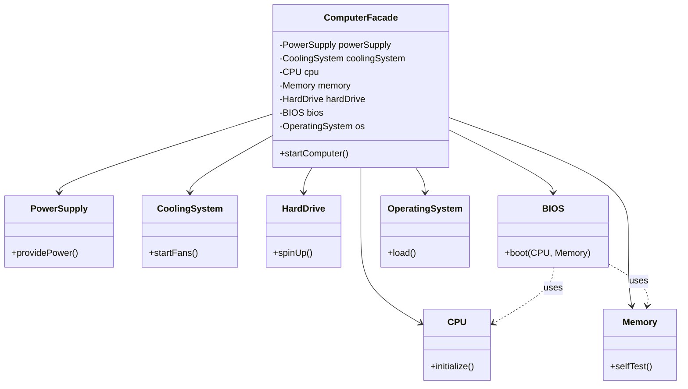
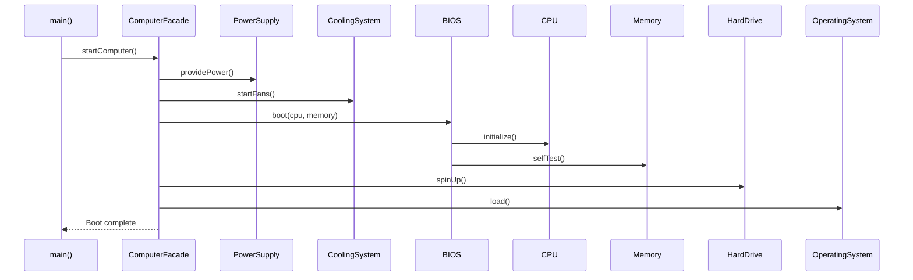

# Facade Design Pattern — Detailed Guide

> **Structural Design Pattern** jo ek complex subsystem ke liye ek **simplified, unified interface** provide karta hai. Client ko andar ke 6–7 classes, unke order, aur unke dependencies ke baare mein kuch jaanne ki zaroorat nahi — sirf ek Facade method call karo, baaki sab Facade handle karega.

**Domain example (is repo mein):** Computer boot sequence — `PowerSupply`, `CoolingSystem`, `CPU`, `Memory`, `BIOS`, `HardDrive`, `OperatingSystem` ko ek hi `ComputerFacade::startComputer()` se start karna.

---

## Table of Contents

1. [Problem kya hai? (Bina Facade ke)](#1-problem-kya-hai-bina-facade-ke)
2. [Facade Pattern kya hai?](#2-facade-pattern-kya-hai)
3. [Real-World Analogy](#3-real-world-analogy)
4. [Key Participants (UML Roles)](#4-key-participants-uml-roles)
5. [Kab use karein / Kab na karein](#5-kab-use-karein--kab-na-karein)
6. [Fayde aur Nuksan](#6-fayde-aur-nuksan)
7. [Principle of Least Knowledge (Law of Demeter)](#7-principle-of-least-knowledge-law-of-demeter)
8. [Folder Structure](#8-folder-structure)
9. [Code Implementation — Detailed Walkthrough](#9-code-implementation--detailed-walkthrough)
10. [Execution Flow (Step-by-Step)](#10-execution-flow-step-by-step)
11. [Architecture Diagrams](#11-architecture-diagrams)
12. [Build & Run](#12-build--run)
13. [Facade vs Related Patterns](#13-facade-vs-related-patterns)
14. [Interview Talking Points](#14-interview-talking-points)
15. [Summary](#15-summary)

---

## 1. Problem kya hai? (Bina Facade ke)

Computer start karna simple lagta hai — button dabao, screen on ho jaye. Lekin andar **bahut saare subsystems** ek **specific order** mein kaam karte hain:

| Step | Subsystem        | Action                          |
| ---- | ---------------- | ------------------------------- |
| 1    | Power Supply     | Electricity provide karna         |
| 2    | Cooling System   | Fans start karna (overheat se bachne ke liye) |
| 3    | BIOS             | CPU aur Memory ko boot karna      |
| 4    | CPU              | Initialize hona                   |
| 5    | Memory           | Self-test pass karna              |
| 6    | Hard Drive       | Spin up hona                      |
| 7    | Operating System | Memory mein load hona             |

Agar **client (main function)** directly har subsystem se baat kare, to code aisa dikhega:

```cpp
// ❌ Bina Facade — Client ko sab kuch pata hona chahiye
PowerSupply ps;
CoolingSystem cs;
CPU cpu;
Memory mem;
HardDrive hd;
BIOS bios;
OperatingSystem os;

ps.providePower();
cs.startFans();
bios.boot(cpu, mem);   // Client ko pata hona chahiye ki BIOS ko CPU+Memory chahiye
hd.spinUp();
os.load();
```

**Problems:**

- Client **tightly coupled** hai har subsystem se
- Galat order mein call karne par system fail ho sakta hai (e.g., OS load karne se pehle power nahi di)
- Naya subsystem add karna = **har client** ka code change
- Client ko **internal dependencies** pata honi chahiye (BIOS ko CPU aur Memory ka reference chahiye)
- Testing mushkil — client ke tests mein saare subsystems mock karne padenge

---

## 2. Facade Pattern kya hai?

**Facade** ek **wrapper / entry point** class hoti hai jo:

1. Saare subsystem objects ko **apne andar own** karti hai (composition)
2. Client ke liye **ek ya do simple public methods** expose karti hai
3. Un methods ke andar **correct order** mein subsystem calls coordinate karti hai
4. Client ko subsystem classes ka **naam bhi na pata ho** to chalega

```cpp
// ✅ Facade ke saath — Client sirf ek line likhta hai
ComputerFacade computer;
computer.startComputer();
```

> Facade subsystems ko **replace ya modify** kar sakti hai bina client code badle — yahi is pattern ki asli power hai.

---

## 3. Real-World Analogy

### A. Home Theater System

Movie dekhne ke liye normally:

1. TV on karo
2. TV input HDMI pe set karo
3. Sound system on karo
4. Volume set karo
5. Streaming box / DVD player on karo
6. Movie play karo

**Home Theater Facade** ek method deta hai: `watchMovie("Inception")` — baaki sab andar handle hota hai.

### B. Car Dashboard (Classic Analogy)

Driver sirf steering, pedals, aur buttons use karta hai (Facade). Engine, transmission, fuel injection, ABS — ye sab **driver ko directly interact nahi karne dete**. Woh complexity car ke andar hidden hai.

### C. Restaurant

Customer sirf **Waiter** se baat karta hai (Facade). Waiter kitchen ke Chef, pantry, billing sab coordinate karta hai. Customer ko kitchen workflow ki knowledge nahi chahiye.

---

## 4. Key Participants (UML Roles)

| Role | Is Code Mein | Responsibility |
| ---- | ------------ | -------------- |
| **Facade** | `ComputerFacade` | Subsystems ko own karna, unhe correct order mein call karna, client ko simple API dena |
| **Subsystem A** | `PowerSupply` | Power provide karna |
| **Subsystem B** | `CoolingSystem` | Fans start karna |
| **Subsystem C** | `CPU` | CPU initialize karna |
| **Subsystem D** | `Memory` | RAM self-test karna |
| **Subsystem E** | `HardDrive` | Disk spin up karna |
| **Subsystem F** | `BIOS` | Boot sequence — CPU + Memory ko coordinate karna |
| **Subsystem G** | `OperatingSystem` | OS load karna |
| **Client** | `main()` | Sirf Facade se interact karna |

**Important:** Subsystems **Facade ke baare mein nahi jaante**. Coupling **one-way** hai: Facade → Subsystems. Subsystems independent rehte hain.

---

## 5. Kab use karein / Kab na karein

### ✅ Kab use karein

| Scenario | Example |
| -------- | ------- |
| Complex library / framework ko simple API chahiye | `std::ios_base` + streams ka simple wrapper |
| Multiple subsystems ko **fixed order** mein chalana ho | Computer boot, checkout flow, app startup |
| Legacy code ko naye clients ke liye wrap karna ho | Purani payment APIs ke upar naya `PaymentFacade` |
| **Layered architecture** — presentation layer ko business complexity se bachana | UI sirf `OrderFacade.placeOrder()` call kare |
| Bahut saare clients same subsystem group use karte hain | Har jagah duplicate orchestration code na likho |
| Testing mein client ko simple mock chahiye | Mock `ComputerFacade` instead of 7 subsystems |

### ❌ Kab na karein

| Scenario | Reason |
| -------- | ------ |
| Subsystem already simple hai (1–2 classes) | Facade unnecessary abstraction ban jayega |
| Client ko **fine-grained control** chahiye har subsystem par | Facade control restrict kar deta hai |
| Facade "God Object" ban raha ho (500+ lines, har cheez handle kare) | Split into multiple facades (e.g., `BootFacade`, `ShutdownFacade`) |
| Performance-critical path jahan har extra indirection matter kare | Profile first; usually negligible |

---

## 6. Fayde aur Nuksan

### Fayde (Pros)

| Fayda | Detail |
| ----- | ------ |
| **Simplification** | Client ke liye learning curve kam — ek method ya do methods yaad rakho |
| **Loose Coupling** | Client subsystems se decouple — internal change se client safe |
| **Correct Sequencing** | Boot / checkout / payment jaise flows mein order Facade enforce karta hai |
| **Single Entry Point** | Debugging easy — flow ek jagah se trace hota hai |
| **Encapsulation** | Internal subsystem structure hide rehti hai |
| **Easier Migration** | Subsystem replace karo, sirf Facade update karo |

### Nuksan (Cons)

| Nuksan | Detail |
| ------ | ------ |
| **Limited Control** | Advanced users ko kuch subsystem methods directly chahiye ho to Facade restrictive lag sakta hai |
| **God Object Risk** | Ek Facade mein bahut zyada responsibility daal di to maintain karna mushkil |
| **Extra Layer** | Chhote projects mein over-engineering lag sakta hai |
| **Not a Substitute for Good Design** | Kharaab subsystem design ko Facade se cover mat karo |

---

## 7. Principle of Least Knowledge (Law of Demeter)

Facade pattern **Law of Demeter (LoD)** / **Principle of Least Knowledge (PoLK)** ko naturally follow karta hai.

> **Rule:** "Talk to your friends, not to strangers."  
> Ek object ko dusre objects ki **deep internal structure** ke baare mein kam se kam pata hona chahiye.

### Violation (Bina Facade)

```cpp
// ❌ Client "strangers" se baat kar raha hai — deep coupling
customer.getOrder().getAddress().getZipCode();
```

### Correct (Facade / Delegation)

```cpp
// ✅ Client sirf apne "friend" se baat karta hai
customer.getZipCode();  // Customer andar Address se baat karega
```

Is project mein:

```cpp
// ❌ Violation
bios.boot(cpu, memory);  // Client ko BIOS-CPU-Memory relationship pata hai

// ✅ Facade ke through
computer.startComputer();  // Client sirf Facade se baat karta hai
```

**PoLK ke fayde:** Maintainability, loose coupling, easier unit testing, better encapsulation.

> Detailed Hindi guide: [`C++ Code/Principle_of_least_knowledge.md`](./C%20%2B%2B%20Code/Principle_of_least_knowledge.md)

---

## 8. Folder Structure

```
L17 Facade_Design_Pattern/
├── README.md                              ← Ye file — complete guide
└── C++ Code/
    ├── FacadePattern.cpp                  ← Working C++ implementation
    ├── markdown.md                        ← Pattern theory (English summary)
    └── Principle_of_least_knowledge.md     ← Law of Demeter deep dive (Hindi)
```

---

## 9. Code Implementation — Detailed Walkthrough

Source: [`C++ Code/FacadePattern.cpp`](./C%20%2B%2B%20Code/FacadePattern.cpp)

### 9.1 Subsystems (Complex Components)

Har subsystem **ek specific kaam** karta hai aur **khud independent** hai — Facade ke baare mein nahi jaanta.

#### `PowerSupply`

```cpp
class PowerSupply {
public:
    void providePower() {
        cout << "Power Supply: Providing power..." << endl;
    }
};
```

Pehla step — bina power ke kuch nahi chalega. Simple, single-responsibility class.

#### `CoolingSystem`

```cpp
class CoolingSystem {
public:
    void startFans() {
        cout << "Cooling System: Fans started..." << endl;
    }
};
```

CPU/memory kaam shuru karne se pehle cooling — real hardware mein bhi fans pehle ya parallel start hote hain.

#### `CPU` aur `Memory`

```cpp
class CPU {
public:
    void initialize() { ... }
};

class Memory {
public:
    void selfTest() { ... }
};
```

Dono alag classes hain kyunki real system mein ye alag hardware components hain. BIOS in dono ko boot sequence mein use karta hai.

#### `BIOS` — Subsystem jo doosre subsystems ko use karta hai

```cpp
class BIOS {
public:
    void boot(CPU& cpu, Memory& memory) {
        cout << "BIOS: Booting CPU and Memory checks..." << endl;
        cpu.initialize();
        memory.selfTest();
    }
};
```

**Key point:** BIOS internally CPU aur Memory ko coordinate karta hai. **Client ko ye dependency nahi pata honi chahiye** — isliye ye logic Facade ke andar rehta hai, client ke paas nahi.

#### `HardDrive` aur `OperatingSystem`

```cpp
class HardDrive {
public:
    void spinUp() { ... }
};

class OperatingSystem {
public:
    void load() { ... }
};
```

Boot sequence ke last steps — storage ready karo, phir OS memory mein load karo.

---

### 9.2 Facade — `ComputerFacade`

```cpp
class ComputerFacade {
private:
    PowerSupply powerSupply;
    CoolingSystem coolingSystem;
    CPU cpu;
    Memory memory;
    HardDrive hardDrive;
    BIOS bios;
    OperatingSystem os;

public:
    void startComputer() {
        cout << "----- Starting Computer -----" << endl;
        powerSupply.providePower();
        coolingSystem.startFans();
        bios.boot(cpu, memory);
        hardDrive.spinUp();
        os.load();
        cout << "Computer Booted Successfully!" << endl;
    }
};
```

**Design decisions explained:**

| Decision | Kyun? |
| -------- | ----- |
| Subsystems **private members** hain | Client unhe directly access nahi kar sakta — encapsulation |
| **Composition** (has-a), inheritance nahi | Facade subsystems ko *use* karta hai, unki type nahi banta |
| Ek public method `startComputer()` | Simple client API — "boot karo" |
| Order: Power → Cooling → BIOS → HDD → OS | Realistic boot sequence; galat order = failure |
| BIOS ko CPU/Memory references Facade pass karta hai | Client ko ye wiring nahi karni padti |

---

### 9.3 Client — `main()`

```cpp
int main() {
    ComputerFacade* computer = new ComputerFacade();
    computer->startComputer();
    return 0;
}
```

Client **sirf 2 cheezein** jaanta hai:
1. `ComputerFacade` class exist karti hai
2. `startComputer()` method call karni hai

Client ko `PowerSupply`, `BIOS`, `CPU` — kisi ka naam ya order nahi pata.

> **Production note:** `new` ke baad `delete` ya better — stack allocation: `ComputerFacade computer; computer.startComputer();` ya `std::unique_ptr<ComputerFacade>`.

---

## 10. Execution Flow (Step-by-Step)

Jab `computer->startComputer()` call hota hai:

```
main()
  └── ComputerFacade::startComputer()
        ├── PowerSupply::providePower()       → "Power Supply: Providing power..."
        ├── CoolingSystem::startFans()        → "Cooling System: Fans started..."
        ├── BIOS::boot(cpu, memory)
        │     ├── CPU::initialize()           → "CPU: Initialization started..."
        │     └── Memory::selfTest()          → "Memory: Self-test passed..."
        ├── HardDrive::spinUp()               → "Hard Drive: Spinning up..."
        └── OperatingSystem::load()           → "Operating System: Loading into memory..."
      → "Computer Booted Successfully!"
```

### Expected Output

```
----- Starting Computer -----
Power Supply: Providing power...
Cooling System: Fans started...
BIOS: Booting CPU and Memory checks...
CPU: Initialization started...
Memory: Self-test passed...
Hard Drive: Spinning up...
Operating System: Loading into memory...
Computer Booted Successfully!
```

---

## 11. Architecture Diagrams

### Class Diagram



### Sequence Diagram



### High-Level Architecture

```
┌─────────────┐
│   Client    │  ← Sirf Facade jaanta hai
│   (main)    │
└──────┬──────┘
       │ startComputer()
       ▼
┌─────────────────────────────────────┐
│         ComputerFacade              │  ← Simplified Interface
│  (coordinates all subsystems)       │
└──┬───┬───┬───┬───┬───┬───┬──────────┘
   │   │   │   │   │   │   │
   ▼   ▼   ▼   ▼   ▼   ▼   ▼
  PS  CS BIOS CPU Mem  HD  OS          ← Subsystems (actual work)
```

---

## 12. Build & Run

```bash
cd "L17 Facade_Design_Pattern/C++ Code"
g++ -std=c++17 -o facade_demo FacadePattern.cpp
./facade_demo
```

Windows (MinGW / MSVC):

```bash
g++ -std=c++17 -o facade_demo.exe FacadePattern.cpp
facade_demo.exe
```

---

## 13. Facade vs Related Patterns

| Pattern | Focus | Facade se Farq |
| ------- | ----- | -------------- |
| **Adapter** | Incompatible interface ko compatible banana | Adapter *interface convert* karta hai; Facade *complexity simplify* karta hai |
| **Decorator** | Behavior dynamically add karna (wrapping) | Decorator same interface extend karta hai; Facade naya simplified interface deta hai |
| **Proxy** | Access control / lazy loading / remote access | Proxy same interface rakhta hai; Facade chhota interface deta hai |
| **Mediator** | Components ek dusre se baat karte hain through mediator | Mediator *decentralized* communication; Facade *one-way* client entry point |

**Dono saath use ho sakte hain:** LLD projects mein aksar `XxxSystem` ya `XxxFacade` class hoti hai jo services ko orchestrate karti hai (e.g., repo ke `EcommerceCheckoutSystem`, `GPaySystem`, `MeetingSchedulerSystem`).

---

## 14. Interview Talking Points

1. **Define in one line:** "Facade ek simplified unified interface provide karta hai ek complex subsystem ke upar."

2. **Real example bol sakte ho:** "E-commerce checkout — cart validate, inventory check, payment, notification — sab `CheckoutFacade.checkout()` ke andar."

3. **LoD connection:** "Facade Law of Demeter follow karta hai — client sirf immediate friend (Facade) se baat karta hai."

4. **Facade subsystem ko modify nahi karta** — wo unhe *use* karta hai. Subsystems independent rehte hain.

5. **Trade-off:** "Agar client ko low-level control chahiye to Facade ke saath optional 'escape hatch' expose kar sakte hain — lekin default simple API rakho."

6. **Anti-pattern:** Facade ko God Object mat banao — multiple focused facades better hain (`PaymentFacade`, `ShippingFacade`).

---

## 15. Summary

| Pehlu | Detail |
| ----- | ------ |
| **Pattern Type** | Structural |
| **Core Idea** | Complex subsystem → simple interface |
| **Is Repo ka Example** | `ComputerFacade::startComputer()` |
| **Main Fayda** | Client simplicity + loose coupling + correct orchestration |
| **Related Principle** | Principle of Least Knowledge (Law of Demeter) |
| **Key File** | [`C++ Code/FacadePattern.cpp`](./C%20%2B%2B%20Code/FacadePattern.cpp) |

> **Yaad rakho:** Facade car ka dashboard hai — tum sirf button dabate ho, engine khud kaam karta hai. 🚗

---

## Further Reading (Is Folder Mein)

| File | Content |
| ---- | ------- |
| [`C++ Code/markdown.md`](./C%20%2B%2B%20Code/markdown.md) | Pattern theory — English summary, home theater analogy |
| [`C++ Code/Principle_of_least_knowledge.md`](./C%20%2B%2B%20Code/Principle_of_least_knowledge.md) | Law of Demeter — Hindi deep dive, restaurant analogy |
