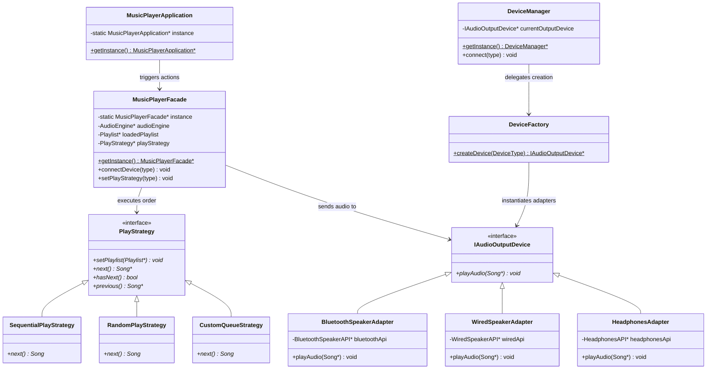

# Spotify Music Player: Design Patterns Analysis

Is document me `/Users/shubham/Desktop/LLD/L18 Spotify_LLD/C++ Code` code me use hone wale sabhi design patterns ko detail me explain kiya gaya hai.

---

## Quick Summary (Overview of Patterns)

Spotify-style Music Player application me modularity, extensibility aur loose coupling achieve karne ke liye **5 major Design Patterns** ka use kiya gaya hai:

| Pattern Name | Category | Purpose in Spotify Music Player |
| :--- | :--- | :--- |
| **1. Singleton Pattern** | Creational | Pure application life cycle me Managers (`DeviceManager`, `PlaylistManager`, `StrategyManager`), `MusicPlayerApplication`, aur `MusicPlayerFacade` ka ek hi global instance maintain karne ke liye. |
| **2. Facade Pattern** | Structural | Client to subsystem complexity (audio engine, multiple managers, devices) ko simple controls (play, pause, set device) ke peeche hide karne ke liye. |
| **3. Strategy Pattern** | Behavioral | Playback traverse flow ko dynamically runtime par switch (Sequential, Random, Custom Queue) karne ke liye. |
| **4. Adapter Pattern** | Structural | System ke generic output device interface (`IAudioOutputDevice`) ko external incompatible third-party APIs (`BluetoothSpeakerAPI`, `WiredSpeakerAPI`, `HeadphonesAPI`) ke sath compatible banane ke liye. |
| **5. Simple Factory Pattern** | Creational | Parameterized `DeviceType` input ke based par correct adapted device subclass instantiate karne ke liye. |

---

## Architectural Interaction Diagram



---

## Detailed Analysis of Design Patterns

### 1. Singleton Design Pattern (Creational)

#### Intent
Ek class ka sirf ek single instance pure system me ensure karna aur use access karne ke liye ek global point of integration custom dynamic setup provide karna.

#### Spotify me implementation
System me core state coordinates synchronization maintain karne ke liye multiple classes ko Singleton banaya gaya hai:
* **`MusicPlayerApplication`**: Central entry engine controller coordinate jo memory maps database track karke library objects hold karta hai.
* **`MusicPlayerFacade`**: Client actions request forward karne ke liye ek global wrapper interface coordinate.
* **Managers (`PlaylistManager`, `DeviceManager`, `StrategyManager`)**: Subsystem coordination points ko dynamic multiple execution paths ke collision protect karne ke liye unka single static object construct kiya jata hai.

#### Code Reference Example (DeviceManager)
```cpp
class DeviceManager {
private:
    IAudioOutputDevice* currentOutputDevice;
    DeviceManager() { currentOutputDevice = nullptr; } // Private constructor
public:
    static DeviceManager* getInstance() {
        static DeviceManager* instance = nullptr;
        if (instance == nullptr) {
            instance = new DeviceManager();
        }
        return instance;
    }
    // ...
};
```

---

### 2. Facade Design Pattern (Structural)

#### Intent
Ek block of subsystems ko represent karne ke liye simplify control interfaces generate karna taaki client objects high-level instructions execute kar sakein bina subsystem internal details compile kiye.

#### Spotify me implementation
* `MusicPlayerFacade` class acts as the Facade.
* Subsystems are:
  * `AudioEngine` (Core media playback logic)
  * `PlaylistManager` (Playlist retrieval)
  * `DeviceManager` (Audio connection adapters control)
  * `StrategyManager` (Playback routing algorithm)
* Client code (in `main.cpp`/`MusicPlayerApplication`) simple interface methods call karta hai jaise `loadPlaylist()`, `playAllTracks()`, and `connectDevice()`. Facade internally multiple Managers aur Audio Engines ko manipulate karke system state updates apply karta hai.

---

### 3. Strategy Design Pattern (Behavioral)

#### Intent
Algorithms/Logics ke collection ko dynamic define karna, har ek strategy step encapsulate karna, aur unhe swap-in/swap-out dynamically compatible banana.

#### Spotify me implementation
* **Strategy Interface**: `PlayStrategy` (abstract base class).
* **Concrete Strategies**:
  * `SequentialPlayStrategy`: Sequentially lists indexing index.
  * `RandomPlayStrategy`: Random indexing using calculations.
  * `CustomQueueStrategy`: Manages user queues list sequence.
* Facade loads play strategy runtime updates, letting `playAllTracks()` iterate seamlessly without knowing the actual traversal math.

```cpp
// Facade redirects the logic execution
void loadPlaylist(const string& name) {
    loadedPlaylist = PlaylistManager::getInstance()->getPlaylist(name);
    playStrategy->setPlaylist(loadedPlaylist);
}
```

---

### 4. Adapter Design Pattern (Structural)

#### Intent
Convert the interface of a class into another interface clients expect. Adapter lets classes work together that couldn't otherwise because of incompatible interfaces.

#### Spotify me implementation
System output target signature class expects standard `IAudioOutputDevice` interface containing:
```cpp
virtual void playAudio(Song* song) = 0;
```
External hardware driver APIs have incompatible methods (e.g. `playSoundViaBluetooth(payload)`, `playViaWiredConnector()`, etc.).
* **Adapters**: `BluetoothSpeakerAdapter`, `WiredSpeakerAdapter`, and `HeadphonesAdapter` subclass `IAudioOutputDevice` and internally encapsulate instances of `BluetoothSpeakerAPI`, `WiredSpeakerAPI`, and `HeadphonesAPI` respectively, mapping generic `playAudio` calls to target specific actions.

---

### 5. Simple Factory Design Pattern (Creational)

#### Intent
Centralize and isolate object instantiation logic from caller client implementations.

#### Spotify me implementation
`DeviceFactory` contains the static method `createDevice(DeviceType deviceType)` which maps parameters to correct adapter constructions:
```cpp
class DeviceFactory {
public:
    static IAudioOutputDevice* createDevice(DeviceType deviceType) {
        if (deviceType == DeviceType::BLUETOOTH) {
            return new BluetoothSpeakerAdapter(new BluetoothSpeakerAPI());
        } else if (deviceType == DeviceType::WIRED) {
            return new WiredSpeakerAdapter(new WiredSpeakerAPI());
        } else { // HEADPHONES
            return new HeadphonesAdapter(new HeadphonesAPI());
        }
    }
};
```
This isolates the creation of adapters and their third-party API dependencies away from `DeviceManager` logic.
