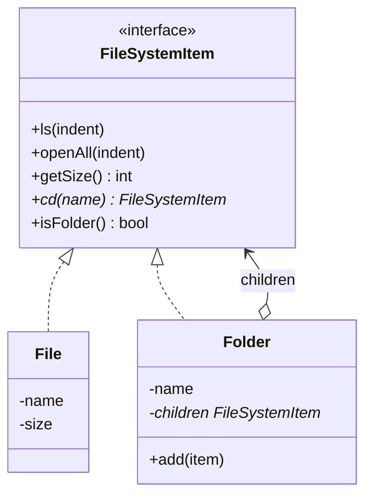
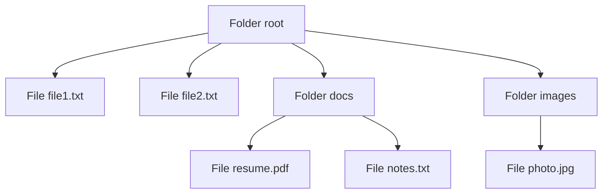

# Composite Design Pattern — Detailed Guide

> **Structural Design Pattern** jo **part-whole hierarchies** ko treat karta hai — **leaf** (File) aur **composite** (Folder) dono **same interface** (`FileSystemItem`) se; client ko pata nahi chalta individual object hai ya poora tree.

**Domain example (is repo mein):** File system — `File` (leaf), `Folder` (composite); uniform `ls()`, `openAll()`, `getSize()`, `cd()`.

**Core problem jo solve hota hai:** Tree structure mein **client code** alag-alag treat kare leaf vs folder — duplicate logic, `if (isFolder)` everywhere, operations recurse manually har jagah.

**Mantra:** _"Treat individual objects and compositions of objects uniformly."_

---

## Table of Contents

1. [Problem kya hai? (Bina Composite)](#1-problem-kya-hai-bina-composite)
2. [Composite Pattern kya hai?](#2-composite-pattern-kya-hai)
3. [Real-World Analogy](#3-real-world-analogy)
4. [Key Participants (UML Roles)](#4-key-participants-uml-roles)
5. [Leaf vs Composite — Uniform Interface](#5-leaf-vs-composite--uniform-interface)
6. [Kab use karein / Kab na karein](#6-kab-use-karein--kab-na-karein)
7. [Fayde aur Nuksan](#7-fayde-aur-nuksan)
8. [SOLID Principles se Connection](#8-solid-principles-se-connection)
9. [Folder Structure](#9-folder-structure)
10. [Code Implementation — Detailed Walkthrough](#10-code-implementation--detailed-walkthrough)
11. [Execution Flow & Expected Output](#11-execution-flow--expected-output)
12. [Architecture Diagrams](#12-architecture-diagrams)
13. [Build & Run](#13-build--run)
14. [Composite vs Related Patterns](#14-composite-vs-related-patterns)
15. [Interview Talking Points](#15-interview-talking-points)
16. [Summary](#16-summary)

---

## 1. Problem kya hai? (Bina Composite)

Agar `File` aur `Folder` **alag types** hon bina common interface:

```cpp
// ❌ Client har jagah type check
void printSize(File* f) { ... }
void printSize(Folder* folder) {
    for (File* f : folder->files) printSize(f);
    for (Folder* sub : folder->subfolders) printSize(sub);  // manual recurse
}
```

| Problem | Detail |
| ------- | ------ |
| **Type branching** | Har operation mein `if (isFolder)` |
| **Duplicate recursion** | `getSize`, `ls`, `openAll` — har client mein repeat |
| **No uniform API** | `file->getSize()` vs folder ka alag method |
| **Extension hard** | Naya operation = File + Folder dono update |
| **Client complexity** | Tree traverse client ki responsibility |

---

## 2. Composite Pattern kya hai?

**Composite** tree ko **ek interface** se represent karta hai:

1. **Component** — `FileSystemItem` (common interface)
2. **Leaf** — `File` — no children, actual work
3. **Composite** — `Folder` — children hold + delegate/recurse
4. **Client** — `FileSystemItem*` — leaf ya folder, same calls

```cpp
// ✅ Uniform treatment
FileSystemItem* root = new Folder("root");
root->add(new File("file1.txt", 1));
cout << root->getSize();   // recursively sums all files
root->openAll();           // tree print — client ko recurse nahi karna
```

> **Ek object ya uski poori subtree — client ke liye same type.**

---

## 3. Real-World Analogy

### A. File System (Is repo ka example)

Folder ke andar files + subfolders — `getSize()` poore tree ka total.

### B. Organization Chart

CEO → VPs → Managers → Employees. "Total headcount" ek operation — composite recurse.

### C. UI Component Tree

Panel (composite) → Button, Label (leaves) + nested Panel. Render entire subtree with one `draw()`.

### D. JSON / XML Tree (Is repo — JSON Parser)

`JsonObject`, `JsonArray` composite; primitives leaf — `print()` uniform.

### E. Menu System

Menu (composite) → MenuItem (leaf) + submenu (composite). "Enable all" one call on root.

---

## 4. Key Participants (UML Roles)

| Role | Is Code Mein | Responsibility |
| ---- | ------------ | -------------- |
| **Component** | `FileSystemItem` | Common interface — `ls`, `openAll`, `getSize`, `cd` |
| **Leaf** | `File` | Terminal node — no children |
| **Composite** | `Folder` | `children` vector — add, recurse operations |
| **Client** | `main()` | Tree build + uniform calls on `FileSystemItem*` |

```
FileSystemItem (Component)
    ▲
    ├── File (Leaf)           — getSize() returns own size
    └── Folder (Composite)    — getSize() = sum(children->getSize())
            │
            └── children[] → FileSystemItem*
```

---

## 5. Leaf vs Composite — Uniform Interface

| Operation | `File` (Leaf) | `Folder` (Composite) |
| --------- | ------------- | -------------------- |
| `ls()` | Print filename | List children (folders with `+`) |
| `openAll()` | Print self | Print self + recurse each child |
| `getSize()` | Return `size` | Sum all `child->getSize()` |
| `cd(name)` | Return `nullptr` | Find child folder by name |
| `isFolder()` | `false` | `true` |

**Recursive composite pattern:**

```cpp
int Folder::getSize() override {
    int total = 0;
    for (auto child : children)
        total += child->getSize();  // polymorphic — File or Folder
    return total;
}
```

---

## 6. Kab use karein / Kab na karein

### ✅ Kab use karein

| Scenario | Example |
| -------- | ------- |
| **Tree / part-whole hierarchy** | File system, org chart, UI |
| **Client uniform treat kare** | Same API leaf + composite |
| **Recursive operations** | Size, print, search entire tree |
| **Arbitrary nesting depth** | Folders in folders |
| **Add/remove children at runtime** | Dynamic tree structure |

### ❌ Kab na karein

| Scenario | Reason |
| -------- | ------ |
| **Flat list only** | No hierarchy — simple collection kaafi |
| **Leaf vs composite behavior bahut alag** | Interface force-fit awkward — type checks creep in |
| **Parent reference / complex constraints** | Extra design (parent ptr, cycle detection) |
| **Performance-critical flat data** | Virtual dispatch + recursion overhead |

---

## 7. Fayde aur Nuksan

### Fayde (Pros)

| Fayda | Detail |
| ----- | ------ |
| **Uniformity** | Client `FileSystemItem*` — simple API |
| **Easy to add new component types** | New leaf/composite implements interface |
| **Recursive ops natural** | Composite delegates to children |
| **Flexible tree** | Runtime add/remove via `Folder::add` |
| **Open/Closed** | Naya operation interface mein — implementations extend |

### Nuksan (Cons)

| Nuksan | Detail |
| ------ | ------ |
| **Over-generalization** | Leaf methods meaningless (`cd` on File → nullptr) |
| **Type safety weak** | Everything same interface — invalid ops at runtime |
| **Hard to restrict** | "Only folders can have children" — not enforced by type system |
| **Memory ownership** | Folder destructor must delete children — clear ownership rules |

---

## 8. SOLID Principles se Connection

### Open/Closed Principle (OCP)

Naya `Symlink` leaf add — existing `Folder` code change minimal if interface same.

### Single Responsibility Principle (SRP)

| Class | Responsibility |
| ----- | -------------- |
| `File` | Represent single file + leaf ops |
| `Folder` | Manage children + aggregate ops |

### Liskov Substitution Principle (LSP)

`File*` kahin bhi `FileSystemItem*` — but `cd()` on File returning nullptr is documented contract.

### Interface Segregation (consideration)

Fat interface (`ls`, `openAll`, `getSize`, `cd`) — some leaves don't support all; optional slimmer interfaces in large systems.

---

## 9. Folder Structure

```
L19 Composite_Design_Pattern/
├── README.md                              ← Ye file — complete guide
└── C++ Code/
    └── CompositePattern.cpp               ← File system tree demo
```

---

## 10. Code Implementation — Detailed Walkthrough

Source: [`C++ Code/CompositePattern.cpp`](./C%20%2B%2B%20Code/CompositePattern.cpp)

### 10.1 Component — `FileSystemItem`

```cpp
class FileSystemItem {
public:
    virtual ~FileSystemItem() {}
    virtual void ls(int indent = 0) = 0;
    virtual void openAll(int indent = 0) = 0;
    virtual int getSize() = 0;
    virtual FileSystemItem* cd(const string& name) = 0;
    virtual string getName() = 0;
    virtual bool isFolder() = 0;
};
```

**Uniform contract** — leaf aur composite dono implement karte hain.

---

### 10.2 Leaf — `File`

```cpp
class File : public FileSystemItem {
    string name;
    int size;
public:
    int getSize() override { return size; }
    FileSystemItem* cd(const string&) override { return nullptr; }
    bool isFolder() override { return false; }
};
```

**Terminal node** — no children, `cd` always fails.

---

### 10.3 Composite — `Folder`

```cpp
class Folder : public FileSystemItem {
    string name;
    vector<FileSystemItem*> children;
public:
    void add(FileSystemItem* item) { children.push_back(item); }

    ~Folder() {
        for (auto c : children) delete c;  // owns children
    }

    int getSize() override {
        int total = 0;
        for (auto child : children)
            total += child->getSize();
        return total;
    }

    void openAll(int indent = 0) override {
        cout << string(indent, ' ') << "+ " << name << "\n";
        for (auto child : children)
            child->openAll(indent + 4);
    }

    FileSystemItem* cd(const string& target) override {
        for (auto child : children)
            if (child->isFolder() && child->getName() == target)
                return child;
        return nullptr;
    }
};
```

**Composite** = store children + **delegate/recurse** for tree operations.

---

### 10.4 Client — Tree Build

```cpp
Folder* root = new Folder("root");
root->add(new File("file1.txt", 1));
root->add(new File("file2.txt", 1));

Folder* docs = new Folder("docs");
docs->add(new File("resume.pdf", 1));
docs->add(new File("notes.txt", 1));
root->add(docs);

Folder* images = new Folder("images");
images->add(new File("photo.jpg", 1));
root->add(images);
```

**Tree structure:**

```
root/
├── file1.txt
├── file2.txt
├── docs/
│   ├── resume.pdf
│   └── notes.txt
└── images/
    └── photo.jpg
```

---

## 11. Execution Flow & Expected Output

| Call | Behavior |
| ---- | -------- |
| `root->ls()` | Top-level listing — files + `+ docs`, `+ images` |
| `docs->ls()` | Inside docs — resume.pdf, notes.txt |
| `root->openAll()` | Full tree recursive print with indent |
| `root->cd("docs")->ls()` | Navigate into docs, list contents |
| `root->getSize()` | 5 files × size 1 = **5** |

### Expected Output

```
file1.txt
file2.txt
+ docs
+ images
resume.pdf
notes.txt
+ root
    file1.txt
    file2.txt
    + docs
        resume.pdf
        notes.txt
    + images
        photo.jpg
resume.pdf
notes.txt
5
```

---

## 12. Architecture Diagrams

### Class Diagram



### Tree Structure



### getSize() Recursion

```
root.getSize()
  ├─ file1.getSize() → 1
  ├─ file2.getSize() → 1
  ├─ docs.getSize()
  │    ├─ resume.getSize() → 1
  │    └─ notes.getSize() → 1  → 2
  └─ images.getSize()
       └─ photo.getSize() → 1  → 1
Total = 5
```

---

## 13. Build & Run

```bash
cd "L19 Composite_Design_Pattern/C++ Code"
g++ -std=c++17 -o composite_demo CompositePattern.cpp
./composite_demo
```

---

## 14. Composite vs Related Patterns

| Pattern | Focus | Composite se Farq |
| ------- | ----- | ----------------- |
| **Decorator** | **Single object** wrap — add behavior | Composite **children collection** — tree structure |
| **Flyweight** | Share intrinsic state — memory save | Composite **structure**; can combine for large trees |
| **Iterator** | Traverse collection | Composite defines structure; Iterator traverses it |
| **Visitor** | New ops without changing nodes | Composite + Visitor = add ops to tree nodes |
| **Facade** | Simplify subsystem | Composite is structure; Facade is simplified API layer |

### Is Repo Mein Composite Kahan Use Hota Hai

| Project | Example |
| ------- | ------- |
| **L19 (ye folder)** | File + Folder file system |
| **L7 Document Editor** | Composite-like document elements |
| **JSON Parser** | `JsonObject`, `JsonArray` tree |
| **File System LLD** | Directory + file hierarchy |

---

## 15. Interview Talking Points

1. **One-liner:** "Composite lets clients treat individual objects and tree compositions uniformly via same interface."

2. **Leaf vs Composite:** "Leaf = no children; Composite = holds children, recurses operations."

3. **vs Decorator:** "Decorator wraps one object; Composite owns many children in tree."

4. **Transparency:** "Client calls getSize on root — doesn't know recursion happened."

5. **Trade-off:** "Uniform interface can force meaningless ops on leaves (cd on File)."

6. **Ownership:** "Folder deletes children in destructor — define who owns what."

7. **Real-world:** File system, UI widgets, org charts — quick examples.

8. **JSON Parser link:** "Same pattern in repo JSON tree."

---

## 16. Summary

| Pehlu | Detail |
| ----- | ------ |
| **Pattern Type** | Structural |
| **Core Idea** | Tree part-whole — leaf + composite, same interface |
| **Is Repo ka Example** | `File` + `Folder` — ls, openAll, getSize, cd |
| **Main Problem Solved** | Client type-checking + manual recursion everywhere |
| **Key Relationship** | Composite **Has-A** children (`FileSystemItem*`) |
| **Main Fayda** | Uniform API, natural recursive operations |
| **Key File** | [`C++ Code/CompositePattern.cpp`](./C%20%2B%2B%20Code/CompositePattern.cpp) |

> **Yaad rakho:** Composite **Russian nesting doll** hai — bahar wala box (Folder) andar wale sab (files + folders) ko ek unit ki tarah treat karta hai. 📁
