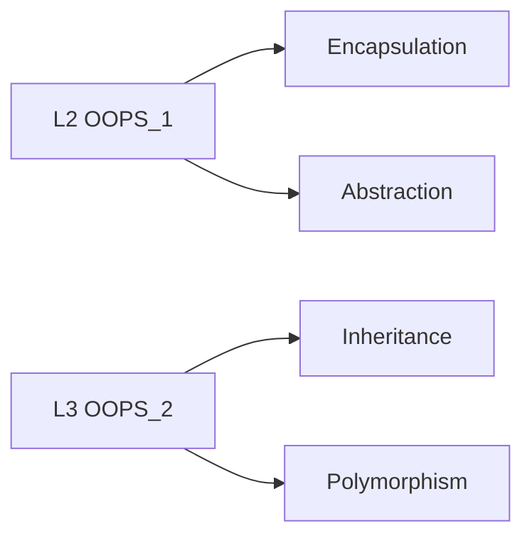
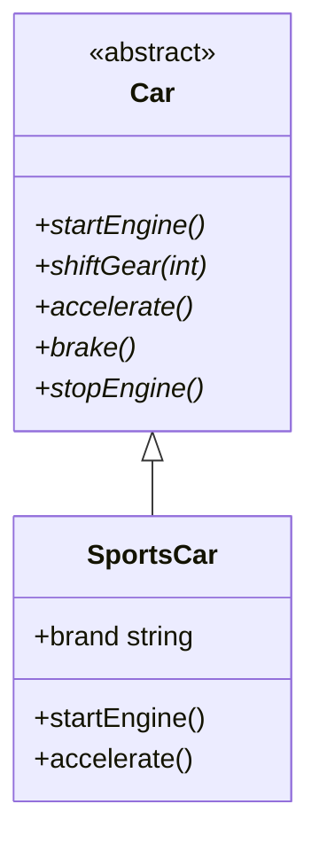
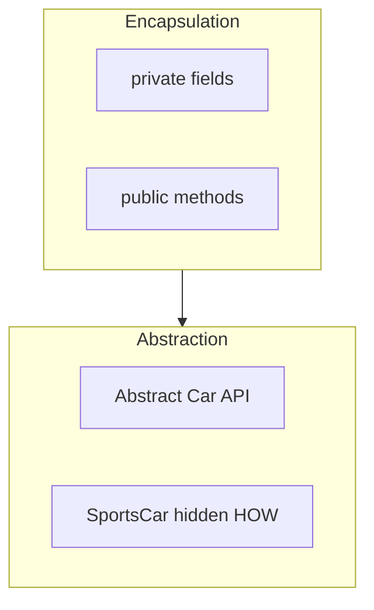
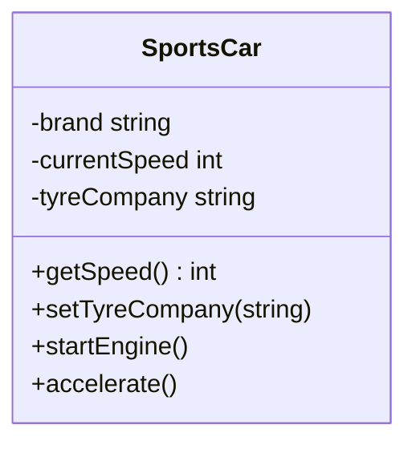

# L2 — OOP Part 1: Encapsulation & Abstraction (Complete Guide)

> **📌 Expanded master (recommended):** [`OOPS_COMPLETE_GUIDE.md`](./OOPS_COMPLETE_GUIDE.md) — class, ctor/dtor, static, inline, friend, const + pillars.  
> **Part 2:** [`L3 OOPS_COMPLETE_GUIDE`](../L3%20OOPS_2/OOPS_COMPLETE_GUIDE.md)

<p align="center">
  
  
  
</p>

> **Master doc** — Encapsulation + Abstraction detail me  
> **Code:** [`C++ Code/08_Encapsulation.cpp`](./C++%20Code/08_Encapsulation.cpp) · [`C++ Code/09_Abstraction.cpp`](./C++%20Code/09_Abstraction.cpp)

---

## Table of Contents

1. [OOP Kya Hai — 4 Pillars Map](#1-oop-kya-hai--4-pillars-map)
2. [Encapsulation — Poori Detail](#2-encapsulation--poori-detail)
3. [Access Modifiers (+ # -)](#3-access-modifiers---)
4. [Getters & Setters](#4-getters--setters)
5. [Abstraction — Poori Detail](#5-abstraction--poori-detail)
6. [Abstract Class vs Concrete Class](#6-abstract-class-vs-concrete-class)
7. [Pure Virtual Functions](#7-pure-virtual-functions)
8. [Encapsulation vs Abstraction](#8-encapsulation-vs-abstraction)
9. [Repo Code Walkthrough](#9-repo-code-walkthrough)
10. [UML Notation](#10-uml-notation)
11. [Interview Question Bank](#11-interview-question-bank)
12. [Cheat Sheet](#12-cheat-sheet)

---

## 1. OOP Kya Hai — 4 Pillars Map

| Pillar | Lesson | Matlab (ek line) |
|--------|--------|------------------|
| **Encapsulation** | **L2** ✅ | Data + behaviour ek object me; **hide** internal state |
| **Abstraction** | **L2** ✅ | User ko sirf **WHAT** dikhao, **HOW** chhupao |
| **Inheritance** | L3 | **IS-A** — child parent se extend |
| **Polymorphism** | L3 | Same call, different behaviour |



**L2 focus:** Object ko **safe** aur **simple interface** dena — real world `SportsCar` example.

---

## 2. Encapsulation — Poori Detail

### 2.1 Definition (2 rules from repo code)

`08_Encapsulation.cpp` ke comments se:

| # | Rule (English) | Hindi |
|---|----------------|-------|
| 1 | Object ki **characteristics (data)** aur **behaviour (methods)** ek saath encapsulated | Sab kuch class ke andar bundle |
| 2 | Sab kuch sabke liye open nahi — **data security** | Private fields, public controlled API |

### 2.2 Programming me kaise implement

| Step | C++ me |
|------|--------|
| 1 | `class` = blueprint for objects |
| 2 | **Variables** = state (brand, speed, gear) |
| 3 | **Methods** = behaviour (startEngine, accelerate) |
| 4 | **Access modifiers** = kaun kya dekh / change kar sake |

### 2.3 Real-world analogy — `SportsCar`

```
┌─────────────────────────────────────┐
│           SportsCar object          │
│  PRIVATE (hood ke neeche)           │
│    brand, model, isEngineOn,        │
│    currentSpeed, currentGear,       │
│    tyreCompany                      │
├─────────────────────────────────────┤
│  PUBLIC (driver controls)           │
│    startEngine(), accelerate(),     │
│    getSpeed(), setTyreCompany()     │
└─────────────────────────────────────┘
```

**Driver** directly `currentSpeed = 500` **nahi** kar sakta (commented code in demo) — sirf `accelerate()` / `brake()` se controlled change.

### 2.4 Fayde

| Fayda | Example |
|-------|---------|
| **Data hiding** | Speed negative / 500 glitch prevent |
| **Invariant maintain** | Engine off → shiftGear block |
| **Change internal impl** | Tyre company field rename — public API same |
| **Debugging easy** | State sirf methods se change |

---

## 3. Access Modifiers (+ # -)

| Modifier | Class member | Inherited by child? | Outside class? |
|----------|--------------|---------------------|----------------|
| **`public`** | ✅ | ✅ (as public) | ✅ |
| **`protected`** | ✅ | ✅ (child access) | ❌ |
| **`private`** | ✅ | ❌ direct | ❌ |

**UML / L4 notation:**

| Symbol | Keyword |
|--------|---------|
| `+` | public |
| `#` | protected |
| `-` | private |

**L2 `SportsCar`:** sab driving state **`private`**, methods **`public`**.

```cpp
class SportsCar {
private:
    int currentSpeed;   // -  hidden
public:
    int getSpeed();     // +  controlled read
    void accelerate(); // +  controlled write
};
```

---

## 4. Getters & Setters

### 4.1 Getter (read-only access)

```cpp
int getSpeed() { return currentSpeed; }
string getTyreCompany() { return tyreCompany; }
```

| Kab use | Kyun |
|---------|------|
| UI / log ko value chahiye | Field private rahe |
| Validation on read (rare) | Computed property |

### 4.2 Setter (controlled write)

```cpp
void setTyreCompany(string tyreCompany) {
    this->tyreCompany = tyreCompany;
}
```

| Kab use | Kyun |
|---------|------|
| User allowed to change | Lekin direct field nahi |
| Setter me validation | `if (empty) return;` |

### 4.3 Getter without setter

`currentSpeed` — sirf `getSpeed()`, **no** `setSpeed()` — speed change **only** via `accelerate()` / `brake()` → **strong encapsulation**.

### 4.4 `this` pointer

```cpp
this->brand = b;
this->tyreCompany = tyreCompany;
```

Current object ka address — parameter name clash resolve.

---

## 5. Abstraction — Poori Detail

### 5.1 Definition

**Abstraction** = complex implementation chhupao, user ko **simple interface** do.

| Real world | Code |
|------------|------|
| Pedals / steering — **WHAT** you do | `Car` abstract class methods |
| Engine, gearbox — **HOW** (under hood) | `SportsCar` implementation |

`09_Abstraction.cpp` comments:

1. Interface for outside world  
2. Tells **WHAT**, not **HOW**  
3. Abstract class ka object **direct nahi**  
4. Child implementation deta hai  
5. User ko hood ke andar ki zarurat nahi  

### 5.2 Two-class design (repo pattern)



| Class | Role |
|-------|------|
| `Car` | **Contract** — kya operations possible |
| `SportsCar` | **Implementation** — kaise hota hai |

### 5.3 Client code pattern

```cpp
Car* myCar = new SportsCar("Ford", "Mustang");
myCar->startEngine();   // interface se call
myCar->accelerate();    // actual SportsCar code runs (L3 dynamic poly)
```

**Note:** L2 me `Car` methods pure virtual — runtime polymorphism L3 me deep dive.

---

## 6. Abstract Class vs Concrete Class

| | Abstract class | Concrete class |
|---|----------------|----------------|
| **Instantiate** | ❌ `new Car()` illegal | ✅ `new SportsCar()` |
| **Pure virtual** | Kam se kam **1** `= 0` | Sab methods defined |
| **Purpose** | Interface / template | Full working object |
| **Repo example** | `class Car` | `class SportsCar` |

```cpp
class Car {
public:
    virtual void startEngine() = 0;  // pure virtual → abstract
    virtual ~Car() {}
};
```

---

## 7. Pure Virtual Functions

```cpp
virtual void accelerate() = 0;
```

| Part | Meaning |
|------|---------|
| `virtual` | Runtime override possible (child) |
| `= 0` | **No implementation** in this class — **pure virtual** |
| Child **must** implement | Warna abstract child bhi rahega |

**Destructor virtual kyun?**

```cpp
Car* p = new SportsCar(...);
delete p;  // SportsCar destructor chale — leak avoid
```

---

## 8. Encapsulation vs Abstraction

| | Encapsulation | Abstraction |
|---|---------------|-------------|
| **Focus** | **Hide data** + bundle | **Hide complexity** — show API |
| **Mechanism** | `private` / `protected` | Abstract class / interface |
| **Question** | "Kaun access kare?" | "User kya dekhe?" |
| **Same class?** | Often **dono** ek class me | `SportsCar` encapsulates + `Car` abstracts |



**Interview one-liner:**  
*Encapsulation = data security; Abstraction = simplified view.*

---

## 9. Repo Code Walkthrough

### 9.1 `08_Encapsulation.cpp` — line of thought

| Lines / block | Concept |
|---------------|---------|
| `private` fields | Data hiding |
| Constructor | Initial state safe |
| `startEngine`, `shiftGear` | Business rules (engine on check) |
| `getSpeed()` | Getter — no public speed field |
| `setTyreCompany()` | Controlled setter |
| Commented `currentSpeed = 500` | **Why encapsulation matters** |

**Compile & run:**

```bash
cd "L2 OOPS_1"
g++ -std=c++17 -Wall -Wextra "C++ Code/08_Encapsulation.cpp" -o bin/08_Encapsulation
./bin/08_Encapsulation
```

### 9.2 `09_Abstraction.cpp` — line of thought

| Block | Concept |
|-------|---------|
| `Car` pure virtual methods | Abstract interface |
| `SportsCar : public Car` | IS-A + implementation |
| `Car* myCar = new SportsCar` | Program to interface |
| `virtual ~Car()` | Safe delete via base pointer |

```bash
g++ -std=c++17 -Wall -Wextra "C++ Code/09_Abstraction.cpp" -o bin/09_Abstraction
./bin/09_Abstraction
```

---

## 10. UML Notation



Abstract class UML: *italic* name ya `<<abstract>>`, pure virtual *italic*.

**More:** [`L4 UML_DIAGRAMS_AND_NOTATION.md`](../L4%20UML_Diagrams/UML_DIAGRAMS_AND_NOTATION.md)

---

## 11. Interview Question Bank

<details>
<summary><strong>Q1: Encapsulation kya hai?</strong></summary>

Data + methods ek unit me; internal state `private`, access public methods se — taaki invalid state na bane (speed 500 direct set nahi).

</details>

<details>
<summary><strong>Q2: Abstraction kya hai?</strong></summary>

Implementation hide, sirf essential operations expose — `Car` interface, `SportsCar` detail.

</details>

<details>
<summary><strong>Q3: Abstract class vs interface?</strong></summary>

C++ me pure abstract class = interface jaisa; Java `interface` alag keyword, C++ me `virtual ... = 0` sab.

</details>

<details>
<summary><strong>Q4: Pure virtual function?</strong></summary>

`virtual void f() = 0;` — base me body nahi; child **must** override.

</details>

<details>
<summary><strong>Q5: Getter/setter zaroori?</strong></summary>

Encapsulation ke liye controlled access; har field ka setter nahi — behaviour methods better (`accelerate` vs `setSpeed`).

</details>

<details>
<summary><strong>Q6: virtual destructor kyun?</strong></summary>

`Base* p = new Derived(); delete p;` — derived destructor call ho, warna leak / UB.

</details>

---

## 12. Cheat Sheet

```
ENCAPSULATION = bundle + hide (private + public API)
ABSTRACTION   = show WHAT, hide HOW (abstract class)

private  → data hiding
public   → interface for user
protected → child access (L3 inheritance)

pure virtual = 0  → abstract class
Concrete child implements all pure virtuals

Getter  → read  |  Setter → controlled write
Prefer methods over raw setters for invariants

Car* p = new SportsCar();  → program to interface
virtual ~Base()  → safe delete
```

---

## Next lesson

➡️ [**L3 OOPS_2**](../L3%20OOPS_2/OOPS_2_COMPLETE.md) — Inheritance, Static & Dynamic Polymorphism

---

<p align="center">
  <b>L2 OOPS_1 — Encapsulation & Abstraction</b>
</p>
