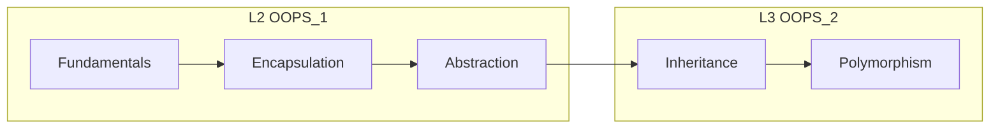

# OOP Complete Guide — Part 1 (L2): Fundamentals + Encapsulation + Abstraction

<p align="center">
  
  
  
</p>

> **Single source of truth (L2)** — class se lekar friend/const tak + **4 pillars** ka pehla half.  
> **Part 2:** [L3 OOPS_COMPLETE_GUIDE](../L3%20OOPS_2/OOPS_COMPLETE_GUIDE.md) — Inheritance + Polymorphism.

---

## Table of Contents

### Foundations
1. [OOP Kya Hai — 4 Pillars Roadmap](#1-oop-kya-hai--4-pillars-roadmap)
2. [Class vs Object](#2-class-vs-object)
3. [Access Modifiers (+ # -)](#3-access-modifiers--)
4. [Constructors & Destructors](#4-constructors--destructors)
5. [this Pointer](#5-this-pointer)
6. [static — Members & Methods](#6-static--members--methods)
7. [inline Functions](#7-inline-functions)
8. [friend — Function & Class](#8-friend--function--class)
9. [const & mutable](#9-const--mutable)

### Four Pillars (L2)
10. [Encapsulation — Full Detail](#10-encapsulation--full-detail)
11. [Abstraction — Full Detail](#11-abstraction--full-detail)
12. [Encapsulation vs Abstraction](#12-encapsulation-vs-abstraction)

### Advanced C++ (Interview)
13. [Advanced Topics — Separate Guide](#13-advanced-topics--separate-guide)

### Practice
14. [All Code Files — Map](#14-all-code-files--map)
15. [Interview Question Bank (L2)](#15-interview-question-bank-l2)
16. [Mega Cheat Sheet](#16-mega-cheat-sheet)

---

## 1. OOP Kya Hai — 4 Pillars Roadmap

**Object-Oriented Programming** = real world entities ko **objects** ki tarah model karna — har object apna **data** + **behaviour** rakhta hai.

| # | Pillar | Lesson | Ek line |
| - | ------ | ------ | ------- |
| 1 | **Encapsulation** | **L2** | Data + methods bundle; **hide** internal state |
| 2 | **Abstraction** | **L2** | User ko **WHAT**, implementation **HOW** chhupao |
| 3 | **Inheritance** | L3 | **IS-A** — child parent se extend |
| 4 | **Polymorphism** | L3 | Same interface, **alag behaviour** |



**OOP ke fayde (interview):** modularity, reuse, maintainability, data security, real-world mapping.

---

## 2. Class vs Object

| | Class | Object |
| - | ----- | ------ |
| **Kya hai** | Blueprint / template | Runtime instance |
| **Memory** | No state until object | Allocated (stack/heap) |
| **Analogy** | Biscuit cutter | Actual biscuit |

```cpp
class Student { /* fields + methods */ };
Student s1("Aditya", 101);     // stack object
Student* s2 = new Student("R", 102);  // heap
delete s2;
```

**Code:** [`01_Class_And_Object.cpp`](./C%20%2B%2B%20Code/01_Class_And_Object.cpp)

---

## 3. Access Modifiers (+ # -)

| Modifier | Same class | Derived class | Outside | UML |
| -------- | ---------- | ------------- | ------- | --- |
| `public` | ✅ | ✅ | ✅ | `+` |
| `protected` | ✅ | ✅ | ❌ | `#` |
| `private` | ✅ | ❌ | ❌ | `-` |

**Default (struct):** members `public`. **Default (class):** members `private`.

**Interview:** `protected` = inheritance ke liye child access; bahar se nahi.

---

## 4. Constructors & Destructors

### 4.1 Constructor types

| Type | Kab | Example |
| ---- | --- | ------- |
| **Default** | No-arg / `= default` | `Buffer()` |
| **Parameterized** | Initial values | `SportsCar("Ford", "Mustang")` |
| **Copy** | `Buffer b = a;` | Deep copy raw pointers |
| **Move** (C++11) | `std::move` | Transfer ownership |

### 4.2 Constructor initializer list

```cpp
SportsCar(string b, string m) : brand(b), model(m), currentSpeed(0) {}
```

Members **initialization order** = declaration order in class (not list order).

### 4.3 Destructor

- Object destroy hote waqt **automatic** call  
- `virtual ~Base()` jab polymorphic delete ho ([L3](../L3%20OOPS_2/OOPS_COMPLETE_GUIDE.md))

### 4.4 Rule of Three / Five

Agar class **raw pointer** manage kare:

| Rule of Three | Rule of Five (+ C++11) |
| ------------- | ---------------------- |
| Destructor | Destructor |
| Copy constructor | Copy constructor |
| Copy assignment | Copy assignment |
| — | Move constructor |
| — | Move assignment |

**Code:** [`02_Constructors_Destructors.cpp`](./C%20%2B%2B%20Code/02_Constructors_Destructors.cpp)

---

## 5. this Pointer

- Har non-static member function ko hidden **`this`** milta hai — current object ka address  
- `this->member` — parameter shadow resolve  
- `return *this` — **method chaining**

```cpp
Counter& increment() { count++; return *this; }
c.increment().increment();
```

**Code:** [`03_This_Pointer.cpp`](./C%20%2B%2B%20Code/03_This_Pointer.cpp)

---

## 6. static — Members & Methods

| | static data | static method |
| - | ----------- | ------------- |
| **Belongs to** | Class (one copy) | Class |
| **Per object?** | ❌ Shared | ❌ No `this` |
| **Call** | `Class::method()` | `Class::method()` |
| **Define data** | Outside class once | Inside/outside |

```cpp
int CarFactory::carsProduced = 0;  // required definition
```

**Use cases:** object counter, utility helpers, singleton (careful).

**Interview:** static local in function = persists across calls (lifetime).

**Code:** [`04_Static_Members.cpp`](./C%20%2B%2B%20Code/04_Static_Members.cpp)

**Note:** `static` at global/file scope = internal linkage (C++) — alag concept.

---

## 7. inline Functions

- **Suggestion** to compiler: function body call site par expand — call overhead kam  
- Defined in header often (ODR — One Definition Rule)  
- Compiler **may ignore** `inline` — large functions usually not inlined  

```cpp
inline int add(int a, int b) { return a + b; }
class X { int square(int x) const { return x*x; } };  // implicit inline
```

**Interview:** `inline` ≠ `macro` — type safe, respects scope.

**Code:** [`05_Inline_Functions.cpp`](./C%20%2B%2B%20Code/05_Inline_Functions.cpp)

---

## 8. friend — Function & Class

- **friend** = selective break of encapsulation  
- **Not** member; can access `private` / `protected`  
- Friendship **not inherited**, **not transitive**

```cpp
class BankAccount {
    double balance;
    friend void printBalance(const BankAccount& acc);
};
```

**Use sparingly:** operator overloading (`<<`), tight coupling tests.

**Code:** [`06_Friend_Function.cpp`](./C%20%2B%2B%20Code/06_Friend_Function.cpp)

---

## 9. const & mutable

| Syntax | Meaning |
| ------ | ------- |
| `const int x` | x change nahi |
| `void f() const` | method object state modify nahi karega (logical const) |
| `const Student&` | bind to const — only const methods |
| `mutable int cache` | const method me bhi change allowed |

```cpp
double getCelsius() const { readCount++; return celsius; }
```

**Code:** [`07_Const_And_Mutable.cpp`](./C%20%2B%2B%20Code/07_Const_And_Mutable.cpp)

---

## 10. Encapsulation — Full Detail

### Definition (2 rules)

1. Object ki **characteristics + behaviour** ek unit (class) me  
2. Sab kuch sabke liye open nahi — **data security**

### Implementation

- `private` fields  
- `public` controlled API (`accelerate`, not `speed = 500`)  
- Getters/setters **jab zaroori** — prefer behaviour methods for invariants  

### SportsCar example

```cpp
class SportsCar {
private:
    int currentSpeed;
public:
    int getSpeed() { return currentSpeed; }
    void accelerate() { if (engineOn) currentSpeed += 20; }
};
// myCar->currentSpeed = 500;  // ❌ compile error
```

**Code:** [`08_Encapsulation.cpp`](./C%20%2B%2B%20Code/08_Encapsulation.cpp)  
**Deep dive:** [`notes/02_encapsulation.md`](./notes/02_encapsulation.md)

---

## 11. Abstraction — Full Detail

### Definition

- **Hide complexity** — user ko simple operations  
- **Abstract class** = WHAT; **concrete child** = HOW  

```cpp
class Car {
public:
    virtual void accelerate() = 0;  // pure virtual
    virtual ~Car() {}
};
class SportsCar : public Car { void accelerate() override { ... } };
Car* c = new SportsCar("Ford", "Mustang");
```

| Abstract class | Interface (C++ idiom) |
| ---------------- | --------------------- |
| Kam se kam 1 pure virtual | Sab methods pure virtual |
| Can have data members | Usually only pure virtual |
| Can have concrete methods | Rare |

**Code:** [`09_Abstraction.cpp`](./C%20%2B%2B%20Code/09_Abstraction.cpp)  
**Deep dive:** [`notes/03_abstraction.md`](./notes/03_abstraction.md)

---

## 12. Encapsulation vs Abstraction

| | Encapsulation | Abstraction |
| - | ------------- | ----------- |
| **Focus** | Hide **data** | Hide **complexity** |
| **Tool** | private/protected | abstract API |
| **Question** | Kaun access kare? | User kya dekhe? |

*Encapsulation = security; Abstraction = simplicity.*

---

## 13. Advanced Topics — Separate Guide

Ye topics **interview me zaroor** aate hain — full detail + code:

| Topic | Guide |
| ----- | ----- |
| Shallow / Deep copy | [OOPS_ADVANCED_CPP](./OOPS_ADVANCED_CPP.md#1-shallow-copy-vs-deep-copy) |
| Operator overloading | [§2](./OOPS_ADVANCED_CPP.md#2-operator-overloading) |
| new vs malloc vs calloc | [§3](./OOPS_ADVANCED_CPP.md#3-new-vs-malloc-vs-calloc) |
| RAII | [§4](./OOPS_ADVANCED_CPP.md#4-raii) |
| unique/shared/weak_ptr | [§5](./OOPS_ADVANCED_CPP.md#5-smart-pointers) |
| Move / `std::move` | [§6](./OOPS_ADVANCED_CPP.md#6-move-semantics--rvalue) |
| Rule of 3/5/0 | [§7](./OOPS_ADVANCED_CPP.md#7-rule-of-3--5--0) |
| Virtual / vtable / Diamond | [L3 OOPS_ADVANCED_INHERITANCE](../L3%20OOPS_2/OOPS_ADVANCED_INHERITANCE.md) |

---

## 14. All Code Files — Map

| Range | Topics |
| ----- | ------ |
| `01`–`07` | Class, ctor, this, static, inline, friend, const |
| `08`–`14` | Shallow/deep, operators, malloc, RAII, smart ptr, move, Rule 3/5/0 |
| `Encapsulation`, `Abstraction` | 4 pillars (L2) |

```bash
cd "L2 OOPS_1" && ./compile.sh && ./bin/14_Smart_Pointers
```

---

## 15. Interview Question Bank (L2)

<details><summary><b>Class vs object?</b></summary>Blueprint vs instance; class no memory until object created.</details>

<details><summary><b>Encapsulation?</b></summary>Bundle data+methods; private fields; public controlled API.</details>

<details><summary><b>Abstraction?</b></summary>Expose WHAT hide HOW; abstract class / interface.</details>

<details><summary><b>Pure virtual?</b></summary>`virtual void f() = 0;` — no base body; makes class abstract.</details>

<details><summary><b>static member vs static function?</b></summary>One shared data vs no this; call Class::fn().</details>

<details><summary><b>inline?</b></summary>Hint to embed body at call site; not guaranteed.</details>

<details><summary><b>friend?</b></summary>Non-member granted private access; use rarely.</details>

<details><summary><b>const member function?</b></summary>Promises not to modify logical state; callable on const object.</details>

<details><summary><b>Copy ctor vs assignment?</b></summary>Copy ctor new object; assignment existing object both sides alive.</details>

<details><summary><b>Rule of three?</b></summary>If custom dtor/copy for resource, define all three.</details>

---

## 16. Mega Cheat Sheet

```
CLASS/OBJECT     blueprint vs instance
ACCESS           public + | protected # | private -
CTOR/DTOR        init / cleanup | virtual ~Base() if poly
this             current object | chaining return *this
static           class-level | define data outside class
inline           compile hint | often in header
friend           private access for non-member
const            const method = read-only object promise
mutable          exception in const method

ENCAPSULATION    private + public API
ABSTRACTION      abstract class + concrete impl
pure virtual =0  cannot instantiate base
```

---

➡️ **Advanced C++:** [OOPS_ADVANCED_CPP.md](./OOPS_ADVANCED_CPP.md)  
➡️ **Next:** [L3 — Inheritance & Polymorphism](../L3%20OOPS_2/OOPS_COMPLETE_GUIDE.md) · [L3 Advanced Inheritance](../L3%20OOPS_2/OOPS_ADVANCED_INHERITANCE.md)
