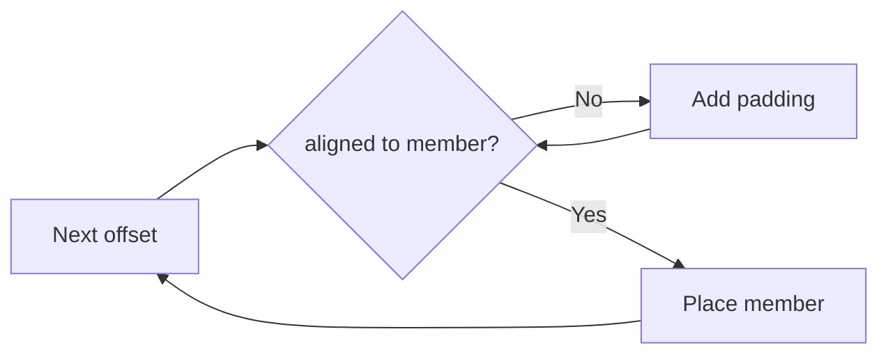

# Struct Padding & Alignment (Greedy Alignment) — Complete Guide

> **Runnable:** [`C++ Code/17_Padding_And_Alignment.cpp`](./C%20%2B%2B%20Code/17_Padding_And_Alignment.cpp)

---

## Table of Contents

1. [Alignment kya hai](#1-alignment-kya-hai)
2. [Padding kyun lagta hai](#2-padding-kyun-lagta-hai)
3. [Greedy alignment rule](#3-greedy-alignment-rule)
4. [sizeof bad vs good layout](#4-sizeof-bad-vs-good-layout)
5. [alignas / alignof](#5-alignas--alignof)
6. [#pragma pack](#6-pragma-pack)
7. [Cache line & false sharing (bonus)](#7-cache-line--false-sharing-bonus)
8. [Interview Q&A](#8-interview-qa)

---

## 1. Alignment kya hai

CPU memory se **efficient** read karta hai jab address **type ke alignment** ka multiple ho.

| Type (typical 64-bit) | Size | Alignment |
|-----------------------|------|-----------|
| `char` | 1 | 1 |
| `int` | 4 | 4 |
| `double` | 8 | 8 |
| pointer | 8 | 8 |

```cpp
alignof(int);   // usually 4
sizeof(int);    // 4
```

---

## 2. Padding kyun lagta hai

Compiler **unused bytes** insert karta hai taaki next member sahi boundary par aaye.

```cpp
struct Bad {
    char a;   // offset 0, size 1
    // 3 bytes PADDING
    int b;    // offset 4 — int needs 4-align
    char c;   // offset 8
    // 3 bytes PADDING — struct size multiple of 4
};  // sizeof often 12
```

**Visual (12 bytes):**

```
[a][pad][pad][pad][  b  ][c][pad][pad][pad]
```

---

## 3. Greedy alignment rule

Har member ko place karte waqt:

1. **Current offset** ko member ke `alignof(T)` ka multiple banao (padding add).
2. Member place karo.
3. Struct ka **total size** sabse strict (largest) alignment ka multiple banao.

Isi ko books me **greedy alignment** / natural alignment bolte hain — compiler step-by-step "next valid slot" dhundhta hai.



---

## 4. sizeof bad vs good layout

**Reorder** karke waste kam karo — bade members pehle:

```cpp
struct Good {
    int b;    // 4
    char a;   // 1
    char c;   // 1 + 2 tail padding → sizeof often 8
};
```

| Struct | Typical sizeof (64-bit) |
|--------|-------------------------|
| `Bad` (char,int,char) | 12 |
| `Good` (int,char,char) | 8 |

**Tools:** `sizeof(T)`, `offsetof(T, member)` — demo file me print hota hai.

---

## 5. alignas / alignof

```cpp
struct alignas(16) CacheLine {
    char x;
};  // sizeof may be 16 — SIMD / cache alignment
```

| Keyword | Use |
|---------|-----|
| `alignof(T)` | Required alignment of type |
| `alignas(N)` | Force minimum alignment (≥ type natural) |

---

## 6. #pragma pack

```cpp
#pragma pack(push, 1)
struct Packed { char a; int b; char c; };  // minimal padding
#pragma pack(pop)
```

| Pros | Cons |
|------|------|
| Kam memory | Unaligned loads — slower / platform issues |
| Wire protocols, embedded | Avoid in hot-path perf code unless needed |

---

## 7. Cache line & false sharing (bonus)

Modern CPU **cache line** (~64 bytes) load karta hai.

Agar do threads **alag variables** ko update karein lekin wo **same cache line** me hon → **false sharing** → performance drop.

**Fix:** `alignas(64)` per-thread counters, padding between hot fields.

---

## 8. Interview Q&A

<details>
<summary><strong>sizeof struct with char, int, char?</strong></summary>

Usually **12** on 64-bit (padding). Reorder to int first → often **8**.

</details>

<details>
<summary><strong>Padding vs alignment?</strong></summary>

**Alignment** = rule (address multiple). **Padding** = extra bytes compiler adds to satisfy alignment.

</details>

<details>
<summary><strong>Greedy alignment?</strong></summary>

Members placed in order; before each member, offset rounded up to that member's alignment; final struct size rounded to struct alignment.

</details>

---

## Cheat sheet

```
offsetof / sizeof     → layout samjho
Reorder fields        → bada → chota
alignas(64)           → false sharing kam
#pragma pack(1)       → tight pack, use carefully
```

---

⬅️ [L2 OOPS_ADVANCED_CPP](./OOPS_ADVANCED_CPP.md) · ➡️ [L3 Inheritance topics](../L3%20OOPS_2/notes/OOPS_INHERITANCE_INTERVIEW_TOPICS.md)
