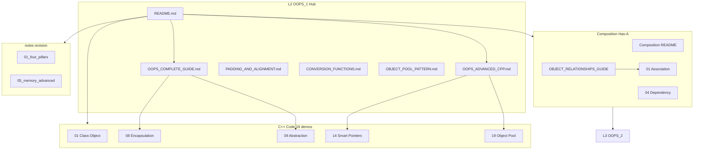
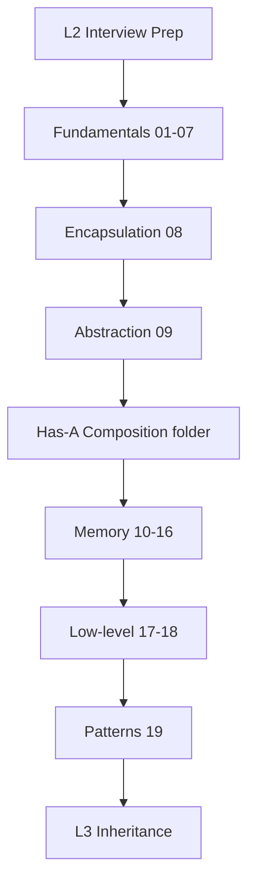

# L2 — OOP Part 1: Complete Reference (Encapsulation + Fundamentals)

> **Goal:** OOP + C++ interview topics **ek jagah** — theory, diagrams, runnable code. Padhna ho to **sirf is folder + L3** kaafi hai.

<p align="center">
  
  
  
  
</p>

---

## Canonical source of truth

- Latest navigation and counts: `README.md`
- Theory depth: `OOPS_COMPLETE_GUIDE.md`
- Legacy alias (backward links): `OOPS_1_COMPLETE.md`

If any mismatch appears, trust this `README.md`.

---

## Start here

| Document | Kya hai |
| -------- | ------- |
| **[`OOPS_COMPLETE_GUIDE.md`](./OOPS_COMPLETE_GUIDE.md)** | **Master L2** — fundamentals + Encapsulation + Abstraction |
| **[`OOPS_ADVANCED_CPP.md`](./OOPS_ADVANCED_CPP.md)** | **Advanced** — shallow/deep, operator overloading, new/malloc/calloc, RAII, smart ptr, move, Rule 3/5/0 |
| **[`PADDING_AND_ALIGNMENT.md`](./PADDING_AND_ALIGNMENT.md)** | Struct padding, greedy alignment, `alignas`, `#pragma pack` |
| **[`CONVERSION_FUNCTIONS.md`](./CONVERSION_FUNCTIONS.md)** | Implicit conversion, `explicit`, conversion operators |
| **[`OBJECT_POOL_PATTERN.md`](./OBJECT_POOL_PATTERN.md)** | Object pool — reuse, memory optimization |
| **[`L1 Composition/OBJECT_RELATIONSHIPS_GUIDE.md`](../%20L1%20Composition/OBJECT_RELATIONSHIPS_GUIDE.md)** | **Has-A family** — Association, Aggregation, Composition, Dependency |
| **[`L3 OOPS_ADVANCED_INHERITANCE`](../L3%20OOPS_2/OOPS_ADVANCED_INHERITANCE.md)** | virtual, vtable, virtual dtor, diamond, overload vs override |
| [`notes/`](./notes/) | Topic-wise revision |
| [`L1 Composition/notes/`](../%20L1%20Composition/notes/) | Per-relationship quick revision |
| [`notes/06_oop_api_error_handling.md`](./notes/06_oop_api_error_handling.md) | OOP API error handling: exception vs status |

**Legacy alias:** [`OOPS_1_COMPLETE.md`](./OOPS_1_COMPLETE.md) → same topics, L2 pillars detail (Encap + Abstraction).

---

## Architecture — folder ka pura map (Mermaid)



---

## Folder layout

```
L2 OOPS_1/
├── README.md
├── OOPS_COMPLETE_GUIDE.md
├── OOPS_ADVANCED_CPP.md
├── C++ Code/                 ← 01_ … 20_ (classes, memory, pillars)
├── notes/
└── compile.sh
```

---

## All guides — detailed index

| Guide | Focus | Kab padho |
| ----- | ----- | --------- |
| [`OOPS_COMPLETE_GUIDE.md`](./OOPS_COMPLETE_GUIDE.md) | Class, ctor/dtor, static, friend, const, Encapsulation, Abstraction | Pehle din — theory foundation |
| [`OOPS_ADVANCED_CPP.md`](./OOPS_ADVANCED_CPP.md) | Shallow/deep, operators, malloc vs new, RAII, smart ptr, move, Rule 3/5/0 | Memory interviews se pehle |
| [`PADDING_AND_ALIGNMENT.md`](./PADDING_AND_ALIGNMENT.md) | sizeof, padding, alignas, cache lines | Low-level / embedded rounds |
| [`CONVERSION_FUNCTIONS.md`](./CONVERSION_FUNCTIONS.md) | explicit, conversion operators | Constructor design questions |
| [`OBJECT_POOL_PATTERN.md`](./OBJECT_POOL_PATTERN.md) | Acquire/release, reuse | System design + performance |
| [`OOPS_1_COMPLETE.md`](./OOPS_1_COMPLETE.md) | Legacy alias — pillars detail | Bookmark only |
| [`OBJECT_RELATIONSHIPS_GUIDE.md`](../%20L1%20Composition/OBJECT_RELATIONSHIPS_GUIDE.md) | UML arrows, ownership, lifetime | Before L3 Composition vs Inheritance |
| [`OOPS_COMPLETE_GUIDE.md`](../L3%20OOPS_2/OOPS_COMPLETE_GUIDE.md) | Inheritance + Polymorphism Part 2 | L2 ke baad |
| [`OOPS_ADVANCED_INHERITANCE.md`](../L3%20OOPS_2/OOPS_ADVANCED_INHERITANCE.md) | vtable, diamond, virtual dtor | Advanced inheritance |

---

## Code index (`C++ Code/`) — summary table

| # | File | Topic |
| - | ---- | ----- |
| 01 | [`01_Class_And_Object.cpp`](./C%20%2B%2B%20Code/01_Class_And_Object.cpp) | Class blueprint, stack/heap object |
| 02 | [`02_Constructors_Destructors.cpp`](./C%20%2B%2B%20Code/02_Constructors_Destructors.cpp) | Default, copy ctor, assignment, dtor |
| 03 | [`03_This_Pointer.cpp`](./C%20%2B%2B%20Code/03_This_Pointer.cpp) | `this`, method chaining |
| 04 | [`04_Static_Members.cpp`](./C%20%2B%2B%20Code/04_Static_Members.cpp) | `static` data + static methods |
| 05 | [`05_Inline_Functions.cpp`](./C%20%2B%2B%20Code/05_Inline_Functions.cpp) | `inline` keyword |
| 06 | [`06_Friend_Function.cpp`](./C%20%2B%2B%20Code/06_Friend_Function.cpp) | `friend` function & class |
| 07 | [`07_Const_And_Mutable.cpp`](./C%20%2B%2B%20Code/07_Const_And_Mutable.cpp) | `const` methods, `mutable` |
| 08 | [`08_Encapsulation.cpp`](./C%20%2B%2B%20Code/08_Encapsulation.cpp) | private, getters/setters |
| 09 | [`09_Abstraction.cpp`](./C%20%2B%2B%20Code/09_Abstraction.cpp) | abstract class, pure virtual |
| 10 | [`10_Shallow_Deep_Copy.cpp`](./C%20%2B%2B%20Code/10_Shallow_Deep_Copy.cpp) | Shallow vs deep copy |
| 11 | [`11_Operator_Overloading.cpp`](./C%20%2B%2B%20Code/11_Operator_Overloading.cpp) | `operator+`, `<<` |
| 12 | [`12_New_Malloc_Calloc.cpp`](./C%20%2B%2B%20Code/12_New_Malloc_Calloc.cpp) | new vs malloc vs calloc |
| 13 | [`13_RAII.cpp`](./C%20%2B%2B%20Code/13_RAII.cpp) | RAII file/mutex guard |
| 14 | [`14_Smart_Pointers.cpp`](./C%20%2B%2B%20Code/14_Smart_Pointers.cpp) | unique/shared/weak_ptr |
| 15 | [`15_Move_Semantics.cpp`](./C%20%2B%2B%20Code/15_Move_Semantics.cpp) | move ctor, `std::move` |
| 16 | [`16_Rule_Of_Three_Five_Zero.cpp`](./C%20%2B%2B%20Code/16_Rule_Of_Three_Five_Zero.cpp) | Rule of 3/5/0 |
| 17 | [`17_Padding_And_Alignment.cpp`](./C%20%2B%2B%20Code/17_Padding_And_Alignment.cpp) | Padding & alignment |
| 18 | [`18_Conversion_Functions.cpp`](./C%20%2B%2B%20Code/18_Conversion_Functions.cpp) | Implicit vs `explicit` conversions |
| 19 | [`19_Object_Pool_Pattern.cpp`](./C%20%2B%2B%20Code/19_Object_Pool_Pattern.cpp) | Object pool acquire/release |
| 20 | [`20_Inline_Static_Member_Usecase.cpp`](./C%20%2B%2B%20Code/20_Inline_Static_Member_Usecase.cpp) | `static` vs `inline static` use case |

---

## Detailed breakdown — har `.cpp` file (19 files)

> Har demo **compile.sh** se `bin/` me binary banata hai. Run: `./bin/NN_Topic`

### 01. Class & Object

| Field | Detail |
| ----- | ------ |
| **File** | [`01_Class_And_Object.cpp`](./C%20%2B%2B%20Code/01_Class_And_Object.cpp) |
| **Topic** | Class blueprint, stack/heap object |
| **Theory** | Class = template, Object = instance. Stack vs heap allocation. |
| **Guide** | [`OOPS_COMPLETE_GUIDE.md#2-class-vs-object`](./OOPS_COMPLETE_GUIDE.md#2-class-vs-object) |
| **Run** | `./bin/01_Class_And_Object` |
| **Interview** | Class aur object me kya difference hai? Stack vs heap object kab banate ho? |

```bash
cd "L2 OOPS_1"
./compile.sh
./bin/01_Class_And_Object
```

### 02. Constructors & Destructors

| Field | Detail |
| ----- | ------ |
| **File** | [`02_Constructors_Destructors.cpp`](./C%20%2B%2B%20Code/02_Constructors_Destructors.cpp) |
| **Topic** | Default, copy ctor, assignment, dtor |
| **Theory** | Ctor initialization list, Rule of Three preview, self-assignment check. |
| **Guide** | [`OOPS_COMPLETE_GUIDE.md#4-constructors--destructors`](./OOPS_COMPLETE_GUIDE.md#4-constructors--destructors) |
| **Run** | `./bin/02_Constructors_Destructors` |
| **Interview** | Copy constructor kab call hota hai? Assignment operator vs copy ctor? |

```bash
cd "L2 OOPS_1"
./compile.sh
./bin/02_Constructors_Destructors
```

### 03. this Pointer

| Field | Detail |
| ----- | ------ |
| **File** | [`03_This_Pointer.cpp`](./C%20%2B%2B%20Code/03_This_Pointer.cpp) |
| **Topic** | `this`, method chaining |
| **Theory** | Implicit pointer to current object; fluent interface pattern. |
| **Guide** | [`OOPS_COMPLETE_GUIDE.md#5-this-pointer`](./OOPS_COMPLETE_GUIDE.md#5-this-pointer) |
| **Run** | `./bin/03_This_Pointer` |
| **Interview** | `this` pointer kya return karta hai? Method chaining kaise implement karte ho? |

```bash
cd "L2 OOPS_1"
./compile.sh
./bin/03_This_Pointer
```

### 04. Static Members

| Field | Detail |
| ----- | ------ |
| **File** | [`04_Static_Members.cpp`](./C%20%2B%2B%20Code/04_Static_Members.cpp) |
| **Topic** | `static` data + static methods |
| **Theory** | Class-level state; static method cannot use non-static members directly. |
| **Guide** | [`OOPS_COMPLETE_GUIDE.md#6-static--members--methods`](./OOPS_COMPLETE_GUIDE.md#6-static--members--methods) |
| **Run** | `./bin/04_Static_Members` |
| **Interview** | Static variable kahan store hota hai? Static method me `this` allowed? |

```bash
cd "L2 OOPS_1"
./compile.sh
./bin/04_Static_Members
```

### 05. Inline Functions

| Field | Detail |
| ----- | ------ |
| **File** | [`05_Inline_Functions.cpp`](./C%20%2B%2B%20Code/05_Inline_Functions.cpp) |
| **Topic** | `inline` keyword |
| **Theory** | Hint to compiler for expansion; ODR considerations. |
| **Guide** | [`OOPS_COMPLETE_GUIDE.md#7-inline-functions`](./OOPS_COMPLETE_GUIDE.md#7-inline-functions) |
| **Run** | `./bin/05_Inline_Functions` |
| **Interview** | Inline function kya karta hai? Header me function definition kyun? |

```bash
cd "L2 OOPS_1"
./compile.sh
./bin/05_Inline_Functions
```

### 06. Friend Function

| Field | Detail |
| ----- | ------ |
| **File** | [`06_Friend_Function.cpp`](./C%20%2B%2B%20Code/06_Friend_Function.cpp) |
| **Topic** | `friend` function & class |
| **Theory** | Break encapsulation selectively for operators / cross-class access. |
| **Guide** | [`OOPS_COMPLETE_GUIDE.md#8-friend--function--class`](./OOPS_COMPLETE_GUIDE.md#8-friend--function--class) |
| **Run** | `./bin/06_Friend_Function` |
| **Interview** | Friend function encapsulation todta hai? Friend class vs friend function? |

```bash
cd "L2 OOPS_1"
./compile.sh
./bin/06_Friend_Function
```

### 07. const & mutable

| Field | Detail |
| ----- | ------ |
| **File** | [`07_Const_And_Mutable.cpp`](./C%20%2B%2B%20Code/07_Const_And_Mutable.cpp) |
| **Topic** | `const` methods, `mutable` |
| **Theory** | Logical constness; mutable for cache fields inside const methods. |
| **Guide** | [`OOPS_COMPLETE_GUIDE.md#9-const--mutable`](./OOPS_COMPLETE_GUIDE.md#9-const--mutable) |
| **Run** | `./bin/07_Const_And_Mutable` |
| **Interview** | Const method kya guarantee karta hai? Mutable kab use karte ho? |

```bash
cd "L2 OOPS_1"
./compile.sh
./bin/07_Const_And_Mutable
```

### 08. Encapsulation (Pillar 1)

| Field | Detail |
| ----- | ------ |
| **File** | [`08_Encapsulation.cpp`](./C%20%2B%2B%20Code/08_Encapsulation.cpp) |
| **Topic** | private, getters/setters |
| **Theory** | Data hiding + controlled access via public interface. |
| **Guide** | [`OOPS_COMPLETE_GUIDE.md#10-encapsulation--full-detail`](./OOPS_COMPLETE_GUIDE.md#10-encapsulation--full-detail) |
| **Run** | `./bin/08_Encapsulation` |
| **Interview** | Encapsulation ka matlab? Getter/setter har field ke liye zaroori? |

```bash
cd "L2 OOPS_1"
./compile.sh
./bin/08_Encapsulation
```

### 09. Abstraction (Pillar 2)

| Field | Detail |
| ----- | ------ |
| **File** | [`09_Abstraction.cpp`](./C%20%2B%2B%20Code/09_Abstraction.cpp) |
| **Topic** | abstract class, pure virtual |
| **Theory** | Interface contract; user ko implementation detail nahi dikhana. |
| **Guide** | [`OOPS_COMPLETE_GUIDE.md#11-abstraction--full-detail`](./OOPS_COMPLETE_GUIDE.md#11-abstraction--full-detail) |
| **Run** | `./bin/09_Abstraction` |
| **Interview** | Abstract class vs interface? Pure virtual function kya hai? |

```bash
cd "L2 OOPS_1"
./compile.sh
./bin/09_Abstraction
```

### 10. Shallow vs Deep Copy

| Field | Detail |
| ----- | ------ |
| **File** | [`10_Shallow_Deep_Copy.cpp`](./C%20%2B%2B%20Code/10_Shallow_Deep_Copy.cpp) |
| **Topic** | Shallow vs deep copy |
| **Theory** | Pointer members — default copy shallow; deep copy allocates new buffer. |
| **Guide** | [`OOPS_ADVANCED_CPP.md`](./OOPS_ADVANCED_CPP.md) |
| **Run** | `./bin/10_Shallow_Deep_Copy` |
| **Interview** | Shallow copy problem kya hai? Deep copy kab mandatory? |

```bash
cd "L2 OOPS_1"
./compile.sh
./bin/10_Shallow_Deep_Copy
```

### 11. Operator Overloading

| Field | Detail |
| ----- | ------ |
| **File** | [`11_Operator_Overloading.cpp`](./C%20%2B%2B%20Code/11_Operator_Overloading.cpp) |
| **Topic** | `operator+`, `<<` |
| **Theory** | Member vs non-member operators; stream insertion friends. |
| **Guide** | [`OOPS_ADVANCED_CPP.md`](./OOPS_ADVANCED_CPP.md) |
| **Run** | `./bin/11_Operator_Overloading` |
| **Interview** | Operator+ member ya friend? `<<` overload kaise? |

```bash
cd "L2 OOPS_1"
./compile.sh
./bin/11_Operator_Overloading
```

### 12. new vs malloc vs calloc

| Field | Detail |
| ----- | ------ |
| **File** | [`12_New_Malloc_Calloc.cpp`](./C%20%2B%2B%20Code/12_New_Malloc_Calloc.cpp) |
| **Topic** | new vs malloc vs calloc |
| **Theory** | C++ new/delete call ctors/dtors; malloc raw bytes only. |
| **Guide** | [`OOPS_ADVANCED_CPP.md`](./OOPS_ADVANCED_CPP.md) |
| **Run** | `./bin/12_New_Malloc_Calloc` |
| **Interview** | new aur malloc difference? calloc zero-initialize karta hai? |

```bash
cd "L2 OOPS_1"
./compile.sh
./bin/12_New_Malloc_Calloc
```

### 13. RAII

| Field | Detail |
| ----- | ------ |
| **File** | [`13_RAII.cpp`](./C%20%2B%2B%20Code/13_RAII.cpp) |
| **Topic** | RAII file/mutex guard |
| **Theory** | Resource Acquisition Is Initialization — scope-bound cleanup. |
| **Guide** | [`OOPS_ADVANCED_CPP.md`](./OOPS_ADVANCED_CPP.md) |
| **Run** | `./bin/13_RAII` |
| **Interview** | RAII kya hai? Exception safe resource management kaise? |

```bash
cd "L2 OOPS_1"
./compile.sh
./bin/13_RAII
```

### 14. Smart Pointers

| Field | Detail |
| ----- | ------ |
| **File** | [`14_Smart_Pointers.cpp`](./C%20%2B%2B%20Code/14_Smart_Pointers.cpp) |
| **Topic** | unique/shared/weak_ptr |
| **Theory** | Automatic ownership; shared_ptr ref count; weak_ptr breaks cycles. |
| **Guide** | [`OOPS_ADVANCED_CPP.md`](./OOPS_ADVANCED_CPP.md) |
| **Run** | `./bin/14_Smart_Pointers` |
| **Interview** | unique_ptr copy kyun nahi? shared_ptr thread-safe count? |

```bash
cd "L2 OOPS_1"
./compile.sh
./bin/14_Smart_Pointers
```

### 15. Move Semantics

| Field | Detail |
| ----- | ------ |
| **File** | [`15_Move_Semantics.cpp`](./C%20%2B%2B%20Code/15_Move_Semantics.cpp) |
| **Topic** | move ctor, `std::move` |
| **Theory** | Steal resources from rvalue; noexcept move for containers. |
| **Guide** | [`OOPS_ADVANCED_CPP.md`](./OOPS_ADVANCED_CPP.md) |
| **Run** | `./bin/15_Move_Semantics` |
| **Interview** | Move vs copy? std::move actually move karta hai? |

```bash
cd "L2 OOPS_1"
./compile.sh
./bin/15_Move_Semantics
```

### 16. Rule of 3/5/0

| Field | Detail |
| ----- | ------ |
| **File** | [`16_Rule_Of_Three_Five_Zero.cpp`](./C%20%2B%2B%20Code/16_Rule_Of_Three_Five_Zero.cpp) |
| **Topic** | Rule of 3/5/0 |
| **Theory** | Special members — define or delete explicitly; Rule of Zero with smart ptr. |
| **Guide** | [`OOPS_ADVANCED_CPP.md`](./OOPS_ADVANCED_CPP.md) |
| **Run** | `./bin/16_Rule_Of_Three_Five_Zero` |
| **Interview** | Rule of Five me kaunse members? Rule of Zero kab follow karo? |

```bash
cd "L2 OOPS_1"
./compile.sh
./bin/16_Rule_Of_Three_Five_Zero
```

### 17. Padding & Alignment

| Field | Detail |
| ----- | ------ |
| **File** | [`17_Padding_And_Alignment.cpp`](./C%20%2B%2B%20Code/17_Padding_And_Alignment.cpp) |
| **Topic** | Padding & alignment |
| **Theory** | Struct layout, padding bytes, alignment requirements. |
| **Guide** | [`PADDING_AND_ALIGNMENT.md`](./PADDING_AND_ALIGNMENT.md) |
| **Run** | `./bin/17_Padding_And_Alignment` |
| **Interview** | sizeof struct kyun expected se bada? alignas kya karta hai? |

```bash
cd "L2 OOPS_1"
./compile.sh
./bin/17_Padding_And_Alignment
```

### 18. Conversion Functions

| Field | Detail |
| ----- | ------ |
| **File** | [`18_Conversion_Functions.cpp`](./C%20%2B%2B%20Code/18_Conversion_Functions.cpp) |
| **Topic** | Implicit vs `explicit` conversions |
| **Theory** | Single-arg ctor conversions; explicit keyword blocks implicit. |
| **Guide** | [`CONVERSION_FUNCTIONS.md`](./CONVERSION_FUNCTIONS.md) |
| **Run** | `./bin/18_Conversion_Functions` |
| **Interview** | explicit keyword kyun? Conversion operator kab dangerous? |

```bash
cd "L2 OOPS_1"
./compile.sh
./bin/18_Conversion_Functions
```

### 19. Object Pool Pattern

| Field | Detail |
| ----- | ------ |
| **File** | [`19_Object_Pool_Pattern.cpp`](./C%20%2B%2B%20Code/19_Object_Pool_Pattern.cpp) |
| **Topic** | Object pool acquire/release |
| **Theory** | Reuse pre-allocated objects; avoid frequent new/delete. |
| **Guide** | [`OBJECT_POOL_PATTERN.md`](./OBJECT_POOL_PATTERN.md) |
| **Run** | `./bin/19_Object_Pool_Pattern` |
| **Interview** | Object pool kab use karte ho? Memory fragmentation kaise kam? |

```bash
cd "L2 OOPS_1"
./compile.sh
./bin/19_Object_Pool_Pattern
```

---

## Object relationships (`Composition/`)

> **UML Has-A** — inheritance (L3) se pehle ya baad me padho; interview me diamond arrows zaroor aate hain.

| # | File | Relationship | Example |
| - | ---- | ------------ | ------- |
| 01–04 | Association, Aggregation, Composition, Dependency | **Moved to [`L1 Composition`](../%20L1%20Composition/)** |

| Doc | Link |
| --- | ---- |
| **Master guide** | [`L1 Composition/OBJECT_RELATIONSHIPS_GUIDE.md`](../%20L1%20Composition/OBJECT_RELATIONSHIPS_GUIDE.md) |
| **Lesson README** | [`L1 Composition/README.md`](../%20L1%20Composition/README.md) |

```bash
cd " L1 Composition"
./compile.sh
./bin/03_Composition
```

| | Ownership | Lifetime |
| - | --------- | -------- |
| Dependency | ❌ | Method only |
| Association | ❌ | Independent |
| Aggregation | Weak | Part may outlive whole |
| Composition | Strong | Part dies with whole |

**Next:** [L3 `05_Composition_Vs_Inheritance`](../L3%20OOPS_2/C++%20Code/05_Composition_Vs_Inheritance.cpp) · [L4 UML](../L4%20UML_Diagrams/UML_DIAGRAMS_AND_NOTATION.md)

---

## notes/ — revision files

| File | Content |
| ---- | ------- |
| [`01_four_pillars.md`](./notes/01_four_pillars.md) | 4 pillars roadmap — L2 covers 1-2, L3 covers 3-4 |
| [`02_encapsulation.md`](./notes/02_encapsulation.md) | Pillar 1 quick revision — private, getters/setters |
| [`03_abstraction.md`](./notes/03_abstraction.md) | Pillar 2 — abstract class, interface thinking |
| [`04_static_inline_friend_const.md`](./notes/04_static_inline_friend_const.md) | Static, inline, friend, const/mutable cheat sheet |
| [`05_memory_advanced.md`](./notes/05_memory_advanced.md) | RAII, smart ptr, move, Rule 3/5/0 summary |
| [`06_oop_api_error_handling.md`](./notes/06_oop_api_error_handling.md) | Exception vs status approach for OOP APIs |

---

## Build & run

```bash
cd "L2 OOPS_1"
chmod +x compile.sh
./compile.sh

./bin/08_Encapsulation
./bin/17_Padding_And_Alignment
```

**Naming rule:** `NN_Topic_Words.cpp` — number order = study order, `bin/` name matches file name.

### Compiler flags (compile.sh)

| Flag | Purpose |
| ---- | ------- |
| `-std=c++17` | Modern C++ features (smart ptr, move) |
| `-Wall -Wextra -pedantic` | Catch common mistakes |
| `CXX=g++` override | `CXX=clang++ ./compile.sh` bhi chalega |

### Troubleshooting

| Problem | Fix |
| ------- | --- |
| `permission denied` | `chmod +x compile.sh` |
| `g++ not found` | Install Xcode CLI or `brew install gcc` |
| Binary not found | Run `./compile.sh` first — output in `bin/` |

---

## Learning paths

### Path A — Beginner (2 weeks)

```
Week 1: 01–07 fundamentals → 08 Encapsulation → 09 Abstraction
Week 2: L1 Composition (01-04) -> 10-13 memory basics
Then: L3 inheritance
```

### Path B — Interview crash (3 days)

```
Day 1: 08, 09 pillars + OOPS_COMPLETE_GUIDE pillars section
Day 2: 10–16. 14–16 smart ptr + move + Rule 3/5/0
Day 3: L1 Composition all 4 + 17 padding + 18 explicit + 19 pool
```

### Path C — Advanced C++ only

```
10 → 11 → 12 → 13 → 14 → 15 → 16 → 17 → 18 → 19
Parallel read: OOPS_ADVANCED_CPP.md, PADDING_AND_ALIGNMENT.md
```

### Suggested order (L2)

```
01–07 fundamentals → 08 Encapsulation → 09 Abstraction
-> L1 Composition (01-04 relationships)
→ 10–19 memory & modern C++
→ L3 inheritance & polymorphism
```

---

## Interview roadmap — L2 topics



### Top interview questions (L2)

| Question | Short answer / file |
| -------- | ------------------- |
| Encapsulation vs Abstraction? | Encap = hide data + bundle; Abstraction = show WHAT hide HOW. See 08 vs 09. |
| Shallow vs deep copy? | Pointer members — default copy shallow. Deep = new buffer.    copy bytes. See 10. |
| RAII kya hai? | Resource tied to object lifetime — dtor cleans up. See 13. |
| unique_ptr vs shared_ptr? | Exclusive vs shared ownership. See 14. |
| Rule of Five? | Copy/move ctor, copy/move assign, dtor — define or =default. See 16. |
| Struct padding kyun? | Alignment — CPU reads aligned addresses faster. See 17. |
| explicit keyword? | Block implicit single-arg ctor conversions. See 18. |
| Association vs Composition? | No ownership vs strong ownership whole-part. See L1 Composition docs. |

---

## 4 Pillars — L2 ka hissa

| # | Pillar | L2 file | Ek line (Hindi) |
| - | ------ | ------- | ----------------- |
| 1 | **Encapsulation** | 08 | Data chhupao, controlled access do |
| 2 | **Abstraction** | 09 | User ko sirf interface dikhao |
| 3 | Inheritance | L3 | IS-A — parent se extend |
| 4 | Polymorphism | L3 | Same call, alag behaviour |

---

## Cross-links — repo navigation

| Direction | Link |
| --------- | ---- |
| ⬅️ Repo root | [../README.md](../README.md) |
| ➡️ L3 OOPS_2 | [../L3 OOPS_2/README.md](../L3%20OOPS_2/README.md) |
| ➡️ L4 UML | [../L4 UML_Diagrams/UML_DIAGRAMS_AND_NOTATION.md](../L4%20UML_Diagrams/UML_DIAGRAMS_AND_NOTATION.md) |
| Composition deep dive | [L1 Composition/README.md](../%20L1%20Composition/README.md) |

### Study week 1 — detailed checklist

- [ ] **01 Class & Object** — read guide, run `./bin/01_Class_And_Object`, note: Class = template, Object = instance. Stack vs heap allocatio...
- [ ] **02 Constructors & Destructors** — read guide, run `./bin/02_Constructors_Destructors`, note: Ctor initialization list, Rule of Three preview, self-assign...
- [ ] **03 this Pointer** — read guide, run `./bin/03_This_Pointer`, note: Implicit pointer to current object; fluent interface pattern...
- [ ] **04 Static Members** — read guide, run `./bin/04_Static_Members`, note: Class-level state; static method cannot use non-static membe...
- [ ] **05 Inline Functions** — read guide, run `./bin/05_Inline_Functions`, note: Hint to compiler for expansion; ODR considerations....
- [ ] **06 Friend Function** — read guide, run `./bin/06_Friend_Function`, note: Break encapsulation selectively for operators / cross-class ...
- [ ] **07 const & mutable** — read guide, run `./bin/07_Const_And_Mutable`, note: Logical constness; mutable for cache fields inside const met...

### Study week 2 — detailed checklist

- [ ] **08 Encapsulation (Pillar 1)** — read guide, run `./bin/08_Encapsulation`, note: Data hiding + controlled access via public interface....
- [ ] **09 Abstraction (Pillar 2)** — read guide, run `./bin/09_Abstraction`, note: Interface contract; user ko implementation detail nahi dikha...
- [ ] **10 Shallow vs Deep Copy** — read guide, run `./bin/10_Shallow_Deep_Copy`, note: Pointer members — default copy shallow; deep copy allocates ...

### Study week 3 — detailed checklist

- [ ] **11 Operator Overloading** — read guide, run `./bin/11_Operator_Overloading`, note: Member vs non-member operators; stream insertion friends....
- [ ] **12 new vs malloc vs calloc** — read guide, run `./bin/12_New_Malloc_Calloc`, note: C++ new/delete call ctors/dtors; malloc raw bytes only....
- [ ] **13 RAII** — read guide, run `./bin/13_RAII`, note: Resource Acquisition Is Initialization — scope-bound cleanup...
- [ ] **14 Smart Pointers** — read guide, run `./bin/14_Smart_Pointers`, note: Automatic ownership; shared_ptr ref count; weak_ptr breaks c...
- [ ] **15 Move Semantics** — read guide, run `./bin/15_Move_Semantics`, note: Steal resources from rvalue; noexcept move for containers....
- [ ] **16 Rule of 3/5/0** — read guide, run `./bin/16_Rule_Of_Three_Five_Zero`, note: Special members — define or delete explicitly; Rule of Zero ...

### Study week 4 — detailed checklist

- [ ] **17 Padding & Alignment** — read guide, run `./bin/17_Padding_And_Alignment`, note: Struct layout, padding bytes, alignment requirements....
- [ ] **18 Conversion Functions** — read guide, run `./bin/18_Conversion_Functions`, note: Single-arg ctor conversions; explicit keyword blocks implici...
- [ ] **19 Object Pool Pattern** — read guide, run `./bin/19_Object_Pool_Pattern`, note: Reuse pre-allocated objects; avoid frequent new/delete....

---

## Mega cheat sheet — L2 one-liners

| Term | One-liner |
| ---- | --------- |
| **Class** | Blueprint; object = instance at runtime |
| **Ctor** | Object birth; initialization list preferred |
| **Dtor** | Object death; virtual in polymorphic base (L3) |
| **this** | Pointer to current object |
| **static** | Belongs to class, not instance |
| **friend** | Granted access outside class encapsulation |
| **const method** | Promise not to modify logical state |
| **mutable** | Can change in const method (cache counters) |
| **Encapsulation** | Bundle + hide — private fields |
| **Abstraction** | Pure virtual / interface — hide implementation |
| **Shallow copy** | Copy pointer address only — aliasing |
| **Deep copy** | New allocation + copy content |
| **RAII** | Acquire in ctor, release in dtor |
| **unique_ptr** | Single owner; move-only |
| **shared_ptr** | Ref-counted shared ownership |
| **weak_ptr** | Non-owning observer; breaks cycles |
| **std::move** | Cast to rvalue — enable move |
| **Rule of Zero** | Let compiler + smart ptr handle special members |
| **Padding** | Compiler inserts bytes for alignment |
| **explicit** | No implicit conversions from ctor |
| **Object pool** | Reuse fixed set of pre-built objects |

---

⬅️ [Repo root](../README.md) · ➡️ [L3 OOPS_2](../L3%20OOPS_2/README.md)
