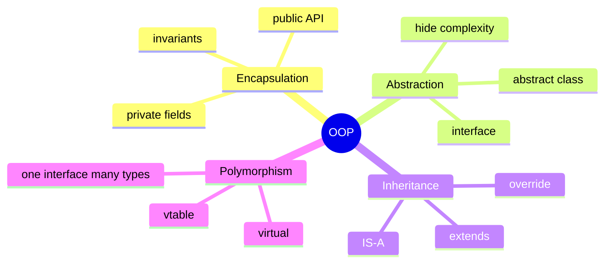
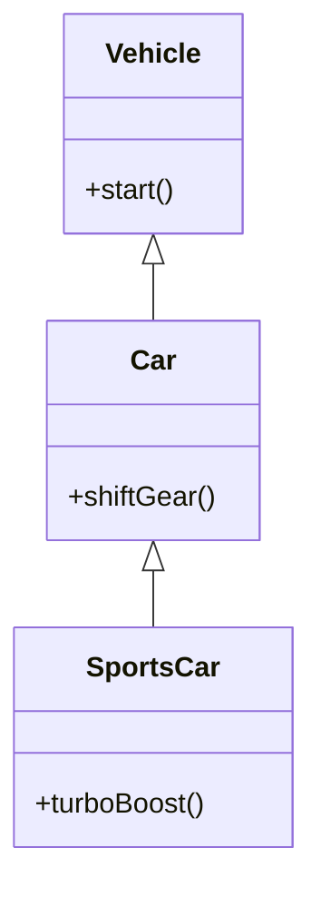
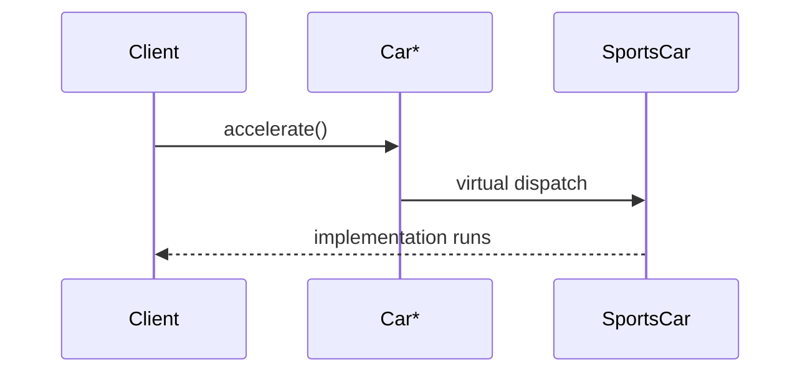
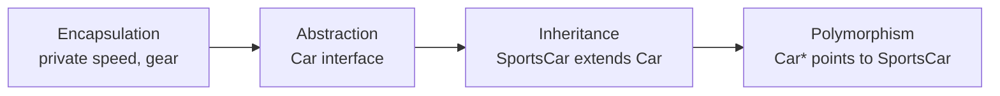
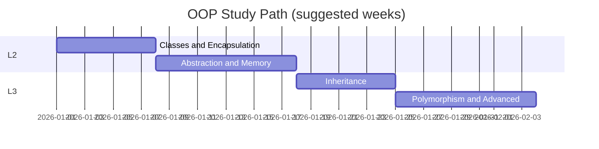
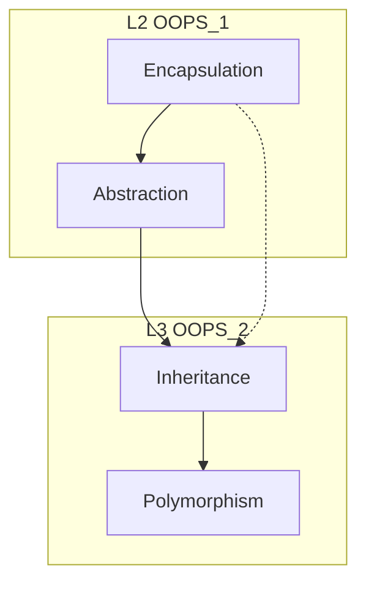
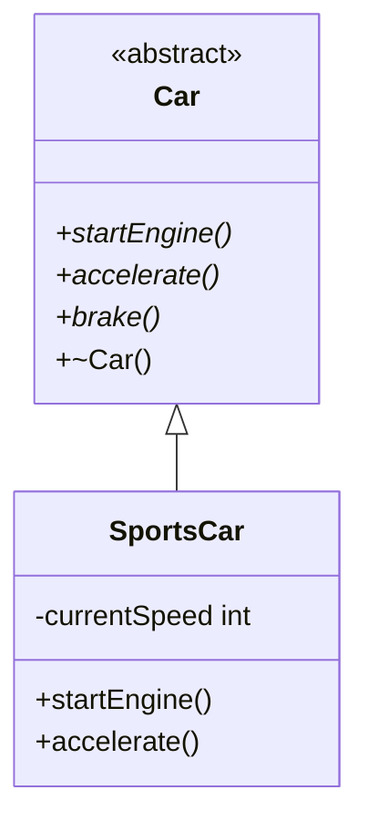
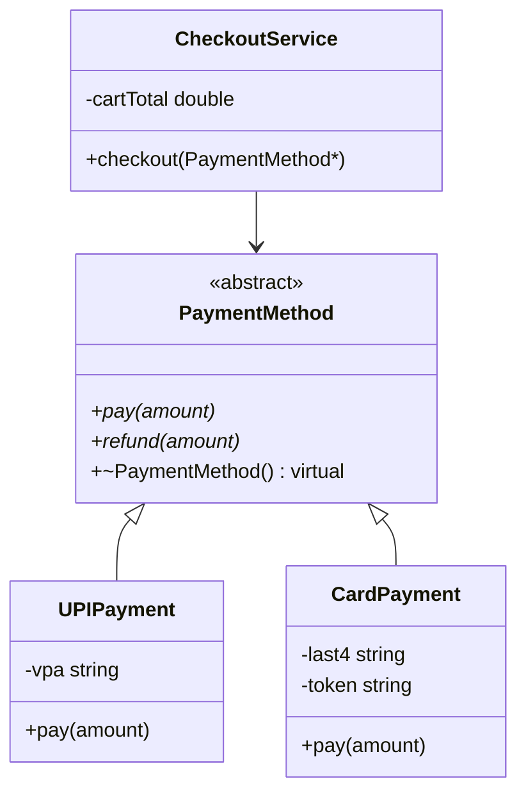
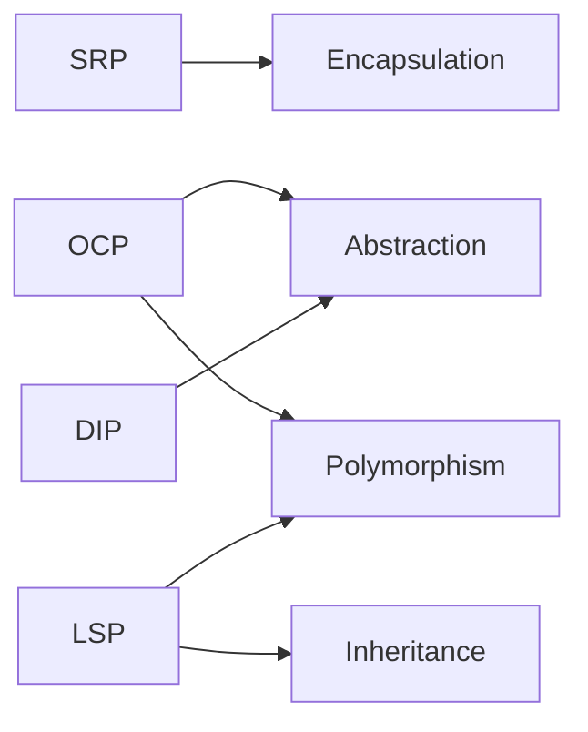

# (Four Pillars) of OOP — Complete Study Guide

> **Level:** L2 OOPS_1 (Encapsulation, Abstraction) + L3 OOPS_2 (Inheritance, Polymorphism)  
> **Language:** Hindi + English (interview-ready)  
> **Companion:** [`OOPS_COMPLETE_GUIDE.md`](../OOPS_COMPLETE_GUIDE.md) | [`OOPS_1_COMPLETE.md`](../OOPS_1_COMPLETE.md)

---

## Table of Contents

1. [Introduction — OOP Kyun?](#1-introduction--oop-kyun)
2. [Four Pillars Overview](#2-four-pillars-overview)
3. [Pillar 1: Encapsulation (L2)](#3-pillar-1-encapsulation-l2)
4. [Pillar 2: Abstraction (L2)](#4-pillar-2-abstraction-l2)
5. [Pillar 3: Inheritance (L3)](#5-pillar-3-inheritance-l3)
6. [Pillar 4: Polymorphism (L3)](#6-pillar-4-polymorphism-l3)
7. [How the Four Pillars Work Together](#7-how-the-four-pillars-work-together)
8. [L2 / L3 Learning Roadmap](#8-l2--l3-learning-roadmap)
9. [UML & Mental Models (Mermaid)](#9-uml--mental-models-mermaid)
10. [Interview Questions & Answers](#10-interview-questions--answers)
11. [Common Mistakes](#11-common-mistakes)
12. [Cheat Sheet](#12-cheat-sheet)
13. [Code Index — L2 & L3](#13-code-index--l2--l3)
14. [Further Reading](#14-further-reading)

---

## 1. Introduction — OOP Kyun?

**Object-Oriented Programming (OOP)** real duniya ko model karta hai: **objects** jinke paas **state** (data) aur **behaviour** (methods) hota hai.

| Term   | English   | Hindi intuition               |
| ------ | --------- | ----------------------------- |
| Class  | Blueprint | नक्शा — object ka design      |
| Object | Instance  | नक्शे se bana hua real entity |
| Method | Behaviour | Object kya **kar sakta** hai  |
| Field  | State     | Object **kya jaanta** hai     |

**Procedural vs OOP:**

| Procedural                       | OOP                               |
| -------------------------------- | --------------------------------- |
| Functions + global data          | Data + behaviour **ek unit** me   |
| Change ek jagah, break kahin bhi | Encapsulation se localized change |
| Reuse copy-paste                 | Inheritance + polymorphism        |

```cpp
// Procedural style (avoid for domain models)
int accountBalance = 1000;
void withdraw(int amount) { accountBalance -= amount; }

// OOP style
class BankAccount {
private:
    int balance;
public:
    void withdraw(int amount);  // rules inside class
};
```

**Interview one-liner:**  
_"OOP groups related data and operations into objects, hides internal details, reuses code through inheritance, and allows one interface with many implementations through polymorphism."_

---

## 2. Four Pillars Overview

| #   | Pillar            | Hindi one-liner                 | Primary lesson | Core idea              |
| --- | ----------------- | ------------------------------- | -------------- | ---------------------- |
| 1   | **Encapsulation** | Data chhupao, controlled API do | L2             | Bundle + protect       |
| 2   | **Abstraction**   | WHAT dikhao, HOW chhupao        | L2             | Simplify interface     |
| 3   | **Inheritance**   | IS-A — parent se reuse          | L3             | Code reuse + taxonomy  |
| 4   | **Polymorphism**  | Ek call, alag behaviour         | L3             | Flexibility at runtime |



**Mnemonic (Hindi):**  
**ई-अ-इ-प** → **ई**ncapsulation, **अ**bstraction (L2), **इ**nheritance, **प**olymorphism (L3)

---

## 3. Pillar 1: Encapsulation (L2)

### Definition

**Encapsulation** = (1) object ki **characteristics** aur **behaviour** ek class me band, (2) bahar se **direct access** band — sirf **allowed operations**.

| Aspect       | Detail                                   |
| ------------ | ---------------------------------------- |
| Mechanism    | `private`, `protected`, `public`         |
| Goal         | Data integrity + hide implementation     |
| Anti-pattern | Public fields, client sets `speed = 500` |

### Real-world analogy

Car ka engine — aap **start/stop/accelerate** karte ho; piston rods directly touch nahi karte.

### Code reference

| File                                                                             | Topic                                         |
| -------------------------------------------------------------------------------- | --------------------------------------------- |
| [`../C++ Code/08_Encapsulation.cpp`](../C++%20Code/08_Encapsulation.cpp)         | `SportsCar` — private state, public behaviour |
| [`../C++ Code/07_Const_And_Mutable.cpp`](../C++%20Code/07_Const_And_Mutable.cpp) | const correctness                             |
| [`02_encapsulation.md`](02_encapsulation.md)                                     | Deep dive                                     |

**Key snippet from repo:**

```cpp
class SportsCar {
private:
    int currentSpeed;   // hidden
public:
    void accelerate();  // controlled change
    int getSpeed();     // read-only where needed
};
// mySportsCar->currentSpeed = 500;  // COMPILE ERROR — good!
```

### Encapsulation vs "just making fields private"

| Shallow                              | Deep encapsulation                  |
| ------------------------------------ | ----------------------------------- |
| Only getters/setters for every field | **Behaviour methods** enforce rules |
| `setBalance(-100)` allowed           | `withdraw()` checks balance         |
| Leaky abstraction                    | Invariants always true              |

---

## 4. Pillar 2: Abstraction (L2)

### Definition

**Abstraction** = user/client ko sirf **zaroori detail** (WHAT), baaki complexity (HOW) chhupana.

| Encapsulation                              | Abstraction                      |
| ------------------------------------------ | -------------------------------- |
| **Mechanism** — access control             | **Concept** — simplified view    |
| HOW chhupa sakte ho **aur** dikha sakte ho | Focus on **essential** features  |
| Often same class                           | Often **base class / interface** |

### Code reference

| File                                                                 | Topic                                |
| -------------------------------------------------------------------- | ------------------------------------ |
| [`../C++ Code/09_Abstraction.cpp`](../C++%20Code/09_Abstraction.cpp) | `Car` abstract, `SportsCar` concrete |
| [`03_abstraction.md`](03_abstraction.md)                             | Pure virtual, interface vs abstract  |

```cpp
class Car {  // WHAT a car can do
public:
    virtual void accelerate() = 0;  // pure virtual
    virtual ~Car() {}
};
// Car c;  // ERROR — abstract
Car* p = new SportsCar("Ford", "Mustang");  // program to interface
```

---

## 5. Pillar 3: Inheritance (L3)

### Definition

**Inheritance** = existing class se nayi class — **IS-A** relationship, code reuse.

| Term            | C++ syntax                   | Meaning       |
| --------------- | ---------------------------- | ------------- |
| Base / Parent   | `class Vehicle`              | General       |
| Derived / Child | `class Car : public Vehicle` | Specialized   |
| `protected`     | inherited visible in child   | Family access |

### Types (overview)

| Type         | Example                          | When               |
| ------------ | -------------------------------- | ------------------ |
| Single       | `Dog : Animal`                   | Most common        |
| Multilevel   | `GoldenRetriever : Dog : Animal` | Chain              |
| Multiple     | `class D : public B, public C`   | Rare; diamond risk |
| Hierarchical | Many children, one parent        | Taxonomies         |

### L3 code links

| File                                                                                                                                 | Topic                                |
| ------------------------------------------------------------------------------------------------------------------------------------ | ------------------------------------ |
| [`../../L3 OOPS_2/C++ Code/01_Inheritance.cpp`](../../L3%20OOPS_2/C++%20Code/01_Inheritance.cpp)                                     | Basic inheritance                    |
| [`../../L3 OOPS_2/C++ Code/10_Access_Specifiers_Inheritance.cpp`](../../L3%20OOPS_2/C++%20Code/10_Access_Specifiers_Inheritance.cpp) | public/protected/private inheritance |
| [`../../L3 OOPS_2/C++ Code/11_Constructor_Chaining.cpp`](../../L3%20OOPS_2/C++%20Code/11_Constructor_Chaining.cpp)                   | Parent ctor first                    |
| [`../../L3 OOPS_2/C++ Code/08_Diamond_Problem.cpp`](../../L3%20OOPS_2/C++%20Code/08_Diamond_Problem.cpp)                             | Virtual inheritance                  |
| [`../../L3 OOPS_2/notes/01_inheritance.md`](../../L3%20OOPS_2/notes/01_inheritance.md)                                               | L3 notes                             |



**Composition vs Inheritance (preview):**

| HAS-A (Composition)                                | IS-A (Inheritance)      |
| -------------------------------------------------- | ----------------------- |
| `Car has Engine`                                   | `SportsCar is a Car`    |
| Prefer for reuse of **behaviour** without taxonomy | Prefer for true subtype |

See: [`../../L3 OOPS_2/C++ Code/05_Composition_Vs_Inheritance.cpp`](../../L3%20OOPS_2/C++%20Code/05_Composition_Vs_Inheritance.cpp)

---

## 6. Pillar 4: Polymorphism (L3)

### Definition

**Polymorphism** = **ek interface**, runtime par **alag implementation** — "many forms".

| Type                      | Binding | C++ example                                  | When resolved      |
| ------------------------- | ------- | -------------------------------------------- | ------------------ |
| **Compile-time** (static) | Early   | Function overloading, templates, `operator+` | Compile time       |
| **Runtime** (dynamic)     | Late    | `virtual` + pointer/reference                | Runtime via vtable |

### Static polymorphism example

```cpp
void print(int x) { cout << x; }
void print(string s) { cout << s; }
// print(5); print("hi"); — compiler picks overload
```

### Dynamic polymorphism example

```cpp
class Shape {
public:
    virtual double area() = 0;
    virtual ~Shape() {}
};
class Circle : public Shape {
    double area() override { return 3.14 * r * r; }
};
Shape* s = new Circle();
s->area();  // Circle::area at runtime
```

### L3 code links

| File                                                                                                                         | Topic                 |
| ---------------------------------------------------------------------------------------------------------------------------- | --------------------- |
| [`../../L3 OOPS_2/C++ Code/02_Static_Polymorphism.cpp`](../../L3%20OOPS_2/C++%20Code/02_Static_Polymorphism.cpp)             | Overloading           |
| [`../../L3 OOPS_2/C++ Code/03_Dynamic_Polymorphism.cpp`](../../L3%20OOPS_2/C++%20Code/03_Dynamic_Polymorphism.cpp)           | virtual override      |
| [`../../L3 OOPS_2/C++ Code/07_Virtual_Table_Demo.cpp`](../../L3%20OOPS_2/C++%20Code/07_Virtual_Table_Demo.cpp)               | vptr/vtable           |
| [`../../L3 OOPS_2/C++ Code/06_Virtual_Destructor.cpp`](../../L3%20OOPS_2/C++%20Code/06_Virtual_Destructor.cpp)               | Why `virtual ~Base()` |
| [`../../L3 OOPS_2/C++ Code/09_Overloading_Vs_Overriding.cpp`](../../L3%20OOPS_2/C++%20Code/09_Overloading_Vs_Overriding.cpp) | Interview favourite   |



---

## 7. How the Four Pillars Work Together

Typical design flow (car example across L2 → L3):



| Step | Pillar        | What happens                                             |
| ---- | ------------- | -------------------------------------------------------- |
| 1    | Encapsulation | `SportsCar` hides `currentSpeed`, exposes `accelerate()` |
| 2    | Abstraction   | `Car` lists operations — no engine internals             |
| 3    | Inheritance   | `SportsCar : public Car` implements pure virtuals        |
| 4    | Polymorphism  | `Car* c = new SportsCar(); c->accelerate();`             |

**Design principle:**  
Encapsulation **protects** each class. Abstraction **defines contracts**. Inheritance **reuses** contracts. Polymorphism **swaps** implementations.

---

## 8. L2 / L3 Learning Roadmap

### Phase 1 — L2 OOPS_1 (Foundation)

| Order | Topic                      | C++ file                          | Notes                                                                  |
| ----- | -------------------------- | --------------------------------- | ---------------------------------------------------------------------- |
| 1     | Class & Object             | `01_Class_And_Object.cpp`         | [`../C++ Code/`](../C++%20Code/)                                       |
| 2     | Constructors / Destructors | `02_Constructors_Destructors.cpp` | RAII later                                                             |
| 3     | this pointer               | `03_This_Pointer.cpp`             |                                                                        |
| 4     | static members             | `04_Static_Members.cpp`           |                                                                        |
| 5     | inline, friend, const      | `05`–`07`                         | [`04_static_inline_friend_const.md`](04_static_inline_friend_const.md) |
| 6     | **Encapsulation**          | `08_Encapsulation.cpp`            | [`02_encapsulation.md`](02_encapsulation.md)                           |
| 7     | **Abstraction**            | `09_Abstraction.cpp`              | [`03_abstraction.md`](03_abstraction.md)                               |
| 8     | Memory                     | `10`–`16`                         | [`05_memory_advanced.md`](05_memory_advanced.md)                       |
| 9     | Advanced                   | `17`–`19`                         | padding, object pool                                                   |

**Compile all L2:**

```bash
cd "/Users/shubham/Desktop/LLD/L2 OOPS_1"
./compile.sh
```

### Phase 2 — L3 OOPS_2 (Inheritance & Polymorphism)

| Order | Topic                      | C++ file                                 |
| ----- | -------------------------- | ---------------------------------------- |
| 1     | Inheritance                | `01_Inheritance.cpp`                     |
| 2     | Static polymorphism        | `02_Static_Polymorphism.cpp`             |
| 3     | Dynamic polymorphism       | `03_Dynamic_Polymorphism.cpp`            |
| 4     | Combined                   | `04_Static_And_Dynamic_Polymorphism.cpp` |
| 5     | Composition vs inheritance | `05_Composition_Vs_Inheritance.cpp`      |
| 6     | Virtual destructor         | `06_Virtual_Destructor.cpp`              |
| 7     | vtable                     | `07_Virtual_Table_Demo.cpp`              |
| 8     | Diamond problem            | `08_Diamond_Problem.cpp`                 |
| 9+    | Slicing, casting, RTTI     | `12`–`18`                                |

**L3 guide:** [`../../L3 OOPS_2/OOPS_COMPLETE_GUIDE.md`](../../L3%20OOPS_2/OOPS_COMPLETE_GUIDE.md)



---

## 9. UML & Mental Models (Mermaid)

### Pillars dependency graph



### Interview "draw on board" — class hierarchy



---

## 10. Interview Questions & Answers

### Q1. What are the four pillars of OOP?

**A:** Encapsulation, Abstraction, Inheritance, Polymorphism. First two emphasize hiding and contracts (L2); last two emphasize reuse and flexible dispatch (L3).

### Q2. Difference between encapsulation and abstraction?

**A:** Encapsulation is **bundling + access control** (private data, public methods). Abstraction is **showing only essential features** — often via abstract base class or interface. You can encapsulate without abstract classes; abstraction often uses encapsulation.

### Q3. Is abstraction possible without inheritance?

**A:** Yes — modules, APIs, PIMPL idiom, namespaces. In C++, abstract classes are the common OOP form.

### Q4. Why is polymorphism useful?

**A:** Client code depends on `Car*` or `Shape*`, not concrete types — open for extension (new `ElectricCar`), closed for modification of client loops.

### Q5. Compile-time vs runtime polymorphism?

**A:** Overloading/templates = compile-time. `virtual` + base pointer = runtime (vtable).

### Q6. Can we instantiate an abstract class?

**A:** No, if it has at least one pure virtual (`= 0`) unimplemented function.

### Q7. IS-A vs HAS-A?

**A:** Inheritance = IS-A. Composition = HAS-A. Favour composition when reuse doesn't imply subtype (GoF).

### Q8. What happens if base destructor is not virtual?

**A:** `delete basePtr` may call only base destructor — undefined behaviour / leaks for derived resources. See L3 `06_Virtual_Destructor.cpp`.

### Q9. Name access specifiers and default in class vs struct.

**A:** `private`, `protected`, `public`. **class** default: private. **struct** default: public.

### Q10. Real example of all four pillars together?

**A:** Payment system — `PaymentMethod` abstract (abstraction), hidden credentials (encapsulation), `UPIPayment : PaymentMethod` (inheritance), process payment via base pointer (polymorphism).

### Q11. Are four pillars only for C++?

**A:** No — Java, C#, Python, Kotlin share concepts; syntax differs (interfaces in Java, duck typing in Python).

### Q12. What is object slicing?

**A:** Assigning derived object to base **by value** slices off derived part. See L3 `12_Object_Slicing.cpp`.

### Q13. Diamond problem?

**A:** Multiple inheritance duplicate base subobjects — solved with `virtual` inheritance. L3 `08_Diamond_Problem.cpp`.

### Q14. Encapsulation in Java vs C++?

**A:** Java has package-private; C++ has `protected` + friends. Principle same.

### Q15. Which pillar reduces coupling most?

**A:** Abstraction + polymorphism — client depends on interface, not concrete class.

### Q16. Can polymorphism work without inheritance?

**A:** C++ concepts/templates (static polymorphism) without `virtual`. Dynamic needs inheritance or similar (vtable).

### Q17. Why learn L2 before L3?

**A:** You need classes, access control, and abstract interfaces before IS-A and vtables make sense.

### Q18. OOP disadvantages?

**A:** Overhead (vtable, indirection), wrong inheritance hierarchies, god objects. Use when domain has clear objects and lifecycles.

### Q19. SOLID relation to pillars?

**A:** SRP/OCP often use abstraction + polymorphism; encapsulation supports information hiding.

### Q20. One-line Hindi summary of each pillar?

**A:** Encapsulation — data chhupao; Abstraction — sirf zaroori dikhao; Inheritance — parent se banao; Polymorphism — ek naam, kai roop.

---

## 11. Common Mistakes

| Mistake                               | Why bad                | Fix                                  |
| ------------------------------------- | ---------------------- | ------------------------------------ |
| Public fields everywhere              | No invariants          | private + behaviour methods          |
| Inheritance for code reuse only       | Fragile hierarchies    | composition                          |
| Forgetting `virtual` destructor       | Leak / UB on delete    | `virtual ~Base()`                    |
| Confusing overloading vs overriding   | Wrong interview answer | static vs dynamic                    |
| `Car c = SportsCar();` slicing        | Lost derived state     | use pointer/reference                |
| God class with 50 methods             | Breaks SRP             | split classes                        |
| Abstract class with no virtual dtor   | Same delete issue      | always virtual ~ in polymorphic base |
| Thinking encapsulation = getters only | Anemic domain model    | rich behaviour                       |

---

## 12. Cheat Sheet

```
ENCAPSULATION  → bundle + private/protected/public
ABSTRACTION    → WHAT not HOW; abstract class / API
INHERITANCE    → class Derived : public Base  (IS-A)
POLYMORPHISM   → virtual + override + base ptr/ref

C++ keywords:
  pure virtual     virtual void f() = 0;
  override         void f() override;
  abstract class   ≥1 pure virtual
  vtable           dynamic dispatch (runtime)

Order: L2 (08, 09) → L3 (01–07) → advanced (08–18)

Links:
  ../OOPS_COMPLETE_GUIDE.md
  ../C++ Code/08_Encapsulation.cpp
  ../C++ Code/09_Abstraction.cpp
  ../../L3 OOPS_2/C++ Code/
```

---

## 13. Code Index — L2 & L3

### L2 — [`../C++ Code/`](../C++%20Code/)

| #     | File                      | Pillar / topic    |
| ----- | ------------------------- | ----------------- |
| 01    | `01_Class_And_Object.cpp` | Foundation        |
| 08    | `08_Encapsulation.cpp`    | **Encapsulation** |
| 09    | `09_Abstraction.cpp`      | **Abstraction**   |
| 10–16 | Memory, Rule of 3/5/0     | Supporting skills |

### L3 — [`../../L3 OOPS_2/C++ Code/`](../../L3%20OOPS_2/C++%20Code/)

| #     | File                 | Pillar / topic        |
| ----- | -------------------- | --------------------- |
| 01    | `01_Inheritance.cpp` | **Inheritance**       |
| 02–04 | Static/Dynamic poly  | **Polymorphism**      |
| 06–07 | Virtual dtor, vtable | **Polymorphism** deep |

### Notes cross-link

| L2 note                                      | L3 note                                                                                  |
| -------------------------------------------- | ---------------------------------------------------------------------------------------- |
| [`02_encapsulation.md`](02_encapsulation.md) | —                                                                                        |
| [`03_abstraction.md`](03_abstraction.md)     | [`../../L3 OOPS_2/notes/02_polymorphism.md`](../../L3%20OOPS_2/notes/02_polymorphism.md) |
| This file                                    | [`../../L3 OOPS_2/notes/01_inheritance.md`](../../L3%20OOPS_2/notes/01_inheritance.md)   |

---

## 14. Further Reading

| Document                | Path                                                                                           |
| ----------------------- | ---------------------------------------------------------------------------------------------- |
| L2 complete guide       | [`../OOPS_COMPLETE_GUIDE.md`](../OOPS_COMPLETE_GUIDE.md)                                       |
| L2 advanced             | [`../OOPS_ADVANCED_CPP.md`](../OOPS_ADVANCED_CPP.md)                                           |
| L3 complete guide       | [`../../L3 OOPS_2/OOPS_COMPLETE_GUIDE.md`](../../L3%20OOPS_2/OOPS_COMPLETE_GUIDE.md)           |
| Composition (HAS-A)     | [`../../ L1 Composition/OBJECT_RELATIONSHIPS_GUIDE.md`](../../%20L1%20Composition/OBJECT_RELATIONSHIPS_GUIDE.md) |
| Encapsulation deep dive | [`02_encapsulation.md`](02_encapsulation.md)                                                   |
| Abstraction deep dive   | [`03_abstraction.md`](03_abstraction.md)                                                       |

---

**Revision checklist**

- [ ] Explain all 4 pillars in 2 minutes (Hindi + English)
- [ ] Draw Car → SportsCar diagram
- [ ] Run `08_Encapsulation.cpp` and `09_Abstraction.cpp`
- [ ] Run L3 `03_Dynamic_Polymorphism.cpp`
- [ ] Answer Q1–Q10 without looking at notes

---

## 15. Appendix — Pillars Across Languages (Quick Compare)

| Concept | C++ | Java | Python | C# |
|---------|-----|------|--------|-----|
| Encapsulation | `private` / `protected` / `public` | same + package | `_name`, `__mangle` | `private` + properties |
| Abstraction | abstract class, pure `= 0` | `abstract class`, `interface` | ABC module | `interface`, `abstract` |
| Inheritance | single + multiple MI | single (interfaces multi) | multiple | single + interfaces |
| Polymorphism | virtual, templates | `@Override`, interfaces | duck typing | `virtual` / interfaces |

**Hindi note:** Chaaro languages me **idea same** hai — syntax alag. Interview me pehle concept bolo, phir C++ example do.

---

## 16. Appendix — End-to-End Case Study: Payment Checkout



| Pillar | Payment example me kya hai |
|--------|---------------------------|
| Encapsulation | `token`, `vpa` private — bahar direct set nahi |
| Abstraction | `PaymentMethod` — sirf `pay` / `refund` dikhta hai |
| Inheritance | `UPIPayment : PaymentMethod` |
| Polymorphism | `checkout(PaymentMethod* p)` — UPI ya Card runtime par |

```cpp
class PaymentMethod {
public:
    virtual bool pay(double amount) = 0;
    virtual bool refund(double amount) = 0;
    virtual ~PaymentMethod() = default;
};

class UPIPayment : public PaymentMethod {
    std::string vpa;
public:
    explicit UPIPayment(std::string v) : vpa(std::move(v)) {}
    bool pay(double amount) override { return amount > 0; }
    bool refund(double amount) override { return pay(amount); }
};

void checkout(PaymentMethod* method, double total) {
    method->pay(total);
}
```

---

## 17. Appendix — SOLID ↔ Four Pillars Mapping

| SOLID | Principle (short) | Strongest pillar link |
|-------|-------------------|------------------------|
| **S** | Single Responsibility | Encapsulation |
| **O** | Open/Closed | Abstraction + Polymorphism |
| **L** | Liskov Substitution | Inheritance + Polymorphism |
| **I** | Interface Segregation | Abstraction |
| **D** | Dependency Inversion | Abstraction |



---

## 18. Appendix — L2/L3 File Map (Every C++ Demo)

### L2 [`../C++ Code/`](../C++%20Code/)

| File | Primary pillar | Interview hook |
|------|----------------|----------------|
| `08_Encapsulation.cpp` | Encapsulation | private speed |
| `09_Abstraction.cpp` | Abstraction | `Car` pure virtual |
| `13_RAII.cpp` | Encapsulation | resource inside object |

### L3 [`../../L3 OOPS_2/C++ Code/`](../../L3%20OOPS_2/C++%20Code/)

| File | Primary pillar | Interview hook |
|------|----------------|----------------|
| `01_Inheritance.cpp` | Inheritance | IS-A |
| `03_Dynamic_Polymorphism.cpp` | Polymorphism | virtual override |
| `06_Virtual_Destructor.cpp` | Polymorphism safety | delete base ptr |
| `12_Object_Slicing.cpp` | Polymorphism pitfall | by-value assign |

---

## 19. Extended Interview Q&A (Q21–Q35)

### Q21. Kya OOP sirf classes banane ka naam hai?

**A:** Nahi. OOP = design mindset + language features; modules/APIs bhi encapsulation/abstraction dete hain.

### Q22. Four pillars me sabse pehle kaun seekhein?

**A:** Encapsulation → Abstraction → Inheritance → Polymorphism (Section 8 roadmap).

### Q23. Functional vs OOP pillars?

**A:** Alag paradigm; similar goals (hide detail, reuse, substitute implementations).

### Q24. Microservices me pillars?

**A:** Service boundary = encapsulation; API contract = abstraction; pluggable backends = polymorphism.

### Q25. Testing doubles?

**A:** Mock `Car` via `Car*` — abstraction + polymorphism.

### Q26. Performance vs virtual?

**A:** Hot path: templates/static; domain model: virtual OK.

### Q27. Hindi elevator pitch?

**A:** *"Data band, zaroori dikhao, parent se banao, ek pointer se kai roop."*

### Q28–Q35. Quick fire

| # | Q | Short A |
|---|---|---------|
| 28 | UML inheritance arrow? | Hollow triangle to base |
| 29 | HAS-A folder? | [`../../ L1 Composition/`](../../%20L1%20Composition/) |
| 30 | Draw 2×2 pillars? | Encap/Abstr/Inher/Poly |
| 31 | Revision run order? | 08 → 09 → L3 01 → 03 → 06 |
| 32 | Abstract without inheritance? | APIs, PIMPL — yes |
| 33 | God object violates? | Encapsulation/SRP |
| 34 | Patterns + pillars? | Strategy = A+P |
| 35 | Complete guide link? | [`../OOPS_COMPLETE_GUIDE.md`](../OOPS_COMPLETE_GUIDE.md) |

---

## 20. Mock Interview — 5-Minute Oral Drill

| Minute | Task | Pass criteria |
|--------|------|---------------|
| 0–1 | Define OOP + 4 pillars | Four names + one phrase each |
| 1–2 | Encap vs Abstr | mechanism vs simplified view |
| 2–3 | Draw `Car` / `SportsCar` | abstract + `Car*` |
| 3–4 | Static vs dynamic poly | overload vs virtual |
| 4–5 | One pitfall each | public fields, no virtual dtor, slicing |

---

## 21. Day-by-Day Study Plan (14 Days)

| Day | Focus | Run |
|-----|-------|-----|
| 1–2 | Encapsulation | `08_Encapsulation.cpp` |
| 3–4 | Abstraction | `09_Abstraction.cpp` |
| 5 | Memory/RAII | `13_RAII.cpp` |
| 6–7 | L3 Inheritance | `01_Inheritance.cpp` |
| 8–10 | Polymorphism | `02`–`03`, `06`, `07` |
| 11–12 | Diamond, slicing | `08`, `12` |
| 13–14 | Mock + compile | `./compile.sh` both levels |

---

## 22. Quick Reference Card

```
Encapsulation  → bundle + private/protected/public
Abstraction    → WHAT not HOW; Car with = 0
Inheritance    → class D : public B
Polymorphism   → virtual + override + base ptr

L2: ../C++ Code/08, 09
L3: ../../L3 OOPS_2/C++ Code/01, 03, 06
Guide: ../OOPS_COMPLETE_GUIDE.md
```

---

_End of chapter — Four Pillars of OOP_
