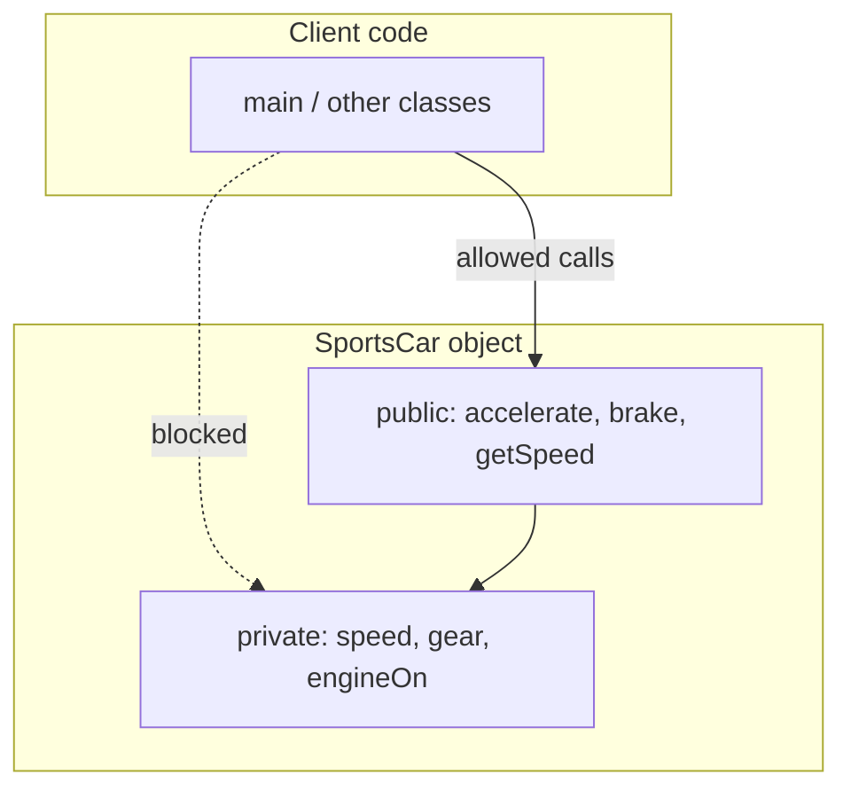
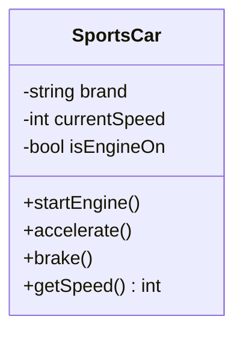
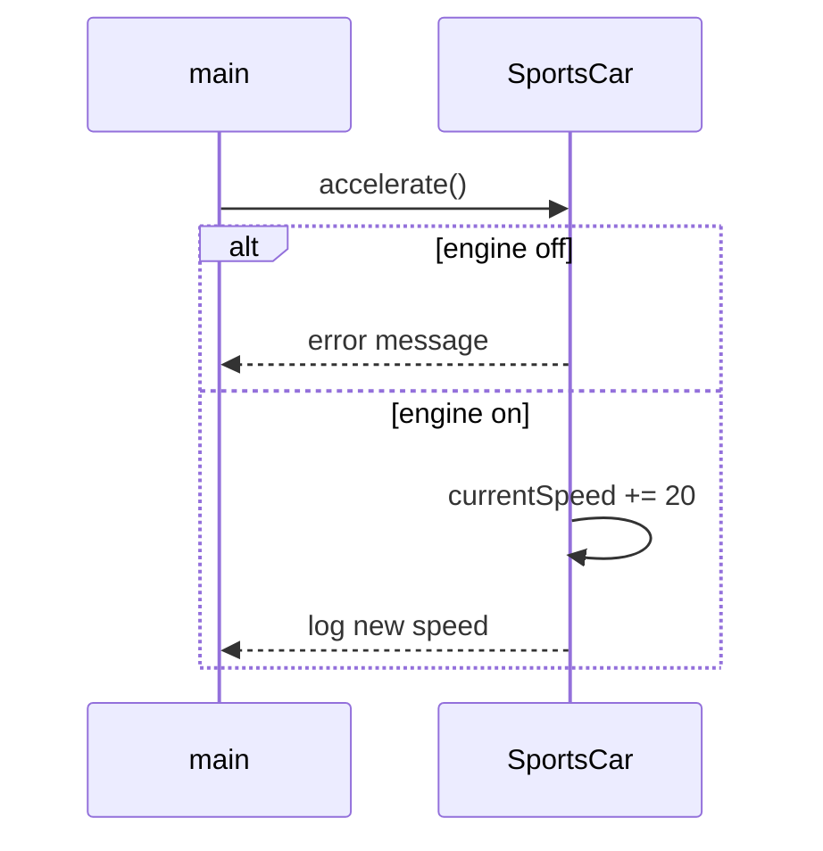
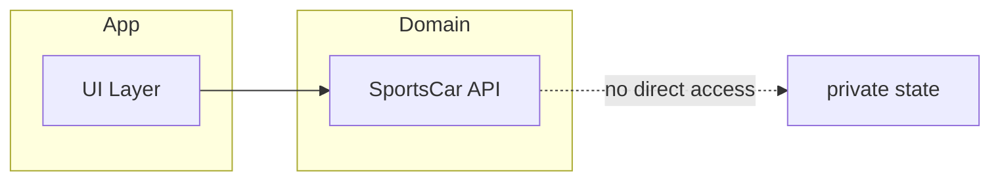
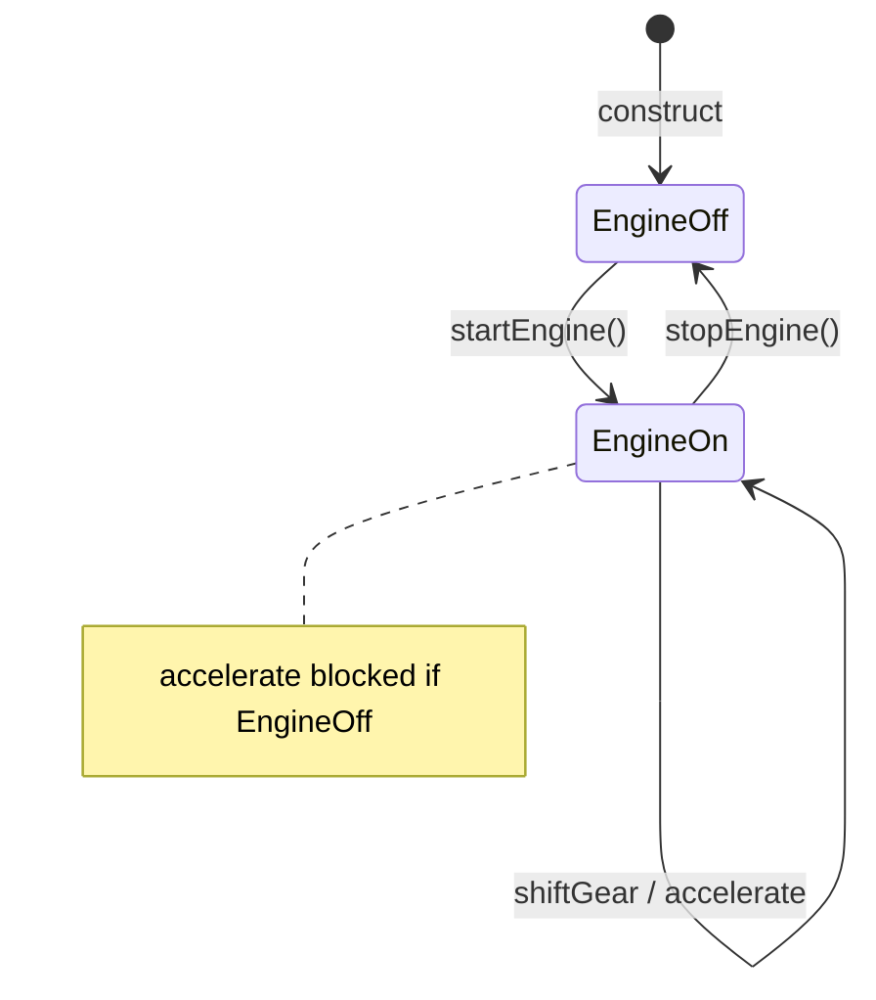
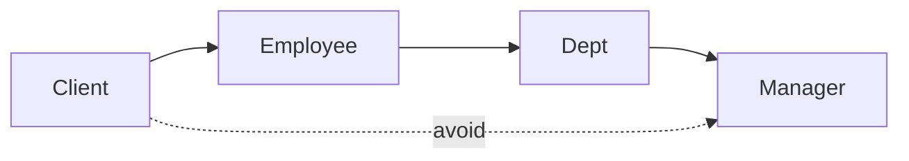

# Encapsulation (एनकैप्सुलेशन) — Complete Study Guide

> **Level:** L2 OOPS_1  
> **Language:** Hindi + English (interview-ready)  
> **Runnable code:** [`../C++ Code/08_Encapsulation.cpp`](../C++%20Code/08_Encapsulation.cpp)  
> **Companion:** [`../OOPS_COMPLETE_GUIDE.md`](../OOPS_COMPLETE_GUIDE.md)

---

## Table of Contents

1. [Definition & Two Meanings](#1-definition--two-meanings)
2. [Real-World Analogy — Sports Car](#2-real-world-analogy--sports-car)
3. [Walkthrough: Repo Code `08_Encapsulation.cpp`](#3-walkthrough-repo-code-08_encapsulationcpp)
4. [Access Modifiers — Deep Dive](#4-access-modifiers--deep-dive)
5. [Getters, Setters & Better Alternatives](#5-getters-setters--better-alternatives)
6. [Data Hiding vs Information Hiding](#6-data-hiding-vs-information-hiding)
7. [Encapsulation in Banking, API, Collections](#7-encapsulation-in-banking-api-collections)
8. [const, mutable, friend (related tools)](#8-const-mutable-friend-related-tools)
9. [Encapsulation vs Abstraction](#9-encapsulation-vs-abstraction)
10. [Design Patterns That Rely on Encapsulation](#10-design-patterns-that-rely-on-encapsulation)
11. [Mermaid Diagrams](#11-mermaid-diagrams)
12. [Interview Q&A (20+ Questions)](#12-interview-qa-20-questions)
13. [Common Mistakes](#13-common-mistakes)
14. [Cheat Sheet](#14-cheat-sheet)
15. [Practice Exercises](#15-practice-exercises)
16. [Related Code & Reading](#16-related-code--reading)

---

## 1. Definition & Two Meanings

**Encapsulation (एनकैप्सुलेशन)** OOP ka pehla practical pillar hai — class ke andar **data + methods** ek capsule me, aur bahar wale ko sirf **allowed door** se access.

Source comments in [`08_Encapsulation.cpp`](../C++%20Code/08_Encapsulation.cpp) state two rules:

| # | English | Hindi |
|---|---------|-------|
| 1 | Object's characteristics and behaviour live **together** in one object | Data aur behaviour **ek class** me band |
| 2 | Not every member is for everyone — **data security** | Har cheez public nahi; rules ke saath access |

**Formal definition (interview):**  
*"Encapsulation is the bundling of data and methods that operate on that data within a single unit (class), while restricting direct access to internal state through access modifiers and a controlled public interface."*

### Why it matters

| Without encapsulation | With encapsulation |
|----------------------|-------------------|
| `account.balance = -999` | `account.withdraw()` validates |
| Global variables mutated anywhere | State changes traceable |
| Refactor breaks 50 files | Change inside class only |



---

## 2. Real-World Analogy — Sports Car

Driver ke paas:

| Control (public API) | Hidden (private) |
|---------------------|------------------|
| Accelerator pedal | ECU mapping |
| Brake | ABS logic |
| Gear lever | Transmission internals |
| Ignition button | Spark timing |

Aap **directly** crankshaft nahi ghumate — wahi encapsulation hai.

**Anti-pattern in code (commented in repo):**

```cpp
// mySportsCar->currentSpeed = 500;  // Would be DISASTER if public
```

500 km/h bina engine on, bina gear — physics aur safety dono break. Class **invariants** protect karti hai.

---

## 3. Walkthrough: Repo Code `08_Encapsulation.cpp`

### Class structure

```cpp
class SportsCar {
private:
    string brand;
    string model;
    bool isEngineOn;
    int currentSpeed;
    int currentGear;
    string tyreCompany;

public:
    SportsCar(string b, string m);
    int getSpeed();
    string getTyreCompany();
    void setTyreCompany(string tyreCompany);
    void startEngine();
    void shiftGear(int gear);
    void accelerate();
    void brake();
    void stopEngine();
    ~SportsCar();
};
```

### State machine (mental model)

| State variable | Initial | Changes when |
|----------------|---------|--------------|
| `isEngineOn` | false | `startEngine()` / `stopEngine()` |
| `currentGear` | 0 | `shiftGear()` if engine on |
| `currentSpeed` | 0 | `accelerate()` / `brake()` / `stopEngine()` |

### Method behaviour table

| Method | Preconditions | Effect |
|--------|---------------|--------|
| `startEngine()` | — | `isEngineOn = true` |
| `shiftGear(g)` | engine on | sets gear or prints error |
| `accelerate()` | engine on | speed += 20 |
| `brake()` | — | speed -= 20, min 0 |
| `stopEngine()` | — | resets gear & speed |

### main() flow

```cpp
SportsCar* mySportsCar = new SportsCar("Ford", "Mustang");
mySportsCar->startEngine();
mySportsCar->shiftGear(1);
mySportsCar->accelerate();
// ...
cout << mySportsCar->getSpeed() << endl;
delete mySportsCar;
```

**Compile & run:**

```bash
cd "/Users/shubham/Desktop/LLD/L2 OOPS_1/C++ Code"
g++ -std=c++17 -o encaps_demo 08_Encapsulation.cpp && ./encaps_demo
```

Or use [`../compile.sh`](../compile.sh).

---

## 4. Access Modifiers — Deep Dive

### C++ access levels

| Modifier | Class内部 | Derived class | Outside |
|----------|-----------|---------------|---------|
| `private` | Yes | No* | No |
| `protected` | Yes | Yes | No |
| `public` | Yes | Yes | Yes |

\*Unless friend or nested class.

### class vs struct default

| Keyword | Default if omitted |
|---------|---------------------|
| `class` | `private` |
| `struct` | `public` |

```cpp
class A { int x; };      // x is private
struct B { int x; };     // x is public
```

### When to use which

| Use `private` | Use `protected` | Use `public` |
|---------------|-----------------|--------------|
| All implementation fields | Extension points for children | Client API methods |
| Helper that must not leak | Template method hooks | Factories sometimes |
| Invariants | Rare — prefer composition | Minimal surface |

### Inheritance + access (preview for L3)

| Inheritance mode | public base → derived | protected base → derived |
|------------------|----------------------|--------------------------|
| `public` | public | protected |
| `protected` | protected | protected |
| `private` | private | private |

See L3: [`../../L3 OOPS_2/C++ Code/10_Access_Specifiers_Inheritance.cpp`](../../L3%20OOPS_2/C++%20Code/10_Access_Specifiers_Inheritance.cpp)

---

## 5. Getters, Setters & Better Alternatives

### Repo example

```cpp
int getSpeed() { return currentSpeed; }

void setTyreCompany(string tyreCompany) {
    this->tyreCompany = tyreCompany;
}
```

`tyreCompany` setter exists to teach **controlled write** — speed ke liye **koi public setter nahi** (good design).

### Getter/setter decision matrix

| Situation | Recommendation |
|-----------|----------------|
| Read-only for clients | getter only, no setter |
| Must validate on write | setter with checks OR behaviour method |
| Derived value | compute in getter, don't store duplicate |
| Boolean flag | `isEngineOn()` not `getIsEngineOn()` naming style |
| Collection inside class | return const reference or copy — not raw internal vector ref |

### Anti-pattern: trivial getters everywhere

```cpp
// BAD — anemic model
class Account {
public:
    void setBalance(int b) { balance = b; }  // allows -100
    int getBalance() { return balance; }
};

// GOOD — behaviour encapsulates rules
class Account {
public:
    bool withdraw(int amount) {
        if (amount <= 0 || amount > balance) return false;
        balance -= amount;
        return true;
    }
    int getBalance() const { return balance; }
private:
    int balance;
};
```

### Naming conventions (C++)

| Style | Example |
|-------|---------|
| getter | `getSpeed()`, `tyreCompany()` (modern) |
| setter | `setTyreCompany()`, `setSpeed()` only if justified |
| predicate | `isEngineOn()` |

### const-correct getters

```cpp
int getSpeed() const { return currentSpeed; }
```

Marks method safe on `const SportsCar&` — interview plus.

---

## 6. Data Hiding vs Information Hiding

| Term | Focus |
|------|-------|
| **Data hiding** | Fields private — syntax level |
| **Information hiding** | Implementation detail change without client break — design level |

Encapsulation supports **both**. PIMPL idiom extreme information hiding:

```cpp
// Widget.h — clients see only pImpl pointer
class Widget {
public:
    Widget();
    ~Widget();
    void draw();
private:
    struct Impl;
    std::unique_ptr<Impl> pImpl;
};
```

---

## 7. Encapsulation in Banking, API, Collections

### Example 1 — BankAccount

```cpp
class BankAccount {
private:
    std::string accountId;
    double balance;
    int failedPinAttempts;

public:
    bool withdraw(double amount, const std::string& pin) {
        if (!verifyPin(pin)) {
            failedPinAttempts++;
            return false;
        }
        if (amount <= 0 || amount > balance) return false;
        balance -= amount;
        return true;
    }

    double getBalance() const { return balance; }
    // NO setBalance — invariant: balance >= 0
};
```

### Example 2 — Temperature sensor

```cpp
class Sensor {
private:
    double celsius;
public:
    void readHardware() { celsius = readADC(); }  // private helper
    double fahrenheit() const { return celsius * 9.0/5 + 32; }
};
```

### Example 3 — std::string (library encapsulation)

You don't touch internal char array — you use `size()`, `append()`, `c_str()` when needed.

---

## 8. const, mutable, friend (related tools)

| Feature | File | Encapsulation role |
|---------|------|-------------------|
| `const` methods | [`07_Const_And_Mutable.cpp`](../C++%20Code/07_Const_And_Mutable.cpp) | Read-only API promise |
| `mutable` | same | cache inside const method — rare |
| `friend` | [`06_Friend_Function.cpp`](../C++%20Code/06_Friend_Function.cpp) | Breaks wall **deliberately** — use sparingly |

**Rule:** friend is not "bad OOP" but **exception** — e.g. overloaded `operator<<` for logging.

---

## 9. Encapsulation vs Abstraction

| Encapsulation | Abstraction |
|---------------|-------------|
| **How** we protect one class | **What** we show to the world |
| private fields | abstract `Car` interface |
| Often same concrete class | Often base + derived |

Same car project:

- `SportsCar` in **08** — full concrete class, private speed  
- `Car` + `SportsCar` in **09** — abstraction layer added  

Read: [`03_abstraction.md`](03_abstraction.md) | [`../C++ Code/09_Abstraction.cpp`](../C++%20Code/09_Abstraction.cpp)

---

## 10. Design Patterns That Rely on Encapsulation

| Pattern | Encapsulation use |
|---------|-------------------|
| Singleton | private ctor |
| Factory Method | hide `new` details |
| Builder | step-by-step internal assembly |
| Strategy | hide algorithm inside class |
| RAII | resource inside object lifetime |

Files: [`../C++ Code/13_RAII.cpp`](../C++%20Code/13_RAII.cpp), [`../C++ Code/19_Object_Pool_Pattern.cpp`](../C++%20Code/19_Object_Pool_Pattern.cpp)

---

## 11. Mermaid Diagrams

### Object capsule



### Call flow for accelerate



### Package-level encapsulation (modules)



---

## 12. Interview Q&A (20+ Questions)

### Q1. What is encapsulation?

**A:** Bundling data and methods in a class and restricting direct access to internal state using access modifiers, exposing a controlled public interface.

### Q2. What are the two aspects of encapsulation in our course?

**A:** (1) Data + behaviour together in one class. (2) Access control for security and valid state.

### Q3. Which access modifier is default for `class`?

**A:** `private`.

### Q4. Why not make all members public?

**A:** Clients could break invariants (e.g. set speed without engine on), coupling increases, refactoring becomes impossible.

### Q5. Difference between data hiding and encapsulation?

**A:** Data hiding is making fields private. Encapsulation is the broader principle including behaviour and API design. Data hiding is one technique.

### Q6. When should you use getters?

**A:** When external code legitimately needs read access and you don't want public fields — prefer `const` getters.

### Q7. When should you avoid setters?

**A:** When state must only change through validated operations — use `withdraw()`, `accelerate()` instead of `setBalance`, `setSpeed`.

### Q8. Explain the commented line `currentSpeed = 500` in our demo.

**A:** If speed were public, client could corrupt state; private field forces use of methods that check engine state.

### Q9. Is encapsulation only for fields?

**A:** No — hide helper methods, implementation details, and subsystems (PIMPL, private nested classes).

### Q10. How does encapsulation help testing?

**A:** You test public contract; internal representation can change without breaking tests if behaviour same.

### Q11. Encapsulation in Python? (no private keyword)

**A:** Convention `_name` and `__name` name mangling — principle still applies.

### Q12. Can `protected` break encapsulation?

**A:** It exposes internals to all derived classes — fragile base class problem. Prefer `private` + `public`/`protected` interface methods.

### Q13. What is friend function? Does it violate encapsulation?

**A:** Grants access to private members for specific functions — breaks wall intentionally; use for operators/logging, not wide access.

### Q14. Getter/setter vs public fields performance?

**A:** Modern compilers inline trivial getters — negligible cost; benefit is maintainability.

### Q15. What is invariant? Example from SportsCar?

**A:** Rule always true — e.g. if engine off, accelerating should not increase speed (enforced in `accelerate()`).

### Q16. How is `this` pointer related?

**A:** Disambiguates member vs parameter in setters — see [`03_This_Pointer.cpp`](../C++%20Code/03_This_Pointer.cpp).

### Q17. Encapsulation vs security?

**A:** Encapsulation is design-time access control, not encryption — private doesn't stop memory inspection.

### Q18. Why return copy vs const reference from getter?

**A:** Small types (`int`) — by value fine. Large containers — `const vector&` or don't expose internal container.

### Q19. Real-world JavaBean pattern criticism?

**A:** Pure getters/setters without behaviour = anemic domain model — bad encapsulation of **rules**.

### Q20. How does RAII relate?

**A:** Resource acquisition/release encapsulated in ctor/dtor — client can't forget `free` if API designed right.

### Q21. Can static members be private?

**A:** Yes — `static int count` private with public `getCount()` — see [`04_Static_Members.cpp`](../C++%20Code/04_Static_Members.cpp).

### Q22. One Hindi line for interview?

**A:** *"Data ko class ke andar band karo, bahar sirf safe methods se baat karo."*

---

## 13. Common Mistakes

| Mistake | Consequence | Fix |
|---------|-------------|-----|
| Public fields | Broken invariants | private + API |
| Getter/setter for every field | Anemic model | behaviour methods |
| Returning internal mutable ref | Aliasing bugs | const copy or narrow API |
| `friend` everywhere | Spaghetti access | limit friends |
| Exposing implementation in header | Recompile hell | PIMPL |
| `protected` data for "reuse" | Tight coupling | composition |
| Forgetting const on getters | Can't use on const objects | `getX() const` |
| setSpeed(500) without checks | Same as public field | validate in setter or disallow |

---

## 14. Cheat Sheet

```
ENCAPSULATION = bundle (data + methods) + hide (access modifiers)

Modifiers: private | protected | public
class default: private | struct default: public

Prefer: accelerate() over setSpeed()
Prefer: getSpeed() const over public int speed

Repo: ../C++ Code/08_Encapsulation.cpp
Guide: ../OOPS_COMPLETE_GUIDE.md

Related L2: 07 const, 06 friend, 03 this
Next topic: 03_abstraction.md
```

---

## 15. Practice Exercises

1. Add `maxSpeed` limit in `SportsCar` — only through `accelerate()`.
2. Remove `setTyreCompany`; add `changeTyres(string brand)` that only works when speed == 0.
3. Write `BankAccount` with deposit/withdraw — no public balance field.
4. Try uncommenting illegal access in main — confirm compile error.
5. Add `const` to all read-only methods and fix compile errors.

---

## 16. Related Code & Reading

| Resource | Path |
|----------|------|
| Encapsulation demo | [`../C++ Code/08_Encapsulation.cpp`](../C++%20Code/08_Encapsulation.cpp) |
| Abstraction (next) | [`../C++ Code/09_Abstraction.cpp`](../C++%20Code/09_Abstraction.cpp) |
| Four pillars map | [`01_four_pillars.md`](01_four_pillars.md) |
| Complete guide | [`../OOPS_COMPLETE_GUIDE.md`](../OOPS_COMPLETE_GUIDE.md) |
| L2 compile script | [`../compile.sh`](../compile.sh) |
| All L2 examples | [`../C++ Code/`](../C++%20Code/) |

---

**Revision checklist**

- [ ] Explain two meanings of encapsulation in Hindi
- [ ] Draw private vs public API diagram
- [ ] Run `08_Encapsulation.cpp`
- [ ] Answer Q1–Q15 without notes
- [ ] Write one class with behaviour methods (no reckless setters)

---

## 17. Line-by-Line Walkthrough — `08_Encapsulation.cpp`

Source file: [`../C++ Code/08_Encapsulation.cpp`](../C++%20Code/08_Encapsulation.cpp)

| Lines | Code / comment | Teaching point |
|-------|----------------|----------------|
| 6–18 | Block comment (2 rules) | **Official course definition** — interview me yahi do baatein bolo |
| 20 | `class SportsCar` | Blueprint — object runtime par banega |
| 21–29 | `private` fields | **Data hiding** — `brand`, `speed`, `gear`, `tyreCompany` |
| 32–39 | Constructor | Valid initial state: engine off, speed 0, gear 0, tyres `"MRF"` |
| 41–43 | `getSpeed()` | Read-only view — speed badalne ka raasta `accelerate`/`brake` |
| 45–51 | getter + setter tyres | Setter **sirf** jahan direct field safe hai; speed par setter **nahi** |
| 53–56 | `startEngine()` | Public **behaviour** — state change + message |
| 58–65 | `shiftGear` + guard | **Invariant:** engine off → gear shift fail |
| 67–74 | `accelerate` + guard | **Invariant:** no speed up without engine |
| 76–80 | `brake` | Speed floor at 0 — negative speed impossible |
| 82–87 | `stopEngine` | Resets gear & speed — consistent shutdown |
| 105–108 | Commented `currentSpeed=500` | Compile-time proof encapsulation works |
| 110 | `getSpeed()` in main | Legal access path |



---

## 18. Production-Style Refactor — Same Logic, Stronger Wall

Course demo me `SportsCar` ek class me sab kuch hai. Abstraction file (`09`) alag class banata hai; yahan **encapsulation-first** production sketch:

```cpp
class SportsCar {
private:
    std::string brand_;
    std::string model_;
    bool engineOn_{false};
    int speed_{0};
    int gear_{0};
    std::string tyreCompany_{"MRF"};
    static constexpr int kAccelStep = 20;

    bool engineRunning() const { return engineOn_; }

public:
    SportsCar(std::string brand, std::string model)
        : brand_(std::move(brand)), model_(std::move(model)) {}

    int speed() const { return speed_; }
    const std::string& tyreCompany() const { return tyreCompany_; }

    void changeTyres(const std::string& company) {
        if (speed_ != 0) return;  // business rule
        tyreCompany_ = company;
    }

    void startEngine();
    void shiftGear(int g);
    void accelerate();
    void brake();
    void stopEngine();
};
```

| Demo code | Production tweak |
|-----------|------------------|
| `setTyreCompany` always | `changeTyres` only at standstill |
| `getSpeed` non-const | `speed() const` |
| raw `new` in main | `unique_ptr<SportsCar>` |

---

## 19. Extended Real-World Examples

### 19.1 Hospital — `PatientRecord`

```cpp
class PatientRecord {
private:
    std::string id_;
    std::string diagnosis_;  // sensitive
    std::vector<std::string> prescriptions_;

public:
    const std::string& id() const { return id_; }
    void addPrescription(std::string drug) {
        if (drug.empty()) return;
        prescriptions_.push_back(std::move(drug));
    }
    // NO setDiagnosis(string) — only doctor workflow method
    void updateDiagnosis(const std::string& byRole, const std::string& dx) {
        if (byRole != "doctor") return;
        diagnosis_ = dx;
    }
};
```

**Hindi:** Bimar ka data dikhana zaroori ho sakta hai, par **kaun badlega** — rule class ke andar.

### 19.2 E-commerce — `ShoppingCart`

```cpp
class ShoppingCart {
private:
    std::unordered_map<int, int> productIdToQty_;

public:
    void add(int productId, int qty) {
        if (qty <= 0) return;
        productIdToQty_[productId] += qty;
    }
    int quantity(int productId) const {
        auto it = productIdToQty_.find(productId);
        return it == productIdToQty_.end() ? 0 : it->second;
    }
    // internal map not exposed — no broken cart from outside
};
```

### 19.3 ATM — `PIN` attempts

| Field | Visibility | Why |
|-------|------------|-----|
| `pinHash` | private | security |
| `failedAttempts` | private | lockout logic inside |
| `withdraw()` | public | validates PIN + balance |

---

## 20. Law of Demeter (Encapsulation at Call Site)

**Rule:** object ko apne **friends** ke friends tak mat bhejo — sirf apne direct methods call karo.

```cpp
// BAD — train wreck, breaks encapsulation of department
int pay = employee.getDepartment().getManager().getSalary();

// BETTER
int pay = employee.calculatePay();
```



Interview: *"Demeter reduces coupling — client depends on narrow API."*

---

## 21. Getter/Setter Patterns — Extended Catalog

| Pattern name | When | Example |
|--------------|------|---------|
| Read-only property | External read, internal write | `speed() const` only |
| Write-through behaviour | Validation | `withdraw(amount)` |
| Defensive copy | Return container | `vector<Item> items() const` copy |
| Optional setter | Rare updates | `changeTyres` at speed 0 |
| Boolean predicate | Flags | `isEngineOn()` |
| No getter at all | Secret / derived | hide `pinHash` completely |

### JavaBean vs Rich domain (interview favourite)

| JavaBean style | Rich domain (preferred) |
|----------------|-------------------------|
| `setBalance`, `getBalance` | `deposit`, `withdraw` |
| Rules in service layer | Rules **inside** entity |
| Anemic | Encapsulated behaviour |

---

## 22. Access Modifiers — Interview Edge Cases

### Q23. Nested class access?

**A:** Nested class can access outer's private members — still encapsulation **within** outer unit.

### Q24. `friend class Logger`?

**A:** Explicit break — use for tight coupling (testing/logging), document why.

### Q25. `protected` data in base — good?

**A:** Usually **no** — derived sab jagah touch karega; `protected` **methods** better.

### Q26. Same class two objects — private?

**A:** `SportsCar a, b;` — `a` cannot touch `b`'s private **directly** in C++ (unlike some languages).

### Q27. Encapsulation in `std::unique_ptr`?

**A:** Pointer public ho sakta hai lekin ownership semantics encapsulated in destructor/move.

---

## 23. Merge Path: `08` → `09` With Encapsulation

| Step | Action |
|------|--------|
| 1 | Keep `SportsCar` private fields from `08` |
| 2 | Extract `Car` abstract interface from `09` |
| 3 | `SportsCar : public Car` implements virtuals |
| 4 | Client uses `Car*` but **cannot** touch public fields |

Yeh combined design **dono pillars** — see [`03_abstraction.md`](03_abstraction.md).

---

## 24. Output Trace — Expected `main()` Log

Running [`08_Encapsulation.cpp`](../C++%20Code/08_Encapsulation.cpp) typical sequence:

| Step | Call | Expected theme |
|------|------|----------------|
| 1 | `startEngine` | Engine on message |
| 2 | `shiftGear(1)` | Gear 1 |
| 3–4 | `accelerate` ×2 | Speed 20 → 40 |
| 5 | `shiftGear(2)` | Gear 2 |
| 6 | `accelerate` | Speed 60 |
| 7 | `brake` | Speed 40 |
| 8 | `stopEngine` | Reset |
| 9 | `getSpeed` | Prints `0` |

Try: call `accelerate()` **before** `startEngine()` — guard message, speed unchanged.

---

## 25. Extended Interview Q&A (Q23–Q30)

### Q23. Encapsulation benefit for maintenance?

**A:** Internal representation change (int speed → double) without client recompile if API stable.

### Q24. `mutable` cache field?

**A:** Logical const — see [`07_Const_And_Mutable.cpp`](../C++%20Code/07_Const_And_Mutable.cpp).

### Q25. Package-private in Java vs C++?

**A:** C++ has no package keyword — use `private` + friends or namespaces.

### Q26. Encapsulation vs security?

**A:** Design discipline ≠ encryption; OS/process boundaries alag topic.

### Q27. Why `this->` in setter?

**A:** Parameter shadows member — disambiguation. [`03_This_Pointer.cpp`](../C++%20Code/03_This_Pointer.cpp).

### Q28. Static data encapsulation?

**A:** `private static int count_` + `static int instanceCount()` — [`04_Static_Members.cpp`](../C++%20Code/04_Static_Members.cpp).

### Q29. Unit test private methods?

**A:** Test via public contract; `#define private public` hack — avoid in prod.

### Q30. One code review red flag?

**A:** Public `vector` member returned by non-const reference — aliasing + invariant break.

---

## 26. Appendix — Compile Troubleshooting

| Error | Likely cause |
|-------|--------------|
| `currentSpeed was not declared` | Accessing private from `main` — good, fix client |
| undefined reference | forgot to link .cpp |
| `-std=c++17` missing | use C++17 flag |

```bash
cd "/Users/shubham/Desktop/LLD/L2 OOPS_1"
./compile.sh
# or single file:
cd "C++ Code" && g++ -std=c++17 -Wall -o enc 08_Encapsulation.cpp && ./enc
```

---

## 27. Self-Assessment Rubric

| Score | You can... |
|-------|------------|
| 0–40% | Define encapsulation, name modifiers |
| 40–70% | Explain `08` guards + getter vs behaviour |
| 70–90% | Design `BankAccount` without setters |
| 90–100% | Compare anemic vs rich + Demeter + refactor to `Car*` |

---

*End of chapter — Encapsulation*
