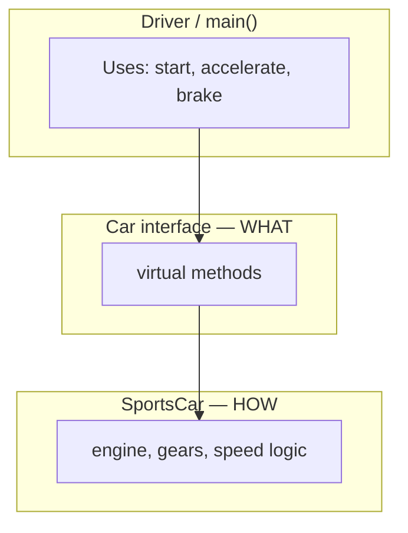
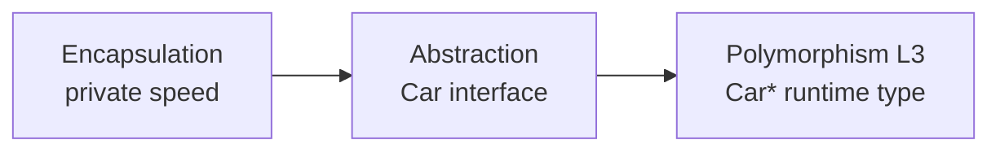
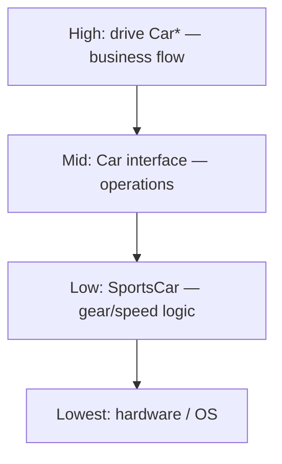
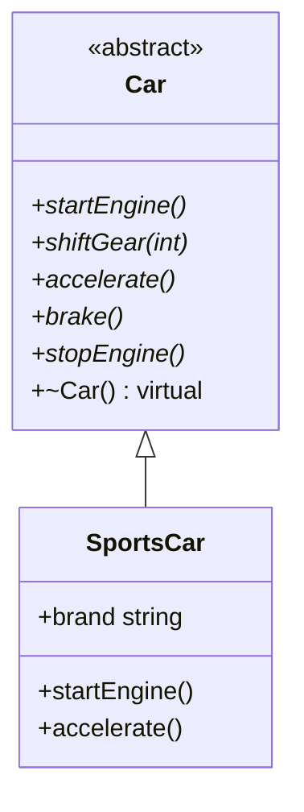
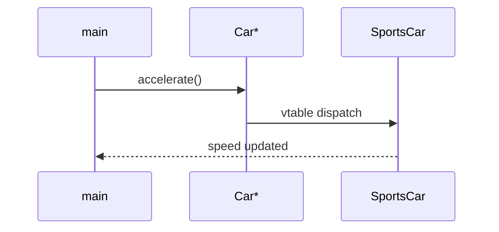
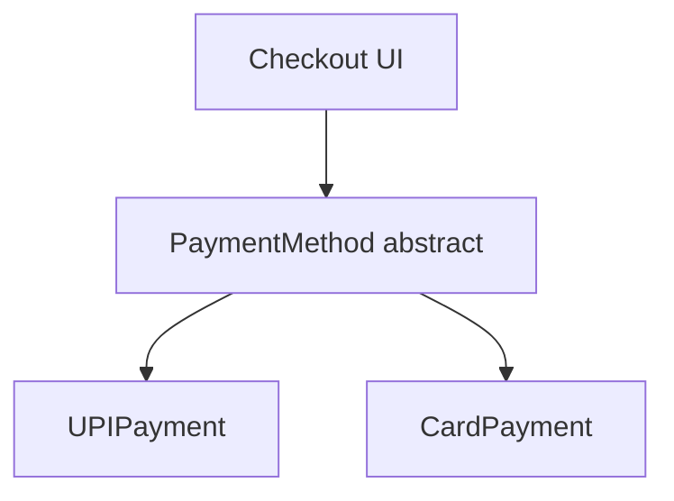
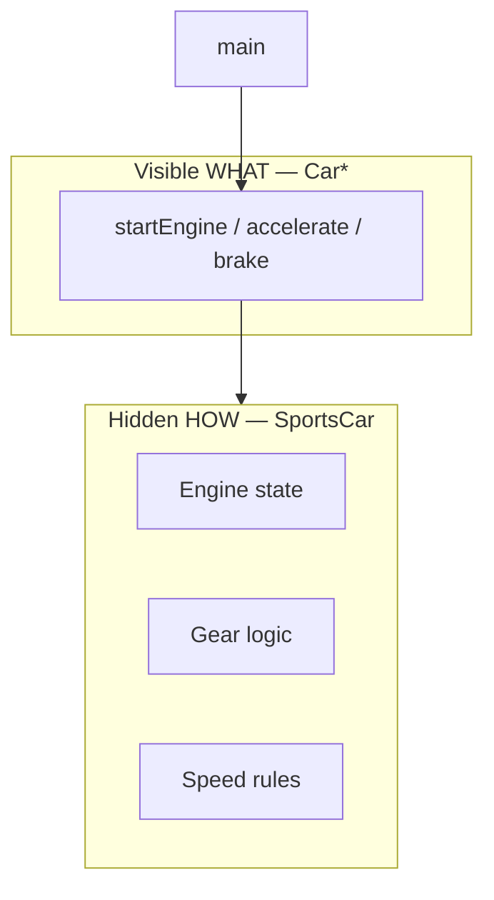
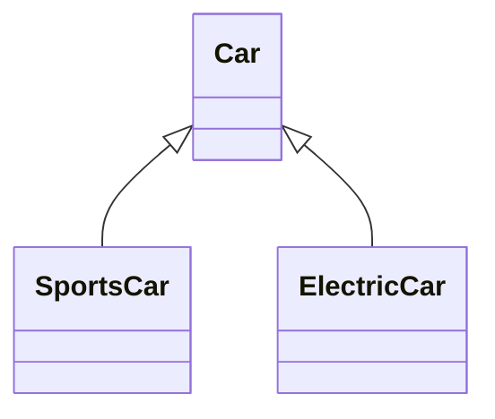
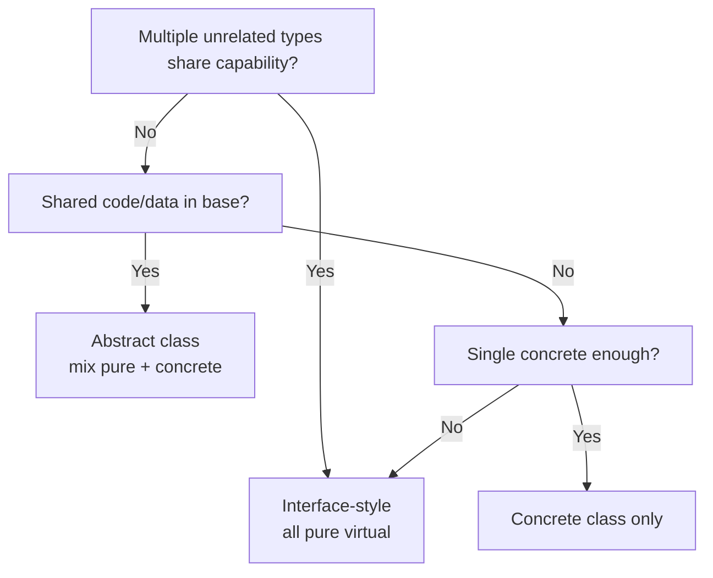

# Abstraction (अमूर्तता) — Complete Study Guide

> **Level:** L2 OOPS_1  
> **Language:** Hindi + English (interview-ready)  
> **Runnable code:** [`../C++ Code/09_Abstraction.cpp`](../C++%20Code/09_Abstraction.cpp)  
> **Companion:** [`../OOPS_COMPLETE_GUIDE.md`](../OOPS_COMPLETE_GUIDE.md)

---

## Table of Contents

1. [What is Abstraction?](#1-what-is-abstraction)
2. [Real-World: Car Pedals vs Engine](#2-real-world-car-pedals-vs-engine)
3. [Walkthrough: `09_Abstraction.cpp`](#3-walkthrough-09_abstractioncpp)
4. [Abstract Classes in C++](#4-abstract-classes-in-c)
5. [Pure Virtual Functions (`= 0`)](#5-pure-virtual-functions--0)
6. [Interface vs Abstract Class](#6-interface-vs-abstract-class)
7. [Abstraction vs Encapsulation](#7-abstraction-vs-encapsulation)
8. [Program to Interface — Base Pointers](#8-program-to-interface--base-pointers)
9. [Virtual Destructor & Object Lifetime](#9-virtual-destructor--object-lifetime)
10. [Levels of Abstraction](#10-levels-of-abstraction)
11. [Abstraction Without Inheritance (Other Forms)](#11-abstraction-without-inheritance-other-forms)
12. [Bridge to L3 — Polymorphism](#12-bridge-to-l3--polymorphism)
13. [Mermaid Diagrams](#13-mermaid-diagrams)
14. [Interview Q&A (20+ Questions)](#14-interview-qa-20-questions)
15. [Common Mistakes](#15-common-mistakes)
16. [Cheat Sheet](#16-cheat-sheet)
17. [Practice Exercises](#17-practice-exercises)
18. [Related Code & Reading](#18-related-code--reading)

---

## 1. What is Abstraction?

**Abstraction (अमूर्तता)** = complexity ko kam karke sirf **zaroori cheez** dikhana — **WHAT** karna hai, **HOW** karna hai chhupana.

| Everyday | Programming |
|----------|-------------|
| Steering wheel — turn left/right | `Car::turnLeft()` — no gear ratios shown |
| ATM — Deposit / Withdraw buttons | `AccountService::withdraw()` — no DB schema |
| TV remote — power, volume | `Remote::volumeUp()` — no IR protocol |

**Interview one-liner:**  
*"Abstraction focuses on essential features while hiding implementation details, allowing clients to work at a higher level of understanding."*

### Abstraction is not "less code"

| Myth | Reality |
|------|---------|
| Abstraction = short files | Often **more** classes — cleaner boundaries |
| Hide everything | Hide **irrelevant** — relevant ops visible |
| Only for big systems | Even `SportsCar` user doesn't need piston API |



---

## 2. Real-World: Car Pedals vs Engine

Repo comments in [`09_Abstraction.cpp`](../C++%20Code/09_Abstraction.cpp) explain:

| Layer | Real world | Code class |
|-------|------------|------------|
| Interface | Pedals, buttons, steering | `Car` (abstract) |
| Implementation | Engine, transmission, ECU | `SportsCar` (concrete) |

Driver **does not** need:

- Fuel injection timing  
- Clutch plate friction coefficients  
- CAN bus messages  

Driver **does** need:

- Start, accelerate, brake, stop  

Yahi **contract** abstract class define karti hai.

---

## 3. Walkthrough: `09_Abstraction.cpp`

### Abstract base — `Car`

```cpp
class Car {
public:
    virtual void startEngine() = 0;
    virtual void shiftGear(int gear) = 0;
    virtual void accelerate() = 0;
    virtual void brake() = 0;
    virtual void stopEngine() = 0;
    virtual ~Car() {}
};
```

| Property | Value |
|----------|-------|
| Can instantiate `Car`? | **No** — pure virtuals |
| Role | Contract / interface |
| Destructor | `virtual ~Car()` — polymorphic delete safe |

### Concrete derived — `SportsCar`

```cpp
class SportsCar : public Car {
public:
    string brand;
    string model;
    bool isEngineOn;
    int currentSpeed;
    int currentGear;

    void startEngine() override { /* ... */ }
    void shiftGear(int gear) override { /* ... */ }
    // accelerate, brake, stopEngine ...
};
```

**Note:** Demo uses **public fields** on `SportsCar` for simplicity — production code would **encapsulate** (see [`02_encapsulation.md`](02_encapsulation.md) + `08_Encapsulation.cpp`).

### main — program to interface

```cpp
Car* myCar = new SportsCar("Ford", "Mustang");

myCar->startEngine();
myCar->shiftGear(1);
myCar->accelerate();
myCar->brake();
myCar->stopEngine();

delete myCar;
```

| Line | Concept |
|------|---------|
| `Car* myCar = new SportsCar(...)` | Base pointer, derived object |
| `myCar->accelerate()` | Dynamic dispatch (L3 deep dive) |
| `delete myCar` | Needs virtual destructor |

**Build:**

```bash
cd "/Users/shubham/Desktop/LLD/L2 OOPS_1/C++ Code"
g++ -std=c++17 -o abstract_demo 09_Abstraction.cpp && ./abstract_demo
```

---

## 4. Abstract Classes in C++

### Definition

A class is **abstract** if it has **at least one** pure virtual function (or inherits unimplemented pure virtuals).

```cpp
class Car {
    virtual void accelerate() = 0;  // makes Car abstract
};
```

### What you can and cannot do

| Action | Allowed? |
|--------|----------|
| `Car* p = new SportsCar();` | Yes |
| `Car c;` | **No** — abstract |
| Define abstract class destructor body | Yes — `Car::~Car() {}` out-of-line |
| Have constructors on abstract class | Yes — for derived init |
| Mix pure + non-pure virtual | Yes |
| All methods pure virtual | Interface-like abstract class |

### Abstract class with some implemented methods

```cpp
class Car {
public:
    virtual void honk() { cout << "Beep\n"; }  // default impl
    virtual void accelerate() = 0;              // must override
};
```

Useful for **optional** behaviour with sensible default.

---

## 5. Pure Virtual Functions (`= 0`)

### Syntax

```cpp
virtual void startEngine() = 0;
```

| Part | Meaning |
|------|---------|
| `virtual` | dynamic dispatch enabled |
| `= 0` | **pure virtual** — no default impl in this class |
| Child | must override (unless child also abstract) |

### Can pure virtual have a body?

**Yes** (C++ nuance) — rare:

```cpp
class Car {
public:
    virtual void log() = 0;
};
void Car::log() { cout << "Car log\n"; }  // definition exists

class SportsCar : public Car {
    void log() override { Car::log(); }  // calls base version
};
```

Interview: *"Pure virtual means must be overridden to instantiate; it can still have a definition used by qualified call."*

### override keyword (C++11)

```cpp
void accelerate() override { /* ... */ }
```

Compiler catches signature mismatch — always use on overrides.

### final keyword

```cpp
void accelerate() final { }  // no further override in grandchildren
```

---

## 6. Interface vs Abstract Class

### C++ has no `interface` keyword

| Java/C# | C++ equivalent |
|---------|----------------|
| `interface I` | class with **all** pure virtual, no data (convention) |
| `abstract class` | mix pure virtual + fields + concrete methods |

### Comparison table

| Aspect | Interface-style | Abstract class |
|--------|-----------------|----------------|
| Data members | Ideally none | Can have protected state |
| Methods | All pure virtual | Mix pure + concrete |
| Constructors | Rare | Common for shared init |
| Multiple "interfaces" | MI in C++ | `class D : public I1, public I2` |
| Purpose | Capability contract | Partial implementation + contract |

### Example — interface-style in C++

```cpp
class IDrivable {
public:
    virtual void accelerate() = 0;
    virtual void brake() = 0;
    virtual ~IDrivable() = default;
};

class IInspectable {
public:
    virtual string inspectionReport() const = 0;
    virtual ~IInspectable() = default;
};

class SportsCar : public Car, public IInspectable {
    // implement both contracts
};
```

### When to use which

| Choose interface-style | Choose abstract class |
|------------------------|----------------------|
| Unrelated types share capability | Shared code in base |
| Multiple contracts | Template method pattern |
| Minimal coupling | Common fields in base |

---

## 7. Abstraction vs Encapsulation

| | Encapsulation | Abstraction |
|---|---------------|-------------|
| **Question** | Who can touch this data? | What does client need to see? |
| **Tool** | private / protected / public | abstract class, modules, APIs |
| **Level** | Class boundary | Design / architecture boundary |
| **Hindi** | Andar band, bahar se control | Sirf kaam dikhao, andar chhupao |

### Same project, two files

| File | Emphasis |
|------|----------|
| [`08_Encapsulation.cpp`](../C++%20Code/08_Encapsulation.cpp) | One concrete class — private fields |
| [`09_Abstraction.cpp`](../C++%20Code/09_Abstraction.cpp) | Two classes — interface + impl |



**Together:** Encapsulation protects **SportsCar internals**. Abstraction exposes **Car** contract. Polymorphism (L3) swaps **which** SportsCar/ElectricCar behind `Car*`.

---

## 8. Program to Interface — Base Pointers

### Principle

Write client code against **abstract type** (`Car*`, `unique_ptr<Car>`), not `SportsCar*`.

```cpp
void drive(Car* vehicle) {
    vehicle->startEngine();
    vehicle->accelerate();
    vehicle->brake();
    vehicle->stopEngine();
}

// drive(new SportsCar("Ford", "Mustang"));
// drive(new ElectricCar("Tesla", "Model3"));  // future
```

### Benefits

| Benefit | Explanation |
|---------|-------------|
| Open/Closed | New car types without changing `drive()` |
| Testability | Mock `Car` for unit tests |
| Decoupling | Client doesn't include heavy headers |

### smart pointer version (modern C++)

```cpp
std::unique_ptr<Car> myCar = std::make_unique<SportsCar>("Ford", "Mustang");
myCar->accelerate();
```

See [`../C++ Code/14_Smart_Pointers.cpp`](../C++%20Code/14_Smart_Pointers.cpp)

---

## 9. Virtual Destructor & Object Lifetime

### Rule

If you `delete` through **base pointer**, base destructor must be **`virtual`**.

```cpp
class Car {
public:
    virtual ~Car() {}
};
```

### Without virtual ~

```cpp
Car* p = new SportsCar(...);
delete p;  // UB or leak if ~Car not virtual
```

**L3 deep dive:** [`../../L3 OOPS_2/C++ Code/06_Virtual_Destructor.cpp`](../../L3%20OOPS_2/C++%20Code/06_Virtual_Destructor.cpp)

### Ownership table

| Pattern | Safe delete |
|---------|-------------|
| `Car* p = new SportsCar; delete p;` | virtual dtor required |
| `SportsCar s;` on stack | no delete |
| `unique_ptr<Car>` | virtual dtor required |

---

## 10. Levels of Abstraction



| Level | Example |
|-------|---------|
| Problem domain | "Process payment" |
| Class interface | `PaymentMethod::pay()` |
| Implementation | `UPIPayment::pay()` |
| Platform | SSL socket write |

**Good design:** each layer depends only on **one level below's interface**.

---

## 11. Abstraction Without Inheritance (Other Forms)

| Mechanism | Example |
|-----------|---------|
| **Headers / APIs** | `.h` public, `.cpp` hidden |
| **PIMPL** | pointer to impl |
| **Namespaces** | `finance::transfer()` |
| **Templates concepts** | generic code over requirements |
| **Modules (C++20)** | export only public API |

Not everything needs `virtual` — abstraction is **idea**, inheritance is **one C++ tool**.

---

## 12. Bridge to L3 — Polymorphism

Abstraction in L2 sets up **runtime polymorphism** in L3:

| L2 concept | L3 file |
|------------|---------|
| `virtual ... = 0` | [`../../L3 OOPS_2/C++ Code/03_Dynamic_Polymorphism.cpp`](../../L3%20OOPS_2/C++%20Code/03_Dynamic_Polymorphism.cpp) |
| vtable | [`07_Virtual_Table_Demo.cpp`](../../L3%20OOPS_2/C++%20Code/07_Virtual_Table_Demo.cpp) |
| override rules | [`09_Overloading_Vs_Overriding.cpp`](../../L3%20OOPS_2/C++%20Code/09_Overloading_Vs_Overriding.cpp) |

```cpp
Car* vehicles[] = { new SportsCar(...), new Sedan(...) };
for (Car* v : vehicles) v->accelerate();  // different behaviour
```

Read: [`01_four_pillars.md`](01_four_pillars.md) | [`../../L3 OOPS_2/notes/02_polymorphism.md`](../../L3%20OOPS_2/notes/02_polymorphism.md)

---

## 13. Mermaid Diagrams

### Class diagram (repo model)



### Sequence — polymorphic call



### Abstraction layers in payment system



---

## 14. Interview Q&A (20+ Questions)

### Q1. What is abstraction in OOP?

**A:** Showing only essential features and hiding implementation complexity — client works with a simpler model (WHAT not HOW).

### Q2. What is an abstract class?

**A:** A class that cannot be instantiated, typically containing at least one pure virtual function, defining a contract for derived classes.

### Q3. What is a pure virtual function?

**A:** Declared with `= 0`, no implementation required in abstract class; derived must implement (unless derived is also abstract).

### Q4. Can we create an object of abstract class?

**A:** No.

### Q5. Difference between abstract class and interface?

**A:** In C++, interface is usually all pure virtuals and no state; abstract class may have data members and concrete methods. Java has separate `interface` keyword.

### Q6. Why `virtual ~Car()` in abstract base?

**A:** So `delete` through `Car*` correctly destroys `SportsCar` subobject.

### Q7. Abstraction vs encapsulation?

**A:** Encapsulation = access control within a class. Abstraction = simplified view / contract. Complementary.

### Q8. What does "program to an interface" mean?

**A:** Depend on `Car*` or `Car&`, not concrete `SportsCar`, so implementations can change/extend.

### Q9. Can abstract class have a constructor?

**A:** Yes — called when constructing derived object.

### Q10. Can abstract class have non-virtual methods?

**A:** Yes — shared concrete helpers.

### Q11. What happens if derived doesn't implement pure virtual?

**A:** Derived is also abstract — cannot instantiate until all pure virtuals implemented.

### Q12. `override` vs `virtual` on derived?

**A:** `virtual` on derived optional; `override` recommended — catches errors.

### Q13. Is every class with `virtual` abstract?

**A:** No — only if at least one pure virtual (`= 0`) unimplemented.

### Q14. Real-world example of abstraction?

**A:** Database ORM — you call `save(user)`, not write disk blocks.

### Q15. Abstraction in OS?

**A:** Syscalls — apps don't program CPU registers for disk directly.

### Q16. Why two classes Car and SportsCar in our demo?

**A:** Separates user-facing operations (interface) from implementation details (concrete car).

### Q17. Can we have abstraction without polymorphism?

**A:** Yes — hidden APIs, namespaces. Polymorphism enhances abstraction with substitutability.

### Q18. Cost of virtual functions?

**A:** vtable pointer per object, indirect call — small trade for flexibility.

### Q19. Abstract class vs concrete class?

**A:** Concrete = can instantiate, full implementation. Abstract = incomplete contract.

### Q20. Hindi one-liner?

**A:** *"User ko sirf buttons dikhao, engine ka code mat dikhao."*

### Q21. Can interface have static methods? (Java context)

**A:** Java 8+ yes; C++ interfaces as pure abstract — statics don't fit classic interface pattern.

### Q22. How does abstraction support SOLID OCP?

**A:** New types extend abstract base without modifying code that uses base pointer.

---

## 15. Common Mistakes

| Mistake | Problem | Fix |
|---------|---------|-----|
| No virtual destructor | Leak / UB | `virtual ~Base()` |
| Public fields on interface class | Breaks encapsulation | private in concrete |
| God abstract class | Fat interface | split interfaces |
| Abstract for every class | Over-engineering | abstract when multiple impls expected |
| Forgetting `override` | Silent bugs | use `override` |
| Slicing: `Car c = SportsCar()` | Lose derived | pointers/refs |
| Pure virtual not implemented | compile error in main | implement all in concrete |
| Confusing abstraction with "less visibility only" | Misses contract design | define clear public API |

---

## 16. Cheat Sheet

```
ABSTRACTION = show WHAT, hide HOW

Abstract class: ≥1 pure virtual (= 0)
Cannot: Car obj; on abstract Car
Can: Car* p = new SportsCar();

Must: virtual ~Base() if polymorphic delete

interface (C++ idiom): all pure virtual, minimal state
abstract class: pure + concrete + fields

vs Encapsulation: access control vs simplified view

Code: ../C++ Code/09_Abstraction.cpp
Next L3: Dynamic polymorphism, vtable

Guide: ../OOPS_COMPLETE_GUIDE.md
```

---

## 17. Practice Exercises

1. Add `ElectricCar : public Car` with different `accelerate()` increment.
2. Add `drive(Car*)` function — loop two car types.
3. Make `SportsCar` fields private (merge with encapsulation lesson).
4. Add interface `IHonk` with pure virtual `honk()` — multiply inherit safely.
5. Break build on purpose — remove `override` with wrong signature — see error.

---

## 18. Related Code & Reading

| Resource | Path |
|----------|------|
| Abstraction demo | [`../C++ Code/09_Abstraction.cpp`](../C++%20Code/09_Abstraction.cpp) |
| Encapsulation (compare) | [`../C++ Code/08_Encapsulation.cpp`](../C++%20Code/08_Encapsulation.cpp) |
| Encapsulation notes | [`02_encapsulation.md`](02_encapsulation.md) |
| Four pillars | [`01_four_pillars.md`](01_four_pillars.md) |
| L2 complete guide | [`../OOPS_COMPLETE_GUIDE.md`](../OOPS_COMPLETE_GUIDE.md) |
| L3 polymorphism | [`../../L3 OOPS_2/C++ Code/03_Dynamic_Polymorphism.cpp`](../../L3%20OOPS_2/C++%20Code/03_Dynamic_Polymorphism.cpp) |
| Virtual destructor | [`../../L3 OOPS_2/C++ Code/06_Virtual_Destructor.cpp`](../../L3%20OOPS_2/C++%20Code/06_Virtual_Destructor.cpp) |
| All L2 C++ | [`../C++ Code/`](../C++%20Code/) |

---

### Side-by-side: Encapsulation file vs Abstraction file

| Feature | `08_Encapsulation.cpp` | `09_Abstraction.cpp` |
|---------|------------------------|----------------------|
| Classes | 1 (`SportsCar`) | 2 (`Car`, `SportsCar`) |
| Inheritance | No | `SportsCar : public Car` |
| Speed field | private | public (demo only) |
| Client type | `SportsCar*` | `Car*` |
| Pillar focus | Hide data | Hide implementation behind interface |

---

**Revision checklist**

- [ ] Explain abstraction with car pedal analogy (Hindi)
- [ ] Write abstract class with 2 pure virtuals from memory
- [ ] Explain why `virtual ~Car()`
- [ ] Compare abstract class vs interface
- [ ] Run `09_Abstraction.cpp`
- [ ] Answer Q1–Q15 without notes

---

## 19. Line-by-Line Walkthrough — `09_Abstraction.cpp`

Source: [`../C++ Code/09_Abstraction.cpp`](../C++%20Code/09_Abstraction.cpp)

| Lines | Content | Abstraction lesson |
|-------|---------|-------------------|
| 6–18 | `Car` comment block | **Interface metaphor** — pedals/buttons = public contract |
| 20–28 | `class Car` pure virtuals | **WHAT** list: start, gear, accel, brake, stop |
| 27 | `virtual ~Car()` | Polymorphic teardown — L3 `06` |
| 30–42 | `SportsCar` comment | **HOW** — real implementation under hood |
| 44 | `: public Car` | IS-A + interface fulfilment |
| 45–50 | Public fields (demo) | **Smell** — production me [`08`](02_encapsulation.md) jaisa private |
| 60–94 | Method bodies | Same logic as `08` — behaviour inside concrete |
| 100 | `Car* = new SportsCar` | **Program to interface** |
| 102–108 | calls via `Car*` | Client doesn't know Ford/Mustang details |
| 110 | `delete myCar` | Requires virtual destructor |



---

## 20. NVI — Non-Virtual Interface Idiom (Advanced)

Public non-virtual method **template** call karta hai private pure virtual:

```cpp
class Car {
public:
    void accelerate() {  // non-virtual public
        doAccelerate();  // hook
    }
    virtual ~Car() = default;
private:
    virtual void doAccelerate() = 0;
};

class SportsCar : public Car {
    void doAccelerate() override { /* +20 km/h */ }
};
```

| Benefit | Explanation |
|---------|-------------|
| Stable public API | `accelerate()` me logging/validation ek jagah |
| Controlled extension | derived sirf hook override |

Interview: *"NVI inverts who calls whom — base controls algorithm skeleton (Template Method preview)."*

---

## 21. Template Method Pattern (Bridge to Design Patterns)

```cpp
class Car {
public:
    void raceLap() {  // template method
        startEngine();
        accelerate();
        brake();
        stopEngine();
    }
    virtual ~Car() = default;
protected:
    virtual void startEngine() = 0;
    virtual void accelerate() = 0;
    virtual void brake() = 0;
    virtual void stopEngine() = 0;
};
```

**Hindi:** Base class **recipe** fix karti hai; child **steps** bharte hain — abstraction + inheritance.

---

## 22. `ElectricCar` Extension Exercise (Full Sketch)

```cpp
class ElectricCar : public Car {
    std::string brand, model;
    bool isEngineOn{false};
    int currentSpeed{0};
    int currentGear{0};
    int batteryPercent{100};

public:
    ElectricCar(std::string b, std::string m) : brand(std::move(b)), model(std::move(m)) {}

    void startEngine() override {
        isEngineOn = true;
        std::cout << brand << " " << model << " : Silent EV start\n";
    }
    void accelerate() override {
        if (!isEngineOn) return;
        if (batteryPercent <= 5) return;
        currentSpeed += 15;  // different HOW
        batteryPercent -= 2;
    }
    // shiftGear, brake, stopEngine ...
};

void drive(Car* c) {
    c->startEngine();
    c->accelerate();
    c->brake();
    c->stopEngine();
}
```



`drive()` **same** — `SportsCar` vs `ElectricCar` polymorphism (L3).

---

## 23. Encapsulated + Abstract — Best of `08` + `09`

| Layer | Class | Responsibility |
|-------|-------|----------------|
| Contract | `Car` abstract | WHAT — pure virtual API |
| Implementation | `SportsCar` | HOW — **private** fields |

```cpp
class SportsCar : public Car {
    std::string brand_;
    int speed_{0};
    bool on_{false};
public:
    void accelerate() override {
        if (!on_) return;
        speed_ += 20;
    }
};
```

Client: `Car* c = new SportsCar(...);` — na fields dikhen, na implementation.

---

## 24. Interface vs Abstract Class — Decision Flowchart



| Signal | Choose |
|--------|--------|
| `IPrintable`, `IComparable` only | Interface-style |
| `Animal` with `breath()` default + `speak()=0` | Abstract class |
| One implementation ever | Concrete, no abstract |

---

## 25. C++ `final` / `override` / Deleted Functions

```cpp
class Car {
public:
    virtual void accelerate() = 0;
    void honk() { std::cout << "Beep\n"; }
    Car(const Car&) = delete;              // abstract hierarchy copy policy
    Car& operator=(const Car&) = delete;
};

class SportsCar : public Car {
public:
    void accelerate() override final;  // no further override in child
};
```

---

## 26. Abstract Class Checklist (Design Review)

- [ ] At least one `= 0` unless interface-only by convention
- [ ] `virtual ~Base()` if any `delete` through base pointer
- [ ] Public API minimal — no fat interface
- [ ] Concrete children implement **all** pure virtuals
- [ ] Avoid public data on interface (encapsulate)
- [ ] Consider `override` on every override
- [ ] Document ownership (`unique_ptr<Car>`)

---

## 27. Abstraction in Standard Library (Analogies)

| STL piece | WHAT | HOW hidden |
|-----------|------|------------|
| `std::vector` | `push_back`, `size` | allocator, capacity growth |
| `std::fstream` | `<<`, `>>` | OS buffers |
| `std::sort` | sort range | introsort implementation |

Encapsulation + abstraction dono — user algorithm likhta hai, memory management nahi.

---

## 28. Extended Interview Q&A (Q23–Q35)

### Q23. Can `Car` have data members?

**A:** Yes — protected shared state possible; interface-style avoids.

### Q24. `= default` destructor vs `virtual ~Car()`?

**A:** Polymorphic hierarchy needs **virtual** destructor; `= default` OK if already virtual.

### Q25. `unique_ptr<Car>` benefits?

**A:** RAII — no manual `delete`; see [`14_Smart_Pointers.cpp`](../C++%20Code/14_Smart_Pointers.cpp).

### Q26. Abstract class vs namespace?

**A:** Namespace groups functions; abstract class **instance** polymorphism + state.

### Q27. Why not one big `SportsCar` only?

**A:** Client couples to Ford logic; tests hard; new car type = rewrite clients.

### Q28. `final` on class?

**A:** `class SportsCar final : public Car` — no further inheritance.

### Q29. Multiple pure virtual bases?

**A:** `class D : public I1, public I2` — watch diamond; L3 `08`.

### Q30. Abstraction in REST API?

**A:** JSON contract = WHAT; DB schema = HOW.

### Q31. Does `override` make function virtual?

**A:** Parent must already be virtual; `override` checks match.

### Q32. Zero pure virtual but virtual dtor?

**A:** Class **concrete**, still polymorphic delete possible.

### Q33. Hindi analogy extension?

**A:** *"Car class = dashboard; SportsCar = poora engine room."*

### Q34. When NOT to use abstract class?

**A:** Single implementation, no variation expected — YAGNI.

### Q35. Link to Proxy pattern L21?

**A:** Proxy bhi same interface — [`../../L21 Proxy_Design_Pattern/README.md`](../../L21%20Proxy_Design_Pattern/README.md) — abstraction at boundary.

---

## 29. Comparison Matrix — All OOP Boundary Tools

| Tool | Hides | Mechanism | File in course |
|------|-------|-----------|----------------|
| Encapsulation | Fields | private | `08` |
| Abstraction | Implementation | abstract `Car` | `09` |
| PIMPL | Compile deps | pointer impl | advanced guides |
| Module | Translation unit | .cpp internal | — |
| Namespace | Name clutter | `finance::` | — |

---

## 30. Hands-On Lab (60 Minutes)

| Time | Task |
|------|------|
| 0–10 | Run `09_Abstraction.cpp`, read output |
| 10–25 | Add `ElectricCar`, second object in array `Car*` |
| 25–40 | Add `drive(Car*)` free function |
| 40–50 | Make `SportsCar` fields private |
| 50–60 | Answer Q1–Q10 + draw sequence diagram |

---

## 31. Glossary (Hindi + English)

| English | Hindi (study) | One line |
|---------|---------------|----------|
| Abstract class | अमूर्त वर्ग | Instantiate nahi |
| Pure virtual | शुद्ध आभासी | `= 0` |
| Concrete class | ठोस वर्ग | Poora implementation |
| Contract | अनुबंध | Kaunse methods zaroori |
| Dynamic dispatch | गतिक बाइंडिंग | Runtime virtual call |
| Program to interface | इंटरफ़ेस पर लिखो | `Car*` not `SportsCar*` |

---

*End of chapter — Abstraction*
