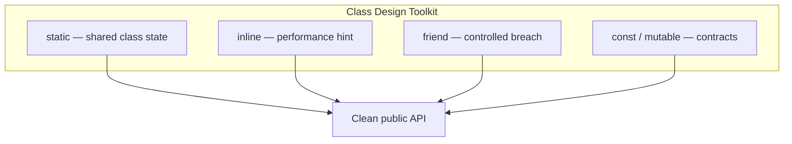
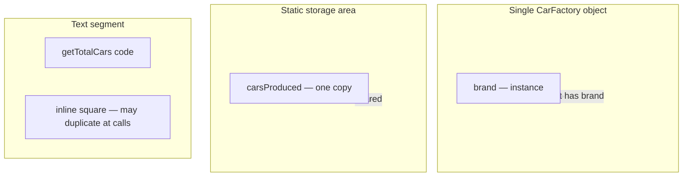
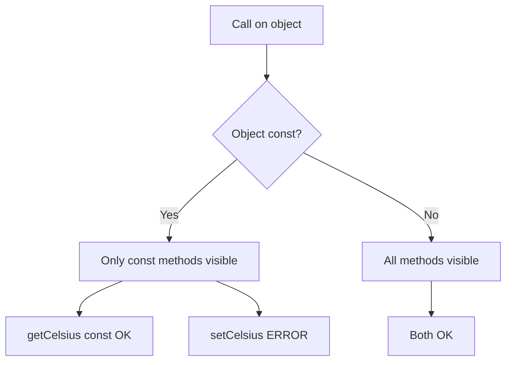
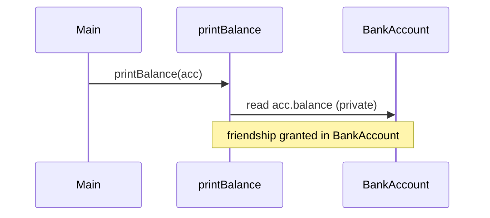
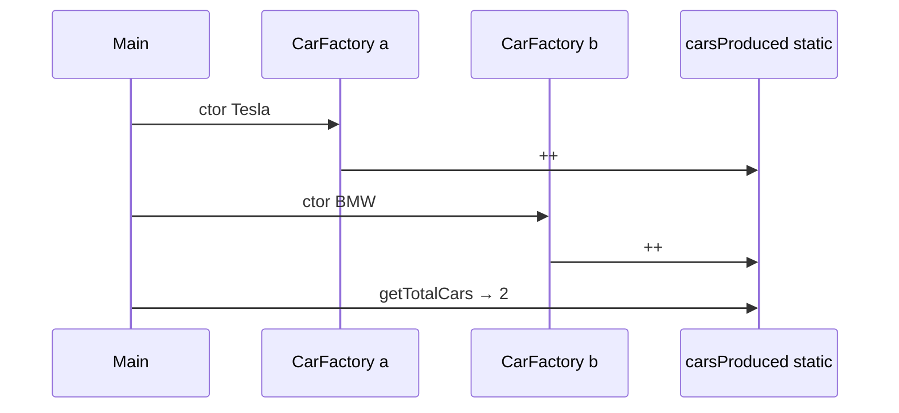

# Static Members · Inline Functions · Friend · Const & Mutable — Complete Guide

> **Runnable code:** [`04_Static_Members.cpp`](../C++%20Code/04_Static_Members.cpp) · [`05_Inline_Functions.cpp`](../C++%20Code/05_Inline_Functions.cpp) · [`06_Friend_Function.cpp`](../C++%20Code/06_Friend_Function.cpp) · [`07_Const_And_Mutable.cpp`](../C++%20Code/07_Const_And_Mutable.cpp)  
> **Full syllabus:** [`OOPS_COMPLETE_GUIDE.md`](../OOPS_COMPLETE_GUIDE.md) §5–9

---

## Table of Contents

1. [Overview — Kyon padhte hain](#1-overview--kyon-padhte-hain)
2. [Static Data Members](#2-static-data-members)
3. [Static Member Functions](#3-static-member-functions)
4. [Inline Functions](#4-inline-functions)
5. [Friend Functions](#5-friend-functions)
6. [Friend Classes](#6-friend-classes)
7. [Const Correctness](#7-const-correctness)
8. [Mutable Keyword](#8-mutable-keyword)
9. [Cross-Topic Comparison](#9-cross-topic-comparison)
10. [Memory & Linking Model](#10-memory--linking-model)
11. [Design Guidelines & Best Practices](#11-design-guidelines--best-practices)
12. [Common Pitfalls & Debugging](#12-common-pitfalls--debugging)
13. [Real-World Patterns](#13-real-world-patterns)
14. [Mermaid Diagrams](#14-mermaid-diagrams)
15. [Interview Question Bank](#15-interview-question-bank)
16. [Cheat Sheet](#16-cheat-sheet)
17. [Hindi / English Glossary](#17-hindi--english-glossary)
18. [Quick Revision Checklist](#18-quick-revision-checklist)

---

## 1. Overview — Kyon padhte hain

Yeh chaar topics C++ me **class design ke building blocks** hain. Interview me inhe alag-alag puchte hain, lekin production code me yeh **mil kar** kaam karte hain:

| Topic | Hindi one-liner | English one-liner | Primary demo file |
| ----- | --------------- | ----------------- | ----------------- |
| **static** | Class ki property, object ki nahi | Belongs to class, not instance | `04_Static_Members.cpp` |
| **inline** | Compiler ko hint — call site par expand karo | Suggestion to embed body at call site | `05_Inline_Functions.cpp` |
| **friend** | Encapsulation selectively todo | Grant private access to outsiders | `06_Friend_Function.cpp` |
| **const / mutable** | Object state change ka contract | Immutability + logical const exceptions | `07_Const_And_Mutable.cpp` |



**Interview framing:**  
*"Static = shared metadata. Inline = optimization hint, not guarantee. Friend = last resort for operators/adapters. Const = API promise that object logical state won't change."*

---

## 2. Static Data Members

### 2.1 Definition (English)

A **static data member** is a class-level variable. There is **exactly one copy** in the program (per class), shared by all objects. It is **not stored inside each object**.

### 2.1 Definition (Hindi)

**Static data member** class ki shared property hoti hai — har object ke andar alag copy nahi banti. Poore program me (us class ke liye) **ek hi copy** rehti hai.

### 2.2 Repo walkthrough — `CarFactory`

```cpp
class CarFactory {
    static int carsProduced;   // declaration only inside class
    string brand;

public:
    CarFactory(string b) : brand(b) {
        carsProduced++;        // har naya object count badhata hai
    }

    static int getTotalCars() {
        return carsProduced;
    }
};

// Definition OUTSIDE class — mandatory for static data
int CarFactory::carsProduced = 0;
```

| Step | Kya hota hai | Kyon zaroori |
| ---- | ------------ | ------------ |
| `static int carsProduced;` inside class | Declaration | Compiler ko batata hai member exists |
| `int CarFactory::carsProduced = 0;` outside | Definition + init | Storage allocate hoti hai exactly once |
| `carsProduced++` in ctor | Mutation | Shared counter update |
| `CarFactory::getTotalCars()` | Read without object | Class scope access |

### 2.3 Static vs instance member

| Aspect | Instance member (`brand`) | Static member (`carsProduced`) |
| ------ | ------------------------- | ------------------------------ |
| Copies | One per object | One per class (program) |
| Access without object | ❌ | ✅ via static method or `Class::member` |
| `this` pointer | ✅ implicit | ❌ not available |
| Initialized in | Constructor initializer list (per object) | Outside class definition (usually) |
| Memory location | Inside object layout | Separate static storage (BSS/data) |

### 2.4 Declaration vs definition rules

```cpp
class Widget {
    static int count;           // declaration
    static const int MAX = 100; // OK in C++11: static const integral init in-class
    static constexpr double PI = 3.14; // C++17: inline static constexpr
};

int Widget::count = 0;          // definition required (unless inline static C++17)
```

| C++ version | In-class initializer for static data |
| ----------- | -------------------------------------- |
| Pre-C++11 | Only `static const int` enum-like constants |
| C++11 | `static const int` in-class init OK |
| C++17 | `inline static` — definition in header OK |

### 2.5 Static members in inheritance

```cpp
class Base {
public:
    static int id;
};
class Derived : public Base { };

// Base::id and Derived::id are SAME if not redeclared
// If Derived redeclares static int id — separate variable
```

**Interview trap:** Derived class **inherits** static members but **does not get a separate copy** unless it **redeclares** its own static member.

### 2.6 Static const / constexpr members

```cpp
class Config {
public:
    static constexpr int DEFAULT_PORT = 8080;  // often no out-of-class def needed
    static const char* NAME;                   // needs out-of-class def if odr-used
};
const char* Config::NAME = "App";
```

### 2.7 Order of initialization (static data)

Static data members of **non-local** classes are zero-initialized, then **dynamic initialization** runs before `main` (within same translation unit order is definition order; across TUs — **static initialization order fiasco** risk).

| Risk | Mitigation |
| ---- | ---------- |
| Global static A uses global static B before B init | Meyers singleton, construct on first use |
| Cross-TU init order undefined | Avoid static init dependencies |

### 2.8 Thread safety of static locals (bonus)

```cpp
Config& getConfig() {
    static Config instance;  // C++11: thread-safe one-time init
    return instance;
}
```

Yeh **Meyers Singleton** pattern hai — interview me kabhi puchte hain static local ka C++11 guarantee.

### 2.9 Hindi summary — static data

> Static data member = **class ki diary** jisme sab objects mil kar likhte hain. Har object apni copy nahi rakhta — ek hi shared page hai.

---

## 3. Static Member Functions

### 3.1 Definition

**Static member functions** belong to the class. They can be called **without an object**: `CarFactory::getTotalCars()`.

### 3.2 Key properties

| Property | Static member function | Non-static member function |
| -------- | ---------------------- | -------------------------- |
| `this` pointer | ❌ No | ✅ Yes |
| Access instance members | ❌ Direct access not allowed | ✅ Yes |
| Access static members | ✅ Yes | ✅ Yes |
| Call syntax | `Class::func()` or `obj.func()` | Needs object (or pointer/ref) |
| Virtual? | ❌ Cannot be virtual | ✅ Can be virtual |
| const qualifier on method? | ❌ Meaningless (`static void f() const` illegal) | ✅ `void f() const` |

### 3.3 Why no `this`?

Static methods are resolved at **compile time** (like namespace functions attached to class). No object → no implicit `this` → cannot read `brand` in `getTotalCars()` unless you pass an object parameter.

```cpp
class CarFactory {
    string brand;
    static int total;
public:
    static int getTotal() { return total; }           // OK
    // static string getBrand() { return brand; }     // ERROR — no this
    string getBrand() const { return brand; }          // OK — has this
};
```

### 3.4 Common use cases

| Use case | Example |
| -------- | ------- |
| Factory methods | `Widget::createFromJson(...)` |
| Utility on type | `MathUtil::clamp(v, lo, hi)` |
| Access static state | `getTotalCars()`, `getInstanceCount()` |
| Callback trampolines | C API needs plain function pointer |

### 3.5 Static + private constructor (Singleton sketch)

```cpp
class Singleton {
    Singleton() = default;
    static Singleton* instance;
public:
    static Singleton* getInstance() {
        if (!instance) instance = new Singleton;
        return instance;
    }
};
```

Modern C++ prefer **Meyers singleton** or dependency injection over raw `new` singleton.

### 3.6 Hindi summary — static methods

> Static method = **class ka function** jo bina object ke call ho sakta hai. Object ka data directly nahi chhuta — sirf static data ya parameters se kaam karta hai.

---

## 4. Inline Functions

### 4.1 Definition (English)

`inline` is a **hint** to the compiler to **substitute the function body at the call site** instead of generating a full call sequence. Modern compilers **inline with or without** the keyword.

### 4.2 Definition (Hindi)

`inline` compiler ko **suggestion** deta hai ki function call ki jagah code wahi expand kar do. Lekin **guarantee nahi** — compiler ignore kar sakta hai.

### 4.3 Repo walkthrough — `MathUtil`

```cpp
class MathUtil {
public:
    inline int square(int x) const { return x * x; }  // defined in class → implicitly inline
};

inline int add(int a, int b) { return a + b; }        // free function, inline keyword
```

| Location | Inline status |
| -------- | ------------- |
| Member defined **inside** class body | Implicitly inline |
| Member declared inside, defined **outside** | Need `inline` on out-of-class definition |
| Free function in header | Mark `inline` to avoid ODR violation |

### 4.4 Why inline in headers? (ODR)

If a non-inline function is defined in a header included by multiple `.cpp` files → **multiple definitions** → linker error (ODR violation).

```cpp
// utils.h
inline int twice(int x) { return 2 * x; }  // OK — merged by linker
// int thrice(int x) { return 3 * x; }     // BAD in header unless inline
```

### 4.5 inline vs macro

| Feature | `#define SQUARE(x) ((x)*(x))` | `inline int square(int x)` |
| ------- | ----------------------------- | -------------------------- |
| Type checking | ❌ | ✅ |
| Scope / debugging | ❌ Poor | ✅ |
| Side effects | `(x++)` duplicated | Evaluated once |
| Recommended | ❌ Avoid in C++ | ✅ Prefer |

### 4.6 When compiler refuses to inline

| Reason | Example |
| ------ | ------- |
| Function too large | Big loops, many branches |
| Virtual dispatch | Virtual call needs vtable |
| Address taken | `auto f = &add;` may force out-of-line |
| Recursive calls | Often not inlined |
| Optimization off | `-O0` debug builds |

### 4.7 `inline` variables (C++17)

```cpp
struct Constants {
    inline static const string APP_NAME = "MyApp";  // one definition rule friendly
};
```

### 4.8 Performance mental model

```
Without inline:  call → push stack → jump → return
With inline:     caller code expanded in place (may increase code size — icache pressure)
```

**Trade-off:** Faster call path vs **larger binary** (code bloat).

### 4.9 Hindi summary — inline

> Inline = **chhote functions ke liye speed hint**. Header me safe rehne ke liye bhi use hota hai. Compiler ko force nahi kar sakte — `-O2` par woh khud bhi inline karta hai.

---

## 5. Friend Functions

### 5.1 Definition

A **friend function** is **not a member** of the class, but is granted **access to private and protected** members.

### 5.2 Repo walkthrough — `BankAccount`

```cpp
class BankAccount {
    double balance;
    friend void printBalance(const BankAccount& acc);
public:
    BankAccount(double b) : balance(b) {}
};

void printBalance(const BankAccount& acc) {
    cout << acc.balance << "\n";  // OK — friend
}
```

| Point | Detail |
| ----- | ------ |
| Friendship | **Not symmetric** — A friend of B ≠ B friend of A |
| Inheritance | **Not inherited** — derived class doesn't get parent's friends |
| Encapsulation | Breaks wall **selectively** — use sparingly |

### 5.3 Why friend for `operator<<`?

```cpp
class Complex {
    friend ostream& operator<<(ostream& os, const Complex& c);
    double real, imag;
};

ostream& operator<<(ostream& os, const Complex& c) {
    os << c.real << "+" << c.imag << "i";
    return os;
}
```

Stream must be `friend` because **left operand** is `ostream` (not your class) — member version would be `c << cout` (wrong syntax).

### 5.4 Friend vs public getter

| Approach | Pros | Cons |
| -------- | ---- | ---- |
| Public getter `getBalance()` | Simple, keeps encapsulation | Exposes data shape |
| Friend `printBalance()` | Hides fields, targeted access | Couples free function to internals |
| Friend for operators | Natural syntax | Slightly wider access |

### 5.5 Friend function declaration placement

```cpp
class X {
    friend void helper(X&);  // can appear in private/public — access same
private:
    int secret;
};
```

Access specifier of friend declaration **does not matter** — friendship is not access control for callers.

### 5.6 Hindi summary — friend function

> Friend function class ka member nahi hai, par **private room ki chabi** mil jati hai. Operator overloading aur targeted helpers ke liye — **daily design me kam use karo**.

---

## 6. Friend Classes

### 6.1 Definition

A **friend class** can access **private/protected** members of the granting class.

### 6.2 Repo walkthrough — `SecretHolder` & `Auditor`

```cpp
class SecretHolder {
    int secret = 42;
    friend class Auditor;
};

class Auditor {
public:
    void inspect(const SecretHolder& h) {
        cout << h.secret << "\n";  // OK
    }
};
```

### 6.3 Friend class granularity

| Declaration | Effect |
| ----------- | ------ |
| `friend class Auditor;` | All methods of `Auditor` access all privates of grantor |
| `friend void Auditor::inspect(...);` | Only specific member function (forward declare class first) |

### 6.4 When justified

| Scenario | Example |
| -------- | ------- |
| Tight collaboration | `House` friend of `Room` for private ctor |
| Iterator | Container friend of Iterator |
| Pimpl idiom | Impl class friend of facade |

### 6.5 When to avoid

- Wide friendship across layers (presentation → DB internals)
- Testing hack — prefer `TEST_F` with public API or dedicated test hooks

### 6.6 Hindi summary — friend class

> Poori class ko private access — **strong coupling**. Sirf tab jab design genuinely co-designed ho (House–Room, Node–Iterator).

---

## 7. Const Correctness

### 7.1 Definition

**Const correctness** means using `const` to document and enforce **what may change** — objects, pointers, methods, return values.

### 7.2 Repo walkthrough — `TemperatureSensor`

```cpp
class TemperatureSensor {
    double celsius;
    mutable int readCount;

public:
    double getCelsius() const {
        readCount++;
        return celsius;
    }

    void setCelsius(double c) { celsius = c; }
};

void printReading(const TemperatureSensor& s) {
    cout << s.getCelsius() << "\n";  // only const methods allowed
}

int main() {
    const TemperatureSensor outdoor(36.5);
    // outdoor.setCelsius(40);  // ERROR
}
```

### 7.3 `const` member function semantics

```cpp
void show() const;  // promises: won't modify *logical* non-mutable members
```

| Caller object | Can call |
| ------------- | -------- |
| `const T&` / `const T*` | Only `const` methods |
| non-const `T&` | Both const and non-const methods |

### 7.4 const overloading

```cpp
class Buffer {
    char* data;
public:
    char& operator[](size_t i)       { return data[i]; }
    const char& operator[](size_t i) const { return data[i]; }
};
```

### 7.5 const placement cheat

```cpp
const int* p;        // pointer to const int — *p cannot change
int* const p;        // const pointer — p cannot change
const int* const p;  // both const
```

### 7.6 Logical vs physical const

| Term | Meaning |
| ---- | ------- |
| **Physical const** | No bytes in object change |
| **Logical const** | Observable state unchanged; caches/stats may update via `mutable` |

### 7.7 Return const

```cpp
const string& getName() const { return name; }  // prevent caller modifying internal
```

### 7.8 Hindi summary — const

> Const = **promise**. `const` object sirf `const` methods call karega. API safe banati hai — bugs compile time par pakde jate hain.

---

## 8. Mutable Keyword

### 8.1 Definition

**mutable** allows modifying a member **even inside a `const` member function**.

### 8.2 Use cases

| Use case | Example |
| -------- | ------- |
| Cache / memoization | `mutable optional<Result> cache;` |
| Lazy initialization | `mutable once_flag` |
| Statistics | `readCount` in sensor demo |
| Mutex in const method | `mutable mutex mtx;` for thread-safe const API |

### 8.3 Example — mutex in const API

```cpp
class ThreadSafeMap {
    mutable mutex m;
    map<string,int> data;
public:
    int get(const string& k) const {
        lock_guard<mutex> lock(m);
        return data.at(k);
    }
};
```

Without `mutable`, `lock(m)` in const method would fail — mutex state changes but **logical** map view is read-only.

### 8.4 mutable abuse warning

Do not use `mutable` to **bypass const** for core business fields — only **implementation details** that don't change observable state.

### 8.5 Hindi summary — mutable

> Mutable = **const method ke andar chhupi hui exception** — cache, counter, lock ke liye. Asli data change karne ke liye mat use karo.

---

## 9. Cross-Topic Comparison

### 9.1 Master table

| Keyword | Scope | Object needed? | Can access private? | Primary purpose |
| ------- | ----- | -------------- | ------------------- | --------------- |
| `static` (data) | Class | No (for access via static method) | Yes (within class methods) | Shared state |
| `static` (method) | Class | No | Via members if static | Class utilities |
| `inline` | Function | N/A | N/A | ODR + perf hint |
| `friend` | External | N/A | ✅ Granted | Selective access |
| `const` method | Instance | Yes | Yes (own class) | Read-only API |
| `mutable` | Member | Yes | N/A | Logical const exception |

### 9.2 Combining static + const

```cpp
class Util {
public:
    static int compute(const vector<int>& v);  // static + const ref param — common
};
```

Static method + `const` parameter = read-only input, no object state.

### 9.3 Combining friend + const

```cpp
friend ostream& operator<<(ostream& os, const Complex& c);
```

Friend respects const object — read-only stream output pattern.

---

## 10. Memory & Linking Model

### 10.1 Where things live



### 10.2 Linker symbols

| Entity | Typical linkage |
| ------ | --------------- |
| `CarFactory::carsProduced` | Single global symbol |
| `inline add()` | Weak / merged across TUs |
| `printBalance()` friend | External linkage unless static |

---

## 11. Design Guidelines & Best Practices

### 11.1 Static

| Do | Don't |
| -- | ----- |
| Use for counts, caches tied to type | Use as global variable disguised |
| Initialize explicitly | Rely on zero-init for non-POD carelessly |
| Prefer Meyers singleton for lazy init | Create static init order across TUs |

### 11.2 Inline

| Do | Don't |
| -- | ----- |
| Small hot accessors in headers | Mark huge functions inline always |
| Use `inline` on header-defined free functions | Put non-inline defs in headers |

### 11.3 Friend

| Do | Don't |
| -- | ----- |
| Operator<<, operator>> | Make whole subsystem friend |
| Pimpl / iterator patterns | Replace getters everywhere with friends |

### 11.4 Const / mutable

| Do | Don't |
| -- | ----- |
| Mark read methods `const` | Cast away const (`const_cast`) to fix design |
| `mutable` for cache/mutex only | `mutable` on primary business fields |

---

## 12. Common Pitfalls & Debugging

### 12.1 Forgot static definition outside class

```
undefined reference to `CarFactory::carsProduced'
```

**Fix:** Add `int CarFactory::carsProduced = 0;` in exactly one `.cpp`.

### 12.2 Static method touches instance field

```
error: cannot call member function without object
```

**Fix:** Pass object as parameter or make field static.

### 12.3 Header function linker error

```
multiple definition of `add(int, int)'
```

**Fix:** Mark function `inline` or move definition to one `.cpp`.

### 12.4 const object calls non-const method

```
passing 'const TemperatureSensor' discards qualifiers
```

**Fix:** Make method `const` or remove const from object (if logically wrong).

### 12.5 Friend misuse — test only

If only tests need internals → `#ifdef TESTING` friend or test in same TU — don't ship wide friendship.

---

## 13. Real-World Patterns

### 13.1 Singleton (static local)

```cpp
DatabasePool& pool() {
    static DatabasePool instance{/*...*/};
    return instance;
}
```

### 13.2 Inline accessors (STL-style)

```cpp
class vector_wrapper {
    size_t sz;
public:
    size_t size() const { return sz; }  // implicitly inline
};
```

### 13.3 Friend stream operators

Standard pattern for user-defined types logging to `cout`.

### 13.4 Const API + mutable mutex

Any thread-safe **const** read path on shared container.

---

## 14. Mermaid Diagrams

### 14.1 const method dispatch



### 14.2 Friend access model



### 14.3 Static vs instance lifetime



---

## 15. Interview Question Bank

### 15.1 Static — Basic

**Q1.** Static data member kya hai?  
**A.** Class ki ek shared copy; sab objects share karte hain; object ke andar store nahi hoti.

**Q2.** Static data ki definition class ke andar kyun nahi?  
**A.** Class body declaration hai; storage ke liye exactly one definition chahiye — usually ek `.cpp` me.

**Q3.** Static member function me `this` kyun nahi?  
**A.** Object bind nahi hota — koi instance context nahi.

**Q4.** `CarFactory::getTotalCars()` bina object call ho sakta hai?  
**A.** Haan — `Class::staticMethod()`.

**Q5.** Static members virtual ho sakte hain?  
**A.** Static member functions **virtual nahi** ho sakte (no vtable entry for class-only dispatch).

### 15.2 Static — Intermediate

**Q6.** Static initialization order fiasco kya hai?  
**A.** Do alag translation units ke global statics ka init order undefined — ek dusre par depend mat karo.

**Q7.** C++11 static local thread-safe kyun?  
**A.** Function-local static init magic statics se guarded — concurrent first call safe.

**Q8.** Derived class me Base ka static member alag copy?  
**A.** Nahi, jab tak Derived apna static redeclare na kare.

**Q9.** `inline static` data member (C++17)?  
**A.** Header me definition OK — ODR solved.

**Q10.** Static const int in-class init?  
**A.** C++11 se integral static const in-class initialize ho sakta hai.

### 15.3 Inline — Basic

**Q11.** Inline ka matlab compiler function body call site par copy kar dega?  
**A.** Hint hai — compiler decide karta hai; ignore ho sakta hai.

**Q12.** Class ke andar define ki method inline hoti hai?  
**A.** Implicitly inline treat hoti hai (member function defined in class definition).

**Q13.** Macro se better kyun?  
**A.** Type safety, no double-eval side effects, debugging.

**Q14.** Header me free function kyun inline?  
**A.** Multiple TUs include karenge — bina inline ODR violation.

**Q15.** Virtual function inline ho sakti hai?  
**A.** Call virtual dispatch se ho to usually out-of-line; direct call optimize ho sakta hai.

### 15.4 Inline — Intermediate

**Q16.** Code bloat kya hai?  
**A.** Har call site par duplicate instructions — icache miss badh sakte hain.

**Q17.** `inline` keyword guarantee deta hai?  
**A.** Nahi — suggestion only.

**Q18.** LTO / PGO inline par effect?  
**A.** Cross-TU inlining possible even without header inline.

**Q19.** Recursive function inline?  
**A.** Usually nahi — depth unbounded.

**Q20.** `-O0` debug build me inline?  
**A.** Often disabled for debugging clarity.

### 15.5 Friend — Basic

**Q21.** Friend function class ka member hai?  
**A.** Nahi — normal function with special access.

**Q22.** Friendship inherit hoti hai?  
**A.** Nahi.

**Q23.** Friendship symmetric hai?  
**A.** Nahi — one-way grant.

**Q24.** Friend declaration private section me — koi farq?  
**A.** Nahi — friendship access control nahi, sirf grant.

**Q25.** Kyon `operator<<` friend hota hai?  
**A.** Left operand `ostream` hai — member banega to syntax ulta.

### 15.6 Friend — Intermediate

**Q26.** Friend class vs nested class?  
**A.** Nested class member hai; friend external class with private access.

**Q27.** Encapsulation tod di friend ne?  
**A.** Selectively — design trade; kam use karo.

**Q28.** Specific member function ko friend?  
**A.** `friend void Auditor::inspect(...);` — forward declare needed.

**Q29.** Friend template?  
**A.** `friend class Allocator<T>;` or `friend void foo<>(...);` — syntax careful.

**Q30.** Testing ke liye friend OK?  
**A.** Sometimes — prefer public contract; avoid production leakage.

### 15.7 Const — Basic

**Q31.** `void f() const` ka matlab?  
**A.** `f` object ki non-mutable state modify nahi karega.

**Q32.** Const object par kaunse methods?  
**A.** Sirf const-qualified member functions.

**Q33.** `const int*` vs `int* const`?  
**A.** Pehla — data const; doosra — pointer const.

**Q34.** Const reference parameter kyun?  
**A.** Read-only + no copy cost.

**Q35.** Logical const kya hai?  
**A.** User ko state same dikhe; internal cache badal sakta hai (mutable).

### 15.8 Const — Intermediate

**Q36.** const overload `operator[]` kyun dono?  
**A.** Const object par non-const ref return illegal hota.

**Q37.** `const_cast` safe kab?  
**A.** Original object non-const tha — otherwise UB.

**Q38.** constexpr vs const method?  
**A.** constexpr = compile-time eval possible; const method = runtime const promise.

**Q39.** mutable mutex in const method?  
**A.** Synchronization state — logical const read.

**Q40.** Return type const reference?  
**A.** Caller internal modify na kare — dangling ref se bachna.

### 15.9 Mixed / Scenario

**Q41.** Static factory method returning new object?  
**A.** `static Widget* create()` — common pattern.

**Q42.** Can friend be defined inside class body?  
**A.** Friend function can be defined inline inside class — still friend.

**Q43.** Static data thread-safe increment?  
**A.** Needs `std::atomic` or mutex — not automatic.

**Q44.** `inline static` member vs old pattern?  
**A.** C++17 simplifies header-only static data.

**Q45.** Why const correctness matters in APIs?  
**A.** Compiler-enforced documentation; parallel read safety.

**Q46.** Hindi: static aur global variable farq?  
**A.** Static member class se scoped — name mangling / access control; global namespace pollute nahi.

**Q47.** Inline in .cpp file?  
**A.** Same TU calls OK; other TUs won't see body unless in header.

**Q48.** Friend namespace function?  
**A.** Haan — `friend void ns::helper(X&);`

**Q49.** const static member function — legal?  
**A.** `static void f() const` — **illegal** (static has no const object).

**Q50.** Best combo for read-only sensor API?  
**A.** `getCelsius() const` + `mutable readCount` for stats.

---

## 16. Cheat Sheet

```
┌─────────────────────────────────────────────────────────────────┐
│ STATIC DATA                                                     │
│   declare inside class: static int count;                       │
│   define outside:       int Class::count = 0;                   │
│   C++17: inline static int count = 0;  // header OK             │
├─────────────────────────────────────────────────────────────────┤
│ STATIC METHOD                                                   │
│   Class::method() — no this, no direct instance members         │
│   cannot be virtual                                             │
├─────────────────────────────────────────────────────────────────┤
│ INLINE                                                          │
│   in-class body = implicit inline                               │
│   header free fn = mark inline                                  │
│   hint only — not guarantee                                     │
├─────────────────────────────────────────────────────────────────┤
│ FRIEND                                                          │
│   friend void f(Class&);  friend class Y;                       │
│   not inherited, not symmetric                                  │
├─────────────────────────────────────────────────────────────────┤
│ CONST                                                           │
│   const object → const methods only                             │
│   void f() const; — logical read-only                           │
├─────────────────────────────────────────────────────────────────┤
│ MUTABLE                                                         │
│   mutable in const method OK — cache, mutex, counters           │
└─────────────────────────────────────────────────────────────────┘
```

### Quick syntax table

| Syntax | Meaning |
| ------ | ------- |
| `static int x;` | Class-level shared field |
| `static void f();` | Call without object |
| `inline int g();` | ODR-safe header function |
| `friend void h(T&);` | Private access grant |
| `void k() const;` | Won't modify non-mutable state |
| `mutable int c;` | Can change in const method |

---

## 17. Hindi / English Glossary

| English | Hindi (concept) | One line |
| ------- | --------------- | -------- |
| Static member | स्थिर सदस्य / class स्तर | Ek copy pure class ke liye |
| Translation unit | अनुवाद इकाई | Ek .cpp + its includes |
| ODR | एक परिभाषा नियम | One definition rule |
| Inline expansion | अंतर्निहित विस्तार | Call ki jagah code paste |
| Encapsulation | इनकैप्सुलेशन | Data chhupa ke API se access |
| Friend | मित्र | Private access grant |
| Const correctness | const शुद्धता | const se design enforce |
| Logical const | तार्किक const | Dikhne me same, cache update OK |
| Mutable | परिवर्तनशील अपवाद | Can change in const method — cache/mutex |
| Meyers singleton | Meyers singleton | Static local lazy instance |

---

## 18. Quick Revision Checklist

- [ ] Static data **defined once** outside class (or C++17 `inline static`)
- [ ] Static method — **no `this`**, not virtual
- [ ] Inline — **header ODR** + perf hint, not order to compiler
- [ ] Friend — **operators**, rare collaborators; not default design
- [ ] `const` method on all **read-only** APIs
- [ ] `mutable` only for **cache / stats / mutex**
- [ ] Ran demos: `04` … `07` in [`C++ Code/`](../C++%20Code/)

---

*End of guide — static · inline · friend · const · mutable*
