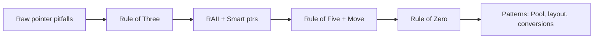
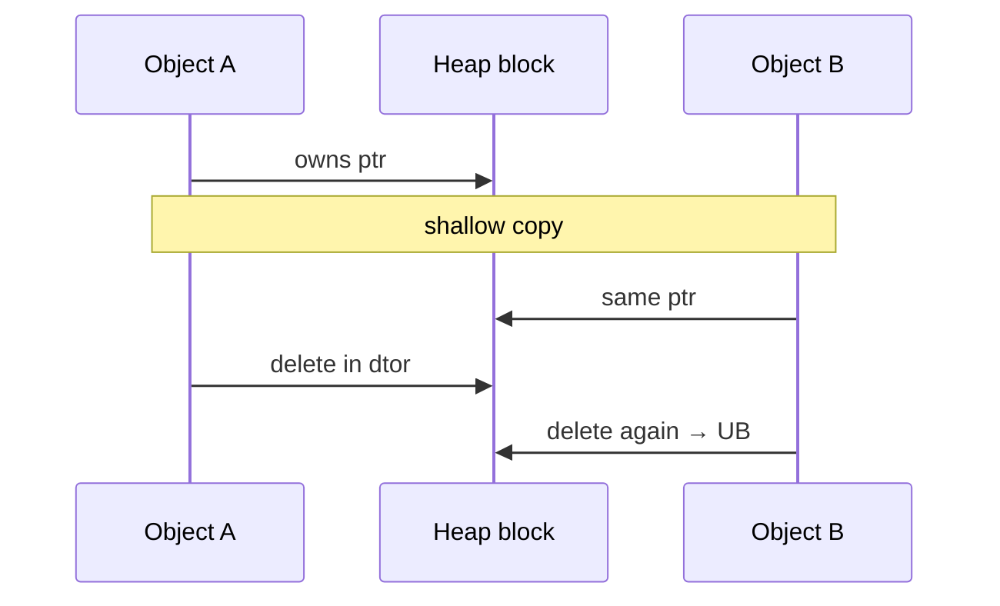
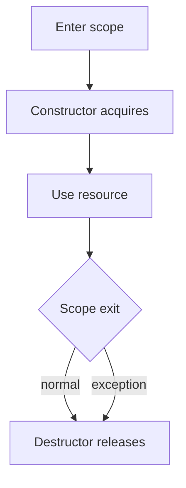
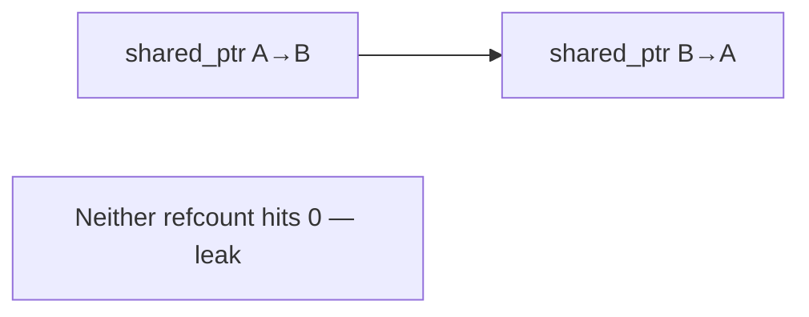
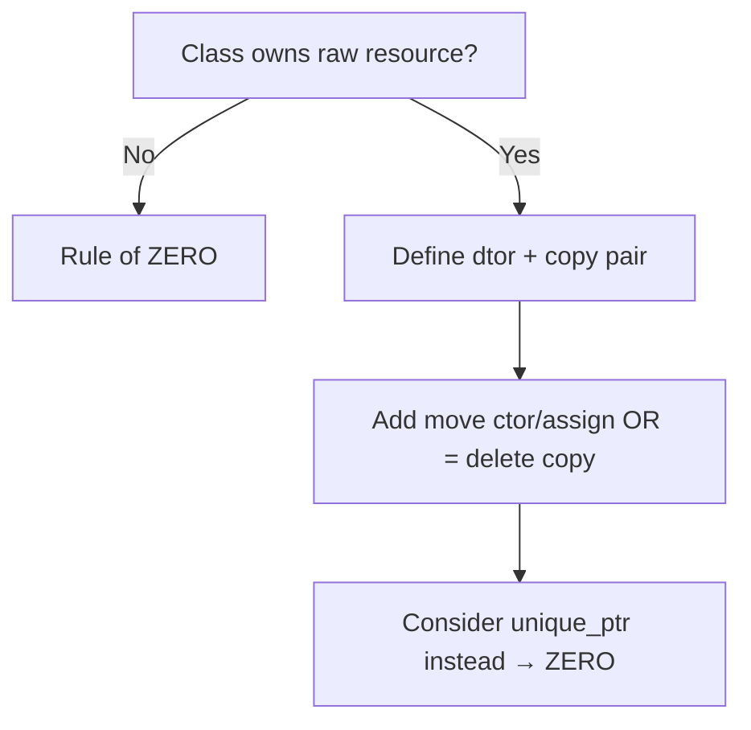
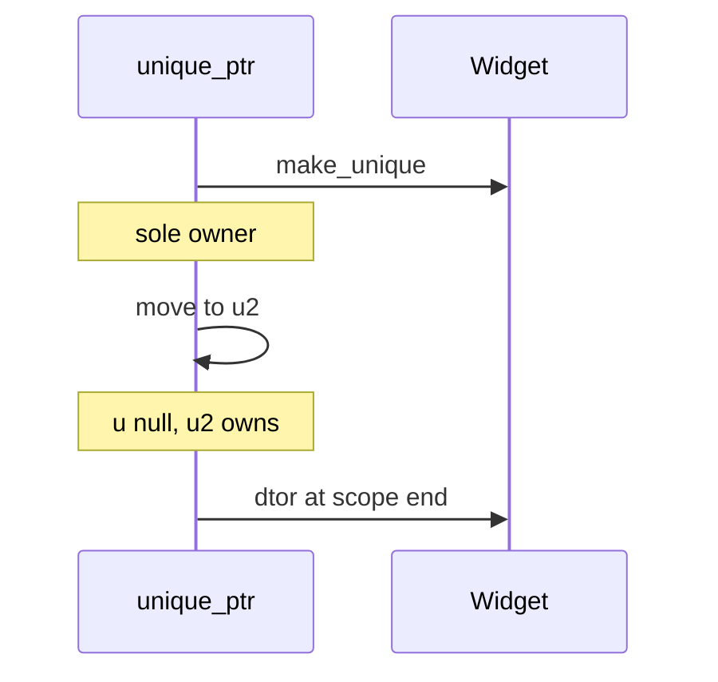
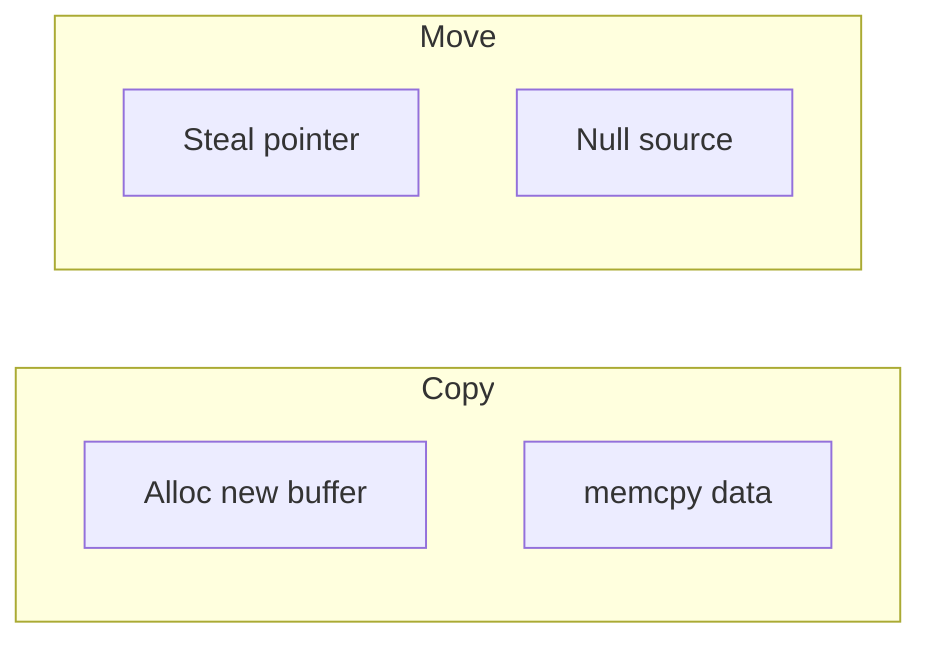
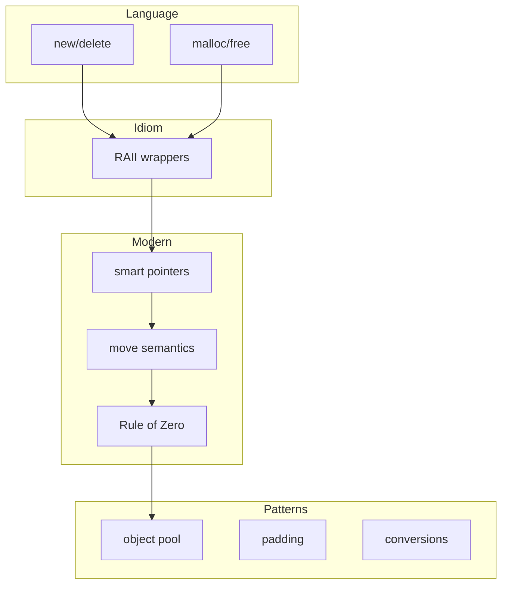

# Memory & Modern C++ — Complete Guide (Shallow Copy → Object Pool)

> **Runnable code:** [`10_Shallow_Deep_Copy.cpp`](../C++%20Code/10_Shallow_Deep_Copy.cpp) through [`19_Object_Pool_Pattern.cpp`](../C++%20Code/19_Object_Pool_Pattern.cpp)  
> **Deep dives:** [`PADDING_AND_ALIGNMENT.md`](../PADDING_AND_ALIGNMENT.md) · [`CONVERSION_FUNCTIONS.md`](../CONVERSION_FUNCTIONS.md) · [`OBJECT_POOL_PATTERN.md`](../OBJECT_POOL_PATTERN.md)  
> **Full syllabus:** [`OOPS_ADVANCED_CPP.md`](../OOPS_ADVANCED_CPP.md)

---

## Table of Contents

1. [Overview — Memory journey map](#1-overview--memory-journey-map)
2. [Shallow Copy vs Deep Copy](#2-shallow-copy-vs-deep-copy)
3. [Operator Overloading](#3-operator-overloading)
4. [new/delete vs malloc/free vs calloc](#4-newdelete-vs-mallocfree-vs-calloc)
5. [RAII — Resource Acquisition Is Initialization](#5-raii--resource-acquisition-is-initialization)
6. [Smart Pointers](#6-smart-pointers)
7. [Move Semantics](#7-move-semantics)
8. [Rule of Three / Five / Zero](#8-rule-of-three--five--zero)
9. [Padding & Alignment](#9-padding--alignment)
10. [Conversion Functions](#10-conversion-functions)
11. [Object Pool Pattern](#11-object-pool-pattern)
12. [Cross-Topic Decision Matrix](#12-cross-topic-decision-matrix)
13. [Mermaid Diagrams](#13-mermaid-diagrams)
14. [Interview Question Bank](#14-interview-question-bank)
15. [Cheat Sheet](#15-cheat-sheet)
16. [Hindi / English Glossary](#16-hindi--english-glossary)
17. [Build & Run](#17-build--run)
18. [Quick Revision Checklist](#18-quick-revision-checklist)

---

## 1. Overview — Memory journey map

Yeh guide **raw pointers se modern C++ resource management** tak ka safar cover karti hai. Har topic ka runnable demo [`C++ Code/`](../C++%20Code/) folder me hai.

| # | Topic | File | Hindi one-liner |
| - | ----- | ---- | --------------- |
| 1 | Shallow / Deep copy | `10_Shallow_Deep_Copy.cpp` | Pointer copy vs alag heap buffer |
| 2 | Operator overloading | `11_Operator_Overloading.cpp` | `+`, `<<` apne types par |
| 3 | new / malloc / calloc | `12_New_Malloc_Calloc.cpp` | C++ vs C allocation |
| 4 | RAII | `13_RAII.cpp` | Ctor me lo, dtor me chhodo |
| 5 | Smart pointers | `14_Smart_Pointers.cpp` | Automatic ownership |
| 6 | Move semantics | `15_Move_Semantics.cpp` | Copy ki jagah chori |
| 7 | Rule 3/5/0 | `16_Rule_Of_Three_Five_Zero.cpp` | Special members ka rule |
| 8 | Padding / alignment | `17_Padding_And_Alignment.cpp` | Struct size & CPU alignment |
| 9 | Conversion functions | `18_Conversion_Functions.cpp` | Implicit vs explicit |
| 10 | Object pool | `19_Object_Pool_Pattern.cpp` | Object reuse pattern |



**Learning order:** 10 → 16 pehle (ownership), phir 17–19 (optimization & language edges).

---

## 2. Shallow Copy vs Deep Copy

### 2.1 Shallow copy (English)

**Shallow copy** copies **pointer values** — two objects point to the **same heap memory**. Destructor of one frees it; the other holds a **dangling pointer**.

### 2.1 Shallow copy (Hindi)

**Shallow copy** me sirf **address copy** hota hai — dono objects **ek hi heap block** share karte hain. Ek ne `delete` kiya to doosra **dangling** ho jata hai → **double free / UB**.

### 2.2 Demo — pointer shallow copy

```cpp
int* p = new int(42);
int* q = p;      // shallow — same address
delete p;        // q ab dangling
```

| After step | `p` | `q` | Heap block |
| ---------- | --- | --- | ---------- |
| `new int(42)` | valid | — | `{42}` |
| `q = p` | valid | valid (same addr) | `{42}` |
| `delete p` | dangling | dangling | freed |

### 2.3 Deep copy (English)

**Deep copy** allocates **new memory** and copies **content**. Each object owns its buffer; independent destruction is safe.

### 2.3 Deep copy (Hindi)

**Deep copy** me **naya buffer** banta hai aur **data copy** hota hai — har object apna heap rakhta hai; alag-alag destroy safe.

### 2.4 Repo class — `DeepString`

```cpp
class DeepString {
    char* data;
    DeepString(const DeepString& o) {
        deepCopy(o.data);  // NEW buffer
    }
    DeepString& operator=(const DeepString& o) {
        if (this == &o) return *this;
        delete[] data;
        deepCopy(o.data);
        return *this;
    }
    ~DeepString() { delete[] data; }
};
```

### 2.5 Compiler default copy = shallow for pointers

| Member type | Default copy behavior |
| ----------- | --------------------- |
| `int`, `double`, struct of POD | Bitwise copy — OK |
| Raw `T*` | Copies address only — **shallow** |
| `string`, `vector` | Deep copy built-in |
| `unique_ptr` | **Not copyable** |

### 2.6 Shallow vs deep comparison table

| Aspect | Shallow | Deep |
| ------ | ------- | ---- |
| Heap allocations | Shared | Separate |
| Copy cost | O(1) pointer | O(n) data |
| Dtor safety | Risky | Safe |
| Default compiler copy | Yes for pointers | Must implement |
| Interview keyword | Aliasing | Independent ownership |

### 2.7 When shallow is OK

- **Immutable shared data** (string interning with care)
- **`shared_ptr`** — refcounted shared ownership (not bitwise shallow)
- Non-owning **observer pointers** with lifetime documented

### 2.8 Double free diagram



### 2.9 Hindi summary

> Shallow = **same address share**. Deep = **apna alag buffer**. Raw pointer class me default copy **hamesha dangerous** — Rule of Three ya smart pointers use karo.

---

## 3. Operator Overloading

### 3.1 Definition

**Operator overloading** lets user-defined types use operators (`+`, `==`, `<<`) with **natural syntax** — compile-time polymorphism.

### 3.2 Repo — `Complex`

```cpp
Complex operator+(const Complex& o) const {
    return Complex(real + o.real, imag + o.imag);
}

friend ostream& operator<<(ostream& os, const Complex& c);
```

### 3.3 Member vs free (friend) operators

| Operator | Typical form | Why |
| -------- | ------------ | --- |
| `+`, `-`, `*` binary | Member or free | Symmetry — sometimes free + friend |
| `<<`, `>>` | **Friend free** | Left operand is stream |
| `=`, `+=` | Member | Modifies `*this` |
| `==`, `<` | Member or free | `std::equality` C++20 |

### 3.4 Rules & conventions

| Rule | Detail |
| ---- | ------ |
| Cannot invent new symbols | `@` overload nahi |
| Precedence fixed | `+` always same binding |
| At least one user type | `int + int` custom nahi |
| Maintain semantics | `+` should feel like addition |
| Return types | `+` usually by value; `+=` returns `T&` |

### 3.5 Essential operators for resource classes

| Operator | Role in Rule of Three/Five |
| -------- | -------------------------- |
| Copy ctor | Deep copy |
| `operator=` | Self-assign safe assign |
| Move ctor/assign | Steal (C++11) |
| `operator<<` | Debugging |

### 3.6 Hindi summary

> Operators = **syntax sugar** apne types ke liye. Stream operators **friend** banate hain. Resource classes me `=`, copy, move carefully implement karo.

---

## 4. new/delete vs malloc/free vs calloc

### 4.1 Comparison master table

| Feature | `new` / `delete` | `malloc` / `free` | `calloc` |
| ------- | ---------------- | ----------------- | -------- |
| Language | C++ | C | C |
| Constructor | ✅ Called | ❌ No | ❌ No |
| Destructor | ✅ Called | ❌ No | ❌ No |
| Return type | `T*` typed | `void*` | `void*` |
| Size | `new T` / `new T[n]` | `malloc(n*sizeof)` | `calloc(count, size)` |
| Zero-init | Depends on `{}` | Uninitialized | **Zero-filled** |
| Failure | Throws `bad_alloc` (default) | Returns `nullptr` | Returns `nullptr` |
| Realloc | No direct | `realloc` | No |

### 4.2 Repo demo highlights

```cpp
Pod* p1 = new Pod{10, 3.14};     // ctor runs
Pod* p2 = (Pod*)malloc(sizeof(Pod)); // raw bytes — no ctor
int* arr = (int*)calloc(5, sizeof(int)); // all zeros
```

### 4.3 new[] / delete[] pairing

```cpp
int* nums = new int[3]{1, 2, 3};
delete[] nums;   // MUST match new[] — not delete
```

| Mismatch | Result |
| -------- | ------ |
| `new[]` + `delete` | UB — wrong dtor count |
| `new` + `delete[]` | UB |

### 4.4 When to use what (modern C++)

| Situation | Prefer |
| --------- | ------ |
| C++ objects | `new`/`delete` or better **smart pointers** |
| C API interop | `malloc`/`free` as API requires |
| Need zero-init C buffer | `calloc` or `vector` |
| Production C++ | **`make_unique` / `make_shared` / containers** |

### 4.5 placement new (interview bonus)

```cpp
alignas(T) char buffer[sizeof(T)];
T* obj = new (buffer) T(args);  // no heap alloc
obj->~T();                       // manual destroy — no delete
```

### 4.6 Hindi summary

> `new`/`delete` = **C++ objects + ctor/dtor**. `malloc` = **raw memory**. Modern code me **smart pointers** prefer karo — raw `new` kam likho.

---

## 5. RAII — Resource Acquisition Is Initialization

### 5.1 Definition (English)

**RAII:** Acquire resource in **constructor**, release in **destructor**. Scope exit (normal or exception) **always** cleans up.

### 5.1 Definition (Hindi)

**RAII:** Resource **constructor me lo**, **destructor me chhodo**. Scope khatam ya exception — **cleanup guaranteed**.

### 5.2 Repo — `FileGuard`

```cpp
class FileGuard {
    FILE* fp;
public:
    explicit FileGuard(const char* path, const char* mode) {
        fp = fopen(path, mode);
        if (!fp) throw runtime_error("fopen failed");
    }
    ~FileGuard() {
        if (fp) fclose(fp);
    }
    FileGuard(const FileGuard&) = delete;
    FileGuard& operator=(const FileGuard&) = delete;
};
```

### 5.3 RAII vs manual cleanup

| Manual | RAII |
| ------ | ---- |
| `fopen` … many returns … `fclose` | Single dtor path |
| Exception skips `fclose` | Dtor runs on unwind |
| Easy to forget | Compiler-generated call |

### 5.4 Standard library RAII types

| Type | Resource |
| ---- | -------- |
| `unique_ptr` | Heap object |
| `lock_guard` / `unique_lock` | Mutex |
| `fstream` | File |
| `vector` | Dynamic array |

### 5.5 Mutex demo pattern

```cpp
{
    LockGuardDemo lock(mtx);
    // critical section
}  // unlock automatic
```

### 5.6 RAII lifecycle diagram



### 5.7 Hindi summary

> RAII = **C++ ka superpower**. File, lock, memory — sab scope-bound. Copy delete karke **single ownership** enforce karo.

---

## 6. Smart Pointers

### 6.1 Overview table

| Type | Ownership | Copy | Typical use |
| ---- | --------- | ---- | ----------- |
| `unique_ptr<T>` | Exclusive | Move only | Default heap owner |
| `shared_ptr<T>` | Shared refcount | Copyable | Shared lifetime |
| `weak_ptr<T>` | None (observe) | Copyable | Break cycles |

### 6.2 unique_ptr — repo demo

```cpp
unique_ptr<Widget> u = make_unique<Widget>(1);
unique_ptr<Widget> u2 = move(u);  // u becomes null
```

| Property | Detail |
| -------- | ------ |
| Zero overhead vs raw (usually) | Same size as raw pointer |
| Custom deleter | `unique_ptr<T, Deleter>` |
| Array specialization | `unique_ptr<T[]>` → `delete[]` |

### 6.3 shared_ptr — repo demo

```cpp
shared_ptr<Widget> s1 = make_shared<Widget>(2);
shared_ptr<Widget> s2 = s1;
cout << s1.use_count();  // 2
```

| Piece | Role |
| ----- | ---- |
| Control block | Refcount + deleter |
| `make_shared` | One allocation (object + control) |
| Thread-safe refcount | Atomic inc/dec |

### 6.4 weak_ptr — break cycles

```cpp
shared_ptr<Widget> sp = make_shared<Widget>(3);
weak_ptr<Widget> wp = sp;
if (auto locked = wp.lock()) { /* use */ }
sp.reset();
// wp.expired() == true
```

**Cycle problem:**



`weak_ptr` on one edge breaks cycle.

### 6.5 Anti-patterns

| Don't | Do |
| ----- | -- |
| `shared_ptr` everywhere by default | `unique_ptr` first |
| `shared_ptr` from raw pointer twice | One owner creates, others `shared_ptr` copy |
| `get()` store long-term raw | Keep smart ptr alive |

### 6.6 Hindi summary

> `unique_ptr` = **default owner**. `shared_ptr` = **saath me share**. `weak_ptr` = **cycle todo**, bina own kiye.

---

## 7. Move Semantics

### 7.1 Motivation

**Copy** expensive hai (heap duplicate). **Move** **steals** resources from dying temporaries — O(1) for pointer buffers.

### 7.2 Repo — `Buffer` move ctor

```cpp
Buffer(Buffer&& o) noexcept : data(o.data), n(o.n) {
    o.data = nullptr;
    o.n = 0;
}
```

| After move | Source `o` | Destination |
| ---------- | ---------- | ----------- |
| pointers | null / empty | owns heap |
| dtor on source | safe no-op delete | owns data |

### 7.3 lvalue vs rvalue

| Expression | Category | Move from? |
| ---------- | -------- | ---------- |
| Named variable `b2` | lvalue | Only via `std::move` |
| Temporary `Buffer(1000)` | rvalue | Automatic move |
| Return value | rvalue | Move or RVO |

### 7.4 std::move

```cpp
Buffer b3 = std::move(b2);  // b2 empty but valid
```

**Note:** `std::move` = **cast to rvalue** — move nahi karta, **enable** karta hai.

### 7.5 RVO / NRVO

```cpp
Buffer makeBuffer() { return Buffer(1000); }
Buffer b1 = makeBuffer();  // often NO move/copy — RVO elision
```

C++17 guaranteed RVO in many cases — **don't rely on move for return local**.

### 7.6 noexcept on move

Move ctor `noexcept` → `vector` reallocate par move use karega; warna copy fallback.

### 7.7 Hindi summary

> Move = **marne wale object se resource chori**. `std::move` named object ko move ke liye cast karta hai. Move operations **`noexcept`** rakho containers ke liye.

---

## 8. Rule of Three / Five / Zero

### 8.1 Rule of Three (pre-C++11)

Agar class me **manual resource** (raw pointer, file handle) hai aur aap define karte ho:

1. Destructor  
2. Copy constructor  
3. Copy assignment  

→ **Teeno define karo** (ya explicitly delete).

### 8.2 Rule of Five (C++11)

Rule of Three **plus**:

4. Move constructor  
5. Move assignment  

Repo `RuleOfFive` uses `unique_ptr` internally — move = `default`.

### 8.3 Rule of Zero

**No raw resource** — members (`string`, `vector`, `unique_ptr`) handle everything → **compiler-generated** special members are correct.

```cpp
class RuleOfZero {
    string name;
    vector<int> scores;
    // no custom dtor/copy/move needed
};
```

### 8.4 Decision flowchart



### 8.5 Comparison table

| Rule | When | Special members |
| ---- | ---- | ----------------- |
| Three | Raw resource, no move | dtor, copy ctor, copy = |
| Five | Raw resource + move | + move ctor, move = |
| Zero | All RAII members | compiler defaults |

### 8.6 = delete patterns

```cpp
NonCopyable(const NonCopyable&) = delete;
NonCopyable& operator=(const NonCopyable&) = delete;
```

### 8.7 Hindi summary

> Raw pointer = **Rule of Five** ya **delete copy**. Smart members = **Rule of Zero** — sabse clean.

---

## 9. Padding & Alignment

> **Full guide:** [`PADDING_AND_ALIGNMENT.md`](../PADDING_AND_ALIGNMENT.md)  
> **Code:** [`17_Padding_And_Alignment.cpp`](../C++%20Code/17_Padding_And_Alignment.cpp)

### 9.1 Alignment (Hindi)

CPU **aligned address** se fast read karta hai. Compiler **padding bytes** insert karta hai taaki har member sahi boundary par ho.

### 9.2 Bad vs good layout

```cpp
struct BadLayout { char a; int b; char c; };   // often sizeof = 12
struct GoodLayout { int b; char a; char c; };  // often sizeof = 8
```

| Struct | Typical sizeof (64-bit) | Waste |
| ------ | ----------------------- | ----- |
| BadLayout | 12 | 5 bytes padding |
| GoodLayout | 8 | 2 bytes padding |

### 9.3 Greedy alignment rule

1. Current offset ko `alignof(member)` ka multiple banao.  
2. Member place karo.  
3. Struct total size ko max alignment ka multiple banao.

### 9.4 Tools

```cpp
sizeof(T);
alignof(T);
offsetof(T, member);
alignas(16) struct S { ... };
#pragma pack(push, 1)  // tight pack — trade speed
```

### 9.5 Interview topics

| Topic | One line |
| ----- | -------- |
| False sharing | Two cores same cache line — perf hit |
| `#pragma pack(1)` | Less memory, unaligned access risk |
| Reorder fields | Cheapest optimization |

### 9.6 Link to full doc

Padding diagrams, cache-line false sharing, interview Q&A — [`PADDING_AND_ALIGNMENT.md`](../PADDING_AND_ALIGNMENT.md).

### 9.7 Hindi summary

> Struct **field order** matter karta hai. `sizeof` hamesha assume mat karo — measure karo.

---

## 10. Conversion Functions

> **Full guide:** [`CONVERSION_FUNCTIONS.md`](../CONVERSION_FUNCTIONS.md)  
> **Code:** [`18_Conversion_Functions.cpp`](../C++%20Code/18_Conversion_Functions.cpp)

### 10.1 Two directions

| Direction | Mechanism | Example |
| --------- | --------- | ------- |
| **T → MyClass** | Single-arg ctor | `Meters(5.0)` from `double` |
| **MyClass → T** | Conversion operator | `operator double()` |

### 10.2 Implicit vs explicit

```cpp
Meters m = 5.5;              // implicit ctor
explicit MetersExplicit(double m);
// MetersExplicit x = 5;     // ERROR

Fraction half(1, 2);
double d = half;               // operator double()
explicit operator bool() const; // no if(obj) surprise
```

### 10.3 SafeBool pattern

```cpp
explicit operator bool() const;
// if (sb) ERROR — need static_cast<bool>(sb)
```

### 10.4 Modern rule

**Default `explicit`** on single-arg ctors and conversion operators unless implicit is intentional.

### 10.5 Link to full doc

Traps, tables, interview — [`CONVERSION_FUNCTIONS.md`](../CONVERSION_FUNCTIONS.md).

### 10.6 Hindi summary

> Compiler **khud convert** kar sakta hai — **explicit** se accidents roko. `operator bool` hamesha **explicit**.

---

## 11. Object Pool Pattern

> **Full guide:** [`OBJECT_POOL_PATTERN.md`](../OBJECT_POOL_PATTERN.md)  
> **Code:** [`19_Object_Pool_Pattern.cpp`](../C++%20Code/19_Object_Pool_Pattern.cpp)

### 11.1 Problem

Har request par `new Connection` / `delete` → **allocator churn**, heavy ctor cost, fragmentation.

### 11.2 Solution

Pre-allocate **N objects**; **acquire** from free list; **release** back (no delete); **reset** state between uses.

### 11.3 Repo architecture

```cpp
class ConnectionPool {
    vector<unique_ptr<Connection>> storage;  // owns all
    queue<Connection*> available;            // idle list
public:
    Connection* acquire();
    void release(Connection* c);
};
```

| Method | Behavior |
| ------ | -------- |
| `acquire()` | Pop free or grow overflow |
| `release()` | `reset()` + push queue — **NOT delete** |
| Pool dtor | All storage destroyed |

### 11.4 Acquire / release contract

| Caller must | Pool must |
| ----------- | --------- |
| `release()` after use | Clear state in `reset()` |
| Not delete raw ptr | Keep ownership in `storage` |
| Thread-safe usage? | Add mutex around queue |

### 11.5 When to use

| Good fit | Poor fit |
| -------- | -------- |
| High-frequency create/destroy | Rare allocation |
| Expensive ctor (socket, DB) | Tiny POD objects |
| Bounded max objects | Unbounded unique sizes |

### 11.6 vs Thread pool

| Object pool | Thread pool |
| ----------- | ----------- |
| Reuses **objects** | Reuses **threads** |
| Same type instances | Worker tasks |

### 11.7 Link to full doc

Thread safety, trade-offs, interview — [`OBJECT_POOL_PATTERN.md`](../OBJECT_POOL_PATTERN.md).

### 11.8 Hindi summary

> Pool = **pehle banao, baar-baar reuse karo**. `release` par delete mat karo — **reset** karke queue me wapas.

---

## 12. Cross-Topic Decision Matrix

### 12.1 Ownership decision

| Situation | Choose |
| --------- | ------ |
| Single owner heap | `unique_ptr` |
| Shared ownership | `shared_ptr` |
| Observer / cache | `weak_ptr` or raw + lifetime doc |
| Stack small object | Value type |
| Many same-type hot alloc | Object pool |

### 12.2 Special members decision

| Members | Rule |
| ------- | ---- |
| `string`, `vector` only | Zero |
| `unique_ptr` only | Zero (move default) |
| `char*` manual | Five |
| Non-copyable resource | Delete copy, define move |

### 12.3 Memory API decision

| Need | API |
| ---- | --- |
| C++ object | new / smart ptr |
| C library buffer | malloc/calloc + RAII wrapper |
| Stack fixed | `T arr[N]` or `array` |

---

## 13. Mermaid Diagrams

### 13.1 Ownership timeline — unique_ptr



### 13.2 Copy vs move cost



### 13.3 Full stack map



---

## 14. Interview Question Bank

### 14.1 Shallow / Deep

**Q1.** Shallow copy kya hai?  
**A.** Sirf pointer copy — shared heap.

**Q2.** Double free kab hota hai?  
**A.** Do objects ne same ptr par delete kiya.

**Q3.** Default copy ctor pointer ke saath?  
**A.** Shallow — dangerous.

**Q4.** Deep copy implement kahan?  
**A.** Copy ctor + copy assignment + dtor.

**Q5.** `string` default copy safe kyun?  
**A.** Library deep copy implement karti hai.

### 14.2 Operators

**Q6.** `operator<<` member kyun nahi?  
**A.** Left operand stream hai.

**Q7.** Kitne naye operators bana sakte ho?  
**A.** Existing tokens only.

**Q8.** `operator+=` return type?  
**A.** Usually `T&` for chaining.

**Q9.** `==` symmetric kaise?  
**A.** Free function or member — both sides user type.

**Q10.** Rule of Three se link?  
**A.** Resource class me copy assign + dtor zaroori.

### 14.3 new vs malloc

**Q11.** malloc ctor call karta hai?  
**A.** Nahi.

**Q12.** new fail par?  
**A.** Throws (default).

**Q13.** calloc vs malloc?  
**A.** calloc zero-initializes.

**Q14.** delete[] mismatch?  
**A.** Undefined behavior.

**Q15.** Modern alternative?  
**A.** make_unique, vector.

### 14.4 RAII

**Q16.** RAII expand karo.  
**A.** Resource Acquisition Is Initialization — dtor cleanup.

**Q17.** Exception ke saath fayda?  
**A.** Stack unwind par dtor.

**Q18.** FileGuard copy kyun delete?  
**A.** Double close / wrong ownership.

**Q19.** lock_guard RAII?  
**A.** Mutex release automatic.

**Q20.** Java try-with-resources compare?  
**A.** Similar intent; C++ uses dtor.

### 14.5 Smart pointers

**Q21.** unique_ptr copy?  
**A.** Not allowed — move only.

**Q22.** shared_ptr thread-safe?  
**A.** Refcount atomic; object not.

**Q23.** make_shared benefit?  
**A.** Single allocation.

**Q24.** weak_ptr use?  
**A.** Break shared_ptr cycles.

**Q25.** Kab shared_ptr avoid?  
**A.** Clear single owner — unique cheaper.

### 14.6 Move

**Q26.** Move ctor signature?  
**A.** `T(T&&) noexcept`.

**Q27.** std::move kya karta hai?  
**A.** Cast to rvalue reference.

**Q28.** Moved-from object state?  
**A.** Valid but unspecified — usually empty.

**Q29.** RVO?  
**A.** Return value optimization — elide copy.

**Q30.** vector push aur move?  
**A.** Temporaries often moved into container.

### 14.7 Rule 3/5/0

**Q31.** Rule of Three list?  
**A.** dtor, copy ctor, copy assign.

**Q32.** Rule of Five adds?  
**A.** Move ctor, move assign.

**Q33.** Rule of Zero?  
**A.** RAII members — no custom special members.

**Q34.** unique_ptr class rule?  
**A.** Zero — defaults OK.

**Q35.** Raw char* class?  
**A.** Five (or delete copy).

### 14.8 Padding

**Q36.** Padding kyun?  
**A.** Alignment requirements.

**Q37.** sizeof BadLayout 12 kyun?  
**A.** char + pad + int + char + pad.

**Q38.** alignas?  
**A.** Force alignment boundary.

**Q39.** #pragma pack trade-off?  
**A.** Less size, slower unaligned access.

**Q40.** False sharing?  
**A.** Independent vars same cache line — contention.

### 14.9 Conversions

**Q41.** Single-arg ctor danger?  
**A.** Unintended implicit conversions.

**Q42.** explicit keyword?  
**A.** Blocks implicit conversions.

**Q43.** operator bool problem?  
**A.** if(ptr) style surprises — use explicit.

**Q44.** Conversion operator direction?  
**A.** From class to other type.

**Q45.** static_cast vs implicit?  
**A.** static_cast explicit user conversion.

### 14.10 Object pool

**Q46.** Pool kab use?  
**A.** High-frequency expensive objects.

**Q47.** release par delete?  
**A.** Nahi — reset + reuse.

**Q48.** storage vector role?  
**A.** Owns all connection lifetime.

**Q49.** Thread safety?  
**A.** Mutex on acquire/release.

**Q50.** Pool vs allocator?  
**A.** Pool recycles typed objects; allocator general bytes.

**Q51.** Hindi: RAII ka matlab ek line?  
**A.** Jo ctor me liya, dtor me chhodo.

**Q52.** Hindi: move copy se fast kyun?  
**A.** Naya buffer nahi — pointer chori.

**Q53.** make_unique C++14?  
**A.** Haan — prefer over new.

**Q54.** shared_ptr control block?  
**A.** Refcount + deleter storage.

**Q55.** Rule of Zero example members?  
**A.** string, vector, unique_ptr.

---

## 15. Cheat Sheet

```
┌──────────────────────────────────────────────────────────────────┐
│ SHALLOW vs DEEP                                                  │
│   default copy + raw ptr = SHALLOW → double free risk            │
│   deep: copy ctor/assign allocate new + copy bytes               │
├──────────────────────────────────────────────────────────────────┤
│ new/delete          ctor/dtor, typed, throws                     │
│ malloc/free         raw, C interop, no ctor                      │
│ calloc              malloc + zero-fill                           │
├──────────────────────────────────────────────────────────────────┤
│ RAII                acquire ctor, release dtor                     │
│ unique_ptr          exclusive, move only                           │
│ shared_ptr          refcount shared                                │
│ weak_ptr            observe, break cycles                          │
├──────────────────────────────────────────────────────────────────┤
│ MOVE                T(T&&), steal, leave source empty            │
│ RULE OF ZERO        prefer — string/vector/unique_ptr members      │
│ RULE OF FIVE        raw resource — all five or delete copy         │
├──────────────────────────────────────────────────────────────────┤
│ PADDING             reorder fields, sizeof/alignof                 │
│ explicit            block implicit conversions                     │
│ OBJECT POOL         acquire / release / reset — no per-use delete  │
└──────────────────────────────────────────────────────────────────┘
```

### File index

| File | One-line |
| ---- | -------- |
| `10_Shallow_Deep_Copy.cpp` | DeepString copy ctor/assign |
| `11_Operator_Overloading.cpp` | Complex +, +=, << |
| `12_New_Malloc_Calloc.cpp` | Pod new/malloc/calloc |
| `13_RAII.cpp` | FileGuard, LockGuardDemo |
| `14_Smart_Pointers.cpp` | unique/shared/weak |
| `15_Move_Semantics.cpp` | Buffer move, vector push |
| `16_Rule_Of_Three_Five_Zero.cpp` | RuleOfFive, RuleOfZero |
| `17_Padding_And_Alignment.cpp` | BadLayout, alignas, pack |
| `18_Conversion_Functions.cpp` | Meters, Fraction, SafeBool |
| `19_Object_Pool_Pattern.cpp` | ConnectionPool |

---

## 16. Hindi / English Glossary

| English | Hindi | Note |
| ------- | ----- | ---- |
| Shallow copy | उथली copy | Address copy |
| Deep copy | गहरी copy | New buffer |
| Dangling pointer | लटकता pointer | Freed memory |
| RAII | आर-ए-आई-आई | Ctor/dtor resource |
| Ownership | स्वामित्व | Who deletes |
| Move semantics | स्थानांतरण | Steal resources |
| Rule of Zero | शून्य नियम | No custom special members |
| Alignment | संरेखण | CPU boundary |
| Padding | भराव bytes | Unused alignment fill |
| Object pool | वस्तु pool | Reuse instances |
| Acquisition | अधिग्रहण | Getting resource |
| Release | मुक्त करना | Returning resource |

---

## 17. Build & Run

From [`L2 OOPS_1/`](../):

```bash
./compile.sh
# Or individually:
g++ -std=c++17 -Wall -o /tmp/deep "C++ Code/10_Shallow_Deep_Copy.cpp" && /tmp/deep
g++ -std=c++17 -Wall -o /tmp/pool "C++ Code/19_Object_Pool_Pattern.cpp" && /tmp/pool
```

| Demo | Expected highlight |
| ---- | ------------------ |
| 10 | Different addresses after deep copy |
| 14 | use_count 2 then 1 |
| 15 | move ctor messages, b2 empty |
| 19 | reuse without destroy on release |

---

## 18. Quick Revision Checklist

- [ ] Shallow vs deep — default copy trap
- [ ] Rule of **Zero** first; raw ptr → **Five**
- [ ] RAII + **unique_ptr** default
- [ ] **move** + `noexcept` for containers
- [ ] new/delete vs malloc — **ctor/dtor**
- [ ] Padding — read [`PADDING_AND_ALIGNMENT.md`](../PADDING_AND_ALIGNMENT.md)
- [ ] Conversions — **`explicit`** default
- [ ] Pool — **acquire/release/reset**, not delete
- [ ] Ran `10` … `19` demos

---

*End of guide — Memory & Modern C++*
