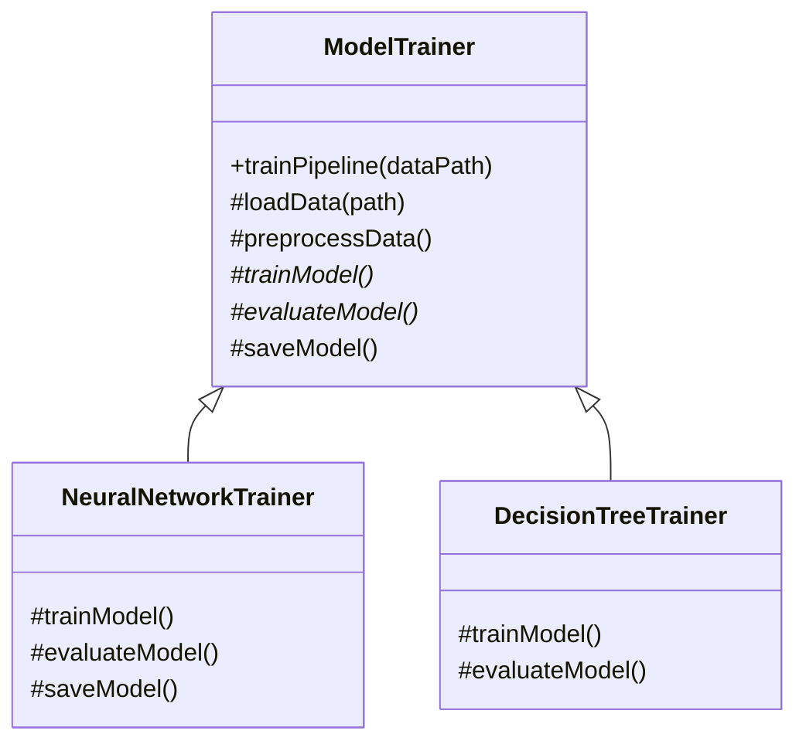
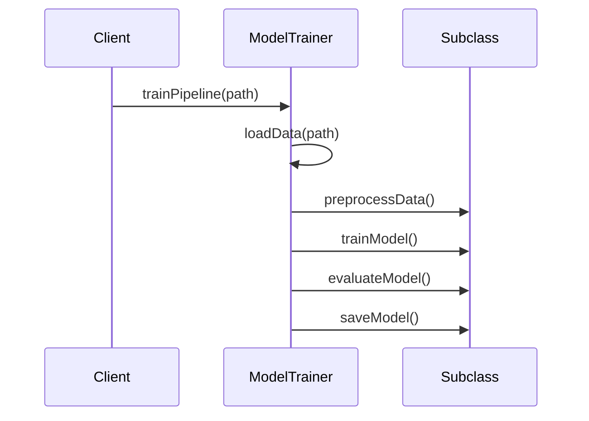

# Template Method Design Pattern — Detailed Guide

> **Behavioral Design Pattern** jo **algorithm ka skeleton** base class mein define karta hai — kuch steps **common/fixed**, kuch steps **subclasses override** karte hain. **Hollywood Principle:** _"Don't call us, we'll call you."_

**Domain example (is repo mein):** ML training pipeline — `ModelTrainer::trainPipeline()` fixed sequence; `NeuralNetworkTrainer` vs `DecisionTreeTrainer` apne `trainModel()` / `evaluateModel()` implement karte hain.

**Core problem jo solve hota hai:** **Code duplication** — har ML trainer mein same `loadData → preprocess → train → evaluate → save` repeat; ya **inconsistent order** — ek trainer evaluate pehle, train baad mein.

---

## Table of Contents

1. [Problem kya hai? (Bina Template Method)](#1-problem-kya-hai-bina-template-method)
2. [Template Method Pattern kya hai?](#2-template-method-pattern-kya-hai)
3. [Real-World Analogy](#3-real-world-analogy)
4. [Key Participants (UML Roles)](#4-key-participants-uml-roles)
5. [Fixed vs Variable Steps — Hook Methods](#5-fixed-vs-variable-steps--hook-methods)
6. [Kab use karein / Kab na karein](#6-kab-use-karein--kab-na-karein)
7. [Fayde aur Nuksan](#7-fayde-aur-nuksan)
8. [SOLID Principles se Connection](#8-solid-principles-se-connection)
9. [Folder Structure](#9-folder-structure)
10. [Code Implementation — Detailed Walkthrough](#10-code-implementation--detailed-walkthrough)
11. [Execution Flow & Expected Output](#11-execution-flow--expected-output)
12. [Architecture Diagrams](#12-architecture-diagrams)
13. [Build & Run](#13-build--run)
14. [Template Method vs Related Patterns](#14-template-method-vs-related-patterns)
15. [Interview Talking Points](#15-interview-talking-points)
16. [Summary](#16-summary)

---

## 1. Problem kya hai? (Bina Template Method)

Har trainer apna poora pipeline copy kare:

```cpp
// ❌ Duplicate skeleton in every class
class NeuralNetTrainer {
    void run() {
        loadData(); preprocess(); trainNN(); evaluateNN(); saveNN();
    }
};
class DecisionTreeTrainer {
    void run() {
        loadData(); preprocess(); trainDT(); evaluateDT(); saveDefault();
    }
};
```

| Problem | Detail |
| ------- | ------ |
| **Duplicate common steps** | `loadData`, `preprocess` har class mein |
| **Inconsistent workflow** | Ek developer order change kar de |
| **Hard to enforce sequence** | Business rule "always evaluate after train" scattered |
| **Change common step** | Sab subclasses edit |
| **Violation DRY** | Same boilerplate everywhere |

---

## 2. Template Method Pattern kya hai?

**Template Method** = base class mein **non-virtual or final sequence** + **virtual hooks** for variation.

```cpp
// ✅ Skeleton ek jagah — subclasses fill gaps
class ModelTrainer {
public:
    void trainPipeline(const string& dataPath) {
        loadData(dataPath);      // common
        preprocessData();        // overridable default
        trainModel();            // pure virtual — subclass MUST
        evaluateModel();         // pure virtual
        saveModel();             // overridable default
    }
protected:
    virtual void trainModel() = 0;
    virtual void evaluateModel() = 0;
};
```

> **Algorithm structure fixed; specific steps customizable.**

---

## 3. Real-World Analogy

### A. Recipe with Fixed Steps (Is repo)

Bake cake: **always** preheat → mix → bake → cool. Different cakes change **mix** step only.

### B. Payment Gateway (Is repo — L23)

`processPayment()` skeleton — validate → charge → receipt; backends override charge step.

### C. Unit Test Framework

`setUp()` → `runTest()` → `tearDown()` — JUnit template; you override `runTest()`.

### D. Data Mining Pipeline

Extract → Transform → Load (ETL) — same order; Transform varies by source.

### E. Game Loop

Input → Update → Render — engine fixed; game overrides Update.

---

## 4. Key Participants (UML Roles)

| Role | Is Code Mein | Responsibility |
| ---- | ------------ | -------------- |
| **Abstract Class** | `ModelTrainer` | Template method `trainPipeline()` + common + abstract steps |
| **Concrete Class A** | `NeuralNetworkTrainer` | Override `trainModel`, `evaluateModel`, `saveModel` |
| **Concrete Class B** | `DecisionTreeTrainer` | Override `trainModel`, `evaluateModel`; default `saveModel` |
| **Client** | `main()` | `ModelTrainer*` → `trainPipeline(path)` |

```
Client
  │
  ▼
ModelTrainer::trainPipeline()     ← Template Method (defines order)
  ├── loadData()                  ← concrete in base (fixed)
  ├── preprocessData()            ← virtual default (hook)
  ├── trainModel()*               ← subclass implements
  ├── evaluateModel()*            ← subclass implements
  └── saveModel()                 ← virtual default (hook)
```

---

## 5. Fixed vs Variable Steps — Hook Methods

| Step | Type in Code | Who defines |
| ---- | ------------ | ----------- |
| `loadData` | Concrete in base | Fixed for all trainers |
| `preprocessData` | `virtual` with default | Override optional |
| `trainModel` | `pure virtual` | **Must** override |
| `evaluateModel` | `pure virtual` | **Must** override |
| `saveModel` | `virtual` with default | Override optional (NN does, DT uses default) |

**Hook method:** Default implementation jo subclass **skip or replace** kar sake — `preprocessData()`, `saveModel()`.

**Note:** Production mein `trainPipeline` ko `final` mark karo taaki subclass sequence na tode (comment in code mentions this).

---

## 6. Kab use karein / Kab na karein

### ✅ Kab use karein

| Scenario | Example |
| -------- | ------- |
| **Fixed algorithm structure** | ML pipeline, payment flow, servlet lifecycle |
| **Common + variable steps** | Same order, different middle steps |
| **Subclass control specific steps only** | Framework calls you back |
| **Prevent workflow corruption** | One place owns sequence |
| **Multiple variants same process** | NN vs Decision Tree training |

### ❌ Kab na karein

| Scenario | Reason |
| -------- | ------ |
| **Algorithm structure bhi vary ho** | Strategy better — whole algorithm swap |
| **Only one implementation** | YAGNI — no base class needed |
| **Deep inheritance hierarchies** | Prefer composition + Strategy |
| **Steps need runtime reorder** | Template Method compile-time fixed |

---

## 7. Fayde aur Nuksan

### Fayde (Pros)

| Fayda | Detail |
| ----- | ------ |
| **DRY** | Common steps ek jagah |
| **Controlled invariant** | Sequence guaranteed — evaluate after train |
| **Open/Closed** | Naya trainer = nayi subclass, skeleton same |
| **Code reuse** | Default hooks (`saveModel`) shared |
| **Framework-friendly** | Base defines lifecycle, user fills hooks |

### Nuksan (Cons)

| Nuksan | Detail |
| ------ | ------ |
| **Inheritance-bound** | Variation via subclass only — rigid |
| **Growing base class** | Too many hooks → fat abstract class |
| **Less flexible than Strategy** | Can't swap whole algorithm at runtime easily |
| **Hidden dependencies** | Subclass must understand when base calls hooks |

---

## 8. SOLID Principles se Connection

### Open/Closed Principle (OCP)

`ModelTrainer` **closed** for sequence modification; **open** for new `XGBoostTrainer` subclass.

### Single Responsibility Principle (SRP)

| Class | Responsibility |
| ----- | -------------- |
| `ModelTrainer` | Define pipeline structure + common steps |
| `NeuralNetworkTrainer` | NN-specific train/evaluate/save |

### Liskov Substitution Principle (LSP)

Any `ModelTrainer*` can run `trainPipeline()` — subclass hooks satisfy contract.

### Template Method vs Strategy (DIP angle)

Template Method uses **inheritance**; Strategy uses **composition** for algorithm variation — Strategy often better for runtime swap and testing.

---

## 9. Folder Structure

```
L20 Template_Method_Pattern/
├── README.md                              ← Ye file — complete guide
└── C++ Code/
    └── TemplateMethodPattern.cpp          ← ML training pipeline demo
```

---

## 10. Code Implementation — Detailed Walkthrough

Source: [`C++ Code/TemplateMethodPattern.cpp`](./C%20%2B%2B%20Code/TemplateMethodPattern.cpp)

### 10.1 Abstract Class — `ModelTrainer`

```cpp
class ModelTrainer {
public:
    void trainPipeline(const string& dataPath) {
        loadData(dataPath);
        preprocessData();
        trainModel();
        evaluateModel();
        saveModel();
    }

protected:
    void loadData(const string& path) {
        cout << "[Common] Loading dataset from " << path << "\n";
    }

    virtual void preprocessData() {
        cout << "[Common] Splitting into train/test and normalizing\n";
    }

    virtual void trainModel() = 0;
    virtual void evaluateModel() = 0;

    virtual void saveModel() {
        cout << "[Common] Saving model to disk as default format\n";
    }
};
```

**Template Method:** `trainPipeline` — **orchestrator**; calls hooks in fixed order.

---

### 10.2 Concrete — `NeuralNetworkTrainer`

```cpp
class NeuralNetworkTrainer : public ModelTrainer {
protected:
    void trainModel() override {
        cout << "[NeuralNet] Training Neural Network for 100 epochs\n";
    }
    void evaluateModel() override {
        cout << "[NeuralNet] Evaluating accuracy and loss on validation set\n";
    }
    void saveModel() override {
        cout << "[NeuralNet] Serializing network weights to .h5 file\n";
    }
};
```

**Overrides all three** variable steps including custom save format.

---

### 10.3 Concrete — `DecisionTreeTrainer`

```cpp
class DecisionTreeTrainer : public ModelTrainer {
protected:
    void trainModel() override {
        cout << "[DecisionTree] Building decision tree with max_depth=5\n";
    }
    void evaluateModel() override {
        cout << "[DecisionTree] Computing classification report (precision/recall)\n";
    }
    // uses default preprocessData() and saveModel()
};
```

**Uses default hooks** for preprocess and save — less code duplication.

---

### 10.4 Client

```cpp
ModelTrainer* nnTrainer = new NeuralNetworkTrainer();
nnTrainer->trainPipeline("data/images/");

ModelTrainer* dtTrainer = new DecisionTreeTrainer();
dtTrainer->trainPipeline("data/iris.csv");
```

Client sirf **template method** call — internal steps base class control karta hai.

---

## 11. Execution Flow & Expected Output

### Neural Network path

| Step | Output |
| ---- | ------ |
| loadData | `[Common] Loading dataset from data/images/` |
| preprocessData | `[Common] Splitting into train/test...` |
| trainModel | `[NeuralNet] Training Neural Network for 100 epochs` |
| evaluateModel | `[NeuralNet] Evaluating accuracy and loss...` |
| saveModel | `[NeuralNet] Serializing network weights to .h5 file` |

### Decision Tree path

Uses default preprocess + save; custom train + evaluate.

### Expected Output

```
=== Neural Network Training ===
[Common] Loading dataset from data/images/
[Common] Splitting into train/test and normalizing
[NeuralNet] Training Neural Network for 100 epochs
[NeuralNet] Evaluating accuracy and loss on validation set
[NeuralNet] Serializing network weights to .h5 file

=== Decision Tree Training ===
[Common] Loading dataset from data/iris.csv
[Common] Splitting into train/test and normalizing
[DecisionTree] Building decision tree with max_depth=5
[DecisionTree] Computing classification report (precision/recall)
[Common] Saving model to disk as default format
```

---

## 12. Architecture Diagrams

### Class Diagram



### Sequence — trainPipeline()



---

## 13. Build & Run

```bash
cd "L20 Template_Method_Pattern/C++ Code"
g++ -std=c++17 -o template_demo TemplateMethodPattern.cpp
./template_demo
```

---

## 14. Template Method vs Related Patterns

| Pattern | Focus | Template Method se Farq |
| ------- | ----- | ----------------------- |
| **Strategy** | **Whole algorithm** interchangeable | TM = **fixed skeleton**; Strategy = swap entire behavior at runtime |
| **Factory Method** | **Object creation** step vary | TM = many steps in process; FM = one creation hook in template |
| **Hook vs Abstract method** | Optional vs required override | TM uses both in same skeleton |
| **State** | Behavior changes with internal state | TM structure fixed; State transitions change behavior |
| **Hollywood Principle** | Framework control | TM epitomizes — base calls subclass hooks |

### Is Repo Mein Template Method Kahan Use Hota Hai

| Project | Example |
| ------- | ------- |
| **L20 (ye folder)** | `ModelTrainer::trainPipeline()` |
| **L23 Payment Gateway** | `processPayment()` skeleton |
| **Rate Limiter** | Base class template steps |

---

## 15. Interview Talking Points

1. **One-liner:** "Template Method defines algorithm skeleton in base class; subclasses override specific steps."

2. **Hollywood Principle:** "Don't call us, we'll call you — framework invokes your hooks."

3. **vs Strategy:** "TM = inheritance, fixed order; Strategy = composition, swap whole algorithm."

4. **Hook methods:** "Default implementation optional to override — preprocessData, saveModel."

5. **Invariant enforcement:** "train always before evaluate — one place in trainPipeline."

6. **final trainPipeline:** "Mark template method final so subclass can't break sequence."

7. **Payment gateway:** "Real repo example — L23 processPayment."

8. **When not:** "If entire workflow varies — Strategy not Template Method."

---

## 16. Summary

| Pehlu | Detail |
| ----- | ------ |
| **Pattern Type** | Behavioral |
| **Core Idea** | Fixed algorithm skeleton + subclass hook overrides |
| **Is Repo ka Example** | ML `trainPipeline` — NN vs Decision Tree |
| **Main Problem Solved** | Duplicate pipeline code, inconsistent step order |
| **Key Method** | `trainPipeline()` — template method |
| **Main Fayda** | DRY common steps, enforced workflow, OCP |
| **Key File** | [`C++ Code/TemplateMethodPattern.cpp`](./C%20%2B%2B%20Code/TemplateMethodPattern.cpp) |

> **Yaad rakho:** Template Method **fixed train route** hai — sab stations (steps) same order; sirf ek station par kya hota hai (train/evaluate) train type par depend karta hai. 🚂
