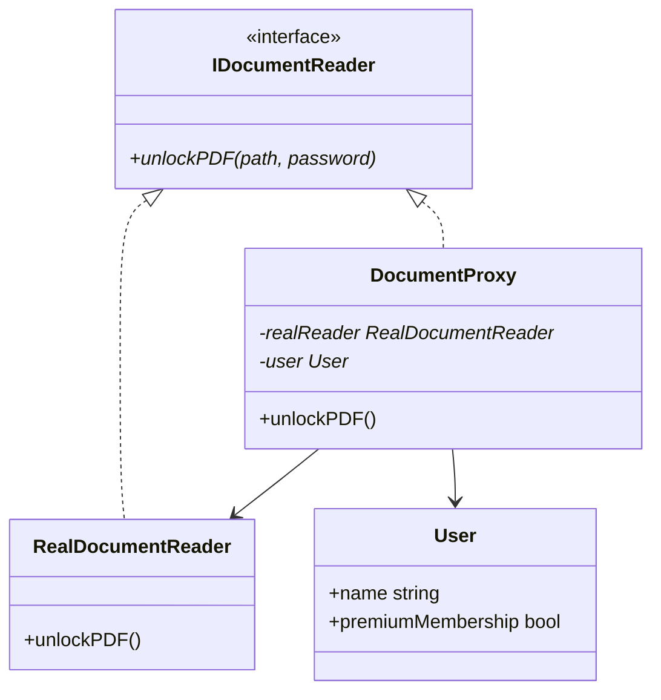
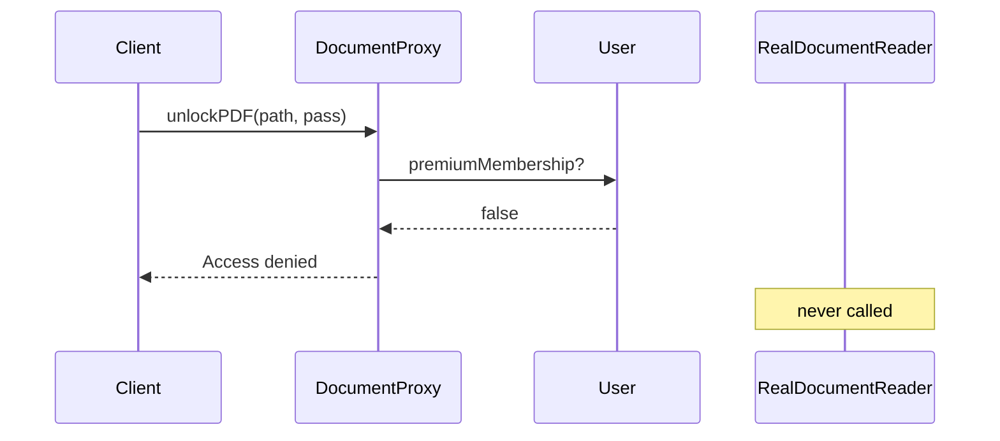
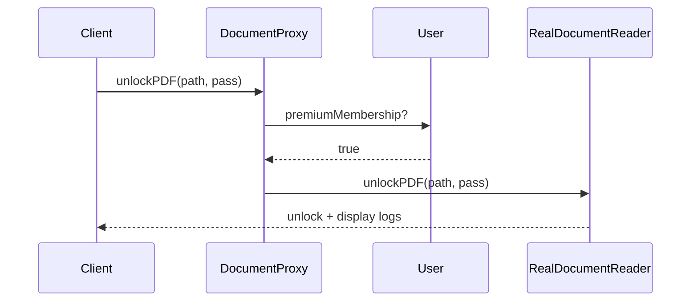

# Protection Proxy — `ProtectionProxy.cpp` (Complete Walkthrough)

> **Variant:** **Protection Proxy** — Real Subject tak pahunchne se **pehle** access check (authorization).  
> **Repo file:** [`ProtectionProxy.cpp`](./ProtectionProxy.cpp) · **Pattern hub:** [`../README.md`](../README.md)

---

## Table of Contents

1. [Ek line mein kya hai](#1-ek-line-mein-kya-hai)
2. [Problem — bina proxy ke](#2-problem--bina-proxy-ke)
3. [Solution — DocumentProxy + User](#3-solution--documentproxy--user)
4. [Class diagram](#4-class-diagram)
5. [Har class — line-by-line](#5-har-class--line-by-line)
6. [Sequence — Rohan vs Rashmi](#6-sequence--rohan-vs-rashmi)
7. [Authorization design choices](#7-authorization-design-choices)
8. [Memory & destructor](#8-memory--destructor)
9. [Production improvements](#9-production-improvements)
10. [Protection Proxy vs related patterns](#10-protection-proxy-vs-related-patterns)
11. [Real-world examples](#11-real-world-examples)
12. [Interview Q&A](#12-interview-qa)
13. [Cheat sheet](#13-cheat-sheet)
14. [Build & run](#14-build--run)

---

## 1. Ek line mein kya hai

**`DocumentProxy`** `IDocumentReader` implement karta hai. **`unlockPDF()`** se pehle **`User::premiumMembership`** check — fail → Real reader call **nahi**; pass → **`RealDocumentReader`** delegate.

---

## 2. Problem — bina proxy ke

```cpp
// ❌ Koi bhi PDF unlock kar sakta hai
IDocumentReader* reader = new RealDocumentReader();
reader->unlockPDF("protected_document.pdf", "secret123");
```

| Issue | Detail |
|-------|--------|
| **Security in wrong layer** | Har caller ko khud check karna pade |
| **Duplicated checks** | UI, API, mobile — same `if (premium)` copy-paste |
| **Real object exposed** | Client direct `RealDocumentReader` bana le |

**Real life:** Premium content — sirf subscribed users ko full video/PDF.

---

## 3. Solution — DocumentProxy + User

```
Client
  │
  ▼
DocumentProxy ──check──► User.premiumMembership?
  │                           │
  │ no                        │ yes
  ▼                           ▼
"Access denied"          RealDocumentReader.unlockPDF()
```

| Role | Class | Kaam |
|------|-------|------|
| **Subject interface** | `IDocumentReader` | `unlockPDF(path, password)` |
| **Real Subject** | `RealDocumentReader` | Actual unlock + display |
| **Protection Proxy** | `DocumentProxy` | Membership gate |
| **Context** | `User` | Who is asking (premium or not) |

---

## 4. Class diagram



---

## 5. Har class — line-by-line

### 5.1 `IDocumentReader`

```cpp
class IDocumentReader {
public:
    virtual void unlockPDF(string filePath, string password) = 0;
    virtual ~IDocumentReader() = default;
};
```

Client **interface** par depend — proxy ya real swap ho sakta hai.

---

### 5.2 `RealDocumentReader` — Real Subject

```cpp
class RealDocumentReader : public IDocumentReader {
public:
    void unlockPDF(string filePath, string password) override {
        cout << "[RealDocumentReader] Unlocking PDF at: " << filePath << "\n";
        cout << "[RealDocumentReader] PDF unlocked successfully with password: " << password << "\n";
        cout << "[RealDocumentReader] Displaying PDF content...\n";
    }
};
```

| Assumption in demo | Production |
|--------------------|------------|
| Password print (unsafe!) | Never log secrets |
| No real crypto | DRM, license server |
| Always succeeds if called | Invalid password handling |

**Key:** Real class **sirf business** — unlock + render — **no** membership logic.

---

### 5.3 `User` — security context

```cpp
class User {
public:
    string name;
    bool premiumMembership;
    
    User(string name, bool isPremium) {
        this->name = name;
        this->premiumMembership = isPremium;
    }
};
```

| Field | Use in proxy |
|-------|--------------|
| `premiumMembership` | Gate condition |
| `name` | Logging / audit (extend) |

Production mein: roles (`enum`), JWT claims, `Permission` service — same proxy idea.

---

### 5.4 `DocumentProxy` — Protection Proxy

```cpp
class DocumentProxy : public IDocumentReader {
    RealDocumentReader* realReader;
    User* user;
    
public:
    DocumentProxy(User* user) {
        realReader = new RealDocumentReader();
        this->user = user;
    }

    void unlockPDF(string filePath, string password) override {
        if (!user->premiumMembership) {
            cout << "[DocumentProxy] Access denied. Only premium members can unlock PDFs.\n";
            return;   // ← Real reader NOT called
        }
        realReader->unlockPDF(filePath, password);
    }

    ~DocumentProxy() {
        delete realReader;
    }
};
```

| Step | Behaviour |
|------|-----------|
| 1 | Proxy ctor — `RealDocumentReader` **eager** create (demo simplification) |
| 2 | `unlockPDF` — **check first** |
| 3 | Deny — early `return`, no forward |
| 4 | Allow — delegate to `realReader` |

**Protection proxy rule:** **Validate before** expensive/sensitive Real operation.

---

### 5.5 `main()` — two users

```cpp
User* user1 = new User("Rohan", false);   // Non-premium
User* user2 = new User("Rashmi", true);   // Premium

IDocumentReader* docReader = new DocumentProxy(user1);
docReader->unlockPDF("protected_document.pdf", "secret123");
delete docReader;

docReader = new DocumentProxy(user2);
docReader->unlockPDF("protected_document.pdf", "secret123");
delete docReader;
```

| User | `premiumMembership` | Result |
|------|---------------------|--------|
| Rohan | `false` | Access denied |
| Rashmi | `true` | Full unlock flow |

---

## 6. Sequence — Rohan vs Rashmi

### Rohan (denied)



### Rashmi (allowed)



### Expected output

```
== Rohan (Non-Premium) tries to unlock PDF ==
[DocumentProxy] Access denied. Only premium members can unlock PDFs.

== Rashmi (Premium) unlocks PDF ==
[RealDocumentReader] Unlocking PDF at: protected_document.pdf
[RealDocumentReader] PDF unlocked successfully with password: secret123
[RealDocumentReader] Displaying PDF content...
```

---

## 7. Authorization design choices

| Approach | Pros | Cons |
|----------|------|------|
| **Check in proxy** (this demo) | Centralized, client simple | Policy change → proxy edit |
| **Check in Real** | — | Violates SRP, hard to reuse Real |
| **Check in client** | — | Duplicated, leaky abstraction |
| **External IAM + proxy** | Scalable | More moving parts |

**Better production:**

```cpp
class IAuthService { virtual bool canUnlock(User&, string path) = 0; };
class DocumentProxy {
    IAuthService& auth;
    void unlockPDF(...) {
        if (!auth.canUnlock(*user, filePath)) return;
        realReader->unlockPDF(...);
    }
};
```

---

## 8. Memory & destructor

| Object | Owner | Cleanup |
|--------|-------|---------|
| `RealDocumentReader` | `DocumentProxy` | `~DocumentProxy` deletes |
| `User` | Client (`main`) | **Not** deleted in demo — leak |
| `DocumentProxy` | Client | `delete docReader` |

**Note:** `User*` proxy stores but doesn't own — document ownership in comments for interview.

---

## 9. Production improvements

- **Lazy RealDocumentReader** — deny path par Real na banao (Virtual + Protection combo)
- **Audit log** — `user.name`, timestamp, path on deny/allow
- **Rate limiting** — brute force password attempts
- **Role-based** — `enum class Role { Free, Premium, Admin }`
- **const correctness** — `unlockPDF` const methods where applicable

---

## 10. Protection Proxy vs related patterns

| Pattern | Difference |
|---------|------------|
| **Virtual Proxy** | Controls **when** object created |
| **Protection Proxy** | Controls **who** can invoke |
| **Decorator** | Adds features (watermark), doesn't block |
| **Bridge** | Splits abstraction/implementation axes |
| **Middleware** (web) | Same idea — auth before handler |

---

## 11. Real-world examples

| System | Protection proxy style |
|--------|------------------------|
| **File system ACL** | OS checks permission before read |
| **API Gateway** | JWT validate before microservice |
| **Smart pointers** | `shared_ptr` control block (access count) |
| **DRM video** | License check before decode |
| **Admin panels** | `@PreAuthorize` before controller method |

---

## 12. Interview Q&A

<details>
<summary><strong>Protection Proxy vs Virtual Proxy?</strong></summary>

Virtual = **lazy creation**. Protection = **access control** before forward.</details>

<details>
<summary><strong>Check proxy mein ya Real mein?</strong></summary>

Proxy mein — Real **trusted** core operation; policy **surrogate** par.</details>

<details>
<summary><strong>Rohan ke case mein RealDocumentReader bana?</strong></summary>

Haan — demo ctor mein eager `new RealDocumentReader()`. Better: lazy Real only after auth pass.</details>

<details>
<summary><strong>Same interface kyun?</strong></summary>

Client code same — test mein mock `IDocumentReader`, prod mein `DocumentProxy`.</details>

---

## 13. Cheat sheet

```
PROTECTION PROXY  = gate before Real
CHECK             user->premiumMembership (or IAM)
DENY              return early, no forward
ALLOW             realReader->unlockPDF(...)
INTERFACE         IDocumentReader
```

---

## 14. Build & run

```bash
cd "L21 Proxy_Design_Pattern/C++ Code"
g++ -std=c++17 -Wall -Wextra ProtectionProxy.cpp -o ProtectionProxy
./ProtectionProxy
```

---

⬅️ [`VirtualProxy.md`](./VirtualProxy.md) · [Pattern README](../README.md) · ➡️ [`RemoteProxy.md`](./RemoteProxy.md)
