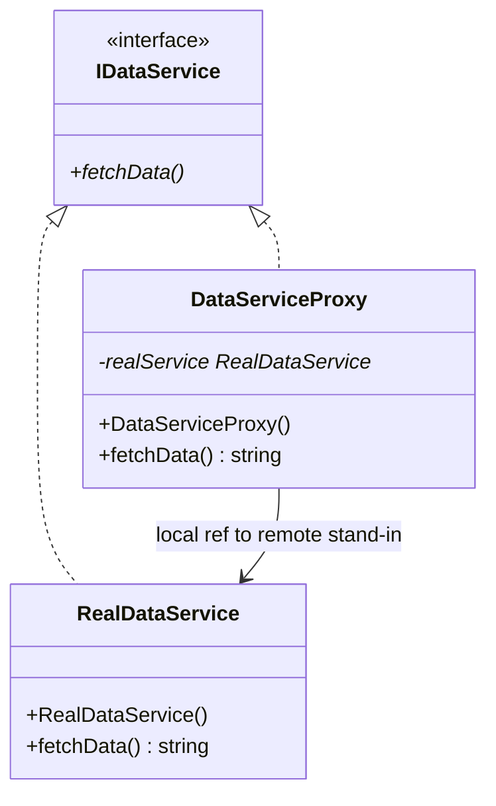
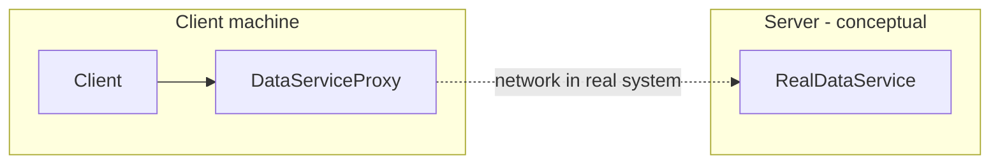
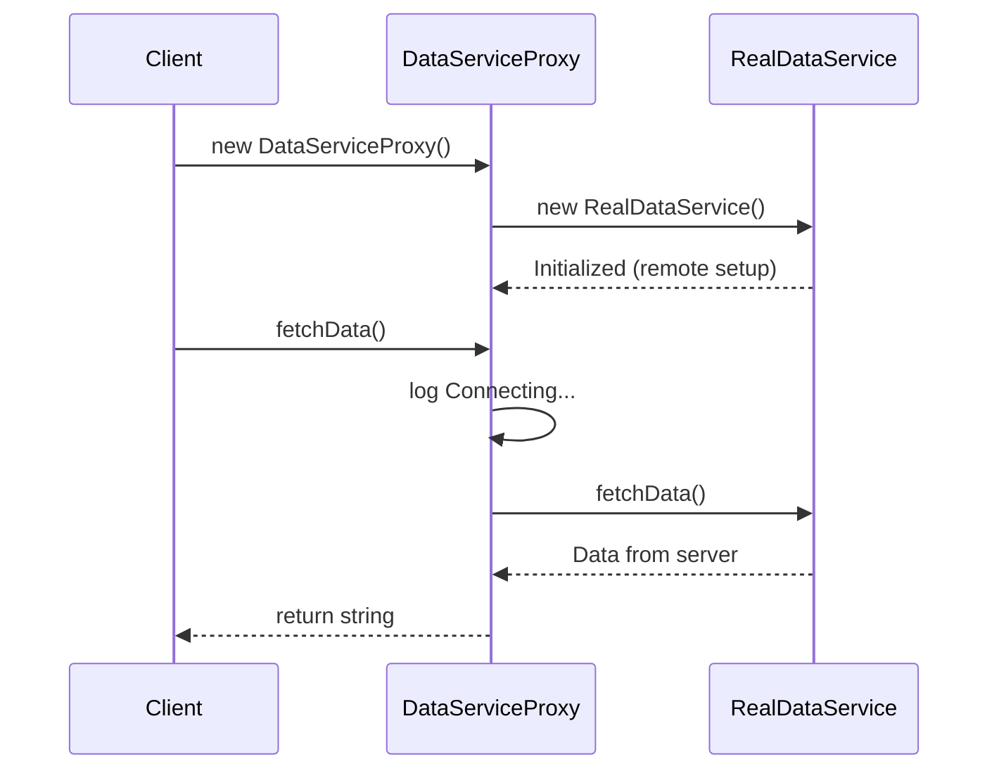

# Remote Proxy — `RemoteProxy.cpp` (Complete Walkthrough)

> **Variant:** **Remote Proxy** — client ke paas **local surrogate**; asli object **remote** (network / another address space) par ho.  
> **Repo file:** [`RemoteProxy.cpp`](./RemoteProxy.cpp) · **Pattern hub:** [`../README.md`](../README.md)

---

## Table of Contents

1. [Ek line mein kya hai](#1-ek-line-mein-kya-hai)
2. [Problem — bina proxy ke](#2-problem--bina-proxy-ke)
3. [Solution — DataServiceProxy](#3-solution--dataserviceproxy)
4. [Class diagram](#4-class-diagram)
5. [Har class — line-by-line](#5-har-class--line-by-line)
6. [Sequence — `main()` execution](#6-sequence--main-execution)
7. [True remote vs this demo](#7-true-remote-vs-this-demo)
8. [RMI / gRPC mental model](#8-rmi--grpc-mental-model)
9. [Memory & lifecycle](#9-memory--lifecycle)
10. [Production improvements](#10-production-improvements)
11. [Remote Proxy vs related patterns](#11-remote-proxy-vs-related-patterns)
12. [Real-world examples](#12-real-world-examples)
13. [Interview Q&A](#13-interview-qa)
14. [Cheat sheet](#14-cheat-sheet)
15. [Build & run](#15-build--run)

---

## 1. Ek line mein kya hai

Client **`IDataService*`** use karta hai. **`DataServiceProxy`** local object hai jo **"Connecting to remote..."** jaisa behaviour dikhata hai aur **`RealDataService`** ko delegate karta hai — real service **simulate** remote server initialization.

---

## 2. Problem — bina proxy ke

```cpp
// ❌ Client directly "remote" service
RealDataService* svc = new RealDataService();
// Client must know: connection strings, retries, serialization, server location
string data = svc->fetchData();
```

| Issue | Detail |
|-------|--------|
| **Location transparency lost** | Client tied to remote API details |
| **Network in business code** | UI layer mein socket/HTTP |
| **Hard to mock/test** | Unit test needs real server |
| **Latency exposed** | No place for local cache stub |

**Real life:** App server baat karta hai **local stub** se; stub RPC karke **data center** mein service call karta hai.

---

## 3. Solution — DataServiceProxy

```
Client (local process)
      │
      ▼
DataServiceProxy  ──"connect" log──►  RealDataService (stands in for remote server)
      │
      └── fetchData() ──delegate──► return payload
```

| Role | Class | Kaam |
|------|-------|------|
| **Subject interface** | `IDataService` | `fetchData()` |
| **Real Subject** | `RealDataService` | "Server" — heavy init + data |
| **Remote Proxy** | `DataServiceProxy` | Local stand-in, connection narrative |

---

## 4. Class diagram





---

## 5. Har class — line-by-line

### 5.1 `IDataService`

```cpp
class IDataService {
public:
    virtual string fetchData() = 0;
    virtual ~IDataService() = default;
};
```

Same interface for:
- Real remote implementation (server side)
- Proxy (client side)
- **Mock** for tests

---

### 5.2 `RealDataService` — Real Subject (remote stand-in)

```cpp
class RealDataService : public IDataService {
public:
    RealDataService() {
        cout << "[RealDataService] Initialized (simulating remote setup)\n";
    }
    string fetchData() override {
        return "[RealDataService] Data from server";
    }
};
```

| Simulated cost | Real equivalent |
|----------------|-----------------|
| Ctor log | TCP connect, TLS handshake, auth |
| `fetchData` | HTTP/RPC round-trip + DB query |

**In true remote proxy:** `RealDataService` class body **server par** chale; client par **sirf proxy** + marshalling.

---

### 5.3 `DataServiceProxy` — Remote Proxy

```cpp
class DataServiceProxy : public IDataService {
private:
    RealDataService* realService = nullptr;

public:
    DataServiceProxy() {
        realService = new RealDataService();
    }

    string fetchData() override {
        cout << "[DataServiceProxy] Connecting to remote service...\n";
        return realService->fetchData();
    }
};
```

| Line | Purpose |
|------|---------|
| Proxy ctor | Create/link to remote representation (here: local `new` for demo) |
| `Connecting...` | Cross-cutting **network layer** concern |
| `return realService->fetchData()` | Forward call, return result |

**Interview:** Remote proxy = **same interface**, **different process/machine** (conceptually).

---

### 5.4 `main()`

```cpp
int main() {
    IDataService* dataService = new DataServiceProxy();
    dataService->fetchData();
}
```

Client **never** types `RealDataService` — only proxy through interface.

---

## 6. Sequence — `main()` execution



### Expected output

```
[RealDataService] Initialized (simulating remote setup)
[DataServiceProxy] Connecting to remote service...
```

**Note:** Return string assign/display nahi — add `cout << dataService->fetchData()` to see third line.

---

## 7. True remote vs this demo

| | This repo (`RemoteProxy.cpp`) | Production remote proxy |
|---|------------------------------|-------------------------|
| **Process** | Same process, same heap | Different machine / process |
| **Communication** | Direct method call | gRPC, REST, RMI, CORBA |
| **Proxy ctor** | `new RealDataService()` | Open channel to server stub |
| **Serialization** | None | Protobuf / JSON |
| **Failure modes** | None | Timeout, retry, circuit breaker |

**Yeh file ka goal:** Pattern **structure** samjhana — local classes se remote **idea** map karna.

---

## 8. RMI / gRPC mental model

```
┌─────────────┐         ┌─────────────┐
│   Client    │         │   Server    │
│             │         │             │
│ Proxy.fetch │ ─ RPC ─►│ Real.fetch  │
│   Data()    │ ◄────── │   Data()    │
└─────────────┘         └─────────────┘
```

| Layer | Responsibility |
|-------|----------------|
| **Proxy** | Marshal args, send request, unmarshal response |
| **Skeleton / stub** | Server-side receive |
| **Real** | Business logic + DB |

C++ mein: gRPC generated `Stub` = remote proxy class.

---

## 9. Memory & lifecycle

```cpp
DataServiceProxy() {
    realService = new RealDataService();
}
// no destructor — leak if proxy destroyed
```

| Improvement | Why |
|-------------|-----|
| `unique_ptr<RealDataService>` | RAII |
| Connection pool | Reuse TCP, don't `new` per proxy |
| `shared_ptr` proxy | Multiple clients share one remote link |

---

## 10. Production improvements

| Feature | Where |
|---------|--------|
| **Retry with backoff** | Proxy `fetchData` |
| **Timeout** | Proxy before hang forever |
| **Cache** | Proxy return cached data if fresh |
| **Circuit breaker** | Stop calling dead server |
| **Observability** | Trace id in "Connecting..." log |
| **Async API** | `future<string> fetchDataAsync()` |

---

## 11. Remote Proxy vs related patterns

| Pattern | Focus |
|---------|--------|
| **Remote Proxy** | **Location** — object elsewhere |
| **Virtual Proxy** | **Time** — create later |
| **Protection Proxy** | **Permission** — who can call |
| **Adapter** | **Interface mismatch** — different API shape |
| **Facade** | **Many classes** → one simple API |

**Adapter vs Remote Proxy:**  
- Adapter = "API translate karo"  
- Remote Proxy = "same API, different location"

---

## 12. Real-world examples

| Technology | Remote proxy role |
|------------|-------------------|
| **gRPC client stub** | Generated proxy calls server |
| **Java RMI** | `Remote` interface + stub |
| **CORBA** | ORB proxy objects |
| **REST client SDK** | `HttpClient` wrapper = proxy feel |
| **Database driver** | App talks to driver; driver talks to DB server |
| **DNs / CDN** | Edge node as proxy to origin |

---

## 13. Interview Q&A

<details>
<summary><strong>Remote Proxy kya hai?</strong></summary>

Local object jo **same interface** rakhe aur calls **remote Real Subject** tak forward kare — client ko location hidden.</details>

<details>
<summary><strong>Is demo mein remote kahan hai?</strong></summary>

Conceptually `RealDataService` = server; same process mein simulate. Interview mein clearly bolo: "structure demo, production mein RPC."</details>

<details>
<summary><strong>Remote vs Virtual Proxy?</strong></summary>

Remote = **where** (address space). Virtual = **when** (lazy init). Dono combine ho sakte hain.</details>

<details>
<summary><strong>Stub vs Proxy?</strong></summary>

Often same generated class on client — GoF name "Remote Proxy"; gRPC calls it **stub**.</details>

<details>
<summary><strong>Facade remote service ke saath?</strong></summary>

Facade = simplify **many** operations. Remote Proxy = **one** remote object ka local representative.</details>

---

## 14. Cheat sheet

```
REMOTE PROXY     = local IDataService*, real work elsewhere
CLIENT           never names RealDataService
PROXY            connect log + delegate fetchData()
REAL             RealDataService (server side in real life)
THIS DEMO        same process, educational
```

---

## 15. Build & run

```bash
cd "L21 Proxy_Design_Pattern/C++ Code"
g++ -std=c++17 -Wall -Wextra RemoteProxy.cpp -o RemoteProxy
./RemoteProxy
```

**Optional — print return value:**

```cpp
cout << dataService->fetchData() << endl;
```

---

⬅️ [`ProtectionProxy.md`](./ProtectionProxy.md) · [Pattern README](../README.md) · ➡️ [`VirtualProxy.md`](./VirtualProxy.md)
