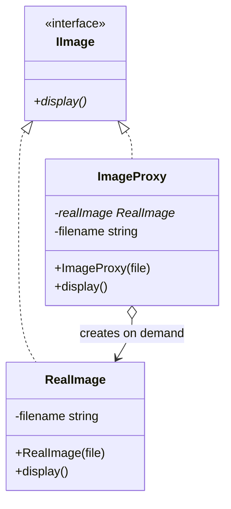
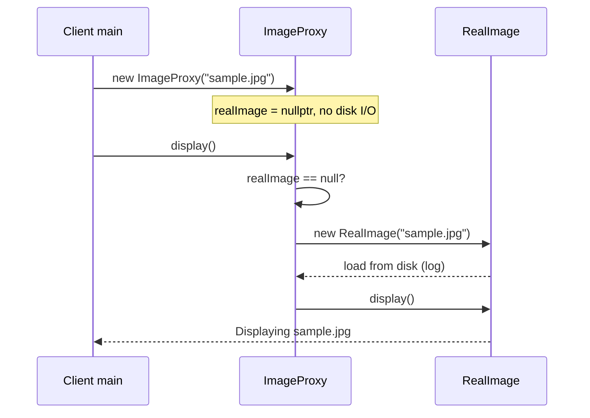

# Virtual Proxy — `VirtualProxy.cpp` (Complete Walkthrough)

> **Variant:** **Virtual Proxy** — expensive **Real Subject** ko **lazy** banate hain (pehli zarurat par).  
> **Repo file:** [`VirtualProxy.cpp`](./VirtualProxy.cpp) · **Pattern hub:** [`../README.md`](../README.md)

---

## Table of Contents

1. [Ek line mein kya hai](#1-ek-line-mein-kya-hai)
2. [Problem — bina proxy ke](#2-problem--bina-proxy-ke)
3. [Solution — ImageProxy](#3-solution--imageproxy)
4. [Class diagram](#4-class-diagram)
5. [Har class — line-by-line](#5-har-class--line-by-line)
6. [Sequence — `main()` execution](#6-sequence--main-execution)
7. [Lazy vs eager — comparison](#7-lazy-vs-eager--comparison)
8. [Memory & ownership notes](#8-memory--ownership-notes)
9. [Production improvements](#9-production-improvements)
10. [Virtual Proxy vs related patterns](#10-virtual-proxy-vs-related-patterns)
11. [Real-world examples](#11-real-world-examples)
12. [Interview Q&A](#12-interview-qa)
13. [Cheat sheet](#13-cheat-sheet)
14. [Build & run](#14-build--run)

---

## 1. Ek line mein kya hai

**Client** `IImage*` use karta hai. **`ImageProxy`** same interface implement karta hai lekin **`RealImage`** (disk se load) tab banata hai jab pehli baar **`display()`** call ho — constructor mein heavy load **nahi**.

---

## 2. Problem — bina proxy ke

```cpp
// ❌ Eager — object banate hi disk read
IImage* img = new RealImage("sample.jpg");  // LOAD abhi
// ... shayad display() kabhi na ho
```

| Issue | Detail |
|-------|--------|
| **Slow startup** | 100 thumbnails list → 100 full image loads |
| **Wasted I/O** | User sirf 2 images dekhe, baaki load waste |
| **Memory** | Saari `RealImage` objects RAM mein |

**Real life:** Gallery mein 500 photos — har ek ko full resolution mein load mat karo jab tak user click na kare.

---

## 3. Solution — ImageProxy

```
Client
  │
  ▼
ImageProxy  ──(first display())──►  new RealImage
  │                                      │
  └──────── display() ──────────────────►└── disk load + show
```

| Role | Class | Kaam |
|------|-------|------|
| **Subject interface** | `IImage` | `display()` contract |
| **Real Subject** | `RealImage` | Actual load + display |
| **Virtual Proxy** | `ImageProxy` | Defer `RealImage` creation |

---

## 4. Class diagram



---

## 5. Har class — line-by-line

### 5.1 `IImage` — common interface

```cpp
class IImage { 
public:
    virtual void display() = 0;
    virtual ~IImage() = default;
};
```

| Point | Why |
|-------|-----|
| `virtual display() = 0` | Polymorphism — client `IImage*` se call kare |
| `virtual ~IImage()` | `delete` through base pointer safe (Rule for polymorphic base) |

Client **sirf** `IImage` jaanta hai — `RealImage` ya `ImageProxy` ka farq code mein dikhe ya na dikhe.

---

### 5.2 `RealImage` — Real Subject (expensive)

```cpp
class RealImage : public IImage {
    string filename;
public:
    RealImage(string file) {
        this->filename = file;
        cout << "[RealImage] Loading image from disk: " << filename << "\n";
    }
    void display() override {
        cout << "[RealImage] Displaying " << filename << "\n";
    }
};
```

| Line / block | Meaning |
|--------------|---------|
| Constructor body | **Heavy work** simulate — file read, decode, GPU upload |
| `display()` | Cheap after load — sirf render |

**Interview line:** Real Subject = jahan **asli cost** hai (I/O, network, DB).

---

### 5.3 `ImageProxy` — Virtual Proxy

```cpp
class ImageProxy : public IImage {
    RealImage* realImage;
    string filename;
public:
    ImageProxy(string file) {
        this->filename = file;
        realImage = nullptr;   // ← abhi RealImage NAHI
    }

    void display() override {
        if (!realImage) {
            realImage = new RealImage(filename);  // ← LAZY
        }
        realImage->display();
    }
};
```

| Design choice | Effect |
|---------------|--------|
| `realImage = nullptr` in ctor | Proxy **lightweight** create |
| `if (!realImage)` | **First** `display()` → construct Real |
| Second `display()` | Reuse same `RealImage` — no reload |

**State machine:**

```
[Proxy created]  realImage == nullptr
       │ first display()
       ▼
[Real loaded]    realImage != nullptr
       │ further display()
       ▼
[Reuse Real]     same pointer
```

---

### 5.4 `main()` — client

```cpp
int main() {
    IImage* image1 = new ImageProxy("sample.jpg");
    image1->display();
}
```

Client type = **`IImage*`** — could be `RealImage` or `ImageProxy` without code change.

---

## 6. Sequence — `main()` execution



### Expected output

```
[RealImage] Loading image from disk: sample.jpg
[RealImage] Displaying sample.jpg
```

**Notice:** Load message **sirf** `display()` ke baad — proxy ctor silent (no load log in repo).

---

## 7. Lazy vs eager — comparison

| | Eager `new RealImage` | Virtual `ImageProxy` |
|---|----------------------|----------------------|
| Load timing | Constructor | First `display()` |
| Proxy ctor cost | High | Low |
| Never displayed? | Wasted load | **No load** |
| Use case | Always needed | Maybe needed |

### Extension demo (mental)

```cpp
IImage* a = new ImageProxy("a.jpg");
IImage* b = new ImageProxy("b.jpg");
// user only views a
a->display();  // only a loads
// b never display() → b's RealImage never created ✅
```

---

## 8. Memory & ownership notes

Current repo code:

```cpp
realImage = new RealImage(filename);  // raw pointer
// no delete in ImageProxy destructor → leak on proxy destroy
```

| Issue | Fix (production) |
|-------|------------------|
| Memory leak | `unique_ptr<RealImage> realImage` |
| Exception in ctor | RAII + try/catch |
| Copy proxy | Delete copy or deep copy rules |

**Improved sketch:**

```cpp
class ImageProxy : public IImage {
    unique_ptr<RealImage> realImage;
    string filename;
public:
    void display() override {
        if (!realImage)
            realImage = make_unique<RealImage>(filename);
        realImage->display();
    }
};
```

---

## 9. Production improvements

| Feature | Virtual Proxy use |
|---------|-------------------|
| **Caching proxy** | Load once, cache bitmap |
| **Copy-on-write** | Share until someone mutates |
| **Placeholder / low-res** | Show thumbnail first, swap Real on zoom |
| **Thread safety** | `mutex` around first `realImage` create |

---

## 10. Virtual Proxy vs related patterns

| Pattern | Intent | Virtual Proxy |
|---------|--------|---------------|
| **Decorator** | **Add** behaviour (border, filter) | **Control creation** — same interface, no extra features |
| **Facade** | Simplify **subsystem** | One object control, not many |
| **Factory** | **Who creates** which type | Proxy **when** expensive object created |
| **Flyweight** | **Share** intrinsic state | Proxy **defer** one heavy instance |

**Trick question:** "Proxy decorates image?"  
→ **No** — Proxy doesn't add filter; it **defers loading**. Filter = Decorator.

---

## 11. Real-world examples

| Domain | Virtual Proxy behaviour |
|--------|-------------------------|
| **OS / VM** | Page fault — memory page load on first access |
| **Hibernate / ORM** | Lazy-loaded entity — DB hit on first field access |
| **Java RMI stub** | (often combined with remote) lazy connect |
| **Game assets** | Texture load when object enters viewport |
| **Web** | Lazy-load images (`loading="lazy"`) |

---

## 12. Interview Q&A

<details>
<summary><strong>Virtual Proxy kya karta hai?</strong></summary>

Expensive Real Subject ki creation **postpone** karta hai jab tak client actually use na kare (pehli `display()`).</details>

<details>
<summary><strong>ImageProxy ctor mein load kyun nahi?</strong></summary>

Wahi virtual proxy ka point — **placeholder** cheap; Real expensive work deferred.</details>

<details>
<summary><strong>Dusri baar display() par dubara load?</strong></summary>

Nahi — `realImage` already set; sirf `RealImage::display()`.</details>

<details>
<summary><strong>Client ko proxy pata hona chahiye?</strong></summary>

Ideally **nahi** — dono `IImage`; dependency injection se proxy inject ho.</details>

<details>
<summary><strong>Factory vs Virtual Proxy?</strong></summary>

Factory: kaun sa class banega. Virtual Proxy: **same** Real class, bas **late** construction.</details>

---

## 13. Cheat sheet

```
VIRTUAL PROXY  = lazy Real Subject
INTERFACE      IImage
REAL           RealImage (heavy ctor)
PROXY          ImageProxy, realImage=null until display()
CLIENT         IImage* only
```

---

## 14. Build & run

```bash
cd "L21 Proxy_Design_Pattern/C++ Code"
g++ -std=c++17 -Wall -Wextra VirtualProxy.cpp -o VirtualProxy
./VirtualProxy
```

---

⬅️ [`ProtectionProxy.md`](./ProtectionProxy.md) · [Pattern README](../README.md) · ➡️ [`RemoteProxy.md`](./RemoteProxy.md)
