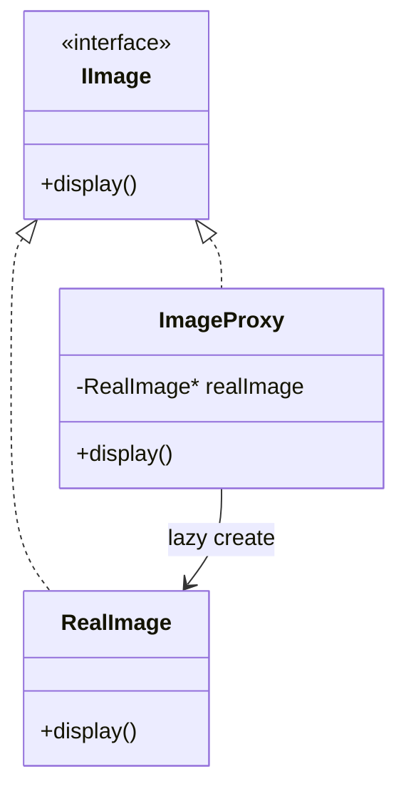
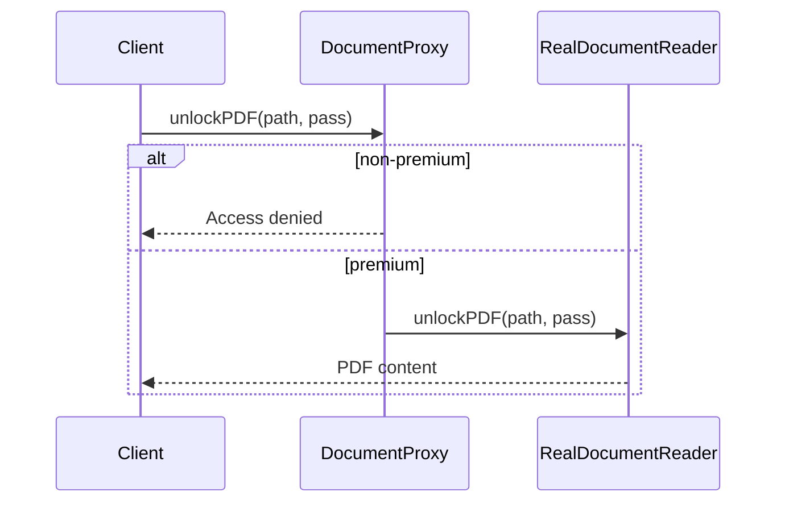

# Proxy Design Pattern — Detailed Guide

> **Structural Design Pattern** jo **Real Subject** ke liye **surrogate / placeholder** provide karta hai — **same interface** (`IImage`, `IDocumentReader`, `IDataService`) taaki client ko pata bhi na chale proxy use ho raha hai. Control **lazy loading**, **access**, ya **remote access** without changing client code.

**Domain example (is repo mein):** Teen variants — **Virtual Proxy** (lazy image), **Protection Proxy** (premium PDF), **Remote Proxy** (remote data service).

**Core problem jo solve hota hai:** Client directly heavy/sensitive/remote object use kare → **slow startup**, **no access control**, **tight coupling** to remote implementation.

---

## Table of Contents

1. [Problem kya hai? (Direct Real Object)](#1-problem-kya-hai-direct-real-object)
2. [Proxy Pattern kya hai?](#2-proxy-pattern-kya-hai)
3. [Teen Variants (Is Repo)](#3-teen-variants-is-repo)
4. [Real-World Analogy](#4-real-world-analogy)
5. [Key Participants (UML Roles)](#5-key-participants-uml-roles)
6. [Kab use karein / Kab na karein](#6-kab-use-karein--kab-na-karein)
7. [Fayde aur Nuksan](#7-fayde-aur-nuksan)
8. [SOLID Principles se Connection](#8-solid-principles-se-connection)
9. [Folder Structure](#9-folder-structure)
10. [Code Implementation — File-by-File Walkthrough](#10-code-implementation--file-by-file-walkthrough)
11. [Execution Flow & Expected Output](#11-execution-flow--expected-output)
12. [Architecture Diagrams](#12-architecture-diagrams)
13. [Build & Run](#13-build--run)
14. [Proxy vs Related Patterns](#14-proxy-vs-related-patterns)
15. [Interview Talking Points](#15-interview-talking-points)
16. [Summary](#16-summary)

---

## 1. Problem kya hai? (Direct Real Object)

Client directly real object banata / use karta hai:

```cpp
// ❌ Virtual — har image page load pe disk read
RealImage* img = new RealImage("huge.jpg");  // heavy NOW

// ❌ Protection — koi bhi PDF unlock
RealDocumentReader* reader = new RealDocumentReader();
reader->unlockPDF("secret.pdf", "pass");  // no membership check

// ❌ Remote — client remote setup details jaane
RealDataService* svc = new RealDataService();  // network init in client
```

| Problem | Detail |
| ------- | ------ |
| **Eager expensive init** | Image load even if never displayed |
| **No access control** | Security logic client ya real class mein scattered |
| **Remote complexity exposed** | Client handles connection, retries |
| **Hard to add cross-cutting** | Caching, logging — real class bloated |

---

## 2. Proxy Pattern kya hai?

**Proxy** = **same interface** as Real Subject + **controls access** to real object.

```
Client → Proxy (IImage*) → [optional] RealImage
              │
              ├─ Lazy create real object
              ├─ Check permissions
              └─ Forward / wrap remote call
```

| Property | Detail |
| -------- | ------ |
| **Interface match** | `ImageProxy` implements `IImage` like `RealImage` |
| **Transparent** | Client code `IImage*` — swap Real vs Proxy |
| **Intent** | **Control** access, not add features (Decorator) |

---

## 3. Teen Variants (Is Repo)

| Variant | File | Kya control karta hai |
| ------- | ---- | --------------------- |
| **Virtual Proxy** | `VirtualProxy.cpp` | **Lazy loading** — RealImage tab create jab `display()` |
| **Protection Proxy** | `ProtectionProxy.cpp` | **Access control** — premium user check before unlock |
| **Remote Proxy** | `RemoteProxy.cpp` | **Remote stand-in** — client local proxy, real service "remote" |

```
Virtual     →  defer expensive RealImage construction
Protection  →  gate RealDocumentReader by membership
Remote      →  DataServiceProxy wraps RealDataService (network abstraction)
```

---

## 4. Real-World Analogy

### A. Virtual Proxy — Book Index / Thumbnail

Pehle cover dikhao; poori book tab kholo jab user open kare.

### B. Protection Proxy — Bouncer at Club

Door par check — andar asli party (Real Subject) sirf allowed logon ke liye.

### C. Remote Proxy — Bank Branch vs HQ

Tum local branch (proxy) se baat karte ho; actual account HQ (remote server) par.

### D. Payment Gateway Proxy (Is repo — L23)

`PaymentGatewayProxy` — retry on failure, real gateway delegate.

### E. Smart Reference / Caching Proxy

Count references, cache results — variant not in this folder but common interview topic.

---

## 5. Key Participants (UML Roles)

| Role | Virtual | Protection | Remote |
| ---- | ------- | ---------- | ------ |
| **Subject (interface)** | `IImage` | `IDocumentReader` | `IDataService` |
| **Real Subject** | `RealImage` | `RealDocumentReader` | `RealDataService` |
| **Proxy** | `ImageProxy` | `DocumentProxy` | `DataServiceProxy` |
| **Client** | `main()` uses `IImage*` | `main()` + `User` | `main()` uses `IDataService*` |

```
Client
  │
  ▼
Subject (interface) ◄── Proxy ──► RealSubject
                         │
                         └── controls when/how RealSubject is used
```

---

## 6. Kab use karein / Kab na karein

### ✅ Kab use karein

| Scenario | Proxy type |
| -------- | ---------- |
| **Expensive object lazy load** | Virtual |
| **Access rights / auth** | Protection |
| **Remote / distributed object** | Remote |
| **Logging, caching, rate limit** | Smart proxy |
| **Client ko complexity hide** | Any |

### ❌ Kab na karein

| Scenario | Reason |
| -------- | ------ |
| **Sirf naya behavior add** | **Decorator** — intent different |
| **Interface convert karna** | **Adapter** |
| **Object creation centralize** | **Factory** |
| **Simple direct call kaafi** | Over-engineering |
| **Proxy + Real same lifetime always** | Maybe no benefit |

---

## 7. Fayde aur Nuksan

### Fayde (Pros)

| Fayda | Detail |
| ----- | ------ |
| **Lazy initialization** | Pay cost only when needed |
| **Access control** | Security at proxy boundary |
| **Location transparency** | Remote feels local |
| **Open/Closed** | Add proxy without changing client or real subject much |
| **Same interface** | Drop-in replacement for Real Subject |

### Nuksan (Cons)

| Nuksan | Detail |
| ------ | ------ |
| **Extra indirection** | One more layer — debug |
| **Latency** | Protection checks, remote hops |
| **Complexity** | Many proxy types — document which when |
| **Stale remote proxy** | Connection state management |

---

## 8. SOLID Principles se Connection

### Single Responsibility Principle (SRP)

| Class | Responsibility |
| ----- | -------------- |
| `RealImage` | Load + display image |
| `ImageProxy` | Lazy access control only |
| `DocumentProxy` | Authorization only |

### Open/Closed Principle (OCP)

Naya `CachingImageProxy` — client still `IImage*`; extend without editing `RealImage`.

### Dependency Inversion Principle (DIP)

Client depends on `IImage` / `IDocumentReader` — not concrete Real or Proxy.

### Proxy vs Decorator (SRP nuance)

Decorator **adds** responsibilities; Proxy **controls access** to one real object.

---

## 9. Folder Structure

```
L21 Proxy_Design_Pattern/
├── README.md                              ← Ye file — complete guide
└── C++ Code/
    ├── VirtualProxy.cpp                   ← Lazy image loading
    ├── ProtectionProxy.cpp                ← Premium PDF access
    └── RemoteProxy.cpp                    ← Remote data service
```

---

## 10. Code Implementation — File-by-File Walkthrough

### 10.1 Virtual Proxy — `VirtualProxy.cpp`

Source: [`C++ Code/VirtualProxy.cpp`](./C%20%2B%2B%20Code/VirtualProxy.cpp)

```cpp
class RealImage : public IImage {
public:
    RealImage(string file) {
        cout << "[RealImage] Loading image from disk: " << file << "\n";
    }
    void display() override {
        cout << "[RealImage] Displaying " << filename << "\n";
    }
};

class ImageProxy : public IImage {
    RealImage* realImage = nullptr;
    string filename;
public:
    ImageProxy(string file) : filename(file) {}

    void display() override {
        if (!realImage)
            realImage = new RealImage(filename);  // lazy
        realImage->display();
    }
};
```

**Key:** Constructor mein **load nahi** — pehli `display()` par `RealImage` create.

---

### 10.2 Protection Proxy — `ProtectionProxy.cpp`

Source: [`C++ Code/ProtectionProxy.cpp`](./C%20%2B%2B%20Code/ProtectionProxy.cpp)

```cpp
class DocumentProxy : public IDocumentReader {
    RealDocumentReader* realReader;
    User* user;
public:
    void unlockPDF(string filePath, string password) override {
        if (!user->premiumMembership) {
            cout << "[DocumentProxy] Access denied. Only premium members...\n";
            return;
        }
        realReader->unlockPDF(filePath, password);
    }
};
```

**Key:** Real reader tab call jab **authorization pass** — Rohan blocked, Rashmi allowed.

---

### 10.3 Remote Proxy — `RemoteProxy.cpp`

Source: [`C++ Code/RemoteProxy.cpp`](./C%20%2B%2B%20Code/RemoteProxy.cpp)

```cpp
class RealDataService : public IDataService {
public:
    RealDataService() {
        cout << "[RealDataService] Initialized (simulating remote setup)\n";
    }
    string fetchData() override {
        return "[RealDataService] Data from server";
    }
};

class DataServiceProxy : public IDataService {
    RealDataService* realService;
public:
    DataServiceProxy() { realService = new RealDataService(); }

    string fetchData() override {
        cout << "[DataServiceProxy] Connecting to remote service...\n";
        return realService->fetchData();
    }
};
```

**Key:** Client `DataServiceProxy` se baat karta hai — connection messaging + delegate to "remote" real service.

---

## 11. Execution Flow & Expected Output

### Virtual Proxy

```
image1 = new ImageProxy("sample.jpg")
image1->display()
  → RealImage created (disk load message)
  → display message
```

```
[RealImage] Loading image from disk: sample.jpg
[RealImage] Displaying sample.jpg
```

### Protection Proxy

| User | Result |
| ---- | ------ |
| Rohan (non-premium) | Access denied |
| Rashmi (premium) | Real unlock + display |

```
== Rohan (Non-Premium) tries to unlock PDF ==
[DocumentProxy] Access denied. Only premium members can unlock PDFs.

== Rashmi (Premium) unlocks PDF ==
[RealDocumentReader] Unlocking PDF at: protected_document.pdf
[RealDocumentReader] PDF unlocked successfully with password: secret123
[RealDocumentReader] Displaying PDF content...
```

### Remote Proxy

```
[RealDataService] Initialized (simulating remote setup)
[DataServiceProxy] Connecting to remote service...
```

---

## 12. Architecture Diagrams

### Virtual Proxy



### Protection Proxy Flow



### Proxy Types Overview

```
                    ┌─────────────┐
                    │   Client    │
                    └──────┬──────┘
                           │ Subject interface
           ┌───────────────┼───────────────┐
           ▼               ▼               ▼
    VirtualProxy   ProtectionProxy   RemoteProxy
           │               │               │
           └───────────────┴───────────────┘
                           ▼
                    Real Subject
```

---

## 13. Build & Run

Har file alag compile karo:

```bash
cd "L21 Proxy_Design_Pattern/C++ Code"

g++ -std=c++17 -o virtual_proxy_demo VirtualProxy.cpp && ./virtual_proxy_demo
g++ -std=c++17 -o protection_proxy_demo ProtectionProxy.cpp && ./protection_proxy_demo
g++ -std=c++17 -o remote_proxy_demo RemoteProxy.cpp && ./remote_proxy_demo
```

---

## 14. Proxy vs Related Patterns

| Pattern | Intent | Proxy se Farq |
| ------- | ------ | ------------- |
| **Decorator** | **Add behavior** (border, scroll) | Proxy **controls access** — same interface, different purpose |
| **Adapter** | **Convert interface** | Proxy **same** interface as subject |
| **Facade** | **Simplify subsystem** (many classes) | Proxy **one** real object stand-in |
| **Flyweight** | Share state for memory | Proxy **one instance** control, not sharing |
| **Smart pointer** | RAII, ref count | C++ idiom overlap with virtual proxy |

### Quick interview distinction

| Question | Answer |
| -------- | ------ |
| Proxy vs Decorator | Proxy = access/lazy/remote; Decorator = stack features |
| Virtual vs Protection vs Remote | Lazy init / auth / location hiding |

### Is Repo Mein Proxy Kahan Use Hota Hai

| Project | Example |
| ------- | ------- |
| **L21 (ye folder)** | Image, Document, DataService |
| **L23 Payment Gateway** | `PaymentGatewayProxy` — retry |
| **Banking LLD** | Gateway proxy layer |

---

## 15. Interview Talking Points

1. **One-liner:** "Proxy provides surrogate with same interface to control access to real object."

2. **Three types:** "Virtual = lazy; Protection = permissions; Remote = local stand-in for remote."

3. **vs Decorator:** "Proxy controls access; Decorator adds responsibilities — don't confuse intent."

4. **Virtual proxy:** "RealImage created on first display — saves startup if never shown."

5. **Protection:** "Check before forward — premium gate in proxy, not scattered in client."

6. **Transparent:** "Client uses IImage* — doesn't know proxy vs real."

7. **L23 link:** "PaymentGatewayProxy — retry wrapper in repo."

8. **Smart proxy:** "Mention caching/logging variant if asked."

---

## 16. Summary

| Pehlu | Detail |
| ----- | ------ |
| **Pattern Type** | Structural |
| **Core Idea** | Same interface surrogate — control real subject access |
| **Is Repo ka Examples** | Lazy image, premium PDF, remote data |
| **Three Variants** | Virtual, Protection, Remote |
| **Main Problem Solved** | Eager cost, missing auth, remote coupling |
| **Key Files** | [`VirtualProxy.cpp`](./C%20%2B%2B%20Code/VirtualProxy.cpp), [`ProtectionProxy.cpp`](./C%20%2B%2B%20Code/ProtectionProxy.cpp), [`RemoteProxy.cpp`](./C%20%2B%2B%20Code/RemoteProxy.cpp) |

> **Yaad rakho:** Proxy **reception desk** hai — tum same building (interface) mein jaate ho, lekin pehle desk check karta hai: visitor allowed hai? abhi andar bulana hai ya baad mein? 🚪
