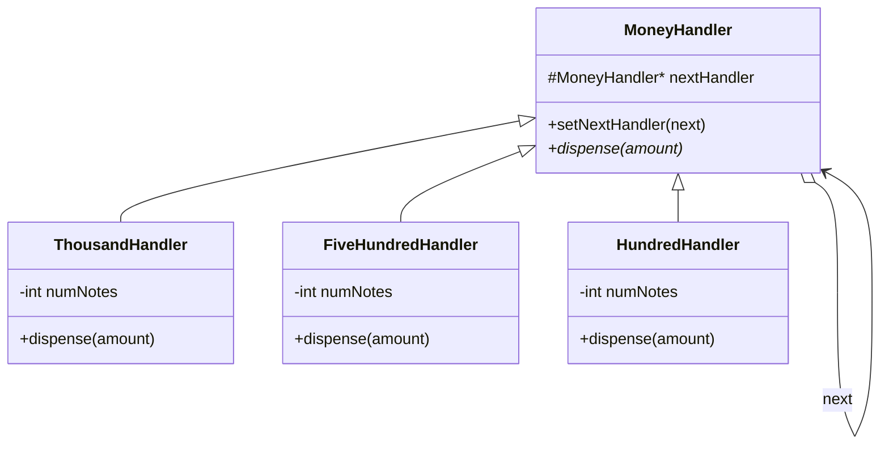
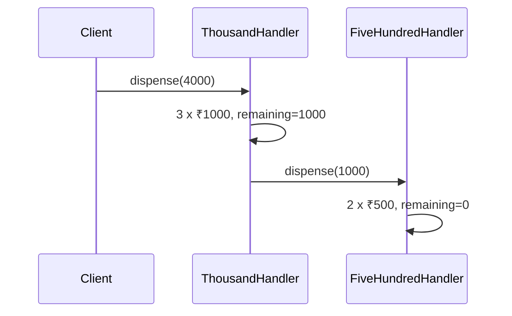

# Chain of Responsibility Design Pattern — Detailed Guide

> **Behavioral Design Pattern** jo request ko **linked handlers** ki chain se pass karta hai — har handler **kuch process karta hai** (ya nahi), phir **remaining request** next handler ko bhejta hai. Sender ko exact handler ki zaroorat nahi pata.

**Domain example (is repo mein):** ATM cash dispensing — ₹1000 → ₹500 → ₹200 → ₹100 handlers; withdraw ₹4000 → chain dispense karta hai.

**Note:** Yeh **full ATM LLD nahi** — sirf **CoR pattern demo**. Complete ATM ke liye repo mein [`ATM_LLD/`](../ATM_LLD/) dekho.

**Core problem jo solve hota hai:** **Tight coupling** sender ↔ specific handler — ya giant `if-else` / `switch` har denomination ke liye ek jagah.

---

## Table of Contents

1. [Problem kya hai? (Monolithic Dispense Logic)](#1-problem-kya-hai-monolithic-dispense-logic)
2. [Chain of Responsibility Pattern kya hai?](#2-chain-of-responsibility-pattern-kya-hai)
3. [Real-World Analogy](#3-real-world-analogy)
4. [Key Participants (UML Roles)](#4-key-participants-uml-roles)
5. [Chain Setup & Request Flow](#5-chain-setup--request-flow)
6. [Kab use karein / Kab na karein](#6-kab-use-karein--kab-na-karein)
7. [Fayde aur Nuksan](#7-fayde-aur-nuksan)
8. [SOLID Principles se Connection](#8-solid-principles-se-connection)
9. [Folder Structure](#9-folder-structure)
10. [Code Implementation — Detailed Walkthrough](#10-code-implementation--detailed-walkthrough)
11. [Execution Flow — ₹4000 Withdrawal](#11-execution-flow--4000-withdrawal)
12. [Architecture Diagrams](#12-architecture-diagrams)
13. [Build & Run](#13-build--run)
14. [Chain of Responsibility vs Related Patterns](#14-chain-of-responsibility-vs-related-patterns)
15. [Interview Talking Points](#15-interview-talking-points)
16. [Summary](#16-summary)

---

## 1. Problem kya hai? (Monolithic Dispense Logic)

Sab denomination logic ek function mein:

```cpp
// ❌ Monolithic — hard to extend, test, reorder
void dispense(int amount) {
    int n1000 = min(amount/1000, stock1000);
    amount -= n1000*1000;
    int n500 = min(amount/500, stock500);
    // ... repeat for 200, 100
    // Naya note type → poora function edit
}
```

| Problem | Detail |
| ------- | ------ |
| **Single class knows all** | ATM dispense + stock + order |
| **Hard to extend** | ₹2000 note add → central logic change |
| **Order change risky** | Chain order embedded in one method |
| **Testing** | Ek handler isolate test mushkil |
| **Sender coupled** | Client knows full algorithm |

---

## 2. Chain of Responsibility Pattern kya hai?

**Handlers** linked list ki tarah — request **pehle handler** se start, **pass along** until handled or chain ends.

```cpp
thousandHandler->setNextHandler(fiveHundredHandler);
fiveHundredHandler->setNextHandler(twoHundredHandler);
twoHundredHandler->setNextHandler(hundredHandler);

thousandHandler->dispense(4000);  // client only knows head of chain
```

| Step (per handler) | Action |
| ------------------ | ------ |
| 1 | Apni denomination se jitna ho sake dispense |
| 2 | `remainingAmount` calculate |
| 3 | Agar remaining > 0 → `nextHandler->dispense(remaining)` |
| 4 | Agar no next + remaining > 0 → error / insufficient |

> **Sender → first handler only. Chain decides rest.**

---

## 3. Real-World Analogy

### A. ATM Note Dispensing (Is repo)

₹1000 handler pehle bade notes, baaki ₹500 handler ko — assembly line.

### B. Logger Levels (Is repo — Logger LLD)

`DebugHandler` → `InfoHandler` → … → `FatalHandler` — log message chain mein process.

### C. Support Ticket Escalation

L1 → L2 → L3 — ticket tab tak pass jab tak resolve na ho.

### D. Middleware / Filters

HTTP request — auth filter → rate limit → handler — servlet chain.

### E. Event Bubbling (UI)

Click event child se parent tak propagate until koi handle kare.

---

## 4. Key Participants (UML Roles)

| Role | Is Code Mein | Responsibility |
| ---- | ------------ | -------------- |
| **Handler (abstract)** | `MoneyHandler` | `setNextHandler`, `dispense()` pure virtual |
| **Concrete Handler** | `ThousandHandler`, `FiveHundredHandler`, `TwoHundredHandler`, `HundredHandler` | Apne denomination se dispense + forward remainder |
| **Client** | `main()` | Chain link + `dispense(amount)` on head |

```
Client
  │
  ▼
ThousandHandler ──► FiveHundredHandler ──► TwoHundredHandler ──► HundredHandler
     │                      │                      │                    │
  ₹1000 notes           ₹500 notes             ₹200 notes          ₹100 notes
```

---

## 5. Chain Setup & Request Flow

### Chain construction

```cpp
MoneyHandler* thousandHandler = new ThousandHandler(3);
MoneyHandler* fiveHundredHandler = new FiveHundredHandler(5);
MoneyHandler* twoHundredHandler = new TwoHundredHandler(10);
MoneyHandler* hundredHandler = new HundredHandler(20);

thousandHandler->setNextHandler(fiveHundredHandler);
fiveHundredHandler->setNextHandler(twoHundredHandler);
twoHundredHandler->setNextHandler(hundredHandler);
```

### Per-handler algorithm (same pattern, different denomination)

```cpp
void dispense(int amount) override {
    int notesNeeded = amount / DENOMINATION;
    if (notesNeeded > numNotes) { notesNeeded = numNotes; numNotes = 0; }
    else { numNotes -= notesNeeded; }

    if (notesNeeded > 0)
        cout << "Dispensing " << notesNeeded << " x ₹" << DENOMINATION << " notes.\n";

    int remainingAmount = amount - (notesNeeded * DENOMINATION);
    if (remainingAmount > 0) {
        if (nextHandler != nullptr)
            nextHandler->dispense(remainingAmount);
        else
            cout << "Remaining amount ... cannot be fulfilled\n";
    }
}
```

**Order matters:** Bade denomination pehle — greedy approach for ATM notes.

---

## 6. Kab use karein / Kab na karein

### ✅ Kab use karein

| Scenario | Example |
| -------- | ------- |
| **Multiple handlers, sender ko exact handler nahi pata** | Logging levels, support tiers |
| **Handlers dynamically add/remove/reorder** | Filter chain |
| **Each handler single responsibility** | One denomination / one log level |
| **Request processing pipeline** | Middleware |
| **At most one handler processes fully OR partial + pass** | ATM partial dispense per step |

### ❌ Kab na karein

| Scenario | Reason |
| -------- | ------ |
| **Exactly one handler must always handle** | Direct call clearer |
| **All handlers must run** | Chain stops early — use pipeline where all steps mandatory |
| **Strict order not guaranteed needed** | Document chain order explicitly |
| **Request must return synchronously from specific handler** | Need explicit routing, not blind chain |

---

## 7. Fayde aur Nuksan

### Fayde (Pros)

| Fayda | Detail |
| ----- | ------ |
| **Loose coupling** | Client → head only |
| **Open/Closed** | Naya `TwoThousandHandler` — chain mein link, others untouched |
| **SRP per handler** | Ek class = ek denomination |
| **Dynamic chain** | Runtime reorder / skip handlers |
| **Flexible processing** | Handle part, pass rest |

### Nuksan (Cons)

| Nuksan | Detail |
| ------ | ------ |
| **No guarantee of handling** | Request chain end tak unresolved |
| **Order dependency** | Wrong chain order → wrong result |
| **Debug harder** | Kaunse handler ne kya kiya trace |
| **Duplicate structure** | Four handlers same logic — template method / parametrize possible |
| **Performance** | Long chains — linear traversal |

---

## 8. SOLID Principles se Connection

### Single Responsibility Principle (SRP)

`ThousandHandler` sirf ₹1000 notes — stock + dispense logic for that denomination.

### Open/Closed Principle (OCP)

Naya handler class add — existing handlers modify nahi (ideal case).

### Dependency Inversion Principle (DIP)

Client `MoneyHandler*` par depend — concrete `HundredHandler` nahi.

### Chain vs Composite

Composite = tree structure uniform ops; CoR = linear pass, handle or forward.

---

## 9. Folder Structure

```
L22 Chain_of_responsiblity_patten(ATM LLD)/
├── README.md                              ← Ye file — complete guide
└── C++ Code/
    └── COR.cpp                            ← ATM note dispensing chain
```

> **Full ATM LLD:** [`ATM_LLD/`](../ATM_LLD/) — accounts, PIN, transactions beyond this pattern demo.

---

## 10. Code Implementation — Detailed Walkthrough

Source: [`C++ Code/COR.cpp`](./C%20%2B%2B%20Code/COR.cpp)

### 10.1 Abstract Handler — `MoneyHandler`

```cpp
class MoneyHandler {
protected:
    MoneyHandler* nextHandler;
public:
    MoneyHandler() : nextHandler(nullptr) {}
    void setNextHandler(MoneyHandler* next) { nextHandler = next; }
    virtual void dispense(int amount) = 0;
};
```

**Chain link** — har handler ko next ka pointer.

---

### 10.2 Concrete Handler — `ThousandHandler` (example)

```cpp
class ThousandHandler : public MoneyHandler {
    int numNotes;
public:
    ThousandHandler(int numNotes) { this->numNotes = numNotes; }

    void dispense(int amount) override {
        int notesNeeded = amount / 1000;
        if (notesNeeded > numNotes) {
            notesNeeded = numNotes;
            numNotes = 0;
        } else {
            numNotes -= notesNeeded;
        }
        if (notesNeeded > 0)
            cout << "Dispensing " << notesNeeded << " x ₹1000 notes.\n";

        int remainingAmount = amount - (notesNeeded * 1000);
        if (remainingAmount > 0) {
            if (nextHandler != nullptr)
                nextHandler->dispense(remainingAmount);
            else
                cout << "Remaining amount of " << remainingAmount
                     << " cannot be fulfilled (Insufficinet fund in ATM)\n";
        }
    }
};
```

**Same pattern** for ₹500, ₹200, ₹100 — denomination value change.

---

### 10.3 Client — Chain + Withdraw

```cpp
int amountToWithdraw = 4000;
cout << "\nDispensing amount: ₹" << amountToWithdraw << endl;
thousandHandler->dispense(amountToWithdraw);
```

**Initial stock (demo):**

| Handler | Notes available |
| ------- | --------------- |
| ₹1000 | 3 |
| ₹500 | 5 |
| ₹200 | 10 |
| ₹100 | 20 |

---

## 11. Execution Flow — ₹4000 Withdrawal

| Handler | Input | Dispense | Remaining → next |
| ------- | ----- | -------- | ---------------- |
| **Thousand** | 4000 | 3 × ₹1000 = 3000 | 1000 → ₹500 handler |
| **FiveHundred** | 1000 | 2 × ₹500 = 1000 | 0 → done |

**Math check:** 3×1000 + 2×500 = 4000 ✓

### Expected Output

```

Dispensing amount: ₹4000
Dispensing 3 x ₹1000 notes.
Dispensing 2 x ₹500 notes.
```

### Failure case (conceptual)

Agar last handler ke baad bhi `remainingAmount > 0` aur `nextHandler == nullptr`:

```
Remaining amount of X cannot be fulfilled (Insufficinet fund in ATM)
```

---

## 12. Architecture Diagrams

### Class Diagram



### Sequence — ₹4000



### Chain Topology

```
┌──────────┐    next    ┌──────────┐    next    ┌──────────┐    next    ┌──────────┐
│ ₹1000 H  │ ────────► │ ₹500 H   │ ────────► │ ₹200 H   │ ────────► │ ₹100 H   │
└──────────┘            └──────────┘            └──────────┘            └──────────┘
     ▲
     │ dispense(4000)
 Client
```

---

## 13. Build & Run

```bash
cd "L22 Chain_of_responsiblity_patten(ATM LLD)/C++ Code"
g++ -std=c++17 -o cor_demo COR.cpp
./cor_demo
```

---

## 14. Chain of Responsibility vs Related Patterns

| Pattern | Focus | CoR se Farq |
| ------- | ----- | ----------- |
| **Pipeline** | **All** stages run | CoR — handler may end chain early |
| **Decorator** | Wrap + add behavior | CoR — pass to next, not wrap same object |
| **Strategy** | **One** algorithm chosen | CoR — multiple handlers may each process part |
| **Command** | Request as object — undo | CoR — routing chain |
| **Middleware** | HTTP filters | CoR classic use — same idea |

### Is Repo Mein CoR Kahan Use Hota Hai

| Project | Example |
| ------- | ------- |
| **L22 (ye folder)** | ATM note handlers |
| **Logger LLD** | Debug → Info → Warn → Error → Fatal |
| **L24 / support systems** | Escalation chains |

### vs Full ATM LLD

| This demo | Full `ATM_LLD` |
| --------- | -------------- |
| Cash dispense chain only | Account, PIN, balance, transactions |
| Pattern teaching | System design interview |

---

## 15. Interview Talking Points

1. **One-liner:** "Chain of Responsibility passes request along handler chain until someone handles it or chain ends."

2. **ATM example:** "₹1000 handler dispenses max, passes remainder to ₹500 handler."

3. **Sender decoupling:** "Client only calls head — doesn't know full chain."

4. **OCP:** "Add TwoThousandHandler — link in chain, minimal change."

5. **Order matters:** "Greedy large denominations first — chain order = algorithm."

6. **Not full ATM:** "This repo file is pattern demo; see ATM_LLD for full system."

7. **Logger link:** "Same pattern — log level handlers in Logger project."

8. **Risk:** "No handler processes — request may fall through; design fallback."

---

## 16. Summary

| Pehlu | Detail |
| ----- | ------ |
| **Pattern Type** | Behavioral |
| **Core Idea** | Linked handlers — process partial, forward remainder |
| **Is Repo ka Example** | ATM ₹1000 → ₹500 → ₹200 → ₹100 |
| **Main Problem Solved** | Monolithic dispense logic, tight sender-handler coupling |
| **Key Methods** | `setNextHandler()`, `dispense(amount)` |
| **Demo withdrawal** | ₹4000 → 3×1000 + 2×500 |
| **Key File** | [`C++ Code/COR.cpp`](./C%20%2B%2B%20Code/COR.cpp) |

> **Yaad rakho:** Chain of Responsibility **assembly line** hai — har worker apna kaam karta hai, baaki agle worker ko pass — client ko poori line yaad rakhne ki zaroorat nahi. 🏧
