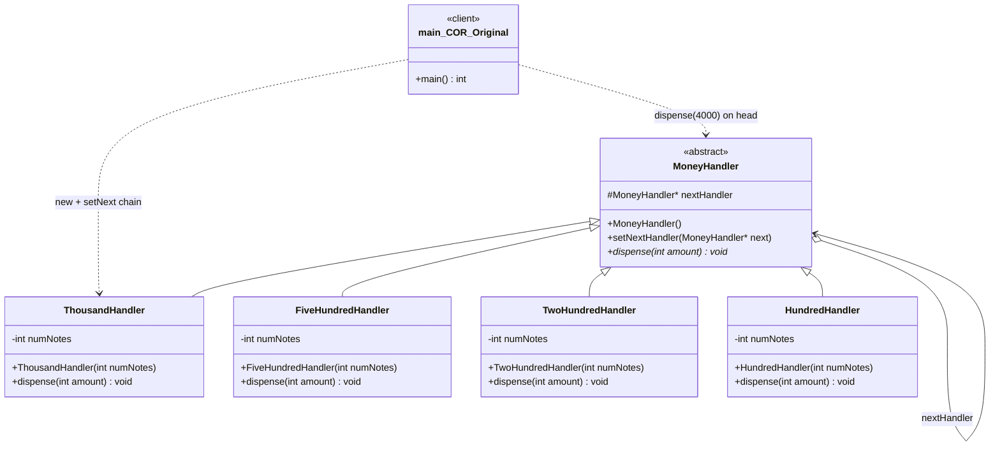
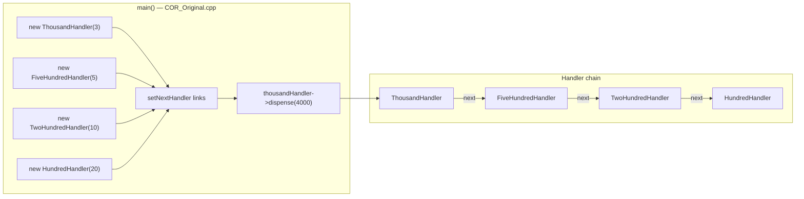
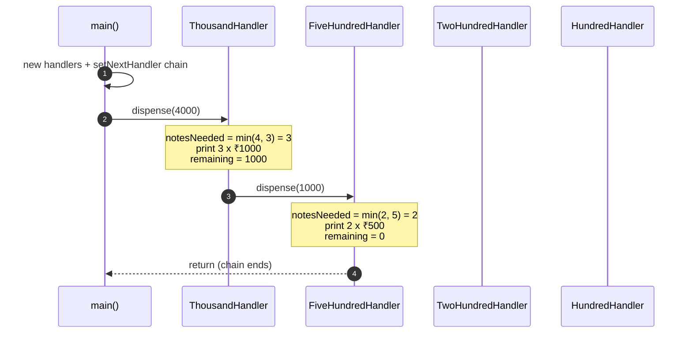
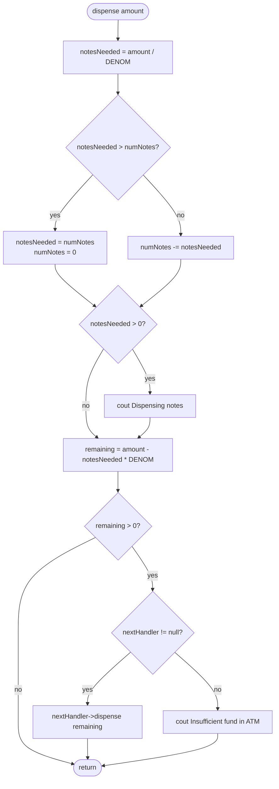
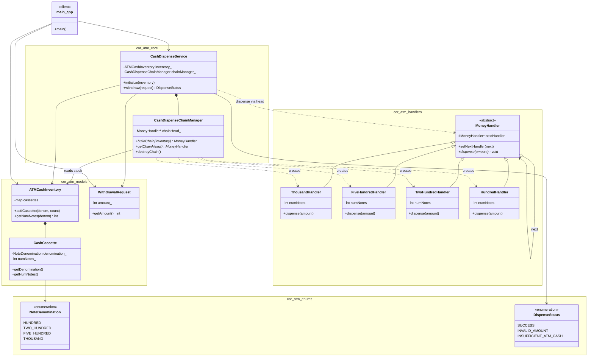
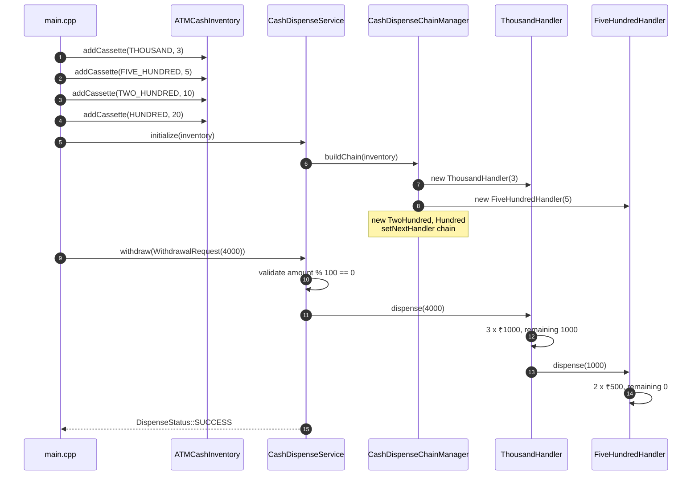
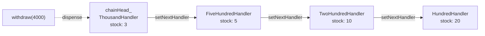
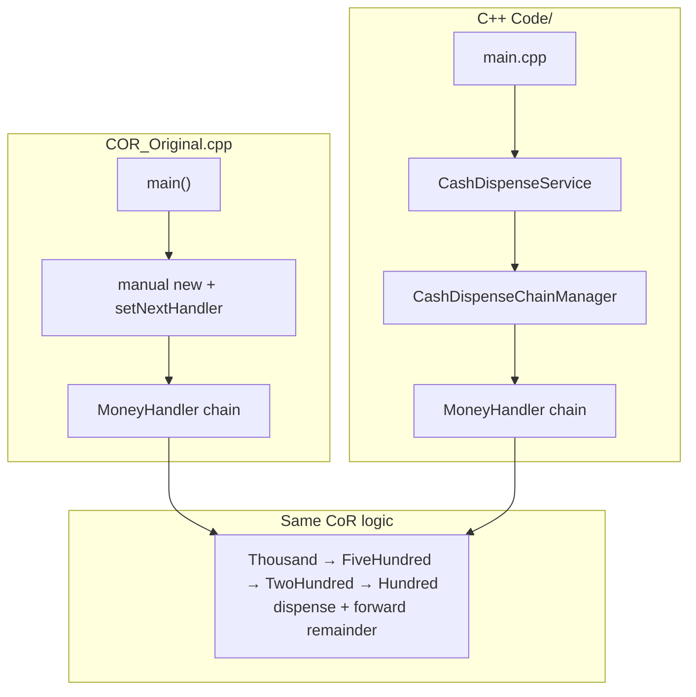

# Chain of Responsibility Design Pattern — Detailed Guide

> **Behavioral Design Pattern** jo request ko **linked handlers** ki chain se pass karta hai — har handler **kuch process karta hai** (ya nahi), phir **remaining request** next handler ko bhejta hai. Sender ko exact handler ki zaroorat nahi pata.

**Domain example (is repo mein):** **ATM Cash Dispenser** — ₹1000 → ₹500 → ₹200 → ₹100 handler chain; withdraw ₹4000 → chain dispense karta hai.

**Note:** Yeh **full ATM LLD nahi** — sirf **CoR + layered cash dispense** demo. Login, card, balance, transactions ke liye [`ATM_LLD/`](../ATM_LLD/) dekho.

**Core problem jo solve hota hai:** **Tight coupling** sender ↔ specific handler — ya giant `if-else` / `switch` har denomination ke liye ek jagah.

---

## Table of Contents

1. [Problem kya hai? (Monolithic Dispense Logic)](#1-problem-kya-hai-monolithic-dispense-logic)
2. [Chain of Responsibility Pattern kya hai?](#2-chain-of-responsibility-pattern-kya-hai)
3. [Real-World Analogy](#3-real-world-analogy)
4. [Key Participants (UML Roles)](#4-key-participants-uml-roles)
5. [Chain Setup & Request Flow](#5-chain-setup--request-flow)
6. [Kab use karein / Kab na karein](#6-kab-use-karein--kab-na-karein)
7. [Fayde aur Nuksan](#7-fayde-aur-nuksan)
8. [SOLID Principles se Connection](#8-solid-principles-se-connection)
9. [Folder Structure](#9-folder-structure)
10. [Code Implementation — Detailed Walkthrough](#10-code-implementation--detailed-walkthrough)
11. [Execution Flow — ₹4000 Withdrawal](#11-execution-flow--4000-withdrawal)
12. [Architecture Diagrams (Mermaid)](#12-architecture-diagrams-mermaid)
13. [Build & Run](#13-build--run)
14. [Chain of Responsibility vs Related Patterns](#14-chain-of-responsibility-vs-related-patterns)
15. [Interview Talking Points](#15-interview-talking-points)
16. [Summary](#16-summary)

---

## 1. Problem kya hai? (Monolithic Dispense Logic)

Sab denomination logic ek function mein:

```cpp
// ❌ Monolithic — hard to extend, test, reorder
void dispense(int amount) {
    int n1000 = min(amount/1000, stock1000);
    amount -= n1000*1000;
    int n500 = min(amount/500, stock500);
    // ... repeat for 200, 100
    // Naya note type → poora function edit
}
```

| Problem | Detail |
| ------- | ------ |
| **Single class knows all** | ATM dispense + stock + order |
| **Hard to extend** | ₹2000 note add → central logic change |
| **Order change risky** | Chain order embedded in one method |
| **Testing** | Ek handler isolate test mushkil |
| **Sender coupled** | Client knows full algorithm |

---

## 2. Chain of Responsibility Pattern kya hai?

**Handlers** linked list ki tarah — request **pehle handler** se start, **pass along** until handled or chain ends.

```cpp
thousandHandler->setNextHandler(fiveHundredHandler);
fiveHundredHandler->setNextHandler(twoHundredHandler);
twoHundredHandler->setNextHandler(hundredHandler);

thousandHandler->dispense(4000);  // client only knows head of chain
```

| Step (per handler) | Action |
| ------------------ | ------ |
| 1 | Apni denomination se jitna ho sake dispense |
| 2 | `remainingAmount` calculate |
| 3 | Agar remaining > 0 → `nextHandler->dispense(remaining)` |
| 4 | Agar no next + remaining > 0 → error / insufficient |

> **Sender → first handler only. Chain decides rest.**

---

## 3. Real-World Analogy

### A. ATM Note Dispensing (Is repo)

₹1000 handler pehle bade notes, baaki ₹500 handler ko — assembly line.

### B. Logger Levels (Is repo — Logger LLD)

`DebugHandler` → `InfoHandler` → … → `FatalHandler` — log message chain mein process.

### C. Support Ticket Escalation

L1 → L2 → L3 — ticket tab tak pass jab tak resolve na ho.

### D. Middleware / Filters

HTTP request — auth filter → rate limit → handler — servlet chain.

### E. Event Bubbling (UI)

Click event child se parent tak propagate until koi handle kare.

---

## 4. Key Participants (UML Roles)

### Pattern roles (CoR)

| Role | Is Code Mein | Responsibility |
| ---- | ------------ | -------------- |
| **Handler (abstract)** | `handlers/MoneyHandler.h` | `setNextHandler`, `dispense()` pure virtual |
| **Concrete Handler** | `ThousandHandler`, `FiveHundredHandler`, `TwoHundredHandler`, `HundredHandler` | Apne denomination se dispense + forward remainder |
| **Client** | `C++ Code/main.cpp` | Inventory setup + `CashDispenseService::withdraw()` |

### Layered LLD roles (is folder)

| Layer | File(s) | Responsibility |
| ----- | ------- | -------------- |
| **Enum** | `enums/NoteDenomination.h`, `DispenseStatus.h` | Note types, withdraw result status |
| **Model** | `CashCassette`, `ATMCashInventory`, `WithdrawalRequest` | ATM stock + request DTO |
| **Manager** | `CashDispenseChainManager` | Handler chain build/link (₹1000 → … → ₹100) |
| **Service** | `CashDispenseService` | Validation + chain head par `dispense()` |
| **Handlers** | `handlers/*.h` | CoR core — har denomination ka logic |

Mermaid diagrams: [§12.1 `COR_Original.cpp`](#121-cor_originalcpp--single-file-cor) · [§12.2 `C++ Code/`](#122-c-code--layered-modular-cor) · [§12.3 Compare](#123-dono-implementations--side-by-side)

Namespace: `cor_atm` (sab headers mein).

---

## 5. Chain Setup & Request Flow

### Chain construction (current — via Manager)

`main` manually chain link **nahi** karta — `CashDispenseChainManager::buildChain()` inventory se handlers banata aur link karta hai:

```cpp
ATMCashInventory inventory;
inventory.addCassette(NoteDenomination::THOUSAND, 3);
inventory.addCassette(NoteDenomination::FIVE_HUNDRED, 5);
// ...

CashDispenseService service;
service.initialize(inventory);           // manager chain build
service.withdraw(WithdrawalRequest(4000)); // head->dispense(amount)
```

Manager ke andar (same order as pehle):

```cpp
thousandHandler->setNextHandler(fiveHundredHandler);
fiveHundredHandler->setNextHandler(twoHundredHandler);
twoHundredHandler->setNextHandler(hundredHandler);
```

### Legacy single-file demo

Purana monolithic code (bina layers): [`COR_Original.cpp`](./COR_Original.cpp) — manual `new` + `setNextHandler` in `main`.

### Per-handler algorithm (same pattern, different denomination)

```cpp
void dispense(int amount) override {
    int notesNeeded = amount / DENOMINATION;
    if (notesNeeded > numNotes) { notesNeeded = numNotes; numNotes = 0; }
    else { numNotes -= notesNeeded; }

    if (notesNeeded > 0)
        cout << "Dispensing " << notesNeeded << " x ₹" << DENOMINATION << " notes.\n";

    int remainingAmount = amount - (notesNeeded * DENOMINATION);
    if (remainingAmount > 0) {
        if (nextHandler != nullptr)
            nextHandler->dispense(remainingAmount);
        else
            cout << "Remaining amount ... cannot be fulfilled\n";
    }
}
```

**Order matters:** Bade denomination pehle — greedy approach for ATM notes.

---

## 6. Kab use karein / Kab na karein

### ✅ Kab use karein

| Scenario | Example |
| -------- | ------- |
| **Multiple handlers, sender ko exact handler nahi pata** | Logging levels, support tiers |
| **Handlers dynamically add/remove/reorder** | Filter chain |
| **Each handler single responsibility** | One denomination / one log level |
| **Request processing pipeline** | Middleware |
| **At most one handler processes fully OR partial + pass** | ATM partial dispense per step |

### ❌ Kab na karein

| Scenario | Reason |
| -------- | ------ |
| **Exactly one handler must always handle** | Direct call clearer |
| **All handlers must run** | Chain stops early — use pipeline where all steps mandatory |
| **Strict order not guaranteed needed** | Document chain order explicitly |
| **Request must return synchronously from specific handler** | Need explicit routing, not blind chain |

---

## 7. Fayde aur Nuksan

### Fayde (Pros)

| Fayda | Detail |
| ----- | ------ |
| **Loose coupling** | Client → head only |
| **Open/Closed** | Naya `TwoThousandHandler` — chain mein link, others untouched |
| **SRP per handler** | Ek class = ek denomination |
| **Dynamic chain** | Runtime reorder / skip handlers |
| **Flexible processing** | Handle part, pass rest |

### Nuksan (Cons)

| Nuksan | Detail |
| ------ | ------ |
| **No guarantee of handling** | Request chain end tak unresolved |
| **Order dependency** | Wrong chain order → wrong result |
| **Debug harder** | Kaunse handler ne kya kiya trace |
| **Duplicate structure** | Four handlers same logic — template method / parametrize possible |
| **Performance** | Long chains — linear traversal |

---

## 8. SOLID Principles se Connection

### Single Responsibility Principle (SRP)

`ThousandHandler` sirf ₹1000 notes — stock + dispense logic for that denomination.

### Open/Closed Principle (OCP)

Naya handler class add — existing handlers modify nahi (ideal case).

### Dependency Inversion Principle (DIP)

Client `MoneyHandler*` par depend — concrete `HundredHandler` nahi.

### Chain vs Composite

Composite = tree structure uniform ops; CoR = linear pass, handle or forward.

---

## 9. Folder Structure

```
L22 Chain_of_responsiblity_patten(ATM_Cash_Dispenser LLD)/
├── README.md
├── COR_Original.cpp                       ← Purana single-file CoR demo (reference)
├── Stanbdard UML.jpeg
└── C++ Code/
    ├── main.cpp                           ← Client entry (service layer)
    ├── compile.sh
    ├── enums/
    │   ├── NoteDenomination.h             ← HUNDRED, TWO_HUNDRED, FIVE_HUNDRED, THOUSAND
    │   └── DispenseStatus.h               ← SUCCESS, INVALID_AMOUNT, INSUFFICIENT_ATM_CASH
    ├── models/
    │   ├── CashCassette.h
    │   ├── ATMCashInventory.h
    │   └── WithdrawalRequest.h
    ├── handlers/                          ← Chain of Responsibility (core pattern)
    │   ├── MoneyHandler.h
    │   ├── ThousandHandler.h
    │   ├── FiveHundredHandler.h
    │   ├── TwoHundredHandler.h
    │   └── HundredHandler.h
    ├── managers/
    │   └── CashDispenseChainManager.h     ← Chain build + ownership
    └── services/
        └── CashDispenseService.h          ← withdraw API + validation
```

| File | Kyon |
| ---- | ---- |
| `main.cpp` | Demo client — inventory + service call |
| `handlers/` | CoR pattern — har note type alag handler |
| `managers/` | Chain wiring ek jagah (client se hide) |
| `services/` | Business entry — amount validate, chain trigger |
| `COR_Original.cpp` | Pehle wala 1-file version — compare / interview |

> **Full ATM LLD:** [`ATM_LLD/`](../ATM_LLD/) — auth, account, balance, `CashDispenser` (map loop, **CoR nahi**).

---

## 10. Code Implementation — Detailed Walkthrough

Entry point: [`C++ Code/main.cpp`](./C%20%2B%2B%20Code/main.cpp)

### 10.1 Enums

```cpp
enum class NoteDenomination { HUNDRED = 100, TWO_HUNDRED = 200, FIVE_HUNDRED = 500, THOUSAND = 1000 };
enum class DispenseStatus { SUCCESS, INVALID_AMOUNT, INSUFFICIENT_ATM_CASH };
```

### 10.2 Models — inventory + request

```cpp
ATMCashInventory inventory;
inventory.addCassette(NoteDenomination::THOUSAND, 3);
inventory.addCassette(NoteDenomination::FIVE_HUNDRED, 5);
inventory.addCassette(NoteDenomination::TWO_HUNDRED, 10);
inventory.addCassette(NoteDenomination::HUNDRED, 20);

WithdrawalRequest request(4000);
```

### 10.3 Handlers (CoR core)

Source: [`handlers/MoneyHandler.h`](./C%20%2B%2B%20Code/handlers/MoneyHandler.h), [`handlers/ThousandHandler.h`](./C%20%2B%2B%20Code/handlers/ThousandHandler.h)

```cpp
class MoneyHandler {
protected:
    MoneyHandler* nextHandler;
public:
    void setNextHandler(MoneyHandler* next) { nextHandler = next; }
    virtual void dispense(int amount) = 0;
};
```

`ThousandHandler::dispense()` — amount se notes nikalo, print karo, `remaining` next handler ko bhejo (logic `COR_Original.cpp` jaisa hi).

### 10.4 Manager — chain build

[`managers/CashDispenseChainManager.h`](./C%20%2B%2B%20Code/managers/CashDispenseChainManager.h) inventory se stock leke handlers create karta aur link karta hai.

### 10.5 Service — client-facing API

```cpp
CashDispenseService dispenseService;
dispenseService.initialize(inventory);
dispenseService.withdraw(WithdrawalRequest(4000));
```

- `amount <= 0` ya `amount % 100 != 0` → `DispenseStatus::INVALID_AMOUNT`
- Chain head par `dispense(amount)` → handlers CoR run

### 10.6 Demo stock

| Denomination | Notes available |
| ------------ | --------------- |
| ₹1000 | 3 |
| ₹500 | 5 |
| ₹200 | 10 |
| ₹100 | 20 |

---

## 11. Execution Flow — ₹4000 Withdrawal

| Handler | Input | Dispense | Remaining → next |
| ------- | ----- | -------- | ---------------- |
| **Thousand** | 4000 | 3 × ₹1000 = 3000 | 1000 → ₹500 handler |
| **FiveHundred** | 1000 | 2 × ₹500 = 1000 | 0 → done |

**Math check:** 3×1000 + 2×500 = 4000 ✓

### Expected Output

```

Dispensing amount: ₹4000
Dispensing 3 x ₹1000 notes.
Dispensing 2 x ₹500 notes.
```

### Failure case (conceptual)

Agar last handler ke baad bhi `remainingAmount > 0` aur `nextHandler == nullptr`:

```
Remaining amount of X cannot be fulfilled (Insufficinet fund in ATM)
```

---

## 12. Architecture Diagrams (Mermaid)

Dono implementations ka **same CoR chain** hai — farq sirf **packaging** mein: `COR_Original.cpp` (single file) vs `C++ Code/` (layered modules).

---

### 12.1 `COR_Original.cpp` — Single-file CoR

**File:** [`COR_Original.cpp`](./COR_Original.cpp) — sab classes + `main()` ek hi translation unit.

#### Class diagram



#### Client wiring + chain (flowchart)



#### Sequence — ₹4000 withdrawal



#### Per-handler algorithm (activity)



---

### 12.2 `C++ Code/` — Layered modular CoR

**Entry:** [`C++ Code/main.cpp`](./C%20%2B%2B%20Code/main.cpp) · **Namespace:** `cor_atm`

#### Package / layer diagram

```mermaid
flowchart TB
    subgraph client["Client"]
        MAIN["main.cpp"]
    end

    subgraph service_layer["services/"]
        SVC["CashDispenseService"]
    end

    subgraph manager_layer["managers/"]
        MGR["CashDispenseChainManager"]
    end

    subgraph handler_layer["handlers/"]
        MH["MoneyHandler"]
        T["ThousandHandler"]
        F["FiveHundredHandler"]
        W["TwoHundredHandler"]
        H["HundredHandler"]
    end

    subgraph model_layer["models/"]
        INV["ATMCashInventory"]
        CAS["CashCassette"]
        REQ["WithdrawalRequest"]
    end

    subgraph enum_layer["enums/"]
        ND["NoteDenomination"]
        DS["DispenseStatus"]
    end

    MAIN --> SVC
    MAIN --> INV
    MAIN --> REQ
    SVC --> MGR
    SVC --> DS
    SVC --> REQ
    MGR --> MH
    MGR --> INV
    MGR --> T & F & W & H
    INV --> CAS
    CAS --> ND
    T & F & W & H --|extends| MH
    MH -->|nextHandler| MH
```

#### Full class diagram



#### Sequence — initialize + withdraw ₹4000



#### Handler chain state (graph)



---

### 12.3 Dono implementations — side-by-side



| | `COR_Original.cpp` | `C++ Code/` |
| --- | --- | --- |
| **Files** | 1 | 14+ headers + `main.cpp` |
| **Chain build** | `main()` manually | `CashDispenseChainManager` |
| **Withdraw API** | `head->dispense(amount)` | `CashDispenseService::withdraw()` |
| **Stock config** | handler constructors | `ATMCashInventory` + enum |
| **CoR handlers** | Same 4 classes | Same logic in `handlers/` |

---

## 13. Build & Run

```bash
cd "L22 Chain_of_responsiblity_patten(ATM_Cash_Dispenser LLD)/C++ Code"
./compile.sh          # g++ main.cpp -> cor_demo
./cor_demo
```

Manual compile:

```bash
g++ -std=c++17 -Wall -Wextra -o cor_demo main.cpp
./cor_demo
```

Purana single-file demo:

```bash
g++ -std=c++17 -o cor_original ../COR_Original.cpp
./cor_original
```

---

## 14. Chain of Responsibility vs Related Patterns

| Pattern | Focus | CoR se Farq |
| ------- | ----- | ----------- |
| **Pipeline** | **All** stages run | CoR — handler may end chain early |
| **Decorator** | Wrap + add behavior | CoR — pass to next, not wrap same object |
| **Strategy** | **One** algorithm chosen | CoR — multiple handlers may each process part |
| **Command** | Request as object — undo | CoR — routing chain |
| **Middleware** | HTTP filters | CoR classic use — same idea |

### Is Repo Mein CoR Kahan Use Hota Hai

| Project | Example |
| ------- | ------- |
| **L22 (ye folder)** | ATM note handlers |
| **Logger LLD** | Debug → Info → Warn → Error → Fatal |
| **L24 / support systems** | Escalation chains |

### vs Full ATM LLD

| This folder (`ATM_Cash_Dispenser`) | `ATM_LLD` |
| ---------------------------------- | --------- |
| **CoR** — linked `MoneyHandler` chain | **No CoR** — `CashDispenser` map loop |
| Cash dispense only | Login, card, balance, transactions |
| ₹1000 + ₹500 + ₹200 + ₹100 handlers | ₹500, ₹200, ₹100 only |
| `cout` dispense lines | `map<int,int>` notes returned |
| Pattern + layered dispense LLD | End-to-end ATM interview LLD |

---

## 15. Interview Talking Points

1. **One-liner:** "Chain of Responsibility passes request along handler chain until someone handles it or chain ends."

2. **ATM example:** "₹1000 handler dispenses max, passes remainder to ₹500 handler."

3. **Sender decoupling:** "Client only calls head — doesn't know full chain."

4. **OCP:** "Add TwoThousandHandler — link in chain, minimal change."

5. **Order matters:** "Greedy large denominations first — chain order = algorithm."

6. **Layers:** "Client → Service → Manager → Handler chain — chain wiring client se hidden."

7. **Not full ATM:** "Cash dispense + CoR only; see ATM_LLD for auth/account."

8. **Logger link:** "Same pattern — log level handlers in Logger project."

9. **Risk:** "No handler processes — request may fall through; design fallback."

---

## 16. Summary

| Pehlu | Detail |
| ----- | ------ |
| **Pattern Type** | Behavioral — Chain of Responsibility |
| **Domain** | ATM Cash Dispenser (note dispensing) |
| **Core Idea** | Linked handlers — process partial, forward remainder |
| **Layers** | enum → model → handler → manager → service → `main` |
| **Namespace** | `cor_atm` |
| **Main Problem Solved** | Monolithic dispense logic, tight sender-handler coupling |
| **Key Methods** | `setNextHandler()`, `dispense()`, `buildChain()`, `withdraw()` |
| **Demo withdrawal** | ₹4000 → 3×1000 + 2×500 |
| **Entry point** | [`C++ Code/main.cpp`](./C%20%2B%2B%20Code/main.cpp) |
| **Legacy reference** | [`COR_Original.cpp`](./COR_Original.cpp) |

> **Yaad rakho:** Chain of Responsibility **assembly line** hai — Service client ko simple rakhti hai; Manager chain banata hai; har Handler apna kaam karke baaki agle ko pass karta hai. 🏧
