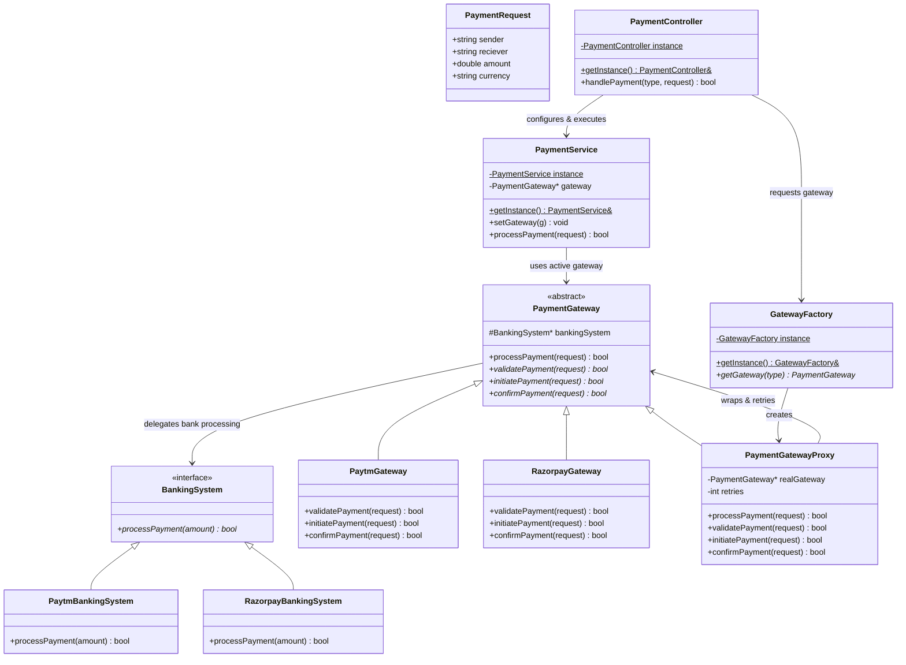

# Design Patterns in Payment Gateway System

This document provides a detailed analysis of the software design patterns implemented in the single-file **Payment Gateway System** (`PaymentGatewayApplication.cpp`).

---

## Architecture Overview

The system simulates a multi-gateway payment processing flow where client requests flow through a Controller, get routed through a unified Payment Service, and are processed by specific gateways (Paytm, Razorpay) backed by their respective banking simulators, with automatic retry mechanisms built in.



---

## 1. Strategy Pattern (Behavioral)

### Intent
Define a family of algorithms, encapsulate each one, and make them interchangeable. Strategy lets the algorithm vary independently from clients that use it.

### Usage in Code
* **Interface**: `BankingSystem` acts as the Strategy interface containing the abstract method `processPayment(double amount)`.
* **Concrete Strategies**: `PaytmBankingSystem` and `RazorpayBankingSystem` implement specific banking channels (each simulating different success rates: 70% and 80% respectively).
* **Context**: `PaymentGateway` holds a reference to `BankingSystem` (via the `bankingSystem` pointer) and delegates the bank-specific payment execution to it inside `initiatePayment`.

> [!NOTE]
> By using Strategy Pattern, the payment gateway code does not hardcode the bank-specific APIs. If we need to connect Paytm to an alternate bank endpoint tomorrow, we just swap the concrete `BankingSystem` strategy object without changing the `PaymentGateway` interface or implementation.

---

## 2. Template Method Pattern (Behavioral)

### Intent
Define the skeleton of an algorithm in an operation, deferring some steps to subclasses. Template Method lets subclasses redefine certain steps of an algorithm without changing the algorithm's structure.

### Usage in Code
* **Abstract Base**: `PaymentGateway` defines the template method `processPayment(PaymentRequest *request)`.
* **The Template Method**:
  ```cpp
  virtual bool processPayment(PaymentRequest *request) {
    if (!validatePayment(request)) return false; // Step 1
    if (!initiatePayment(request)) return false;  // Step 2
    if (!confirmPayment(request)) return false;   // Step 3
    return true;
  }
  ```
* **Concrete Implementations**: `PaytmGateway` and `RazorpayGateway` override the abstract steps:
  * `validatePayment()` (e.g., Paytm requires INR currency, Razorpay is multi-currency)
  * `initiatePayment()` (triggers their respective banking strategy)
  * `confirmPayment()` (simulates transaction confirmation logging)

> [!IMPORTANT]
> The overall sequence of validation $\rightarrow$ initiation $\rightarrow$ confirmation is strictly locked in the base class. Concrete gateways cannot bypass validation or change the execution sequence.

---

## 3. Proxy Pattern (Structural)

### Intent
Provide a surrogate or placeholder for another object to control access to it, or to add behavior transparently.

### Usage in Code
* **Subject Interface**: `PaymentGateway` serves as the common interface for both the proxy and the real gateway.
* **Real Subject**: `PaytmGateway` and `RazorpayGateway`.
* **Proxy**: `PaymentGatewayProxy` wraps a real gateway pointer. It overrides the `processPayment` method to implement a **Retry Loop** (3 retries for Paytm, 5 retries for Razorpay):
  ```cpp
  bool processPayment(PaymentRequest *request) override {
    bool result = false;
    for (int attempt = 0; attempt < retries; attempt++) {
      // pre-processing / logging
      result = realGateway->processPayment(request); // delegation
      if (result) break;
    }
    // post-processing / logging
    return result;
  }
  ```

> [!TIP]
> The Client (represented by `PaymentService`) doesn't even know it's interacting with a proxy; it simply calls `processPayment()` on a `PaymentGateway*` pointer, achieving transparent retry resilience.

---

## 4. Simple Factory Pattern (Creational)

### Intent
Define an interface for creating an object, but let subclasses or helper methods encapsulate the instantiation logic.

### Usage in Code
* **Factory Class**: `GatewayFactory`.
* **Creation Logic**: The `getGateway(GatewayType type)` method accepts an enum parameter and creates the corresponding gateway.
* **Configuration Coupling**: It encapsulates not just instantiation, but also structural configuration—specifically wrapping the raw gateways into proxies with specific retry configurations:
  ```cpp
  PaymentGateway *getGateway(GatewayType type) {
    if (type == GatewayType::PAYTM) {
      return new PaymentGatewayProxy(new PaytmGateway(), 3);
    } else {
      return new PaymentGatewayProxy(new RazorpayGateway(), 5);
    }
  }
  ```

---

## 5. Singleton Pattern (Creational)

### Intent
Ensure a class only has one instance, and provide a global point of access to it.

### Usage in Code
* **Classes**: `GatewayFactory`, `PaymentService`, and `PaymentController` are implemented as singletons.
* **Implementation Details**:
  * Private constructor to prevent direct instantiation.
  * Deleted copy constructor (`= delete`) and assignment operator (`= delete`) to prevent duplication.
  * Static member `instance` and static `getInstance()` method.
  ```cpp
  class PaymentController {
  private:
    static PaymentController instance;
    PaymentController() {}
    PaymentController(const PaymentController &) = delete;
    PaymentController &operator=(const PaymentController &) = delete;
  public:
    static PaymentController &getInstance() { return instance; }
  };
  ```

> [!WARNING]
> While Singletons simplify global configuration states (like setting the active gateway on `PaymentService`), they should be used carefully in multi-threaded production systems to avoid race conditions.

---

## Design Pattern Summary Matrix

| Design Pattern | Category | Role in this System | Key Class / Method |
|---|---|---|---|
| **Strategy** | Behavioral | Decouple gateways from specific low-level bank simulator integrations. | `BankingSystem` & derivatives |
| **Template Method** | Behavioral | Define the invariant workflow of payments (Validate $\rightarrow$ Initiate $\rightarrow$ Confirm). | `PaymentGateway::processPayment()` |
| **Proxy** | Structural | Intercept payment processing calls to transparently execute automatic retry logic on failures. | `PaymentGatewayProxy` |
| **Simple Factory** | Creational | Centralize and hide the complexity of instantiating gateways and configuring their proxies. | `GatewayFactory::getGateway()` |
| **Singleton** | Creational | Maintain single instances of controllers, factories, and pipeline engines. | `getInstance()` in Factory, Service, Controller |
