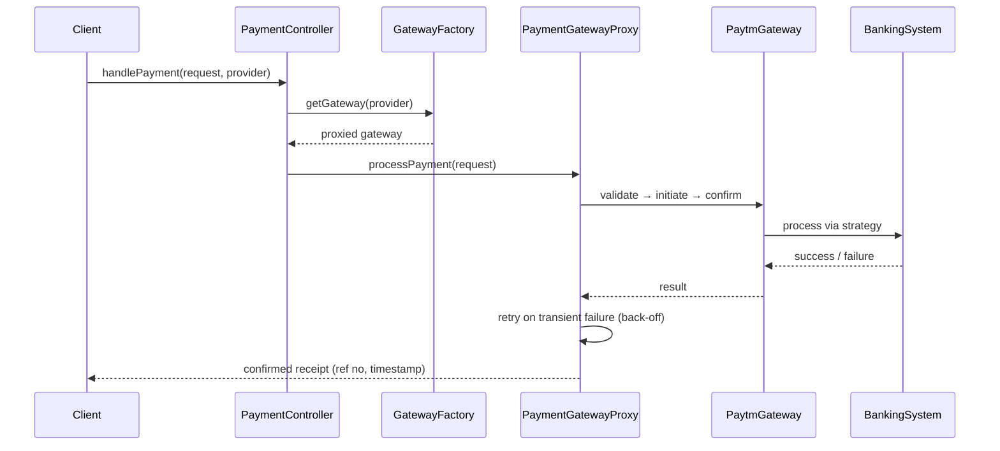

# Payment Gateway LLD (Multi-Gateway Router)

Interview-grade **payment gateway platform** in C++17 — routes a unified checkout request through multiple providers (Paytm, Razorpay, PayPal) with provider-specific validation, pluggable retry/back-off, subscriptions, and a single controller API.

> **UML diagrams:** [Class + Sequence diagrams (Section 37)](../docs/SYSTEM_CLASS_AND_SEQUENCE_DIAGRAMS.md#37-payment-gateway-multi-gateway--l23)
> **Razorpay-only lifecycle** (orders, capture, webhooks, refunds): see [`Razorpay_LLD/`](../Razorpay_LLD/).

---

## Folder Structure

```
L23 Payment_gateway_system_LLD/
├── controllers/        # PaymentController — single handlePayment() entry point
├── core/               # PaymentService — orchestration + Singleton access
├── gateways/           # PaymentGateway (Template Method) + Paytm / Razorpay / PayPal
├── banking/            # BankingSystem strategies (provider-specific processing)
├── proxy/              # PaymentGatewayProxy — retry wrapper
├── retry/              # Retry strategies — linear + exponential back-off
├── factories/          # GatewayFactory — creates proxied gateways
├── models/             # PaymentRequest, subscription models
├── enums/              # PaymentStatus, gateway/currency enums
├── utils/              # helpers
├── C++ Original Code/  # legacy monolithic reference (preserved)
├── compile.sh
├── main.cpp
├── problem_statement.md
└── requirements.md
```

---

## Design Patterns

| Pattern | Class | Why |
|---------|-------|-----|
| **Template Method** | `PaymentGateway::processPayment()` | Fixed validate → initiate → confirm skeleton; providers override steps |
| **Strategy** | `BankingSystem`, retry back-off | Swap banking backend and retry policy (linear / exponential) |
| **Proxy** | `PaymentGatewayProxy` | Adds retry on transient failure without touching gateway code |
| **Factory** | `GatewayFactory` | Creates provider gateways already wrapped in the retry proxy |
| **Singleton** | `PaymentController` / `PaymentService` / factory | One shared entry point and registry |

---

## Payment Flow



---

## Build & Run

```bash
cd "L23 Payment_gateway_system_LLD"
./compile.sh
./payment_gateway_app
```

---

## Demo Scenarios (`main.cpp`)

| Demo | What it shows |
|------|----------------|
| **Paytm UPI** | Payer/payee names, source/destination UPI IDs, timestamp, unique reference number |
| **Razorpay** | Bank account numbers, completion timestamp, unique payment ID |
| **PayPal** | Wallet emails, international currency validation (USD/EUR/GBP), unique transaction ID |
| **Retry** | Linear vs exponential back-off on transient failure |
| **Subscriptions** | Register, run a billing cycle through the gateway flow, cancel |

---

## Interview Talking Points

1. **Why Template Method for the gateway?** — The validate → initiate → confirm order is fixed; only the per-provider steps vary.
2. **Why a Proxy for retry?** — Retry is a cross-cutting concern; the proxy keeps it out of every gateway implementation.
3. **Strategy for back-off** — Linear vs exponential is selected at runtime, no `if/else` ladder in the caller.
4. **Adding a provider** — New gateway subclass + factory entry; controller/service untouched (OCP).
5. **Extensions** — Idempotency keys, webhooks, partial refunds (see [`Razorpay_LLD/`](../Razorpay_LLD/)), fraud checks.

---

## Related Docs

- [Problem Statement](./problem_statement.md) · [Requirements](./requirements.md)
- [Razorpay single-gateway lifecycle](../Razorpay_LLD/)
- [GPay LLD](../GPay_LLD/) · [Pattern map](../docs/PROJECT_DESIGN_PATTERNS.md)
- [All System Diagrams (§37)](../docs/SYSTEM_CLASS_AND_SEQUENCE_DIAGRAMS.md#37-payment-gateway-multi-gateway--l23)
