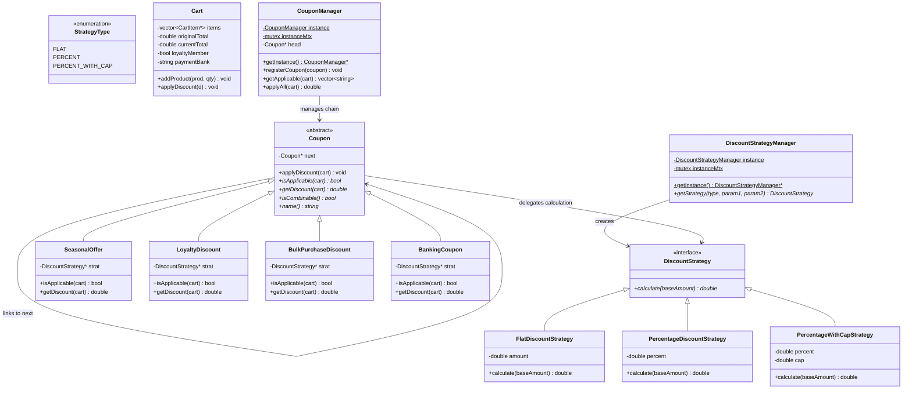

# Design Patterns in Discount Coupon Engine

This document provides a detailed analysis of the software design patterns implemented in the single-file **Discount Coupon Engine** (`DiscountCoupon.cpp`).

---

## Architecture Overview

The system processes client orders via a `Cart` and evaluates a chain of registered discount coupons. Each coupon uses specialized mathematical calculations to deduct amounts from the cart's running total.



---

## 1. Chain of Responsibility Pattern (CoR) (Behavioral)

### Intent
Avoid coupling the sender of a request to its receiver by giving more than one object a chance to handle the request. Chain the receiving objects and pass the request along the chain until an object handles it.

### Usage in Code
* **Handler Base Class**: `Coupon` maintains a pointer to `next` (the next handler node). It exposes `applyDiscount(Cart *cart)` which:
  1. Checks if the coupon is applicable to the cart (`isApplicable`).
  2. Calculates and applies the discount (`getDiscount` $\rightarrow$ `cart->applyDiscount`).
  3. Halts execution if the coupon is marked exclusive/non-combinable (`!isCombinable()`).
  4. Delegates to `next->applyDiscount(cart)` if it exists.
* **Concrete Handlers**: `SeasonalOffer`, `LoyaltyDiscount`, `BulkPurchaseDiscount`, and `BankingCoupon` override coupon validation rules and custom discount targets.
* **Client/Orchestrator**: `CouponManager` registers nodes into the chain list and triggers the sequence.

> [!IMPORTANT]
> The **evaluation order** matches the registration order. Because of compounding (each coupon reduces `currentTotal` which serves as the base for the next), the registration order determines the final checkout price.

---

## 2. Strategy Pattern (Behavioral)

### Intent
Define a family of algorithms, encapsulate each one, and make them interchangeable. Strategy lets the algorithm vary independently from clients that use it.

### Usage in Code
* **Strategy Interface**: `DiscountStrategy` defines the signature `calculate(double baseAmount)`.
* **Concrete Strategies**:
  * `FlatDiscountStrategy` (Deducts a fixed cash amount, bounded by total).
  * `PercentageDiscountStrategy` (Deducts a standard percentage value).
  * `PercentageWithCapStrategy` (Deducts percentage with an upper bound limit cap).
* **Context**: Each concrete coupon object holds a pointer `DiscountStrategy *strat` as a member. The coupon delegates mathematical deduction calculations to its strategy object.

> [!NOTE]
> Separating Coupon eligibility (`isApplicable`) from the mathematical logic (`DiscountStrategy`) keeps Coupon classes clean and makes adding new discount math extremely simple.

---

## 3. Singleton Pattern (Creational)

### Intent
Ensure a class only has one instance, and provide a global point of access to it.

### Usage in Code
* **Classes**: `CouponManager` and `DiscountStrategyManager` are Singletons.
* **Thread-Safety via Double-Checked Locking (DCL)**:
  To prevent race conditions in multi-threaded environments, they utilize Double-Checked Locking:
  ```cpp
  static CouponManager *getInstance() {
    if (!instance) { // 1st Check (Lock-Free optimization)
      lock_guard<mutex> lock(instanceMtx); // Lock Acquisition
      if (!instance) { // 2nd Check (Safety under concurrent race)
        instance = new CouponManager();
      }
    }
    return instance;
  }
  ```

---

## 4. Simple Factory Pattern (Creational)

### Intent
Encapsulate object creation logic in a single centralized method so that clients do not depend directly on concrete classes.

### Usage in Code
* **Factory Class**: `DiscountStrategyManager` acts as the strategy factory.
* **Creation Interface**: The method `getStrategy(StrategyType type, double param1, double param2)` maps an enum parameter to the instantiation of concrete strategies:
  ```cpp
  DiscountStrategy *getStrategy(StrategyType type, double param1, double param2 = 0.0) const {
    if (type == StrategyType::FLAT) {
      return new FlatDiscountStrategy(param1);
    }
    if (type == StrategyType::PERCENT) {
      return new PercentageDiscountStrategy(param1);
    }
    if (type == StrategyType::PERCENT_WITH_CAP) {
      return new PercentageWithCapStrategy(param1, param2);
    }
    return nullptr;
  }
  ```

---

## Design Pattern Summary Matrix

| Design Pattern | Category | Role in this System | Key Class / Method |
|---|---|---|---|
| **Chain of Responsibility** | Behavioral | Sequentially evaluate and apply multiple coupons on a cart, supporting exclusive coupons early-exit. | `Coupon` / `Coupon::applyDiscount()` |
| **Strategy** | Behavioral | Decouple mathematical discount calculations (Flat, %, Capped) from coupon rule definitions. | `DiscountStrategy` / `calculate()` |
| **Singleton** | Creational | Guarantee a single central manager registry instance for coupons and strategies, utilizing DCL. | `getInstance()` with `std::mutex` |
| **Simple Factory** | Creational | Hide concrete strategy implementation classes from coupon creators. | `DiscountStrategyManager::getStrategy()` |
