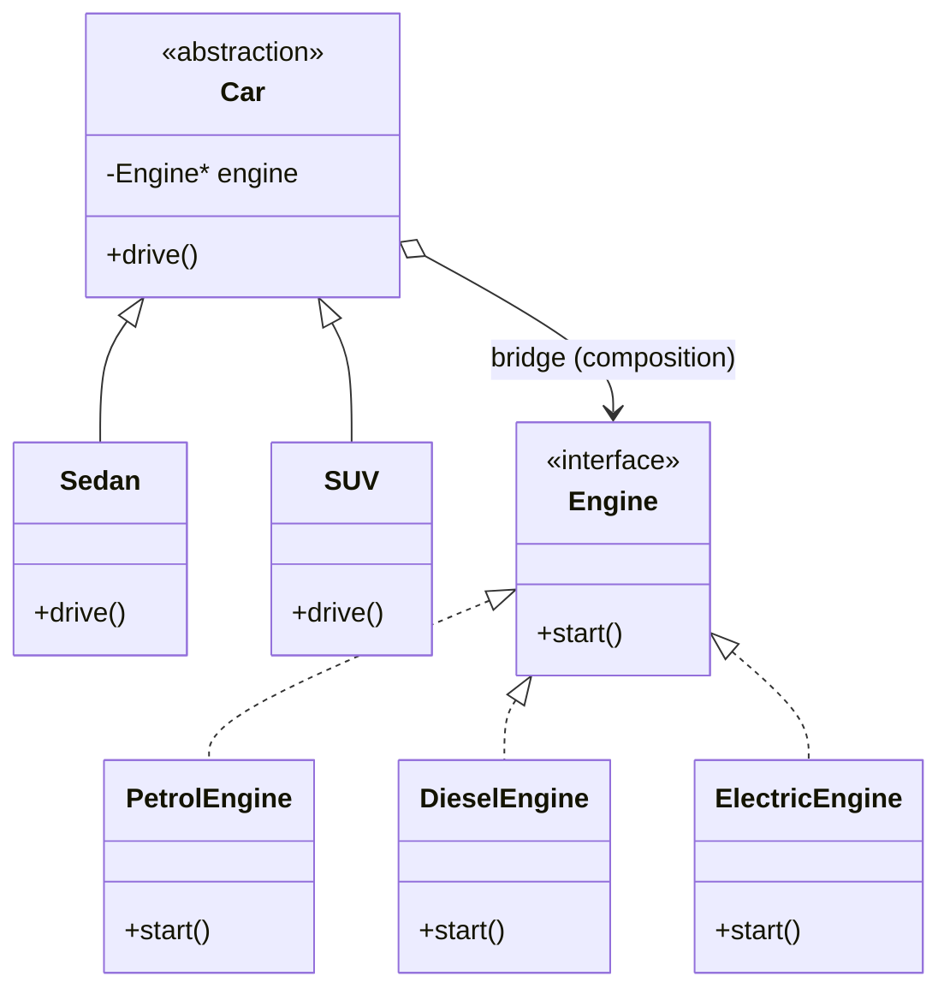

# Bridge Design Pattern — Detailed Guide

> **Structural Design Pattern** that splits an **abstraction** (e.g. car type) and its **implementation** (e.g. engine) into **two independent hierarchies**, connected by **composition** (`Car` holds an `Engine*`). This lets both sides vary independently and avoids the **class explosion** of `SedanPetrolCar`, `SUVDieselCar`, and so on.

**Domain example (in this repo):** `Sedan` / `SUV` (abstractions) × `PetrolEngine` / `DieselEngine` / `ElectricEngine` (implementations) — any pairing is composed at runtime.

**Core problem it solves:** **Cartesian-product inheritance** — 2 car types × 3 engines would otherwise need 6 subclasses, and every new engine multiplies them again.

---

## Table of Contents

1. [Problem — Inheritance Explosion](#1-problem--inheritance-explosion)
2. [What is the Bridge Pattern?](#2-what-is-the-bridge-pattern)
3. [Real-World Analogy](#3-real-world-analogy)
4. [Key Participants (UML Roles)](#4-key-participants-uml-roles)
5. [When to Use / When to Avoid](#5-when-to-use--when-to-avoid)
6. [Pros and Cons](#6-pros-and-cons)
7. [SOLID Principles Connection](#7-solid-principles-connection)
8. [Folder Structure](#8-folder-structure)
9. [Code Walkthrough](#9-code-walkthrough)
10. [Execution Flow & Expected Output](#10-execution-flow--expected-output)
11. [Architecture Diagrams](#11-architecture-diagrams)
12. [Build & Run](#12-build--run)
13. [Bridge vs Related Patterns](#13-bridge-vs-related-patterns)
14. [Interview Talking Points](#14-interview-talking-points)
15. [Summary](#15-summary)

---

## 1. Problem — Inheritance Explosion

When you model two independent dimensions with inheritance alone, every combination becomes a class:

```cpp
// ❌ One class per (car type × engine type)
class SedanPetrolCar   : public Sedan { ... };
class SedanDieselCar   : public Sedan { ... };
class SedanElectricCar : public Sedan { ... };
class SUVPetrolCar     : public SUV   { ... };
class SUVDieselCar     : public SUV   { ... };
class SUVElectricCar   : public SUV   { ... };
// 2 × 3 = 6 classes — add HybridEngine and you write 2 more
```

| Problem | Detail |
| ------- | ------ |
| **Combinatorial subclasses** | One class for every (abstraction × implementation) pair |
| **Tight coupling** | Car type is welded to a specific engine class |
| **Costly change** | A new `HybridEngine` forces edits across all car types |
| **Duplicate logic** | "Driving" behavior copied into every combination |

---

## 2. What is the Bridge Pattern?

Bridge replaces "inherit the combination" with "**compose the two dimensions**":

```
Abstraction (Car)  ──has-a──►  Implementor (Engine)
   Sedan, SUV                     Petrol, Diesel, Electric
```

The `Car` works only through the `Engine` interface; the concrete engine is injected at construction and can be swapped freely.

| Property | Detail |
| -------- | ------ |
| **Two hierarchies** | Car types grow on one side, engines on the other |
| **Composition bridge** | `Car` holds an `Engine*` — the "bridge" |
| **Independent change** | Add a car type *or* an engine without touching the other |

---

## 3. Real-World Analogy

| Analogy | Mapping |
| ------- | ------- |
| **TV remote & TV** | The remote (abstraction) works any brand of TV (implementation) through a common interface |
| **Power socket & appliance** | Any appliance plugs into any socket of the right standard |
| **Driver & vehicle** | A driver "drives"; the actual engine under the hood can be petrol or electric |

---

## 4. Key Participants (UML Roles)

| Role | In this demo |
| ---- | ------------ |
| **Abstraction** | `Car` — holds an `Engine*`, declares `drive()` |
| **Refined Abstraction** | `Sedan`, `SUV` — define their own driving style |
| **Implementor** | `Engine` — interface with `start()` |
| **Concrete Implementor** | `PetrolEngine`, `DieselEngine`, `ElectricEngine` |
| **Client** | `main()` — pairs a car with an engine at runtime |

```
        Abstraction (Car) ◇──────► Implementor (Engine)
            │                          │
   ┌────────┴────────┐      ┌──────────┼───────────┐
 Sedan             SUV   Petrol     Diesel     Electric
```

---

## 5. When to Use / When to Avoid

### ✅ Use when

| Scenario | Example |
| -------- | ------- |
| Two (or more) independent dimensions | Shape × renderer, message × channel, car × engine |
| You foresee growth on **both** axes | New shapes *and* new drawing APIs |
| You want to swap implementation at runtime | Switch engine without changing the car |

### ❌ Avoid when

| Scenario | Reason |
| -------- | ------ |
| Only one dimension varies | Plain inheritance or Strategy is enough |
| The combination set is tiny & fixed | The extra indirection isn't worth it |
| Abstraction and implementation never vary separately | No benefit from decoupling |

---

## 6. Pros and Cons

### Pros

| Benefit | Detail |
| ------- | ------ |
| **No class explosion** | M + N classes instead of M × N |
| **Independent extensibility** | Add a car type or an engine in isolation |
| **Runtime flexibility** | Inject/swap the implementation dynamically |
| **Cleaner abstraction** | High-level code is free of low-level details |

### Cons

| Drawback | Detail |
| -------- | ------ |
| **More indirection** | One extra hop through the interface |
| **Upfront design** | You must identify the two dimensions correctly |
| **Overkill for simple cases** | Adds structure where a single hierarchy would do |

---

## 7. SOLID Principles Connection

| Principle | How Bridge applies |
| --------- | ------------------ |
| **OCP** | Add a new `Engine` or `Car` subtype without modifying existing classes |
| **SRP** | "What to do while driving" (Car) is separated from "how the engine starts" (Engine) |
| **DIP** | `Car` depends on the `Engine` abstraction, not a concrete engine |

---

## 8. Folder Structure

```
L25 Bridge_design_pattern/
├── README.md                       ← This guide
├── C++ Code/
│   └── BridgePattern.cpp           ← Car × Engine demo
└── Notes/
    └── Builder_design_pattern.md   ← class-explosion + Bridge vs Strategy notes
```

---

## 9. Code Walkthrough

**Implementor hierarchy** — engines define how they start:

```cpp
class Engine {                       // Implementor interface
public:
    virtual void start() = 0;
    virtual ~Engine() {}
};

class PetrolEngine : public Engine {
    void start() override { cout << "Petrol engine starting with ignition!\n"; }
};
class ElectricEngine : public Engine {
    void start() override { cout << "Electric engine powering up silently!\n"; }
};
```

**Abstraction hierarchy** — cars hold an engine and delegate to it:

```cpp
class Car {                          // Abstraction
protected:
    Engine* engine;                  // ◄── the bridge
public:
    Car(Engine* e) : engine(e) {}
    virtual void drive() = 0;
};

class Sedan : public Car {           // Refined Abstraction
public:
    Sedan(Engine* e) : Car(e) {}
    void drive() override {
        engine->start();             // delegate to the implementor
        cout << "Driving a Sedan on the highway.\n";
    }
};
```

**Key:** `Sedan` never names a concrete engine — it talks to `Engine`. Any engine can be plugged in.

---

## 10. Execution Flow & Expected Output

```cpp
Car* mySedan = new Sedan(new PetrolEngine());
Car* mySUV   = new SUV(new ElectricEngine());
Car* yourSUV = new SUV(new DieselEngine());

mySedan->drive();   // Sedan + Petrol
mySUV->drive();     // SUV + Electric
yourSUV->drive();   // SUV + Diesel
```

```
Petrol engine starting with ignition!
Driving a Sedan on the highway.
Electric engine powering up silently!
Driving an SUV off-road.
Diesel engine roaring to life!
Driving an SUV off-road.
```

Notice the **same** `SUV` abstraction runs with two **different** engines — that is the bridge at work.

---

## 11. Architecture Diagrams



---

## 12. Build & Run

```bash
cd "L25 Bridge_design_pattern/C++ Code"
g++ -std=c++17 -o bridge_demo BridgePattern.cpp && ./bridge_demo
```

---

## 13. Bridge vs Related Patterns

| Pattern | Intent | Difference from Bridge |
| ------- | ------ | ---------------------- |
| **Strategy** | Swap an algorithm | Strategy varies *one* behavior; Bridge decouples *two whole hierarchies* |
| **Adapter** | Make incompatible interfaces work together | Adapter is applied *after the fact*; Bridge is *designed up front* |
| **Abstract Factory** | Create families of objects | Often used *with* Bridge to build the implementor |
| **State** | Behavior changes with internal state | State swaps behavior on transitions, not across two design axes |

**Bridge vs Strategy nuance:** Strategy is essentially the *implementor* half of a Bridge — Bridge additionally has a growing abstraction hierarchy on the other side.

---

## 14. Interview Talking Points

1. **One-liner:** "Bridge decouples an abstraction from its implementation so both can vary independently."
2. **The math:** "It turns M × N subclasses into M + N classes."
3. **The bridge:** "The composition link (`Car` holds `Engine*`) is the bridge."
4. **vs Strategy:** "Strategy is one swappable behavior; Bridge has independent hierarchies on both sides."
5. **Repo example:** "See L34 Snake & Ladder — `BoardSetupBridge` separates the board from its setup strategy."

---

## 15. Summary

| Aspect | Detail |
| ------ | ------ |
| **Pattern Type** | Structural |
| **Core Idea** | Split abstraction and implementation into two composed hierarchies |
| **Repo Example** | `Sedan`/`SUV` × `Petrol`/`Diesel`/`Electric` engine |
| **Main Problem Solved** | M × N class explosion from two independent dimensions |
| **Key File** | [`BridgePattern.cpp`](./C%20%2B%2B%20Code/BridgePattern.cpp) |

> **Remember:** A Bridge is like a **TV remote** — the remote (abstraction) and the TV (implementation) evolve separately, connected only by a common signal interface. Buy a new TV and the same remote style still works. 📺
