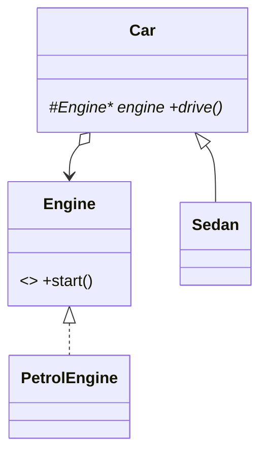

# Bridge Design Pattern — Detailed Guide

> **Structural Design Pattern** jo **abstraction** (Car type) aur **implementation** (Engine) ko **alag hierarchies** mein split karta hai — dono **composition** se bind (`Car` has `Engine*`). `SedanPetrolCar`, `SUVDieselCar` jaisi **class explosion** avoid hoti hai.

**Domain example (is repo mein):** `Sedan` / `SUV` × `PetrolEngine` / `DieselEngine` / `ElectricEngine` — runtime pe koi bhi pair.

**Core problem:** **Cartesian product inheritance** — 2 car types × 3 engines = 6 subclasses.

---

## Table of Contents

1. [Problem kya hai?](#1-problem-kya-hai)
2. [Bridge Pattern kya hai?](#2-bridge-pattern-kya-hai)
3. [Real-World Analogy](#3-real-world-analogy)
4. [Key Participants](#4-key-participants)
5. [Bridge vs Adapter vs Strategy](#5-bridge-vs-adapter-vs-strategy)
6. [Kab use karein / Kab na karein](#6-kab-use-karein--kab-na-karein)
7. [Folder Structure](#7-folder-structure)
8. [Code Walkthrough](#8-code-walkthrough)
9. [Build & Run](#9-build--run)
10. [Interview Points & Summary](#10-interview-points--summary)

---

## 1. Problem kya hai?

```cpp
// ❌ Inheritance explosion
class SedanPetrolCar : public Sedan { ... };
class SedanDieselCar : public Sedan { ... };
class SUVElectricCar : public SUV { ... };
// 2 × 3 = 6 classes — naya engine → sab car types dubara
```

| Problem | Detail |
| ------- | ------ |
| **Combinatorial subclasses** | Har (abstraction × implementation) pair |
| **Tight coupling** | Car type engine class se bind |
| **Change costly** | Naya `HybridEngine` → multiple car classes |

---

## 2. Bridge Pattern kya hai?

**Do independent hierarchies + bridge reference:**

```cpp
Car* mySedan = new Sedan(new PetrolEngine());
Car* mySUV   = new SUV(new ElectricEngine());
mySedan->drive();  // petrol start + sedan message
```

| Side | Role |
| ---- | ---- |
| **Abstraction (HLL)** | `Car`, `Sedan`, `SUV` — `drive()` |
| **Implementor (LLL)** | `Engine` — `start()` |
| **Bridge** | `Car` holds `Engine*` |

> **Prefer composition over inheritance** for cross-cutting dimensions.

---

## 3. Real-World Analogy

- **Remote control (abstraction) × Device (TV/AC implementation)** — same buttons, different devices.
- **Shape × Renderer** (vector vs raster) — Gang of Four classic.
- **Snake & Ladder L34** — `BoardSetupBridge` + setup strategy.

---

## 4. Key Participants

| Role | Class |
| ---- | ----- |
| **Implementor** | `Engine` |
| **Concrete Implementors** | `PetrolEngine`, `DieselEngine`, `ElectricEngine` |
| **Abstraction** | `Car` |
| **Refined Abstractions** | `Sedan`, `SUV` |



---

## 5. Bridge vs Adapter vs Strategy

| Pattern | Purpose |
| ------- | ------- |
| **Bridge** | Design-time split — abstraction + implementation evolve separately |
| **Adapter** | Existing incompatible interface fix |
| **Strategy** | Algorithm swap — usually one dimension; Bridge = two hierarchies |

---

## 6. Kab use karein / Kab na karein

**✅** Multiple implementations × multiple abstractions; both axes change independently.  
**❌** Sirf ek dimension vary — Strategy kaafi; sirf interface fix — Adapter.

---

## 7. Folder Structure

```
L25 Bridge_design_pattern/
├── README.md
└── C++ Code/BridgePattern.cpp
```

---

## 8. Code Walkthrough

Source: [`C++ Code/BridgePattern.cpp`](./C%20%2B%2B%20Code/BridgePattern.cpp)

```cpp
class Car {
protected:
    Engine* engine;
public:
    Car(Engine* e) { engine = e; }
    virtual void drive() = 0;
};

class Sedan : public Car {
    void drive() override {
        engine->start();
        cout << "Driving a Sedan on the highway." << endl;
    }
};
```

**Client:** `Sedan(petrol)`, `SUV(electric)`, `SUV(diesel)` — 3 combinations, 5 classes (not 6 subclasses).

---

## 9. Build & Run

```bash
cd "L25 Bridge_design_pattern/C++ Code"
g++ -std=c++17 -o bridge_demo BridgePattern.cpp && ./bridge_demo
```

**Output:** Petrol+Sedan, Electric+SUV, Diesel+SUV messages.

---

## 10. Interview Points & Summary

1. **One-liner:** "Bridge decouples abstraction from implementation via composition — avoids M×N subclasses."
2. **vs Adapter:** Bridge designed upfront; Adapter retrofits legacy.
3. **Repo:** L34 `BoardSetupBridge`.

| Pehlu | Detail |
| ----- | ------ |
| **Type** | Structural |
| **Key** | `Engine*` inside `Car` |
| **File** | `BridgePattern.cpp` |
