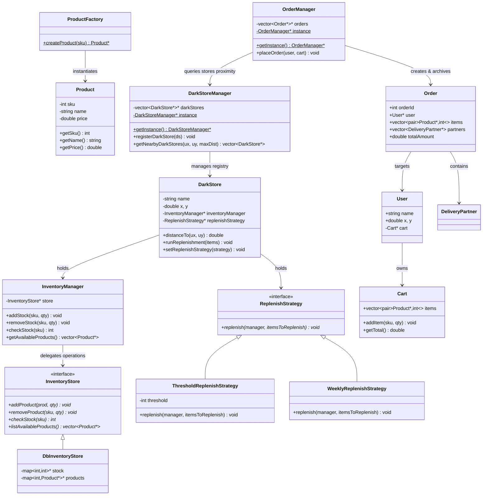

# Design Patterns in Blinkit/Zepto Inventory System

This document outlines the software design patterns implemented in the **Blinkit/Zepto (Inventory & Order Management)** single-file clone (`ZeptoClone.cpp`).

---

## Architecture Overview

The system models a quick-commerce (10-minute delivery) environment. Client requests specify coordinates. The system finds nearby fulfillment centers (Dark Stores) within a range, verifies stock levels, and either fulfills the order from a single store or dynamically splits it across multiple stores, assigning separate delivery partners for each segment.



---

## 1. Simple Factory Pattern (Creational)

### Intent
Define an interface for creating objects, hiding the instantiation complexity from the calling client.

### Usage in Code
* **Factory Class**: `ProductFactory`.
* **Static Factory Method**: `createProduct(int sku)`.
* **Role**: Based on a unique stock-keeping identifier (SKU), it instantiates a concrete `Product` object with preconfigured, mock database properties (name and price):
  ```cpp
  static Product* createProduct(int sku) {
      if (sku == 101) return new Product(101, "Apple", 20);
      else if (sku == 102) return new Product(102, "Banana", 10);
      // ...
  }
  ```
  The user cart and dark stores don't need to specify properties dynamically; they simply request products by SKU.

---

## 2. Strategy Pattern (Behavioral)

### Intent
Define a family of algorithms, encapsulate each one, and make them interchangeable. Strategy lets the algorithm vary independently from the clients that use it.

### Usage in Code
* **Strategy Interface**: `ReplenishStrategy` defines the replenishment action.
* **Concrete Strategies**:
  * `ThresholdReplenishStrategy` (Replenishes stock automatically if local levels fall below a specific limit).
  * `WeeklyReplenishStrategy` (Simulates routine calendar or weekly schedule checks).
* **Context**: `DarkStore` holds a pointer to `ReplenishStrategy*` and delegates inventory refill checks to it using `runReplenishment()`.

> [!NOTE]
> Since replenishment rules vary by region or store size, Strategy Pattern allows assigning different refill behaviors to different dark stores at runtime via `setReplenishStrategy()`.

---

## 3. Singleton Pattern (Creational)

### Intent
Ensure a class has only one instance and provide a global point of access to it.

### Usage in Code
* **Classes**: `DarkStoreManager` and `OrderManager` implement the Singleton Pattern.
* **Instance Retrieval**: Expose public `getInstance()` functions to retrieve a static instance pointer.
* **Role**:
  * `DarkStoreManager` maintains a centralized registry of all global fulfillment warehouses and performs geolocation queries (sorting nearby warehouses by shortest distance).
  * `OrderManager` maintains a centralized order registry database and handles split/optimized routing order placement processes.

---

## 4. Facade Pattern (Structural)

### Intent
Provide a unified interface to a set of interfaces in a subsystem. Facade defines a higher-level interface that makes the subsystem easier to use.

### Usage in Code
* **Facade/Coordinator**: `ZeptoHelper`.
* **Role**: Exposes simplified, high-level helper functions:
  * `initialize()`: Sets up the initial database of dark stores, configures replenishment strategies, and seeds stock inventory.
  * `showAllItems(User*)`: Performs the subsystem lookup (retrieves nearby stores via `DarkStoreManager`, iterates products, filters unique SKUs) and prints them in a clean format to the client.
  Clients do not have to perform complex multi-step coordinate-to-store conversions manually.

---

## Design Pattern Summary Matrix

| Design Pattern | Category | Role in this System | Key Class / Method |
|---|---|---|---|
| **Simple Factory** | Creational | Centralize and abstract the creation of `Product` objects from SKU codes. | `ProductFactory::createProduct()` |
| **Strategy** | Behavioral | Dynamically configure and execute different inventory refilling algorithms for warehouses. | `ReplenishStrategy` & subclasses |
| **Singleton** | Creational | Maintain single central registries for active Dark Stores and placed Orders. | `getInstance()` in Managers |
| **Facade** | Structural | Provide a simplified orchestration interface for system seeding and nearby product discovery. | `ZeptoHelper` utilities |
