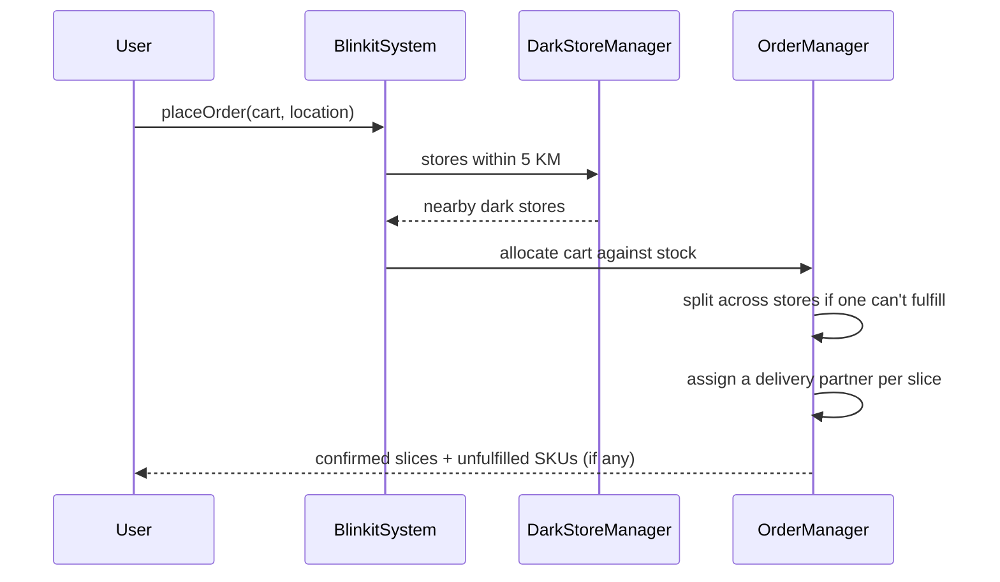

# Blinkit / Zepto LLD (Quick-Commerce Inventory)

Interview-grade **quick-commerce inventory & order fulfillment** system in C++17 — dark-store onboarding, pluggable inventory backends, replenishment strategies, 5 KM catalog visibility, stock-validated ordering, and **order splitting across dark stores** with multiple delivery partners.

> **Pattern map:** [Project → Pattern mapping](../docs/PROJECT_DESIGN_PATTERNS.md)

---

## Folder Structure

```
L26 Blinkit_or_Zepto_(Inventory_Management)_LLD/
├── core/           # BlinkitSystem — DarkStoreManager + OrderManager (Facade)
├── inventory/      # Inventory, InventoryStore backends, ReplenishStrategy
├── models/         # Product, DarkStore, UserCart, Order, DeliveryPartner
├── order/          # order lifecycle / fulfillment
├── C++ Code/       # ZeptoClone.cpp — legacy monolithic reference (preserved)
├── compile.sh
├── main.cpp
├── problem.md
└── requirements.md
```

---

## Design Patterns

| Pattern | Class | Why |
|---------|-------|-----|
| **Strategy** | `ReplenishStrategy` (Threshold / Weekly) | Swappable restock policy per dark store |
| **Strategy / pluggable backend** | `InventoryStore` (in-memory / DB-sim) | New store backends without changing store logic |
| **Factory** | `InventoryStoreFactory`, product creation | Centralized object creation |
| **Facade** | `BlinkitSystem` | One API over stores, catalog, cart, and orders |

---

## Key Flow — Place Order (with split)



---

## Order Lifecycle

`PLACED → CONFIRMED → PACKING → OUT_FOR_DELIVERY → DELIVERED` (or `CANCELLED`).

---

## Build & Run

```bash
cd "L26 Blinkit_or_Zepto_(Inventory_Management)_LLD"
./compile.sh
./blinkit_zepto_app
```

---

## Demo Scenarios (`main.cpp`)

| Demo | What it shows |
|------|----------------|
| **Catalog** | Products visible from all dark stores within 5 KM |
| **Order split** | One store short on stock → cart split across nearby stores |
| **Multiple partners** | Each slice assigned a separate delivery agent |
| **Unfulfilled report** | Remaining SKU quantities printed |
| **Delivery fee** | Distance × surge multiplier |

---

## Interview Talking Points

1. **Why split orders?** — A single dark store rarely has 100% of a cart; splitting maximizes fill rate.
2. **Strategy for replenishment** — Threshold vs Weekly differ only in *when* to restock; the store stays the same.
3. **Pluggable `InventoryStore`** — Lets you swap in-memory for DB-backed without rewriting business logic (DIP).
4. **Extensions** — Payment ([L23](../L23%20Payment_gateway_system_LLD/)), live GPS routing, reservation/locking under concurrency.

> `C++ Code/ZeptoClone.cpp` is the original single-file reference and is intentionally left unmodified.

---

## Related Docs

- [Problem Statement](./problem.md) · [Requirements](./requirements.md)
- [Ecommerce Cart Checkout LLD](../Ecommerce_Cart_Checkout_LLD/) · [Pattern map](../docs/PROJECT_DESIGN_PATTERNS.md)
