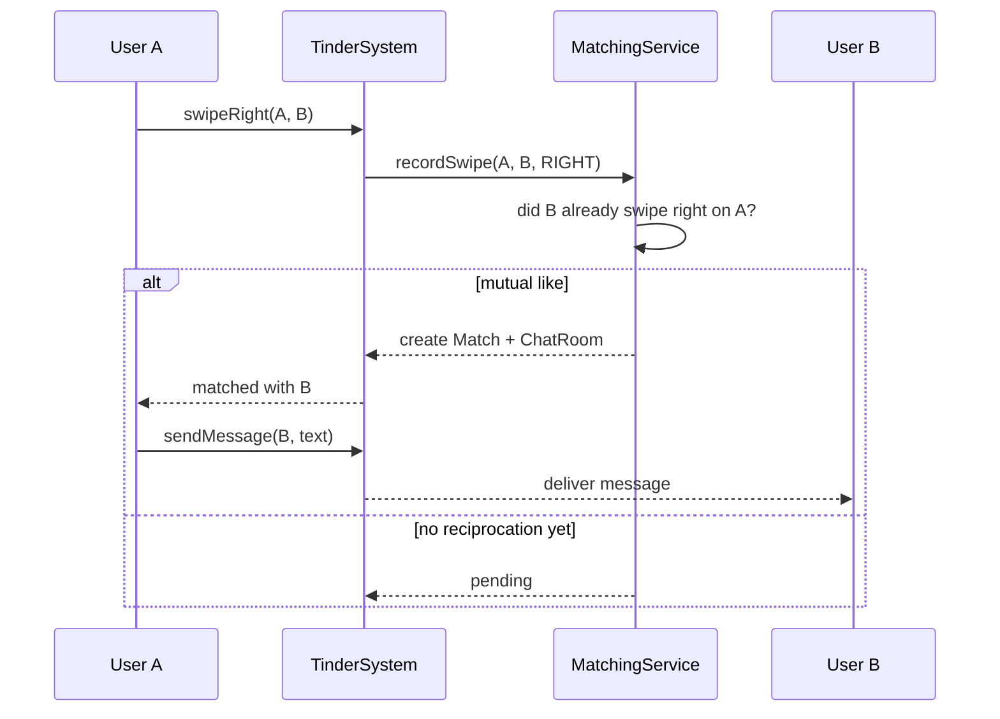

# Tinder LLD (Dating App)

In-memory **Tinder-style dating platform** in C++17 — profile onboarding with location, nearby discovery, swipe left/right + super-like, mutual-match creation, chat between matches, daily swipe limits, and unmatch/block flows.

> **Pattern map:** [Project → Pattern mapping](../docs/PROJECT_DESIGN_PATTERNS.md)

---

## Folder Structure

```
L27 Tinder_LLD/
├── core/           # TinderSystem — Facade orchestrator
├── services/       # MatchingService, ChatService
├── models/         # User, Profile, Location, ChatRoom, Message, Swipe
├── enums/          # SwipeAction, Gender, etc.
├── C++ Code/       # alternate reference implementation
├── compile.sh
├── main.cpp
├── problem.md
└── requirements.md
```

---

## Design Patterns

| Pattern | Class | Why |
|---------|-------|-----|
| **Facade** | `TinderSystem` | Single API over discovery, swipe, match, chat |
| **Service layer** | `MatchingService`, chat services | Domain models separated from orchestration |
| **Strategy (extensible)** | discovery/ranking | Distance-based now; ML ranking pluggable later |

---

## Key Flow — Swipe → Match → Chat



---

## Build & Run

```bash
cd "L27 Tinder_LLD"
./compile.sh
./tinder_app
```

---

## Demo Scenarios (`main.cpp`)

| Demo | What it shows |
|------|----------------|
| **Discovery** | Nearby profiles within a configurable radius |
| **Swipe + match** | Mutual right swipe creates a match |
| **Super-like** | Priority like action |
| **Daily limit** | Swipe cap enforcement |
| **Block / unmatch** | Removing a connection |

---

## Interview Talking Points

1. **Mutual-match detection** — Store directional swipes; a match is a right-swipe in both directions.
2. **Why a service layer?** — Keeps `User`/`Profile` as plain data while matching/chat logic evolves.
3. **Daily swipe limit** — Per-user counter reset by day; natural rate-limit discussion.
4. **Extensions** — Geosharded discovery, recommendation ranking (ML), media moderation, read receipts.

---

## Related Docs

- [Problem Statement](./problem.md) · [Requirements](./requirements.md)
- [WhatsApp LLD (chat)](../WhatsApp_LLD/) · [Pattern map](../docs/PROJECT_DESIGN_PATTERNS.md)
