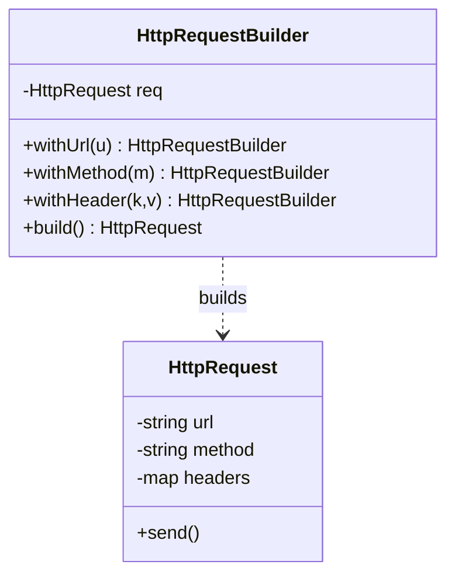
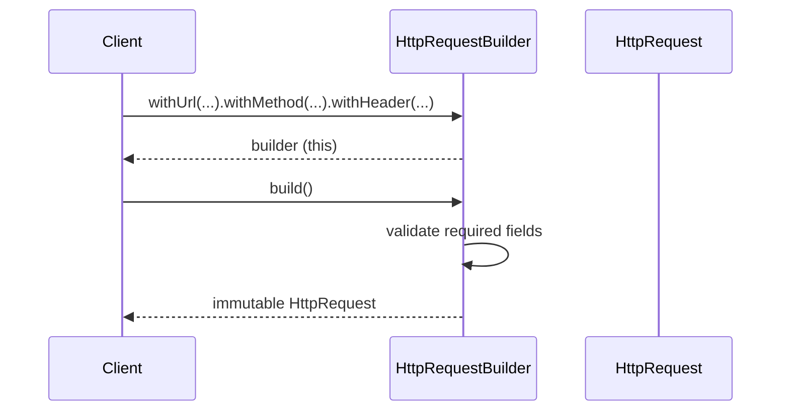

# Builder Design Pattern — Detailed Guide

> **Creational Design Pattern** that constructs a **complex object step by step** through a **fluent API**, supports optional fields cleanly, and validates the result at `build()`. It replaces telescoping constructors and half-initialized mutable objects.

**Domain example (in this repo):** An `HttpRequest` — URL, HTTP method, headers, body, and timeout — assembled by an `HttpRequestBuilder`.

**Core problem it solves:** Objects with many (mostly optional) fields lead to a tangle of overloaded constructors or to mutable objects that can be used while still half-built.

---

## Table of Contents

1. [Problem — Telescoping Constructors & Mutable Objects](#1-problem--telescoping-constructors--mutable-objects)
2. [What is the Builder Pattern?](#2-what-is-the-builder-pattern)
3. [The Four Variants in This Repo](#3-the-four-variants-in-this-repo)
4. [Real-World Analogy](#4-real-world-analogy)
5. [Key Participants (UML Roles)](#5-key-participants-uml-roles)
6. [When to Use / When to Avoid](#6-when-to-use--when-to-avoid)
7. [Pros and Cons](#7-pros-and-cons)
8. [SOLID Principles Connection](#8-solid-principles-connection)
9. [Folder Structure](#9-folder-structure)
10. [Code Walkthrough](#10-code-walkthrough)
11. [Architecture Diagrams](#11-architecture-diagrams)
12. [Build & Run](#12-build--run)
13. [Builder vs Related Patterns](#13-builder-vs-related-patterns)
14. [Interview Talking Points](#14-interview-talking-points)
15. [Summary](#15-summary)

---

## 1. Problem — Telescoping Constructors & Mutable Objects

`WithoutBuilder.cpp` shows the pain: an object with several optional fields forces either many constructors or public setters.

```cpp
// ❌ Telescoping constructors — one per combination of optional args
HttpRequest(string url);
HttpRequest(string url, string method);
HttpRequest(string url, string method, map<string,string> headers);
HttpRequest(string url, string method, map<string,string> headers, string body);
// ...and a setter-based variant lets you use a half-built request
```

| Anti-pattern | Issue |
| ------------ | ----- |
| **Telescoping constructor** | Each optional field doubles the constructor count |
| **Argument confusion** | Many same-typed args (`string, string, string`) are easy to mis-order |
| **Mutable object** | Public setters allow a half-initialized request to be sent |
| **No validation point** | Nothing forces required fields to be present |

---

## 2. What is the Builder Pattern?

A separate **Builder** collects configuration through chained calls, then produces an **immutable** finished object on `build()`:

```cpp
HttpRequest request = HttpRequestBuilder()
    .withUrl("https://api.example.com")
    .withMethod("POST")
    .withHeader("Content-Type", "application/json")
    .withBody("{ \"id\": 1 }")
    .withTimeout(30)
    .build();          // validation happens here; object is now immutable
```

| Property | Detail |
| -------- | ------ |
| **Fluent API** | Readable, self-documenting chained calls |
| **Optional fields** | Set only what you need; sensible defaults for the rest |
| **Single validation point** | `build()` checks invariants before creating the object |
| **Immutability** | The product has no setters once built |

---

## 3. The Four Variants in This Repo

| File | Variant | Idea |
| ---- | ------- | ---- |
| `WithoutBuilder.cpp` | Problem baseline | Telescoping constructors + mutable setters |
| `BuilderPattern.cpp` | Classic fluent builder | `HttpRequestBuilder` with `withXxx()` chain + `build()` |
| `BuilderWithDirector.cpp` | Builder + Director | A `Director` encapsulates a common build recipe (e.g. a JSON POST) |
| `StepBuilder.cpp` | Step / type-state builder | Interfaces (`UrlStep → MethodStep → HeaderStep → OptionalStep`) enforce call **order** at compile time |

```
WithoutBuilder → BuilderPattern → BuilderWithDirector → StepBuilder
   (problem)       (fluent)         (reusable recipe)     (enforced order)
```

---

## 4. Real-World Analogy

| Analogy | Mapping |
| ------- | ------- |
| **Ordering a custom burger** | You pick bun, patty, toppings step by step; the kitchen assembles and hands you the finished burger |
| **Building a PC** | Choose CPU, RAM, GPU incrementally; "build" produces the assembled machine |
| **Filling a form before submit** | You fill fields in any order; "Submit" validates and creates the record |

---

## 5. Key Participants (UML Roles)

| Role | In this demo |
| ---- | ------------ |
| **Product** | `HttpRequest` — the complex, immutable object |
| **Builder** | `HttpRequestBuilder` — accumulates fields, exposes `withXxx()` and `build()` |
| **Director** (optional) | `BuilderWithDirector.cpp` — drives a fixed build sequence |
| **Step interfaces** (optional) | `UrlStep`, `MethodStep`, … — enforce build order in `StepBuilder.cpp` |
| **Client** | `main()` — chains calls and receives the product |

---

## 6. When to Use / When to Avoid

### ✅ Use when

| Scenario | Example |
| -------- | ------- |
| Many optional/configurable fields | HTTP request, DB connection config, UI widget |
| You want an immutable result | Build once, never mutate |
| Construction needs validation | Enforce required fields at `build()` |
| Several representations of the same build | Director recipes for "GET" vs "POST" |

### ❌ Avoid when

| Scenario | Reason |
| -------- | ------ |
| The object has 1–2 fields | A plain constructor is simpler |
| All fields are required and few | No optional complexity to manage |
| You need polymorphic creation by type | That's a **Factory**, not a Builder |

---

## 7. Pros and Cons

### Pros

| Benefit | Detail |
| ------- | ------ |
| **Readable construction** | Named `withXxx()` calls beat positional args |
| **Immutable product** | No half-built state escapes |
| **Flexible** | Set only the fields you care about |
| **Validation in one place** | `build()` guards invariants |

### Cons

| Drawback | Detail |
| -------- | ------ |
| **More code** | A separate builder class per product |
| **Indirection** | Two objects (builder + product) instead of one |
| **Overkill** | Unnecessary for simple value objects |

---

## 8. SOLID Principles Connection

| Principle | How Builder applies |
| --------- | ------------------- |
| **SRP** | The product holds data; the builder handles construction concerns |
| **OCP** | Add a new optional field via a new `withXxx()` without breaking existing callers |
| **ISP** (StepBuilder) | Each step interface exposes only the next valid call |

---

## 9. Folder Structure

```
L28 Builder_design_pattern/
├── README.md                     ← This guide
└── C++ Code/
    ├── WithoutBuilder.cpp         ← Problem: telescoping + mutable
    ├── BuilderPattern.cpp         ← Classic fluent builder
    ├── BuilderWithDirector.cpp    ← Director-driven recipe
    └── StepBuilder.cpp            ← Type-state (enforced order)
```

---

## 10. Code Walkthrough

**Product with a private/friended builder** (`BuilderPattern.cpp`):

```cpp
class HttpRequest {
    string url, method, body;
    map<string,string> headers;
    int timeout = 0;
    friend class HttpRequestBuilder;   // only the builder can fill fields
    HttpRequest() {}                   // not constructible directly
public:
    void send() const { /* ... */ }
};
```

**Fluent builder returning `*this`:**

```cpp
class HttpRequestBuilder {
    HttpRequest req;
public:
    HttpRequestBuilder& withUrl(const string& u)    { req.url = u; return *this; }
    HttpRequestBuilder& withMethod(const string& m) { req.method = m; return *this; }
    HttpRequestBuilder& withHeader(const string& k, const string& v) {
        req.headers[k] = v; return *this;
    }
    HttpRequest build() {
        if (req.url.empty()) throw runtime_error("URL is required");
        return req;                    // validated, immutable copy
    }
};
```

**Step builder** (`StepBuilder.cpp`): each method returns the *next* interface (`UrlStep → MethodStep → …`), so the compiler forbids calling `build()` before the required steps — invalid order won't compile.

---

## 11. Architecture Diagrams





---

## 12. Build & Run

```bash
cd "L28 Builder_design_pattern/C++ Code"

g++ -std=c++17 -o without_builder WithoutBuilder.cpp && ./without_builder
g++ -std=c++17 -o builder_demo BuilderPattern.cpp && ./builder_demo
g++ -std=c++17 -o builder_director BuilderWithDirector.cpp && ./builder_director
g++ -std=c++17 -o step_builder StepBuilder.cpp && ./step_builder
```

---

## 13. Builder vs Related Patterns

| Pattern | Intent | Difference from Builder |
| ------- | ------ | ----------------------- |
| **Factory Method** | Pick which class to create | Factory chooses a *type*; Builder configures *one complex object* |
| **Abstract Factory** | Create families of related objects | Returns products immediately; Builder builds step by step |
| **Prototype** | Clone an existing object | Copies a template; Builder assembles from scratch |
| **Fluent setters** | Chained mutation | Builder yields an *immutable* product; fluent setters leave it mutable |

---

## 14. Interview Talking Points

1. **One-liner:** "Builder constructs a complex object step by step and returns an immutable product."
2. **Why not constructors:** "Telescoping constructors explode with optional fields and are easy to mis-order."
3. **Validation:** "`build()` is the single place to enforce required-field invariants."
4. **Director:** "A Director captures a reusable build recipe so clients don't repeat it."
5. **Step builder:** "Type-state steps make an invalid build order fail at compile time."
6. **vs Factory:** "Factory decides *what* to create; Builder decides *how* to assemble it."

---

## 15. Summary

| Aspect | Detail |
| ------ | ------ |
| **Pattern Type** | Creational |
| **Core Idea** | Step-by-step construction of a complex, immutable object |
| **Repo Example** | `HttpRequest` + `HttpRequestBuilder` |
| **Variants** | Without → Fluent → Director → Step (type-state) |
| **Main Problem Solved** | Telescoping constructors and half-built mutable objects |
| **Key Files** | [`BuilderPattern.cpp`](./C%20%2B%2B%20Code/BuilderPattern.cpp), [`StepBuilder.cpp`](./C%20%2B%2B%20Code/StepBuilder.cpp) |

> **Remember:** A Builder is like ordering a **custom burger** — you choose the parts one at a time in plain language, and only when you say "done" does the kitchen hand you the finished, ready-to-eat result. 🍔
