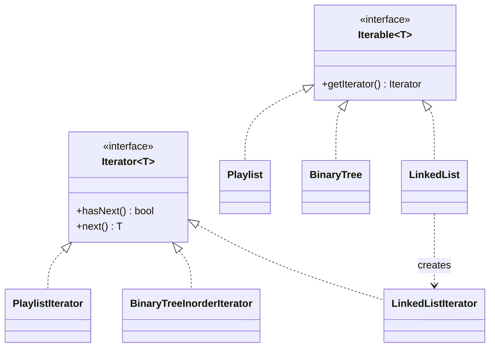

# Iterator Design Pattern — Detailed Guide

> **Behavioral Design Pattern** that provides a **uniform way to traverse** a collection **without exposing its internal structure**. A common `hasNext()` / `next()` interface lets a client walk a linked list, a binary tree, or a playlist with the *same* loop.

**Domain example (in this repo):** Generic `Iterator<T>` and `Iterable<T>` interfaces implemented for a `LinkedList`, a `BinaryTree` (in-order), and a `Playlist` of `Song`s.

**Core problem it solves:** Every data structure has a different traversal mechanism, so client code becomes coupled to each one's internals.

---

## Table of Contents

1. [Problem — Every Collection Traverses Differently](#1-problem--every-collection-traverses-differently)
2. [What is the Iterator Pattern?](#2-what-is-the-iterator-pattern)
3. [Real-World Analogy](#3-real-world-analogy)
4. [Key Participants (UML Roles)](#4-key-participants-uml-roles)
5. [The Three Iterators in Code](#5-the-three-iterators-in-code)
6. [When to Use / When to Avoid](#6-when-to-use--when-to-avoid)
7. [Pros and Cons](#7-pros-and-cons)
8. [SOLID Principles Connection](#8-solid-principles-connection)
9. [Folder Structure](#9-folder-structure)
10. [Code Walkthrough](#10-code-walkthrough)
11. [Architecture Diagrams](#11-architecture-diagrams)
12. [Build & Run](#12-build--run)
13. [Iterator vs Related Patterns](#13-iterator-vs-related-patterns)
14. [Interview Talking Points](#14-interview-talking-points)
15. [Summary](#15-summary)

---

## 1. Problem — Every Collection Traverses Differently

Without a common abstraction, the client must know how each structure is walked:

```cpp
// ❌ Client is coupled to each structure's internals
for (Node* n = head; n; n = n->next) use(n->value);   // linked list
inorderRecursive(root);                                // binary tree
for (int i = 0; i < songs.size(); i++) use(songs[i]);  // playlist
```

| Problem | Detail |
| ------- | ------ |
| **Leaky internals** | Client knows about `next`, `root`, array indices |
| **Non-uniform code** | A different loop per collection |
| **Hard to swap** | Changing the underlying structure breaks every caller |
| **No multiple cursors** | Tracking traversal state inside the collection blocks concurrent walks |

---

## 2. What is the Iterator Pattern?

The collection exposes a factory method that returns an **Iterator** object holding the traversal cursor. Clients use only `hasNext()` and `next()`:

```cpp
Iterator<int>* it = list->getIterator();
while (it->hasNext())
    cout << it->next() << " ";
```

| Property | Detail |
| -------- | ------ |
| **Uniform API** | `hasNext()` / `next()` regardless of structure |
| **Hidden structure** | Client never touches nodes/indices |
| **Externalized cursor** | Traversal state lives in the iterator, not the collection |
| **Multiple traversals** | Each `getIterator()` returns an independent cursor |

---

## 3. Real-World Analogy

| Analogy | Mapping |
| ------- | ------- |
| **TV remote channel-up** | You press "next" repeatedly without knowing how channels are stored |
| **Music player ▶▶** | "Next track" works whether the playlist is an array or a linked list |
| **A bookmark** | Remembers your position so you can resume; another reader has their own bookmark |

---

## 4. Key Participants (UML Roles)

| Role | In this demo |
| ---- | ------------ |
| **Iterator** | `Iterator<T>` — `hasNext()`, `next()` |
| **Concrete Iterator** | `LinkedListIterator`, `BinaryTreeInorderIterator`, `PlaylistIterator` |
| **Iterable / Aggregate** | `Iterable<T>` — declares `getIterator()` |
| **Concrete Aggregate** | `LinkedList`, `BinaryTree`, `Playlist` |
| **Client** | `main()` — loops with `hasNext()`/`next()` |

---

## 5. The Three Iterators in Code

| Collection | Iterator | Traversal strategy |
| ---------- | -------- | ------------------ |
| `LinkedList` | `LinkedListIterator` | Follow `next` pointers head → tail |
| `BinaryTree` | `BinaryTreeInorderIterator` | **In-order** using an explicit stack |
| `Playlist` | `PlaylistIterator` | Sequential over the `Song` list |

The headline: all three are consumed by the **same** `while (it->hasNext()) it->next()` loop.

---

## 6. When to Use / When to Avoid

### ✅ Use when

| Scenario | Example |
| -------- | ------- |
| Uniform traversal of varied structures | List, tree, graph, custom container |
| You want to hide internal representation | Library collection types |
| You need multiple independent cursors | Two passes over the same data |
| Different traversal orders | In-order vs pre-order tree walks as separate iterators |

### ❌ Avoid when

| Scenario | Reason |
| -------- | ------ |
| A plain array/`std::vector` suffices | The language already gives you iteration |
| Single structure, single traversal | An exposed loop is simpler |
| Performance-critical tight loop | The virtual-call indirection may cost |

---

## 7. Pros and Cons

### Pros

| Benefit | Detail |
| ------- | ------ |
| **Uniform interface** | One loop shape for all collections |
| **Encapsulation** | Internal structure stays hidden |
| **SRP** | Traversal logic lives in the iterator, not the collection |
| **Multiple cursors** | Independent simultaneous traversals |

### Cons

| Drawback | Detail |
| -------- | ------ |
| **Extra classes** | One iterator per collection/order |
| **Indirection** | Virtual calls vs a direct index loop |
| **Invalidation** | Modifying the collection mid-iteration can break the cursor |

---

## 8. SOLID Principles Connection

| Principle | How Iterator applies |
| --------- | -------------------- |
| **SRP** | The collection stores data; the iterator handles traversal |
| **OCP** | Add a new traversal order as a new iterator without changing the collection |
| **DIP** | Clients depend on `Iterator<T>`, not on `LinkedList`/`BinaryTree` |

---

## 9. Folder Structure

```
L29 Iterator_design_pattern/
├── README.md                   ← This guide
└── C++ Code/
    └── IteratorPattern.cpp      ← LinkedList, BinaryTree (in-order), Playlist
```

---

## 10. Code Walkthrough

**Generic interfaces:**

```cpp
template <typename T>
class Iterator {
public:
    virtual bool hasNext() = 0;
    virtual T next() = 0;
    virtual ~Iterator() {}
};

template <typename T>
class Iterable {
public:
    virtual Iterator<T>* getIterator() = 0;
};
```

**Binary tree in-order iterator (explicit stack):**

```cpp
class BinaryTreeInorderIterator : public Iterator<int> {
    stack<TreeNode*> st;
    void pushLeft(TreeNode* n) { while (n) { st.push(n); n = n->left; } }
public:
    BinaryTreeInorderIterator(TreeNode* root) { pushLeft(root); }
    bool hasNext() override { return !st.empty(); }
    int next() override {
        TreeNode* node = st.top(); st.pop();
        pushLeft(node->right);
        return node->value;
    }
};
```

**Client — identical loop for all three:**

```cpp
Iterator<int>* it = tree->getIterator();
while (it->hasNext()) cout << it->next() << " ";
```

**Key:** Swap `tree` for `list` or `playlist` and the loop is unchanged.

---

## 11. Architecture Diagrams



---

## 12. Build & Run

```bash
cd "L29 Iterator_design_pattern/C++ Code"
g++ -std=c++17 -o iterator_demo IteratorPattern.cpp && ./iterator_demo
```

---

## 13. Iterator vs Related Patterns

| Pattern | Intent | Difference from Iterator |
| ------- | ------ | ------------------------ |
| **Composite** | Tree of part-whole objects | Iterator *traverses*; Composite *structures*. Often combined |
| **Visitor** | Add operations over elements | Visitor applies an op per element; Iterator just yields elements |
| **Observer** | Push notifications | Iterator is pull-based traversal, not event push |
| **Strategy** | Swap an algorithm | An iterator can be seen as a traversal strategy for a collection |

---

## 14. Interview Talking Points

1. **One-liner:** "Iterator provides uniform sequential access to a collection without exposing its internals."
2. **Externalized state:** "The cursor lives in the iterator, so multiple independent traversals are possible."
3. **Different orders:** "Pre-order vs in-order tree walks are just different concrete iterators."
4. **Encapsulation:** "Clients never see nodes or indices — only `hasNext()`/`next()`."
5. **STL link:** "C++ STL iterators are this pattern; `begin()`/`end()` is the idiomatic form."

---

## 15. Summary

| Aspect | Detail |
| ------ | ------ |
| **Pattern Type** | Behavioral |
| **Core Idea** | Uniform traversal that hides a collection's structure |
| **Repo Example** | `LinkedList`, `BinaryTree` (in-order), `Playlist` |
| **Main Problem Solved** | Client coupling to each collection's internal layout |
| **Key File** | [`IteratorPattern.cpp`](./C%20%2B%2B%20Code/IteratorPattern.cpp) |

> **Remember:** An Iterator is like a **TV remote's "next channel" button** — you keep pressing next without ever knowing how the channels are stored inside the TV. 📺
