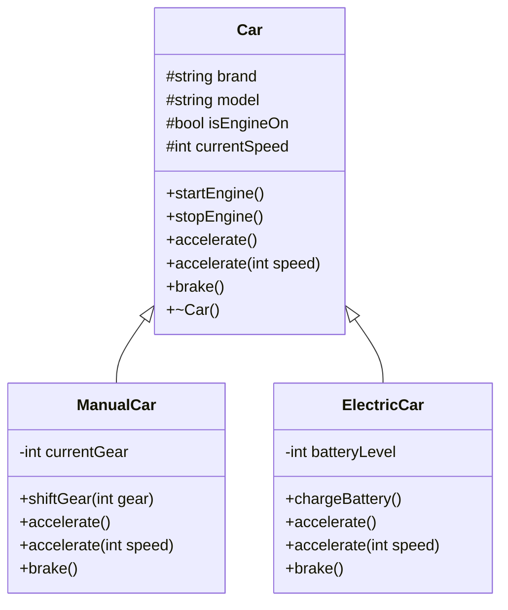

# OOPS Notes: Inheritance and Polymorphism in C++

This note is prepared from:
- `Inheritance.cpp`
- `StaticPolymorphism.cpp`
- `DynamicPolymorphism.cpp`
- `StaticAndDynamicPolymorphism.cpp`

---

## 1) Inheritance (`Inheritance.cpp`)

**Idea:** Child class gets common data + behavior from parent class and adds its own specific features.

- Parent class: `Car`
  - Common properties: `brand`, `model`, `isEngineOn`, `currentSpeed`
  - Common methods: `startEngine()`, `stopEngine()`, `accelerate()`, `brake()`
- Child classes:
  - `ManualCar` adds `currentGear` and `shiftGear(int)`
  - `ElectricCar` adds `batteryLevel` and `chargeBattery()`

**Why useful?**
- Code reusability (common logic written once in `Car`)
- Better modeling of real-world hierarchy
- Easy extension through specialized child classes

---

## 2) Static Polymorphism (`StaticPolymorphism.cpp`)

**Idea:** Same method name, different parameter list (method overloading).  
Binding happens at compile time.

Example in `ManualCar`:
- `accelerate()` -> fixed increment
- `accelerate(int speed)` -> variable increment

Both methods have same name but different signatures, so compiler chooses correct one based on arguments.

---

## 3) Dynamic Polymorphism (`DynamicPolymorphism.cpp`)

**Idea:** Same parent interface, different child behavior.  
Binding happens at runtime using `virtual` methods and overriding.

- `Car` has pure virtual methods:
  - `virtual void accelerate() = 0;`
  - `virtual void brake() = 0;`
- `ManualCar` and `ElectricCar` provide their own implementations.
- Parent pointer (`Car*`) calls child implementation at runtime.

Example:
- `ManualCar::accelerate()` increases speed in manual-car style
- `ElectricCar::accelerate()` also checks/decreases battery

---

## 4) Static + Dynamic Together (`StaticAndDynamicPolymorphism.cpp`)

This file combines both concepts:

- **Dynamic polymorphism:** child classes override
  - `accelerate()`
  - `brake()`
- **Static polymorphism:** overloading also done with
  - `accelerate(int speed)`

So one design demonstrates:
- same function name with different signatures (compile-time),
- and same interface with different child implementations (runtime).

---

## Mermaid Class Diagram

---

## Quick Interview Revision

- **Inheritance:** Parent common code + child specialization.
- **Static polymorphism:** Overloading, compile-time resolution.
- **Dynamic polymorphism:** Overriding + `virtual`, runtime resolution.
- **Abstract class:** Class with at least one pure virtual function.
- **Virtual destructor:** Ensures correct child destructor call through parent pointer.

