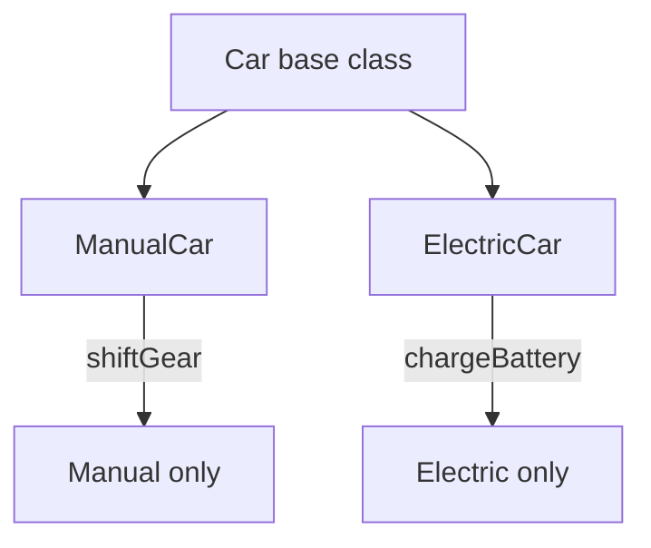
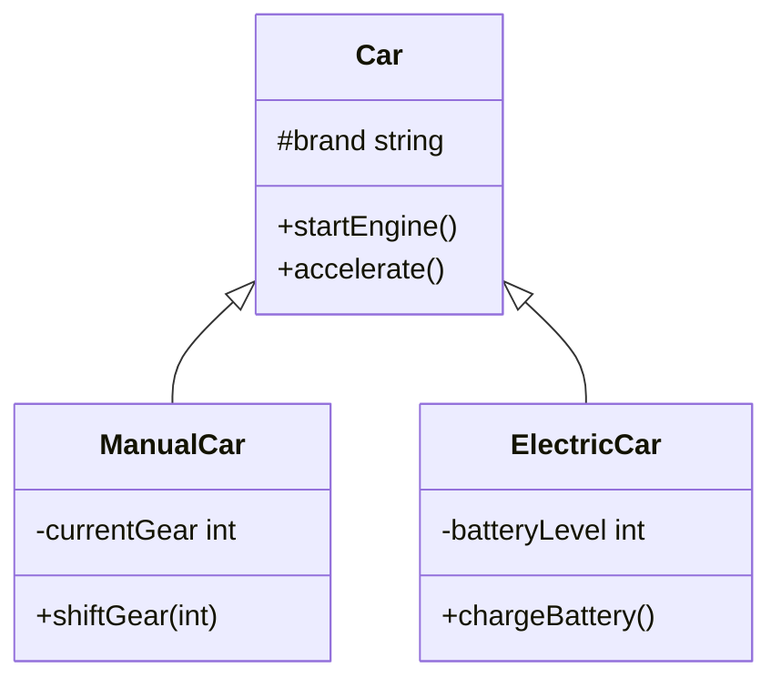
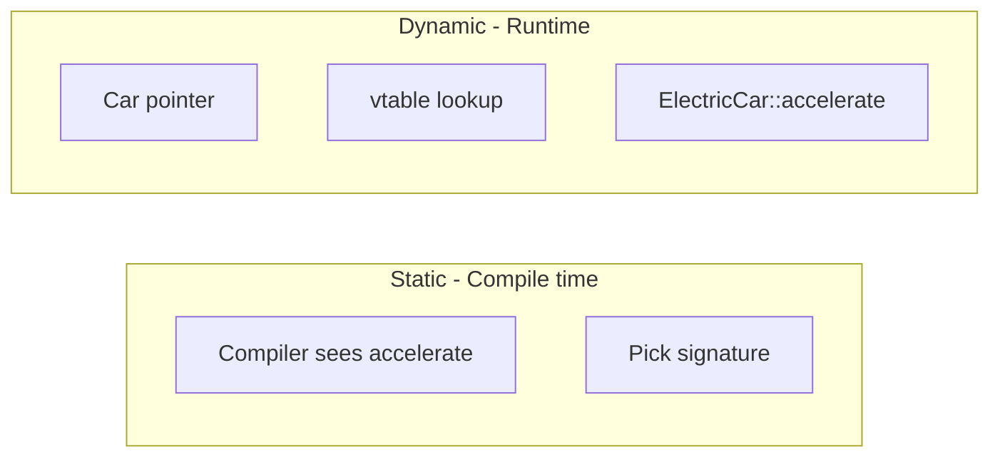

# L3 — OOP Part 2: Inheritance & Polymorphism (Complete Guide)

<p align="center">
  
  
  
</p>

> **Master doc** — Inheritance + Static/Dynamic Polymorphism  
> **Code:** [`C++ Code/`](./C++%20Code/) — 4 files

---

## Table of Contents

1. [4 Pillars — L3 Ka Role](#1-4-pillars--l3-ka-role)
2. [Inheritance — Poori Detail](#2-inheritance--poori-detail)
3. [Types of Inheritance (C++)](#3-types-of-inheritance-c)
4. [Access Specifiers in Inheritance](#4-access-specifiers-in-inheritance)
5. [Static Polymorphism (Compile-Time)](#5-static-polymorphism-compile-time)
6. [Dynamic Polymorphism (Runtime)](#6-dynamic-polymorphism-runtime)
7. [Static vs Dynamic — Comparison](#7-static-vs-dynamic--comparison)
8. [Virtual Functions & vtable](#8-virtual-functions--vtable)
9. [Method Overloading vs Overriding](#9-method-overloading-vs-overriding)
10. [Repo Code Walkthrough (4 Files)](#10-repo-code-walkthrough-4-files)
11. [UML — Inheritance Arrow](#11-uml--inheritance-arrow)
12. [Interview Question Bank](#12-interview-question-bank)
13. [Cheat Sheet](#13-cheat-sheet)

---

## 1. 4 Pillars — L3 Ka Role

| Pillar | L2 | L3 |
|--------|----|----|
| Encapsulation | ✅ | extends with `protected` |
| Abstraction | ✅ | abstract + override |
| **Inheritance** | — | ✅ **IS-A** |
| **Polymorphism** | — | ✅ static + dynamic |



**Previous:** [`L2 OOPS_1_COMPLETE.md`](../L2%20OOPS_1/OOPS_1_COMPLETE.md)  
**More inheritance types:** [`L4 INHERITANCE_AND_COMPOSITION.md`](../L4%20UML_Diagrams/INHERITANCE_AND_COMPOSITION.md)

---

## 2. Inheritance — Poori Detail

### 2.1 Definition (`Inheritance.cpp` comments)

> Child object has **all** parent characteristics + behaviours **plus** own specific ones.  
> Code **reusability** — common code parent me, special child me.

### 2.2 IS-A relationship

```
ManualCar IS-A Car
ElectricCar IS-A Car
```

```cpp
class ManualCar : public Car { };
```

### 2.3 Real-world mapping

| Real world | Code |
|------------|------|
| All cars: brand, start, stop | `Car` base |
| Manual: gears | `ManualCar::shiftGear` |
| Electric: battery | `ElectricCar::chargeBattery` |

### 2.4 Constructor chaining

```cpp
ManualCar(string b, string m) : Car(b, m) {
    currentGear = 0;
}
```

| Order | Kya hota hai |
|-------|--------------|
| 1 | `Car(b, m)` — parent part build |
| 2 | Child body — `currentGear = 0` |

### 2.5 `protected` in base

```cpp
class Car {
protected:
    string brand;
    int currentSpeed;
    // child access kar sakta, bahar nahi
};
```

Child `accelerate()` me `brand` use — **legal**; `main()` se `brand` direct — **error**.

---

## 3. Types of Inheritance (C++)

Repo L4 me 5 types demo: [`inheritance.cpp`](../L4%20UML_Diagrams/inheritance.cpp)

| Type | Structure | L3 example |
|------|-----------|------------|
| **Single** | A → B | `ManualCar : Car` |
| **Multilevel** | A → B → C | (L4 Alphonso chain) |
| **Multiple** | A,B → C | (L4 — rare LLD) |
| **Hierarchical** | A → B, A → C | `ManualCar`, `ElectricCar` : `Car` |
| **Hybrid** | Mix | — |

**L3 `Inheritance.cpp`:** **Hierarchical** — ek `Car`, do children.



---

## 4. Access Specifiers in Inheritance

### 4.1 Child banate waqt: `public` / `protected` / `private` inheritance

```cpp
class ManualCar : public Car    // ✅ 99% LLD / interviews
```

| Inheritance mode | Public member in parent becomes in child |
|------------------|------------------------------------------|
| `public` | public |
| `protected` | protected |
| `private` | private |

### 4.2 Member access summary

| Member in parent | Same class | Child class | Outside |
|------------------|------------|-------------|---------|
| private | ✅ | ❌ | ❌ |
| protected | ✅ | ✅ | ❌ |
| public | ✅ | ✅ | ✅ |

---

## 5. Static Polymorphism (Compile-Time)

### 5.1 Definition

> **Same action**, different behaviour based on **input parameters** — resolved at **compile time**.

**C++ mechanism:** **Function overloading** — same name, different signature.

### 5.2 `StaticPolymorphism.cpp`

```cpp
void accelerate();           // +20 km/h
void accelerate(int speed);  // +speed km/h
```

| Call | Compiler picks |
|------|------------------|
| `accelerate()` | No-arg version |
| `accelerate(40)` | int version |

**Binding time:** Compile time — **no vtable**.

### 5.3 Rules for overloading

| Rule | Example |
|------|---------|
| Same function name | `accelerate` |
| Different parameter list | `()` vs `(int)` |
| Return type alone **not enough** | `int f()` vs `double f()` ambiguous with same params |

### 5.4 Operator overloading (related)

`operator+`, `<<` — bhi compile-time polymorphism family (mention in interview).

---

## 6. Dynamic Polymorphism (Runtime)

### 6.1 Definition (`DynamicPolymorphism.cpp`)

> Same family ke 2 objects, **same stimulus** (`accelerate()`), **different response** — Manual vs Electric.

**C++ mechanism:** **Virtual functions** + **override** — resolved at **runtime**.

### 6.2 Key code pattern

**Base:**

```cpp
class Car {
public:
    virtual void accelerate() = 0;  // abstract
    virtual void brake() = 0;
    virtual ~Car() {}
};
```

**Child:**

```cpp
class ElectricCar : public Car {
public:
    void accelerate() override {  // battery logic
        batteryLevel -= 10;
        currentSpeed += 15;
    }
};
```

**Client:**

```cpp
Car* car = new ElectricCar("Tesla", "Model S");
car->accelerate();  // ElectricCar::accelerate runs
```

### 6.3 `override` keyword (C++11)

```cpp
void accelerate() override { }
```

Compiler check — parent me virtual hai ya nahi; typo pe error.

### 6.4 Without virtual (common mistake)

```cpp
// NO virtual
Car* p = new ElectricCar(...);
p->accelerate();  // ❌ Car version if exists — NOT electric behaviour
```

---

## 7. Static vs Dynamic — Comparison

| | Static (Overloading) | Dynamic (Overriding) |
|---|----------------------|----------------------|
| **When resolved** | Compile time | Runtime |
| **Mechanism** | Same name, different args | `virtual` + child override |
| **Inheritance needed?** | No (same class OK) | Yes (IS-A) |
| **Base pointer** | Not used for dispatch | `Car*` → correct child |
| **Repo file** | `StaticPolymorphism.cpp` | `DynamicPolymorphism.cpp` |
| **Performance** | Slightly faster (no vtable) | vtable indirection |
| **LLD use** | Multiple operation variants | Strategy / plugin behaviour |



---

## 8. Virtual Functions & vtable

### 8.1 How runtime dispatch works (conceptual)

```
Car object (via pointer) → vptr → vtable → ElectricCar::accelerate address
```

| Term | Meaning |
|------|---------|
| **vtable** | Per-class table of virtual function pointers |
| **vptr** | Hidden pointer in object (compiler adds) |
| **Dynamic dispatch** | Runtime vtable lookup |

### 8.2 Pure virtual → abstract class

```cpp
virtual void accelerate() = 0;
```

| Effect |
|--------|
| `Car` abstract — no instance |
| Child **must** implement |
| Pointer/reference to `Car` OK |

### 8.3 Virtual destructor (mandatory)

```cpp
virtual ~Car() {}
```

`delete` through base pointer — child destructor + child members destroy correctly.

---

## 9. Method Overloading vs Overriding

| | Overloading | Overriding |
|---|-------------|------------|
| **Polymorphism** | Static | Dynamic |
| **Same class?** | Usually same class | Parent + child |
| **Signature** | Must differ | Same as virtual parent |
| **Keyword** | None | `virtual` / `override` |
| **Example** | `accelerate()` + `accelerate(int)` | `Car::accelerate` vs `ElectricCar::accelerate` |

### Both together — `StaticAndDynamicPolymorphism.cpp`

```cpp
class Car {
    virtual void accelerate() = 0;
    virtual void accelerate(int speed) = 0;  // overload in base
};
class ManualCar : public Car {
    void accelerate() override { ... }
    void accelerate(int speed) override { ... }
};
```

Child **dono** implement kare — static overload + dynamic override **combined**.

---

## 10. Repo Code Walkthrough (4 Files)

| File | Padho kya seekhna hai |
|------|----------------------|
| [`Inheritance.cpp`](./C++%20Code/Inheritance.cpp) | `protected`, `: Car(b,m)`, child-only methods, reuse `startEngine` |
| [`StaticPolymorphism.cpp`](./C++%20Code/StaticPolymorphism.cpp) | `accelerate()` vs `accelerate(int)` same class |
| [`DynamicPolymorphism.cpp`](./C++%20Code/DynamicPolymorphism.cpp) | `virtual = 0`, `Car*` to Manual/Electric, different `accelerate` |
| [`StaticAndDynamicPolymorphism.cpp`](./C++%20Code/StaticAndDynamicPolymorphism.cpp) | Virtual overload in base + override in children |

### Compile & run (C++17)

```bash
cd "L3 OOPS_2"
./compile.sh

./bin/Inheritance
./bin/StaticPolymorphism
./bin/DynamicPolymorphism
./bin/StaticAndDynamicPolymorphism
```

**Single file:**

```bash
g++ -std=c++17 -Wall -Wextra "C++ Code/DynamicPolymorphism.cpp" -o bin/DynamicPolymorphism
```

### Expected behaviour highlight (`DynamicPolymorphism`)

| Car type | `accelerate()` behaviour |
|----------|--------------------------|
| ManualCar | +20 km/h, simple message |
| ElectricCar | +15 km/h, battery -= 10%, regen brake message |

Same line `car->accelerate()` — **different output** → **dynamic polymorphism**.

---

## 11. UML — Inheritance Arrow

| Symbol | Meaning |
|--------|---------|
| Hollow triangle △ on parent | Inheritance (IS-A) |
| Arrow child → parent | `ManualCar` ──▷ `Car` |

Mermaid: `Car <|-- ManualCar`

**Has-A (composition)** alag hai — L4 `◆` diamond.

---

## 12. Interview Question Bank

<details>
<summary><strong>Q1: Inheritance kya hai?</strong></summary>

IS-A — child parent ke data + methods inherit, apne specific add kare; code reuse + hierarchical design.

</details>

<details>
<summary><strong>Q2: Static vs dynamic polymorphism?</strong></summary>

Static = overloading, compile-time binding. Dynamic = virtual override, runtime vtable dispatch via base pointer.

</details>

<details>
<summary><strong>Q3: virtual keyword kyun?</strong></summary>

Base pointer se child ka override call ho; bina virtual ke parent method bind ho jata (early binding).

</details>

<details>
<summary><strong>Q4: Pure virtual vs virtual?</strong></summary>

Pure virtual `= 0` — no base body, class abstract. Virtual with body — optional override, class concrete possible.

</details>

<details>
<summary><strong>Q5: override vs overload?</strong></summary>

Override = same signature, different class, runtime. Overload = different signature, usually same class, compile time.

</details>

<details>
<summary><strong>Q6: protected vs private?</strong></summary>

private = only own class. protected = own + child classes, not outside.

</details>

<details>
<summary><strong>Q7: Why virtual destructor?</strong></summary>

delete through base pointer — child cleanup + no UB.

</details>

<details>
<summary><strong>Q8: Composition vs inheritance?</strong></summary>

IS-A → inheritance. HAS-A strong → composition. Car HAS Engine, not Car IS Engine.

</details>

---

## 13. Cheat Sheet

```
INHERITANCE     : class Child : public Parent
IS-A              : ManualCar is a Car
protected         : parent fields for children only
: Parent(args)    : ctor chain in child

STATIC POLY       : overload — same name, different params
                  compile-time binding

DYNAMIC POLY      : virtual + override in child
                  Car* p = new ElectricCar(); p->accelerate();
                  runtime vtable dispatch

virtual ~Base()   : always for polymorphic base
= 0               : pure virtual → abstract

override          : compiler-checked override (C++11)
```

---

## Learning path

```
L2 Encapsulation + Abstraction
        ↓
L3 Inheritance + Polymorphism  ← you are here
        ↓
L4 UML arrows (IS-A, HAS-A)
        ↓
L5/L6 SOLID
        ↓
Design Patterns (Strategy = dynamic poly)
```

---

<p align="center">
  <b>L3 OOPS_2 — Inheritance & Polymorphism</b>
</p>
