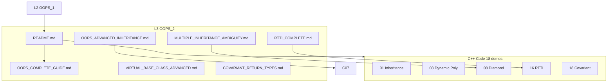
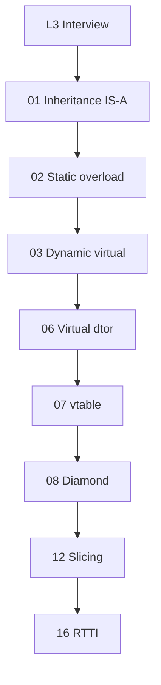

# L3 — OOP Part 2: Complete Reference (Inheritance + Polymorphism)

> **Part 2 of full OOP track** — L2 fundamentals ke baad yahan **Inheritance** aur **Polymorphism** (static + dynamic) complete.

<p align="center">
  
  
  
</p>

---

## Start here

| Document | Kya hai |
| -------- | ------- |
| **[`OOPS_COMPLETE_GUIDE.md`](./OOPS_COMPLETE_GUIDE.md)** | **Master L3** — inheritance, polymorphism |
| **[`OOPS_ADVANCED_INHERITANCE.md`](./OOPS_ADVANCED_INHERITANCE.md)** | **Advanced** — vtable, virtual dtor, diamond, virtual inheritance, overload vs override |
| **[`notes/OOPS_INHERITANCE_INTERVIEW_TOPICS.md`](./notes/OOPS_INHERITANCE_INTERVIEW_TOPICS.md)** | **Interview** — access in inheritance, ctor chaining, slicing, casting, cohesion/coupling |
| **[`MULTIPLE_INHERITANCE_AMBIGUITY.md`](./MULTIPLE_INHERITANCE_AMBIGUITY.md)** | MI ambiguity, diamond, virtual inheritance |
| **[`RTTI_COMPLETE.md`](./RTTI_COMPLETE.md)** | `typeid`, `dynamic_cast`, `-fno-rtti` |
| **[`VIRTUAL_BASE_CLASS_ADVANCED.md`](./VIRTUAL_BASE_CLASS_ADVANCED.md)** | Virtual base ctor order, vbptr, diamond advanced |
| **[`COVARIANT_RETURN_TYPES.md`](./COVARIANT_RETURN_TYPES.md)** | Override with `Derived*` return |
| **[`L2 OOPS_ADVANCED_CPP`](../L2%20OOPS_1/OOPS_ADVANCED_CPP.md)** | RAII, smart ptr, move, Rule 3/5/0 |
| [`notes/`](./notes/) | Topic-wise revision |

**Legacy alias:** [`OOPS_2_COMPLETE.md`](./OOPS_2_COMPLETE.md)

---

## Architecture — L3 folder map



---

## Code index (`C++ Code/` — `01_` … `18_`)

| # | File | Topic |
| - | ---- | ----- |
| 01 | [`01_Inheritance.cpp`](./C%20%2B%2B%20Code/01_Inheritance.cpp) | Hierarchical inheritance, `protected` |
| 02 | [`02_Static_Polymorphism.cpp`](./C%20%2B%2B%20Code/02_Static_Polymorphism.cpp) | Method overloading |
| 03 | [`03_Dynamic_Polymorphism.cpp`](./C%20%2B%2B%20Code/03_Dynamic_Polymorphism.cpp) | `virtual`, override, dispatch |
| 04 | [`04_Static_And_Dynamic_Polymorphism.cpp`](./C%20%2B%2B%20Code/04_Static_And_Dynamic_Polymorphism.cpp) | Both together |
| 05 | [`05_Composition_Vs_Inheritance.cpp`](./C%20%2B%2B%20Code/05_Composition_Vs_Inheritance.cpp) | HAS-A vs IS-A |
| 06 | [`06_Virtual_Destructor.cpp`](./C%20%2B%2B%20Code/06_Virtual_Destructor.cpp) | Why `virtual ~Base()` |
| 07 | [`07_Virtual_Table_Demo.cpp`](./C%20%2B%2B%20Code/07_Virtual_Table_Demo.cpp) | vptr / vtable |
| 08 | [`08_Diamond_Problem.cpp`](./C%20%2B%2B%20Code/08_Diamond_Problem.cpp) | Diamond + virtual inheritance |
| 09 | [`09_Overloading_Vs_Overriding.cpp`](./C%20%2B%2B%20Code/09_Overloading_Vs_Overriding.cpp) | Side-by-side compare |
| 10 | [`10_Access_Specifiers_Inheritance.cpp`](./C%20%2B%2B%20Code/10_Access_Specifiers_Inheritance.cpp) | public/protected/private inheritance |
| 11 | [`11_Constructor_Chaining.cpp`](./C%20%2B%2B%20Code/11_Constructor_Chaining.cpp) | Base → Derived order |
| 12 | [`12_Object_Slicing.cpp`](./C%20%2B%2B%20Code/12_Object_Slicing.cpp) | Value copy vs pointer/ref |
| 13 | [`13_Upcasting_Downcasting.cpp`](./C%20%2B%2B%20Code/13_Upcasting_Downcasting.cpp) | `dynamic_cast`, `bad_cast` |
| 14 | [`14_Cohesion_Coupling.cpp`](./C%20%2B%2B%20Code/14_Cohesion_Coupling.cpp) | God class vs SRP split |
| 15 | [`15_Multiple_Inheritance_Ambiguity.cpp`](./C%20%2B%2B%20Code/15_Multiple_Inheritance_Ambiguity.cpp) | Scope resolution + diamond |
| 16 | [`16_RTTI_Typeid_Dynamic_Cast.cpp`](./C%20%2B%2B%20Code/16_RTTI_Typeid_Dynamic_Cast.cpp) | `typeid`, `dynamic_cast`, flags |
| 17 | [`17_Virtual_Base_Class_Advanced.cpp`](./C%20%2B%2B%20Code/17_Virtual_Base_Class_Advanced.cpp) | Most-derived initializes virtual base |
| 18 | [`18_Covariant_Return_Types.cpp`](./C%20%2B%2B%20Code/18_Covariant_Return_Types.cpp) | `Derived*` override return |

**Naming:** `NN_Topic_Words.cpp` — `bin/` output same name as file (e.g. `./bin/08_Diamond_Problem`).

---

## Detailed breakdown — har `.cpp` file (18 files)

### 01. Inheritance

| Field | Detail |
| ----- | ------ |
| **File** | [`01_Inheritance.cpp`](./C%20%2B%2B%20Code/01_Inheritance.cpp) |
| **Topic** | Hierarchical inheritance, `protected` |
| **Guide** | [`OOPS_COMPLETE_GUIDE.md#2-inheritance--full-detail`](../L3 OOPS_2/OOPS_COMPLETE_GUIDE.md#2-inheritance--full-detail) |
| **Run** | `./bin/01_Inheritance` |

```bash
cd "L3 OOPS_2"
./compile.sh
./bin/01_Inheritance
```

### 02. Static Polymorphism

| Field | Detail |
| ----- | ------ |
| **File** | [`02_Static_Polymorphism.cpp`](./C%20%2B%2B%20Code/02_Static_Polymorphism.cpp) |
| **Topic** | Method overloading |
| **Guide** | [`OOPS_COMPLETE_GUIDE.md#5-static-polymorphism-overloading`](../L3 OOPS_2/OOPS_COMPLETE_GUIDE.md#5-static-polymorphism-overloading) |
| **Run** | `./bin/02_Static_Polymorphism` |

```bash
cd "L3 OOPS_2"
./compile.sh
./bin/02_Static_Polymorphism
```

### 03. Dynamic Polymorphism

| Field | Detail |
| ----- | ------ |
| **File** | [`03_Dynamic_Polymorphism.cpp`](./C%20%2B%2B%20Code/03_Dynamic_Polymorphism.cpp) |
| **Topic** | `virtual`, override, dispatch |
| **Guide** | [`OOPS_COMPLETE_GUIDE.md#6-dynamic-polymorphism-overriding`](../L3 OOPS_2/OOPS_COMPLETE_GUIDE.md#6-dynamic-polymorphism-overriding) |
| **Run** | `./bin/03_Dynamic_Polymorphism` |

```bash
cd "L3 OOPS_2"
./compile.sh
./bin/03_Dynamic_Polymorphism
```

### 04. Static + Dynamic

| Field | Detail |
| ----- | ------ |
| **File** | [`04_Static_And_Dynamic_Polymorphism.cpp`](./C%20%2B%2B%20Code/04_Static_And_Dynamic_Polymorphism.cpp) |
| **Topic** | Both together |
| **Guide** | [`OOPS_COMPLETE_GUIDE.md`](../L3 OOPS_2/OOPS_COMPLETE_GUIDE.md) |
| **Run** | `./bin/04_Static_And_Dynamic_Polymorphism` |

```bash
cd "L3 OOPS_2"
./compile.sh
./bin/04_Static_And_Dynamic_Polymorphism
```

### 05. Composition vs Inheritance

| Field | Detail |
| ----- | ------ |
| **File** | [`05_Composition_Vs_Inheritance.cpp`](./C%20%2B%2B%20Code/05_Composition_Vs_Inheritance.cpp) |
| **Topic** | HAS-A vs IS-A |
| **Guide** | [`OOPS_COMPLETE_GUIDE.md#4-composition-vs-inheritance`](../L3 OOPS_2/OOPS_COMPLETE_GUIDE.md#4-composition-vs-inheritance) |
| **Run** | `./bin/05_Composition_Vs_Inheritance` |

```bash
cd "L3 OOPS_2"
./compile.sh
./bin/05_Composition_Vs_Inheritance
```

### 06. Virtual Destructor

| Field | Detail |
| ----- | ------ |
| **File** | [`06_Virtual_Destructor.cpp`](./C%20%2B%2B%20Code/06_Virtual_Destructor.cpp) |
| **Topic** | Why `virtual ~Base()` |
| **Guide** | [`Virtual_Destructor_Kyun.md`](./notes/Virtual_Destructor_Kyun.md) |
| **Run** | `./bin/06_Virtual_Destructor` |

```bash
cd "L3 OOPS_2"
./compile.sh
./bin/06_Virtual_Destructor
```

### 07. Virtual Table

| Field | Detail |
| ----- | ------ |
| **File** | [`07_Virtual_Table_Demo.cpp`](./C%20%2B%2B%20Code/07_Virtual_Table_Demo.cpp) |
| **Topic** | vptr / vtable |
| **Guide** | [`OOPS_ADVANCED_INHERITANCE.md`](./OOPS_ADVANCED_INHERITANCE.md) |
| **Run** | `./bin/07_Virtual_Table_Demo` |

```bash
cd "L3 OOPS_2"
./compile.sh
./bin/07_Virtual_Table_Demo
```

### 08. Diamond Problem

| Field | Detail |
| ----- | ------ |
| **File** | [`08_Diamond_Problem.cpp`](./C%20%2B%2B%20Code/08_Diamond_Problem.cpp) |
| **Topic** | Diamond + virtual inheritance |
| **Guide** | [`MULTIPLE_INHERITANCE_AMBIGUITY.md`](./MULTIPLE_INHERITANCE_AMBIGUITY.md) |
| **Run** | `./bin/08_Diamond_Problem` |

```bash
cd "L3 OOPS_2"
./compile.sh
./bin/08_Diamond_Problem
```

### 09. Overloading vs Overriding

| Field | Detail |
| ----- | ------ |
| **File** | [`09_Overloading_Vs_Overriding.cpp`](./C%20%2B%2B%20Code/09_Overloading_Vs_Overriding.cpp) |
| **Topic** | Side-by-side compare |
| **Guide** | [`OOPS_ADVANCED_INHERITANCE.md`](./OOPS_ADVANCED_INHERITANCE.md) |
| **Run** | `./bin/09_Overloading_Vs_Overriding` |

```bash
cd "L3 OOPS_2"
./compile.sh
./bin/09_Overloading_Vs_Overriding
```

### 10. Access in Inheritance

| Field | Detail |
| ----- | ------ |
| **File** | [`10_Access_Specifiers_Inheritance.cpp`](./C%20%2B%2B%20Code/10_Access_Specifiers_Inheritance.cpp) |
| **Topic** | public/protected/private inheritance |
| **Guide** | [`OOPS_INHERITANCE_INTERVIEW_TOPICS.md`](./notes/OOPS_INHERITANCE_INTERVIEW_TOPICS.md) |
| **Run** | `./bin/10_Access_Specifiers_Inheritance` |

```bash
cd "L3 OOPS_2"
./compile.sh
./bin/10_Access_Specifiers_Inheritance
```

### 11. Constructor Chaining

| Field | Detail |
| ----- | ------ |
| **File** | [`11_Constructor_Chaining.cpp`](./C%20%2B%2B%20Code/11_Constructor_Chaining.cpp) |
| **Topic** | Base → Derived order |
| **Guide** | [`06_access_and_chaining.md`](./notes/06_access_and_chaining.md) |
| **Run** | `./bin/11_Constructor_Chaining` |

```bash
cd "L3 OOPS_2"
./compile.sh
./bin/11_Constructor_Chaining
```

### 12. Object Slicing

| Field | Detail |
| ----- | ------ |
| **File** | [`12_Object_Slicing.cpp`](./C%20%2B%2B%20Code/12_Object_Slicing.cpp) |
| **Topic** | Value copy vs pointer/ref |
| **Guide** | [`07_slicing_and_casting.md`](./notes/07_slicing_and_casting.md) |
| **Run** | `./bin/12_Object_Slicing` |

```bash
cd "L3 OOPS_2"
./compile.sh
./bin/12_Object_Slicing
```

### 13. Upcasting & Downcasting

| Field | Detail |
| ----- | ------ |
| **File** | [`13_Upcasting_Downcasting.cpp`](./C%20%2B%2B%20Code/13_Upcasting_Downcasting.cpp) |
| **Topic** | `dynamic_cast`, `bad_cast` |
| **Guide** | [`RTTI_COMPLETE.md`](./RTTI_COMPLETE.md) |
| **Run** | `./bin/13_Upcasting_Downcasting` |

```bash
cd "L3 OOPS_2"
./compile.sh
./bin/13_Upcasting_Downcasting
```

### 14. Cohesion & Coupling

| Field | Detail |
| ----- | ------ |
| **File** | [`14_Cohesion_Coupling.cpp`](./C%20%2B%2B%20Code/14_Cohesion_Coupling.cpp) |
| **Topic** | God class vs SRP split |
| **Guide** | [`08_cohesion_coupling.md`](./notes/08_cohesion_coupling.md) |
| **Run** | `./bin/14_Cohesion_Coupling` |

```bash
cd "L3 OOPS_2"
./compile.sh
./bin/14_Cohesion_Coupling
```

### 15. MI Ambiguity

| Field | Detail |
| ----- | ------ |
| **File** | [`15_Multiple_Inheritance_Ambiguity.cpp`](./C%20%2B%2B%20Code/15_Multiple_Inheritance_Ambiguity.cpp) |
| **Topic** | Scope resolution + diamond |
| **Guide** | [`MULTIPLE_INHERITANCE_AMBIGUITY.md`](./MULTIPLE_INHERITANCE_AMBIGUITY.md) |
| **Run** | `./bin/15_Multiple_Inheritance_Ambiguity` |

```bash
cd "L3 OOPS_2"
./compile.sh
./bin/15_Multiple_Inheritance_Ambiguity
```

### 16. RTTI

| Field | Detail |
| ----- | ------ |
| **File** | [`16_RTTI_Typeid_Dynamic_Cast.cpp`](./C%20%2B%2B%20Code/16_RTTI_Typeid_Dynamic_Cast.cpp) |
| **Topic** | `typeid`, `dynamic_cast`, flags |
| **Guide** | [`RTTI_COMPLETE.md`](./RTTI_COMPLETE.md) |
| **Run** | `./bin/16_RTTI_Typeid_Dynamic_Cast` |

```bash
cd "L3 OOPS_2"
./compile.sh
./bin/16_RTTI_Typeid_Dynamic_Cast
```

### 17. Virtual Base Advanced

| Field | Detail |
| ----- | ------ |
| **File** | [`17_Virtual_Base_Class_Advanced.cpp`](./C%20%2B%2B%20Code/17_Virtual_Base_Class_Advanced.cpp) |
| **Topic** | Most-derived initializes virtual base |
| **Guide** | [`VIRTUAL_BASE_CLASS_ADVANCED.md`](./VIRTUAL_BASE_CLASS_ADVANCED.md) |
| **Run** | `./bin/17_Virtual_Base_Class_Advanced` |

```bash
cd "L3 OOPS_2"
./compile.sh
./bin/17_Virtual_Base_Class_Advanced
```

### 18. Covariant Returns

| Field | Detail |
| ----- | ------ |
| **File** | [`18_Covariant_Return_Types.cpp`](./C%20%2B%2B%20Code/18_Covariant_Return_Types.cpp) |
| **Topic** | `Derived*` override return |
| **Guide** | [`COVARIANT_RETURN_TYPES.md`](./COVARIANT_RETURN_TYPES.md) |
| **Run** | `./bin/18_Covariant_Return_Types` |

```bash
cd "L3 OOPS_2"
./compile.sh
./bin/18_Covariant_Return_Types
```

---

### Dedicated topic guide

| Topic | Markdown |
| ----- | -------- |
| **Virtual destructor kyun?** | [`notes/Virtual_Destructor_Kyun.md`](./notes/Virtual_Destructor_Kyun.md) |
| **Access, slicing, casting, cohesion** | [`notes/OOPS_INHERITANCE_INTERVIEW_TOPICS.md`](./notes/OOPS_INHERITANCE_INTERVIEW_TOPICS.md) |

---

## Topic guides — deep index

| Guide | Covers |
| ----- | ------ |
| [`OOPS_COMPLETE_GUIDE.md`](./OOPS_COMPLETE_GUIDE.md) | Inheritance types, static/dynamic polymorphism, composition vs inheritance |
| [`OOPS_ADVANCED_INHERITANCE.md`](./OOPS_ADVANCED_INHERITANCE.md) | vtable internals, virtual dtor, diamond problem overview |
| [`MULTIPLE_INHERITANCE_AMBIGUITY.md`](./MULTIPLE_INHERITANCE_AMBIGUITY.md) | MI ambiguity, scope resolution, virtual inheritance intro |
| [`RTTI_COMPLETE.md`](./RTTI_COMPLETE.md) | typeid, dynamic_cast, static_cast vs dynamic_cast, -fno-rtti |
| [`VIRTUAL_BASE_CLASS_ADVANCED.md`](./VIRTUAL_BASE_CLASS_ADVANCED.md) | vbptr, most-derived ctor initializes virtual base |
| [`COVARIANT_RETURN_TYPES.md`](./COVARIANT_RETURN_TYPES.md) | Override return type Derived* when base returns Base* |
| [`notes/Virtual_Destructor_Kyun.md`](./notes/Virtual_Destructor_Kyun.md) | Hindi/English — delete Base* pointing to Derived |
| [`notes/OOPS_INHERITANCE_INTERVIEW_TOPICS.md`](./notes/OOPS_INHERITANCE_INTERVIEW_TOPICS.md) | Access specifiers, ctor chain, slicing, casting |
| [`notes/01_inheritance.md`](./notes/01_inheritance.md) | Quick revision — IS-A, protected |
| [`notes/02_polymorphism.md`](./notes/02_polymorphism.md) | Overloading vs overriding summary |
| [`notes/03_virtual_diamond.md`](./notes/03_virtual_diamond.md) | Virtual keyword + diamond sketch |
| [`notes/06_access_and_chaining.md`](./notes/06_access_and_chaining.md) | public/protected/private inheritance |
| [`notes/07_slicing_and_casting.md`](./notes/07_slicing_and_casting.md) | Object slicing + upcast/downcast |
| [`notes/08_cohesion_coupling.md`](./notes/08_cohesion_coupling.md) | Design quality metrics |
| [`notes/09_mi_rtti_conversion.md`](./notes/09_mi_rtti_conversion.md) | MI + RTTI + covariant combined revision |

---

## Learning order — recommended

```
Phase 1 — Core (01–05)
  01 Inheritance → 02 Static Poly → 03 Dynamic Poly → 04 Both → 05 Comp vs Inherit

Phase 2 — Virtual mechanics (06–09)
  06 Virtual Dtor → 07 vtable → 08 Diamond → 09 Overload vs Override

Phase 3 — Interview depth (10–14)
  10 Access → 11 Ctor chain → 12 Slicing → 13 Casting → 14 Cohesion

Phase 4 — Advanced (15–18)
  15 MI Ambiguity → 16 RTTI → 17 Virtual Base → 18 Covariant
```

```bash
cd "L3 OOPS_2"
./compile.sh
./bin/03_Dynamic_Polymorphism
```

---

## Interview prep roadmap



### Must-know questions

| Question | Answer pointer |
| -------- | -------------- |
| Virtual function kya hai? | vtable dispatch — runtime polymorphism. File 03, 07. |
| Virtual destructor kyun? | delete Base* → Derived dtor. File 06. |
| Diamond problem? | Two Base subobjects — virtual inheritance. File 08, 17. |
| Overloading vs overriding? | Same class compile-time vs base-derived runtime. File 09. |
| Object slicing? | Derived assigned to Base by value loses derived part. File 12. |
| dynamic_cast vs static_cast? | RTTI safe downcast vs no runtime check. File 13, 16. |
| Covariant return? | Override may return Derived* when base returns Base*. File 18. |
| Composition vs inheritance? | Has-A vs Is-A — prefer composition. File 05. |
| public vs protected inheritance? | Changes visibility of inherited members. File 10. |
| Constructor order? | Base first, members, derived body. Reverse for dtor. File 11. |

---

## 4 Pillars — L3 completes the set

| # | Pillar | L3 files |
| - | ------ | -------- |
| 1 | Encapsulation | (L2) — L3 adds protected for children |
| 2 | Abstraction | (L2) — L3 adds override + pure virtual use |
| 3 | **Inheritance** | 01, 05, 10, 11 |
| 4 | **Polymorphism** | 02, 03, 04, 09 |

---

## Build & run

```bash
cd "L3 OOPS_2"
chmod +x compile.sh
./compile.sh
./bin/08_Diamond_Problem
./bin/16_RTTI_Typeid_Dynamic_Cast
```

| Flag | Purpose |
| ---- | ------- |
| `-std=c++17` | override keyword, modern casts |
| `-Wall -Wextra -pedantic` | Strict warnings |

### Week 1 study plan

- [ ] **01 Inheritance** — `./bin/01_Inheritance` — Hierarchical inheritance, `protected`
- [ ] **02 Static Polymorphism** — `./bin/02_Static_Polymorphism` — Method overloading
- [ ] **03 Dynamic Polymorphism** — `./bin/03_Dynamic_Polymorphism` — `virtual`, override, dispatch
- [ ] **04 Static + Dynamic** — `./bin/04_Static_And_Dynamic_Polymorphism` — Both together
- [ ] **05 Composition vs Inheritance** — `./bin/05_Composition_Vs_Inheritance` — HAS-A vs IS-A

### Week 2 study plan

- [ ] **06 Virtual Destructor** — `./bin/06_Virtual_Destructor` — Why `virtual ~Base()`
- [ ] **07 Virtual Table** — `./bin/07_Virtual_Table_Demo` — vptr / vtable
- [ ] **08 Diamond Problem** — `./bin/08_Diamond_Problem` — Diamond + virtual inheritance
- [ ] **09 Overloading vs Overriding** — `./bin/09_Overloading_Vs_Overriding` — Side-by-side compare
- [ ] **10 Access in Inheritance** — `./bin/10_Access_Specifiers_Inheritance` — public/protected/private inheritance

### Week 3 study plan

- [ ] **11 Constructor Chaining** — `./bin/11_Constructor_Chaining` — Base → Derived order
- [ ] **12 Object Slicing** — `./bin/12_Object_Slicing` — Value copy vs pointer/ref
- [ ] **13 Upcasting & Downcasting** — `./bin/13_Upcasting_Downcasting` — `dynamic_cast`, `bad_cast`
- [ ] **14 Cohesion & Coupling** — `./bin/14_Cohesion_Coupling` — God class vs SRP split
- [ ] **15 MI Ambiguity** — `./bin/15_Multiple_Inheritance_Ambiguity` — Scope resolution + diamond

### Week 4 study plan

- [ ] **16 RTTI** — `./bin/16_RTTI_Typeid_Dynamic_Cast` — `typeid`, `dynamic_cast`, flags
- [ ] **17 Virtual Base Advanced** — `./bin/17_Virtual_Base_Class_Advanced` — Most-derived initializes virtual base
- [ ] **18 Covariant Returns** — `./bin/18_Covariant_Return_Types` — `Derived*` override return

---

## vtable quick reference

| Concept | Detail |
| ------- | ------ |
| vptr | Hidden pointer in polymorphic object |
| vtable | Per-class array of function pointers |
| Cost | Extra indirection + memory per object |
| File | [`07_Virtual_Table_Demo.cpp`](./C%20%2B%2B%20Code/07_Virtual_Table_Demo.cpp) |

---

## RTTI quick reference

| API | Use | File |
| --- | --- | ---- |
| `typeid(x).name()` | Runtime type name | 16 |
| `dynamic_cast<T*>` | Safe downcast, nullptr on fail | 13, 16 |
| `dynamic_cast<T&>` | Throws bad_cast on fail | 13 |
| `-fno-rtti` | Disable RTTI — smaller binary | RTTI_COMPLETE.md |

---

⬅️ [L2 OOPS_1](../L2%20OOPS_1/README.md) · ➡️ [L4 UML](../L4%20UML_Diagrams/UML_DIAGRAMS_AND_NOTATION.md)
