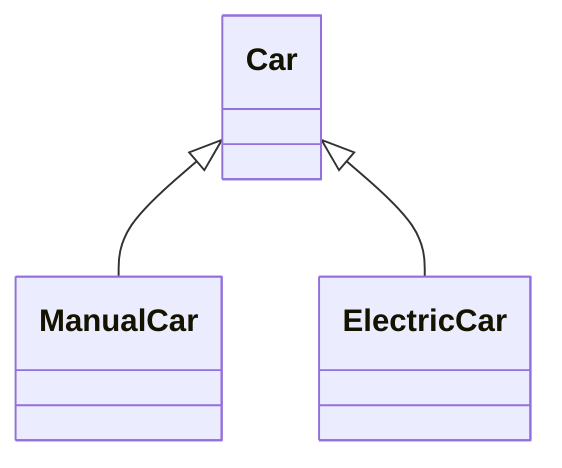
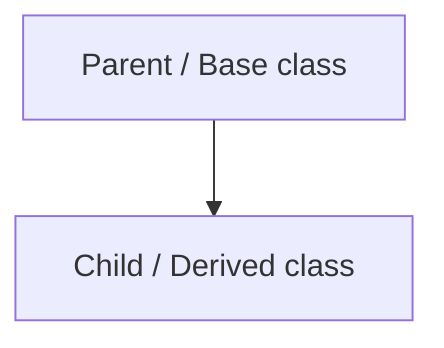
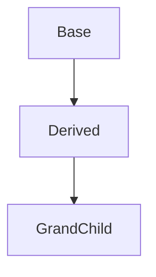
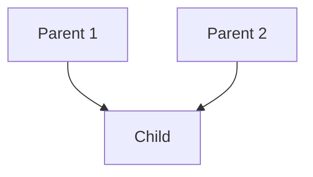
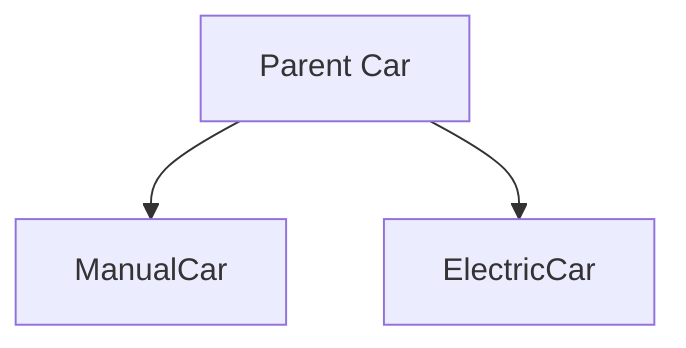
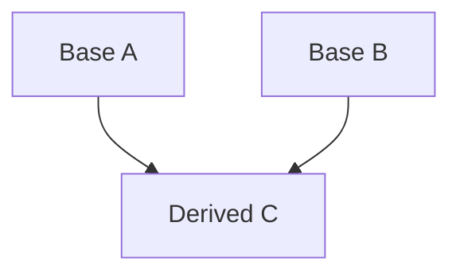
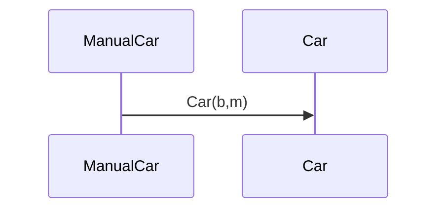
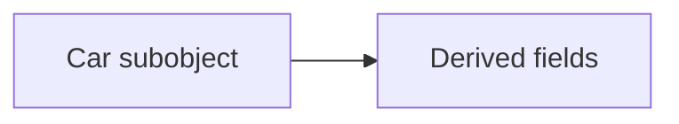

# Inheritance — Complete Guide (विरासत)

> **EN:** Derived classes extend a base (IS-A), reuse code, add specialization.
> **HI:** Child parent se inherit karti hai — code reuse + extra behaviour.

> **Demo:** [`01_Inheritance.cpp`](../C++%20Code/01_Inheritance.cpp)
> **Guides:** [OOPS_2_COMPLETE](../OOPS_2_COMPLETE.md) · [OOPS_ADVANCED_INHERITANCE](../OOPS_ADVANCED_INHERITANCE.md)

---

## Table of Contents

1. [IS-A real world](#1-is-a)
2. [Syntax & access](#2-syntax)
3. [protected bridge](#3-protected)
4. [Five inheritance types](#4-types)
5. [Ctor/dtor chaining](#5-chain)
6. [Walkthrough 01_Inheritance.cpp](#6-walk)
7. [Object layout](#7    )
8. [vs composition](#8-comp)
9. [Mermaid](#9-mermaid)
10. [Interview Q&A](#10-qa)
11. [Mistakes & compile](#11-end)

---

## 1. IS-A real world

<a id="1-is-a"></a>

ManualCar **is a** Car — brand, model, engine shared; gears or battery added.



**हिंदी:** IS-A sahi ho to public inherit; HAS-A ke liye composition.

---

## 2. Syntax & access

<a id="2-syntax"></a>

```cpp
class ManualCar : public Car {
public:
    ManualCar(string b, string m) : Car(b, m) { }
};
```

| Base member | Child | Outside |
|-------------|-------|---------|
| public | yes | yes |
| protected | yes | no |
| private | no | no |

**Inheritance type se access change (notebook table):** [06_access_and_chaining.md §2](06_access_and_chaining.md#2-inheritance-modes-access-table)

---

## 3. protected bridge

<a id="3-protected"></a>

`brand`, `model` protected — `shiftGear` uses them; `main` cannot.

---

## 4. Types of inheritance (5 types)

<a id="4-types"></a>

| Type | Hindi / one line | Example | Demo file |
| ---- | ---------------- | ------- | --------- |
| **All 5 in one file** | revision / interview | sab types `main` mein | [`00_Five_Types_Of_Inheritance.cpp`](../C++%20Code/00_Five_Types_Of_Inheritance.cpp) |
| **Single** | ek parent, ek child | `ManualCar : Car` | [`01_Inheritance.cpp`](../C++%20Code/01_Inheritance.cpp) |
| **Multilevel** | chain — grandparent → parent → child | `GrandChild : Derived : Base` | [`11_Constructor_Chaining.cpp`](../C++%20Code/11_Constructor_Chaining.cpp) |
| **Multiple** | do parents, ek child | `AllInOne : Printer, Scanner` | [`15_Multiple_Inheritance_Ambiguity.cpp`](../C++%20Code/15_Multiple_Inheritance_Ambiguity.cpp) |
| **Hierarchical** | ek parent, kai children | `ManualCar`, `ElectricCar : Car` | [`01_Inheritance.cpp`](../C++%20Code/01_Inheritance.cpp) |
| **Hybrid** | upar ke types ka mix | `TA : Employee, Student` + diamond | [`08_Diamond_Problem.cpp`](../C++%20Code/08_Diamond_Problem.cpp) |

### 4.1 Single inheritance

> **Single →** ek parent class hai, ek child class hai.



```cpp
class ManualCar : public Car { /* ... */ };
```

### 4.2 Multilevel inheritance



### 4.3 Multiple inheritance



### 4.4 Hierarchical inheritance



### 4.5 Hybrid inheritance

Combination of single / multilevel / multiple / hierarchical (e.g. diamond problem).



**Access table (public / protected / private inherit):** [`06_access_and_chaining.md` §2](06_access_and_chaining.md#2-inheritance-modes-access-table) · Code: [`10_Access_Specifiers_Inheritance.cpp`](../C++%20Code/10_Access_Specifiers_Inheritance.cpp)

---

## 5. Ctor/dtor chaining

<a id="5-chain"></a>

`: Car(b,m)` runs before ManualCar body. `delete` → ~ManualCar then ~Car. `virtual ~Car()`.



---

## 6. Walkthrough 01_Inheritance.cpp

<a id="6-walk"></a>

**Car 22–65:** protected state; start/stop/accelerate/brake; virtual dtor.

**ManualCar 67–81:** shiftGear; ctor chains Car.

**ElectricCar 83–97:** chargeBattery.

**main 102–122:** new/delete; inherited + specialized methods.

---

## 7. Object layout

<a id="layout"></a>

ManualCar object = Car subobject + currentGear (+ vptr if virtual).

---

## 8. vs composition

<a id="8-comp"></a>

IS-A → inherit. HAS-A → member object [`05_Composition_Vs_Inheritance.cpp`](../C++%20Code/05_Composition_Vs_Inheritance.cpp).

---

## 9. Mermaid

<a id="9-mermaid"></a>



---

## 10. Interview Q&A

<a id="10-qa"></a>

<details>
<summary><strong>What is inheritance?</strong></summary>

Derived gets base members/behaviour; extends or specializes.

**हिंदी:** Child parent se inherit.

</details>


<details>
<summary><strong>IS-A vs HAS-A?</strong></summary>

Inheritance vs composition.

**हिंदी:** IS-A inherit; HAS-A part.

</details>


<details>
<summary><strong>Why public inheritance?</strong></summary>

Preserves IS-A and upcasting.

**हिंदी:** Default public.

</details>


<details>
<summary><strong>protected meaning?</strong></summary>

Child yes, outside no.

**हिंदी:** Sirf child access.

</details>


<details>
<summary><strong>Ctor order?</strong></summary>

Base before derived body.

**हिंदी:** Pehle Base.

</details>


<details>
<summary><strong>Dtor order?</strong></summary>

Derived then base.

**हिंदी:** Pehle ~Derived.

</details>


<details>
<summary><strong>Child access private base?</strong></summary>

No.

**हिंदी:** private nahi.

</details>


<details>
<summary><strong>Five inheritance types?</strong></summary>

Single,multilevel,multiple,hierarchical,hybrid.

**हिंदी:** Paanch types.

</details>


<details>
<summary><strong>Virtual destructor why?</strong></summary>

Safe delete via Car*.

**हिंदी:** Base* delete.

</details>


<details>
<summary><strong>Multiple inheritance?</strong></summary>

class D:public A,public B

**हिंदी:** Do bases.

</details>


<details>
<summary><strong>Diamond problem?</strong></summary>

Two A subobjects in MI.

**हिंदी:** Do copies.

</details>


<details>
<summary><strong>Virtual inheritance fix?</strong></summary>

virtual public Base.

**हिंदी:** Ek shared base.

</details>


<details>
<summary><strong>Can ctor be virtual?</strong></summary>

No.

**हिंदी:** Ctor virtual nahi.

</details>


<details>
<summary><strong>Liskov?</strong></summary>

Subtype substitutable for base.

**हिंदी:** Child base ki jagah.

</details>


<details>
<summary><strong>Object slicing?</strong></summary>

Derived to base by value loses part.

**हिंदी:** Value slice.

</details>


<details>
<summary><strong>sizeof derived?</strong></summary>

>= sizeof base.

**हिंदी:** Barabar ya bada.

</details>


<details>
<summary><strong>When not inherit?</strong></summary>

HAS-A or wrong IS-A.

**हिंदी:** Galat IS-A avoid.

</details>


<details>
<summary><strong>Friend protected?</strong></summary>

Friends access private/protected.

**हिंदी:** friend special.

</details>


<details>
<summary><strong>Code reuse only?</strong></summary>

Also polymorphism; prefer composition if only reuse.

**हिंदी:** Sirf reuse mat karo.

</details>


<details>
<summary><strong>Multilevel file?</strong></summary>

11_Constructor_Chaining.cpp

**हिंदी:** Chain demo.

</details>


---

## 11. Mistakes & compile

<a id="11-end"></a>

| Mistake | Fix |
|---------|-----|
| No `: Car(args)` | init list |
| public fields | protected |
| delete Base* no virtual ~ | virtual ~Base |

```bash
cd "L3 OOPS_2" && ./compile.sh && ./bin/01_Inheritance
```

---

## Extended revision bank

### Revision drill — 01_inheritance.md #1

**EN:** Re-run the linked .cpp, predict output before executing.
**HI:** Demo chalao, output likh ke match karo.

### Whiteboard — 01_inheritance.md #2

**EN:** Draw class diagram and ctor order without looking at notes.
**HI:** Diagram +attached class + ctor order banao.

### Compare EN/HI — 01_inheritance.md #3

**EN:** State the rule in one English sentence and one Hindi mnemonic.
**HI:** Ek EN + ek HI line yaad karo.

### Interview twist — 01_inheritance.md #4

**EN:** Interviewer asks 'what if' — answer using the demo code path.
**HI:** 'What if' ke liye demo code trace karo.

### Link forward — 01_inheritance.md #5

**EN:** Note which next file in L3 OOPS_2 builds on this topic.
**HI:** Agla lesson ka link dekho.

### Revision drill — 01_inheritance.md #6

**EN:** Re-run the linked .cpp, predict output before executing.
**HI:** Demo chalao, output likh ke match karo.

### Whiteboard — 01_inheritance.md #7

**EN:** Draw class diagram and ctor order without looking at notes.
**HI:** Diagram +attached class + ctor order banao.

### Compare EN/HI — 01_inheritance.md #8

**EN:** State the rule in one English sentence and one Hindi mnemonic.
**HI:** Ek EN + ek HI line yaad karo.

### Interview twist — 01_inheritance.md #9

**EN:** Interviewer asks 'what if' — answer using the demo code path.
**HI:** 'What if' ke liye demo code trace karo.

### Link forward — 01_inheritance.md #10

**EN:** Note which next file in L3 OOPS_2 builds on this topic.
**HI:** Agla lesson ka link dekho.

### Revision drill — 01_inheritance.md #11

**EN:** Re-run the linked .cpp, predict output before executing.
**HI:** Demo chalao, output likh ke match karo.

### Whiteboard — 01_inheritance.md #12

**EN:** Draw class diagram and ctor order without looking at notes.
**HI:** Diagram +attached class + ctor order banao.

### Compare EN/HI — 01_inheritance.md #13

**EN:** State the rule in one English sentence and one Hindi mnemonic.
**HI:** Ek EN + ek HI line yaad karo.

### Interview twist — 01_inheritance.md #14

**EN:** Interviewer asks 'what if' — answer using the demo code path.
**HI:** 'What if' ke liye demo code trace karo.

### Link forward — 01_inheritance.md #15

**EN:** Note which next file in L3 OOPS_2 builds on this topic.
**HI:** Agla lesson ka link dekho.

### Revision drill — 01_inheritance.md #16

**EN:** Re-run the linked .cpp, predict output before executing.
**HI:** Demo chalao, output likh ke match karo.

### Whiteboard — 01_inheritance.md #17

**EN:** Draw class diagram and ctor order without looking at notes.
**HI:** Diagram +attached class + ctor order banao.

### Compare EN/HI — 01_inheritance.md #18

**EN:** State the rule in one English sentence and one Hindi mnemonic.
**HI:** Ek EN + ek HI line yaad karo.

### Interview twist — 01_inheritance.md #19

**EN:** Interviewer asks 'what if' — answer using the demo code path.
**HI:** 'What if' ke liye demo code trace karo.

### Link forward — 01_inheritance.md #20

**EN:** Note which next file in L3 OOPS_2 builds on this topic.
**HI:** Agla lesson ka link dekho.

### Revision drill — 01_inheritance.md #21

**EN:** Re-run the linked .cpp, predict output before executing.
**HI:** Demo chalao, output likh ke match karo.

### Whiteboard — 01_inheritance.md #22

**EN:** Draw class diagram and ctor order without looking at notes.
**HI:** Diagram +attached class + ctor order banao.

### Compare EN/HI — 01_inheritance.md #23

**EN:** State the rule in one English sentence and one Hindi mnemonic.
**HI:** Ek EN + ek HI line yaad karo.

### Interview twist — 01_inheritance.md #24

**EN:** Interviewer asks 'what if' — answer using the demo code path.
**HI:** 'What if' ke liye demo code trace karo.

### Link forward — 01_inheritance.md #25

**EN:** Note which next file in L3 OOPS_2 builds on this topic.
**HI:** Agla lesson ka link dekho.

### Revision drill — 01_inheritance.md #26

**EN:** Re-run the linked .cpp, predict output before executing.
**HI:** Demo chalao, output likh ke match karo.

### Whiteboard — 01_inheritance.md #27

**EN:** Draw class diagram and ctor order without looking at notes.
**HI:** Diagram +attached class + ctor order banao.

### Compare EN/HI — 01_inheritance.md #28

**EN:** State the rule in one English sentence and one Hindi mnemonic.
**HI:** Ek EN + ek HI line yaad karo.

### Interview twist — 01_inheritance.md #29

**EN:** Interviewer asks 'what if' — answer using the demo code path.
**HI:** 'What if' ke liye demo code trace karo.

