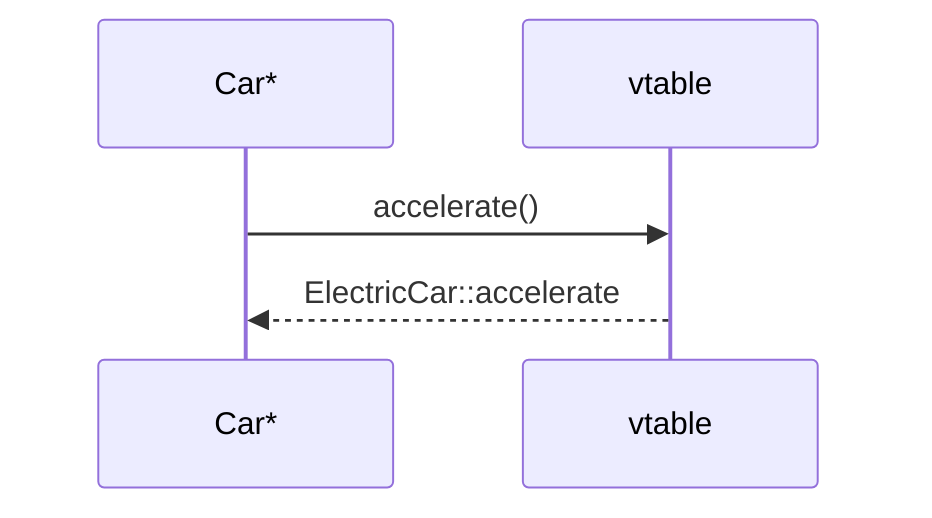

# Polymorphism — Static & Dynamic  

> **EN:** Same name, different behaviour — overload at compile time, override at runtime.

> **Runnable demo:** [`02_Static_Polymorphism.cpp`](../C++ Code/02_Static_Polymorphism.cpp)
> **Runnable demo:** [`03_Dynamic_Polymorphism.cpp`](../C++ Code/03_Dynamic_Polymorphism.cpp)
> **Runnable demo:** [`04_Static_And_Dynamic_Polymorphism.cpp`](../C++ Code/04_Static_And_Dynamic_Polymorphism.cpp)
> **Parent guides:** [OOPS_COMPLETE_GUIDE](../OOPS_COMPLETE_GUIDE.md)

---

## Table of Contents

1. [Definitions](#1-definitions)
2. [Static — overloading](#2-static)
3. [02 walkthrough](#3-02)
4. [Dynamic — virtual](#4-dynamic)
5. [03 walkthrough](#5-03)
6. [04 both](#6-04)
7. [Compare](#7-compare)
8. [Interview Q&A](#8-qa)
9. [Cheat sheet](#9-cheat)

## 1. Definitions

<a id="1-definitions"></a>

| Term | Meaning |
|------|---------|
| **Static polymorphism** | Resolved at **compile time** (overloading, templates) |
| **Dynamic polymorphism** | Resolved at **runtime** via **vtable** (virtual + override) |
## 2. Static — overloading

<a id="2-static-overloading"></a>

```cpp
void accelerate();
void accelerate(int speed);
```

In `02_Static_Polymorphism.cpp`, standalone `ManualCar` has both — compiler picks by args at **compile time**.
## 3. 02 walkthrough

<a id="3-02-walkthrough"></a>

Lines 44–60: two `accelerate` definitions — default +20 km/h vs custom increment.
No inheritance required — same class, different signatures.
## 4. Dynamic — virtual

<a id="4-dynamic-virtual"></a>

```cpp
virtual void accelerate() = 0;  // abstract
void accelerate() override { ... }
```

`03_Dynamic_Polymorphism.cpp`: `Car*` points to `ManualCar` or `ElectricCar` — runtime picks override.
## 5. 03 walkthrough

<a id="5-03-walkthrough"></a>

Electric `accelerate` drains `batteryLevel`; manual uses fixed +20 — same call `p->accelerate()`, different output.


## 6. 04 both

<a id="6-04-both"></a>

Full walkthrough: **[`04_static_and_dynamic_polymorphism.md`](04_static_and_dynamic_polymorphism.md)** — [`04_Static_And_Dynamic_Polymorphism.cpp`](../C++%20Code/04_Static_And_Dynamic_Polymorphism.cpp).
## 7. Compare

<a id="7-compare"></a>

|  | Static | Dynamic |
|---|---|---|
| When | Compile | Runtime |
| How | Overload | virtual+override |
| Abstract class | Not required | Common |
| Cost | Low | vptr/vtable |

## 8. Interview Q&A

<a id="8-interview-q-a"></a>

<details>
<summary><strong>Static vs dynamic polymorphism?</strong></summary>

Static=overload/templates compile-time; dynamic=virtual override runtime.


</details>

<details>
<summary><strong>Overloading vs overriding?</strong></summary>

Overload: same class, diff signature. Override: derived replaces virtual.


</details>

<details>
<summary><strong>Why pure virtual = 0?</strong></summary>

Makes class abstract — force derived implementation.


</details>

<details>
<summary><strong>Can static be runtime?</strong></summary>

No — overloading never uses vtable.


</details>

<details>
<summary><strong>Need pointer for dynamic?</strong></summary>

Yes for true runtime dispatch through base interface.


</details>

<details>
<summary><strong>virtual destructor why?</strong></summary>

Correct cleanup when delete base pointer.


</details>

<details>
<summary><strong>Two virtual accelerate in base?</strong></summary>

04 demo — each overload overridden separately in child.


</details>

<details>
<summary><strong>Compile error if miss override?</strong></summary>

Yes in `-Werror` / abstract — unimplemented pure virtual.


</details>

## 9. Cheat sheet

<a id="9-cheat-sheet"></a>

```text
Static: overload, compile
Dynamic: virtual + override
04: both virtual overloads in hierarchy
```

### Trap: hide not override

Without `virtual`, derived function **hides** base — not polymorphic.

### Trap: overload + virtual

Each overload is separate virtual — override all you need.

### Trap: hide not override

Without `virtual`, derived function **hides** base — not polymorphic.

### Trap: overload + virtual

Each overload is separate virtual — override all you need.

### Trap: hide not override

Without `virtual`, derived function **hides** base — not polymorphic.

### Trap: overload + virtual

Each overload is separate virtual — override all you need.

### Trap: hide not override

Without `virtual`, derived function **hides** base — not polymorphic.

### Trap: overload + virtual

Each overload is separate virtual — override all you need.

### Trap: hide not override

Without `virtual`, derived function **hides** base — not polymorphic.

### Trap: overload + virtual

Each overload is separate virtual — override all you need.

### Trap: hide not override

Without `virtual`, derived function **hides** base — not polymorphic.

### Trap: overload + virtual

Each overload is separate virtual — override all you need.

### Trap: hide not override

Without `virtual`, derived function **hides** base — not polymorphic.

### Trap: overload + virtual

Each overload is separate virtual — override all you need.

### Trap: hide not override

Without `virtual`, derived function **hides** base — not polymorphic.

### Trap: overload + virtual

Each overload is separate virtual — override all you need.

### Trap: hide not override

Without `virtual`, derived function **hides** base — not polymorphic.

### Trap: overload + virtual

Each overload is separate virtual — override all you need.

### Trap: hide not override

Without `virtual`, derived function **hides** base — not polymorphic.

### Trap: overload + virtual

Each overload is separate virtual — override all you need.

### Trap: hide not override

Without `virtual`, derived function **hides** base — not polymorphic.

### Trap: overload + virtual

Each overload is separate virtual — override all you need.

### Trap: hide not override

Without `virtual`, derived function **hides** base — not polymorphic.

### Trap: overload + virtual

Each overload is separate virtual — override all you need.

### Trap: hide not override

Without `virtual`, derived function **hides** base — not polymorphic.

### Trap: overload + virtual

Each overload is separate virtual — override all you need.

### Trap: hide not override

Without `virtual`, derived function **hides** base — not polymorphic.

### Trap: overload + virtual

Each overload is separate virtual — override all you need.

### Trap: hide not override

Without `virtual`, derived function **hides** base — not polymorphic.

### Trap: overload + virtual

Each overload is separate virtual — override all you need.

### Trap: hide not override

Without `virtual`, derived function **hides** base — not polymorphic.

### Trap: overload + virtual

Each overload is separate virtual — override all you need.

### Trap: hide not override

Without `virtual`, derived function **hides** base — not polymorphic.

### Trap: overload + virtual

Each overload is separate virtual — override all you need.

### Trap: hide not override

Without `virtual`, derived function **hides** base — not polymorphic.

### Trap: overload + virtual

Each overload is separate virtual — override all you need.

### Trap: hide not override

Without `virtual`, derived function **hides** base — not polymorphic.

### Trap: overload + virtual

Each overload is separate virtual — override all you need.

### Trap: hide not override

Without `virtual`, derived function **hides** base — not polymorphic.

### Trap: overload + virtual

Each overload is separate virtual — override all you need.

### Trap: hide not override

Without `virtual`, derived function **hides** base — not polymorphic.

### Trap: overload + virtual

Each overload is separate virtual — override all you need.

### Trap: hide not override

Without `virtual`, derived function **hides** base — not polymorphic.

### Trap: overload + virtual

Each overload is separate virtual — override all you need.

### Trap: hide not override

Without `virtual`, derived function **hides** base — not polymorphic.

### Trap: overload + virtual

Each overload is separate virtual — override all you need.

### Trap: hide not override

Without `virtual`, derived function **hides** base — not polymorphic.

### Trap: overload + virtual

Each overload is separate virtual — override all you need.

### Trap: hide not override

Without `virtual`, derived function **hides** base — not polymorphic.

### Trap: overload + virtual

Each overload is separate virtual — override all you need.

### Trap: hide not override

Without `virtual`, derived function **hides** base — not polymorphic.

### Trap: overload + virtual

Each overload is separate virtual — override all you need.

### Trap: hide not override

Without `virtual`, derived function **hides** base — not polymorphic.

### Trap: overload + virtual

Each overload is separate virtual — override all you need.

### Trap: hide not override

Without `virtual`, derived function **hides** base — not polymorphic.

### Trap: overload + virtual

Each overload is separate virtual — override all you need.

### Trap: hide not override

Without `virtual`, derived function **hides** base — not polymorphic.

### Trap: overload + virtual

Each overload is separate virtual — override all you need.

### Trap: hide not override

Without `virtual`, derived function **hides** base — not polymorphic.

### Trap: overload + virtual

Each overload is separate virtual — override all you need.

### Trap: hide not override

Without `virtual`, derived function **hides** base — not polymorphic.

### Trap: overload + virtual

Each overload is separate virtual — override all you need.

### Trap: hide not override

Without `virtual`, derived function **hides** base — not polymorphic.

### Trap: overload + virtual

Each overload is separate virtual — override all you need.

### Trap: hide not override

Without `virtual`, derived function **hides** base — not polymorphic.

### Trap: overload + virtual

Each overload is separate virtual — override all you need.

### Trap: hide not override

Without `virtual`, derived function **hides** base — not polymorphic.

### Trap: overload + virtual

Each overload is separate virtual — override all you need.

### Trap: hide not override

Without `virtual`, derived function **hides** base — not polymorphic.

### Trap: overload + virtual

Each overload is separate virtual — override all you need.

### Trap: hide not override

Without `virtual`, derived function **hides** base — not polymorphic.

### Trap: overload + virtual

Each overload is separate virtual — override all you need.

### Trap: hide not override

Without `virtual`, derived function **hides** base — not polymorphic.

### Trap: overload + virtual

Each overload is separate virtual — override all you need.

### Trap: hide not override

Without `virtual`, derived function **hides** base — not polymorphic.

### Trap: overload + virtual

Each overload is separate virtual — override all you need.

### Trap: hide not override

Without `virtual`, derived function **hides** base — not polymorphic.

### Trap: overload + virtual

Each overload is separate virtual — override all you need.

### Trap: hide not override

Without `virtual`, derived function **hides** base — not polymorphic.

### Trap: overload + virtual

Each overload is separate virtual — override all you need.

### Trap: hide not override

Without `virtual`, derived function **hides** base — not polymorphic.

### Trap: overload + virtual

Each overload is separate virtual — override all you need.

### Trap: hide not override

Without `virtual`, derived function **hides** base — not polymorphic.

### Trap: overload + virtual

Each overload is separate virtual — override all you need.

### Trap: hide not override

Without `virtual`, derived function **hides** base — not polymorphic.

### Trap: overload + virtual

Each overload is separate virtual — override all you need.

### Trap: hide not override

Without `virtual`, derived function **hides** base — not polymorphic.
