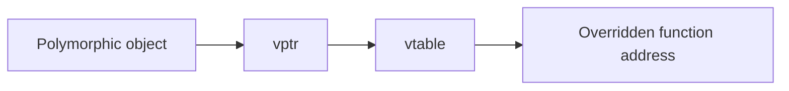
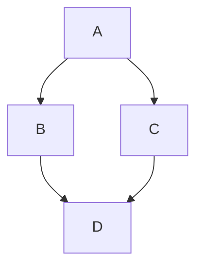

# Virtual Functions, vtable, and Diamond Problem

> `virtual` runtime polymorphism enable karta hai. Diamond issue ko `virtual inheritance` solve karta hai.

**Code demos:**  
[`06_Virtual_Destructor.cpp`](../C++%20Code/06_Virtual_Destructor.cpp)  
[`07_Virtual_Table_Demo.cpp`](../C++%20Code/07_Virtual_Table_Demo.cpp)  
[`08_Diamond_Problem.cpp`](../C++%20Code/08_Diamond_Problem.cpp)

---

## 1) Virtual Destructor

```cpp
BadBase* p = new DerivedBad();
delete p;  // virtual destructor na ho to undefined behavior risk
```

- Polymorphic base class me `virtual ~Base()` mandatory rakho.
- Isse delete-through-base-pointer safe hota hai.

Reference: [`Virtual_Destructor_Kyun.md`](./Virtual_Destructor_Kyun.md)

---

## 2) vptr and vtable

`07_Virtual_Table_Demo.cpp` me `makeSpeak(Animal*)` runtime par correct derived method call karta hai.



- `vptr`: hidden pointer in object.
- `vtable`: virtual methods ke function pointers ka table.

---

## 3) Diamond Problem



Without virtual inheritance, `D` ke andar `A` ke 2 subobjects aa jate hain, ambiguity hoti hai.

---

## 4) Virtual Inheritance Fix

```cpp
class Bv : public virtual A_virt {};
class Cv : public virtual A_virt {};
class D_good : public Bv, public Cv {};
```

- Ab shared base ka single instance rehta hai.
- Ambiguous member access issue remove hota hai.

---

## 5) Interview Quick Q&A

- **vtable kya hai?** Runtime dispatch table for virtual functions.
- **vptr kahan hota hai?** Har polymorphic object me hidden pointer.
- **Diamond issue kyun hota hai?** Same base tak multiple paths se duplicate base subobjects.
- **Fix?** Middle classes me `virtual` inheritance.
- **Virtual destructor kab?** Jab base pointer/reference se derived objects handle kar rahe ho.

---

## 6) Run

```bash
cd "L3 OOPS_2"
./compile.sh
./bin/06_Virtual_Destructor
./bin/07_Virtual_Table_Demo
./bin/08_Diamond_Problem
```

---

## 7) One-line Cheat Sheet

`virtual ~Base()` + `vptr -> vtable` + `virtual inheritance` = safe polymorphism + diamond fix.

### Run

`./bin/06_Virtual_Destructor` `07_Virtual_Table_Demo` `08_Diamond_Problem`

### Run

`./bin/06_Virtual_Destructor` `07_Virtual_Table_Demo` `08_Diamond_Problem`

### Run

`./bin/06_Virtual_Destructor` `07_Virtual_Table_Demo` `08_Diamond_Problem`

### Run

`./bin/06_Virtual_Destructor` `07_Virtual_Table_Demo` `08_Diamond_Problem`

### Run

`./bin/06_Virtual_Destructor` `07_Virtual_Table_Demo` `08_Diamond_Problem`

### Run

`./bin/06_Virtual_Destructor` `07_Virtual_Table_Demo` `08_Diamond_Problem`

### Run

`./bin/06_Virtual_Destructor` `07_Virtual_Table_Demo` `08_Diamond_Problem`

### Run

`./bin/06_Virtual_Destructor` `07_Virtual_Table_Demo` `08_Diamond_Problem`

### Run

`./bin/06_Virtual_Destructor` `07_Virtual_Table_Demo` `08_Diamond_Problem`

### Run

`./bin/06_Virtual_Destructor` `07_Virtual_Table_Demo` `08_Diamond_Problem`

### Run

`./bin/06_Virtual_Destructor` `07_Virtual_Table_Demo` `08_Diamond_Problem`

### Run

`./bin/06_Virtual_Destructor` `07_Virtual_Table_Demo` `08_Diamond_Problem`

### Run

`./bin/06_Virtual_Destructor` `07_Virtual_Table_Demo` `08_Diamond_Problem`

### Run

`./bin/06_Virtual_Destructor` `07_Virtual_Table_Demo` `08_Diamond_Problem`

### Run

`./bin/06_Virtual_Destructor` `07_Virtual_Table_Demo` `08_Diamond_Problem`

### Run

`./bin/06_Virtual_Destructor` `07_Virtual_Table_Demo` `08_Diamond_Problem`

### Run

`./bin/06_Virtual_Destructor` `07_Virtual_Table_Demo` `08_Diamond_Problem`

### Run

`./bin/06_Virtual_Destructor` `07_Virtual_Table_Demo` `08_Diamond_Problem`

### Run

`./bin/06_Virtual_Destructor` `07_Virtual_Table_Demo` `08_Diamond_Problem`

### Run

`./bin/06_Virtual_Destructor` `07_Virtual_Table_Demo` `08_Diamond_Problem`

### Run

`./bin/06_Virtual_Destructor` `07_Virtual_Table_Demo` `08_Diamond_Problem`

### Run

`./bin/06_Virtual_Destructor` `07_Virtual_Table_Demo` `08_Diamond_Problem`

### Run

`./bin/06_Virtual_Destructor` `07_Virtual_Table_Demo` `08_Diamond_Problem`

### Run

`./bin/06_Virtual_Destructor` `07_Virtual_Table_Demo` `08_Diamond_Problem`

### Run

`./bin/06_Virtual_Destructor` `07_Virtual_Table_Demo` `08_Diamond_Problem`

### Run

`./bin/06_Virtual_Destructor` `07_Virtual_Table_Demo` `08_Diamond_Problem`

### Run

`./bin/06_Virtual_Destructor` `07_Virtual_Table_Demo` `08_Diamond_Problem`
