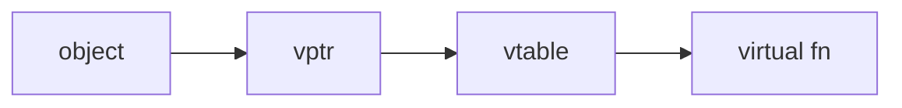
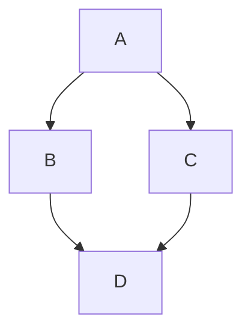

# Virtual Functions, vtable & Diamond Problem

> **EN:** `virtual` → runtime dispatch & virtual dtor; diamond needs `virtual` inheritance. **HI:** virtual = runtime; diamond me virtual base class.

> **Runnable demo:** [`06_Virtual_Destructor.cpp`](../C++ Code/06_Virtual_Destructor.cpp)
> **Runnable demo:** [`07_Virtual_Table_Demo.cpp`](../C++ Code/07_Virtual_Table_Demo.cpp)
> **Runnable demo:** [`08_Diamond_Problem.cpp`](../C++ Code/08_Diamond_Problem.cpp)
> **Parent guides:** [VIRTUAL_BASE_CLASS_ADVANCED](../VIRTUAL_BASE_CLASS_ADVANCED.md) · [Virtual_Destructor_Kyun](Virtual_Destructor_Kyun.md)

---

## Table of Contents

1. [Virtual destructor](#1-vdtor)
2. [vtable demo](#2-vtable)
3. [Diamond](#3-diamond)
4. [Virtual inheritance fix](#4-fix)
5. [Walkthroughs](#5-walk)
6. [Interview Q&A](#6-qa)
7. [Cheat sheet](#7-cheat)

## 1. Virtual destructor

<a id="1-virtual-destructor"></a>

```cpp
BadBase* p = new DerivedBad();
delete p;  // without virtual ~Base → leak
```

Full guide: [`Virtual_Destructor_Kyun.md`](Virtual_Destructor_Kyun.md)
## 2. vtable demo

<a id="2-vtable-demo"></a>

`07_Virtual_Table_Demo.cpp` — `makeSpeak(Animal*)` prints Woof/Meow; `sizeof(Animal)` includes **vptr**.


## 3. Diamond

<a id="3-diamond"></a>



`D_bad` in `08_Diamond_Problem.cpp` — two `A` subobjects → ambiguous `value` / `show()`.
## 4. Virtual inheritance fix

<a id="4-virtual-inheritance-fix"></a>

```cpp
class Bv : public virtual A_virt {};
class D_good : public Bv, public Cv { };
```

## 5. Walkthroughs

<a id="5-walkthroughs"></a>

### Full walkthrough — `08_Diamond_Problem.cpp`

### Without virtual

`D_bad::demo` cannot set `value` unqualified.
sizeof larger — duplicate A.

### With virtual

`D_good::show` sets single `A_virt::value`.
One shared base subobject.

## 6. Interview Q&A

<a id="6-interview-q-a"></a>

<details>
<summary><strong>What is vtable?</strong></summary>

Array of function pointers for virtual methods per class.

**हिंदी:** Virtual functions ki table.

</details>

<details>
<summary><strong>vptr kahan?</strong></summary>

Hidden pointer in each polymorphic object.

**हिंदी:** Object ke andar hidden.

</details>

<details>
<summary><strong>Diamond problem?</strong></summary>

Two paths to same base → duplicate subobjects.

**हिंदी:** Do A base copies.

</details>

<details>
<summary><strong>Fix diamond?</strong></summary>

`virtual` inheritance on middle classes.

**हिंदी:** virtual public Base.

</details>

<details>
<summary><strong>Virtual dtor mandatory when?</strong></summary>

Deleting derived via base pointer.

**हिंदी:** Base* delete.

</details>

<details>
<summary><strong>sizeof with diamond?</strong></summary>

Larger without virtual — duplicate bases.

**हिंदी:** virtual se ek base.

</details>

## 7. Cheat sheet

<a id="7-cheat-sheet"></a>

```text
virtual ~Base | vptr→vtable | diamond→virtual inheritance
```

### Run

`./bin/06_Virtual_Destructor` `07_Virtual_Table_Demo` `08_Diamond_Problem`

### Run

`./bin/06_Virtual_Destructor` `07_Virtual_Table_Demo` `08_Diamond_Problem`

### Run

`./bin/06_Virtual_Destructor` `07_Virtual_Table_Demo` `08_Diamond_Problem`

### Run

`./bin/06_Virtual_Destructor` `07_Virtual_Table_Demo` `08_Diamond_Problem`

### Run

`./bin/06_Virtual_Destructor` `07_Virtual_Table_Demo` `08_Diamond_Problem`

### Run

`./bin/06_Virtual_Destructor` `07_Virtual_Table_Demo` `08_Diamond_Problem`

### Run

`./bin/06_Virtual_Destructor` `07_Virtual_Table_Demo` `08_Diamond_Problem`

### Run

`./bin/06_Virtual_Destructor` `07_Virtual_Table_Demo` `08_Diamond_Problem`

### Run

`./bin/06_Virtual_Destructor` `07_Virtual_Table_Demo` `08_Diamond_Problem`

### Run

`./bin/06_Virtual_Destructor` `07_Virtual_Table_Demo` `08_Diamond_Problem`

### Run

`./bin/06_Virtual_Destructor` `07_Virtual_Table_Demo` `08_Diamond_Problem`

### Run

`./bin/06_Virtual_Destructor` `07_Virtual_Table_Demo` `08_Diamond_Problem`

### Run

`./bin/06_Virtual_Destructor` `07_Virtual_Table_Demo` `08_Diamond_Problem`

### Run

`./bin/06_Virtual_Destructor` `07_Virtual_Table_Demo` `08_Diamond_Problem`

### Run

`./bin/06_Virtual_Destructor` `07_Virtual_Table_Demo` `08_Diamond_Problem`

### Run

`./bin/06_Virtual_Destructor` `07_Virtual_Table_Demo` `08_Diamond_Problem`

### Run

`./bin/06_Virtual_Destructor` `07_Virtual_Table_Demo` `08_Diamond_Problem`

### Run

`./bin/06_Virtual_Destructor` `07_Virtual_Table_Demo` `08_Diamond_Problem`

### Run

`./bin/06_Virtual_Destructor` `07_Virtual_Table_Demo` `08_Diamond_Problem`

### Run

`./bin/06_Virtual_Destructor` `07_Virtual_Table_Demo` `08_Diamond_Problem`

### Run

`./bin/06_Virtual_Destructor` `07_Virtual_Table_Demo` `08_Diamond_Problem`

### Run

`./bin/06_Virtual_Destructor` `07_Virtual_Table_Demo` `08_Diamond_Problem`

### Run

`./bin/06_Virtual_Destructor` `07_Virtual_Table_Demo` `08_Diamond_Problem`

### Run

`./bin/06_Virtual_Destructor` `07_Virtual_Table_Demo` `08_Diamond_Problem`

### Run

`./bin/06_Virtual_Destructor` `07_Virtual_Table_Demo` `08_Diamond_Problem`

### Run

`./bin/06_Virtual_Destructor` `07_Virtual_Table_Demo` `08_Diamond_Problem`

### Run

`./bin/06_Virtual_Destructor` `07_Virtual_Table_Demo` `08_Diamond_Problem`

### Run

`./bin/06_Virtual_Destructor` `07_Virtual_Table_Demo` `08_Diamond_Problem`

### Run

`./bin/06_Virtual_Destructor` `07_Virtual_Table_Demo` `08_Diamond_Problem`

### Run

`./bin/06_Virtual_Destructor` `07_Virtual_Table_Demo` `08_Diamond_Problem`

### Run

`./bin/06_Virtual_Destructor` `07_Virtual_Table_Demo` `08_Diamond_Problem`

### Run

`./bin/06_Virtual_Destructor` `07_Virtual_Table_Demo` `08_Diamond_Problem`

### Run

`./bin/06_Virtual_Destructor` `07_Virtual_Table_Demo` `08_Diamond_Problem`

### Run

`./bin/06_Virtual_Destructor` `07_Virtual_Table_Demo` `08_Diamond_Problem`

### Run

`./bin/06_Virtual_Destructor` `07_Virtual_Table_Demo` `08_Diamond_Problem`

### Run

`./bin/06_Virtual_Destructor` `07_Virtual_Table_Demo` `08_Diamond_Problem`

### Run

`./bin/06_Virtual_Destructor` `07_Virtual_Table_Demo` `08_Diamond_Problem`

### Run

`./bin/06_Virtual_Destructor` `07_Virtual_Table_Demo` `08_Diamond_Problem`

### Run

`./bin/06_Virtual_Destructor` `07_Virtual_Table_Demo` `08_Diamond_Problem`

### Run

`./bin/06_Virtual_Destructor` `07_Virtual_Table_Demo` `08_Diamond_Problem`

### Run

`./bin/06_Virtual_Destructor` `07_Virtual_Table_Demo` `08_Diamond_Problem`

### Run

`./bin/06_Virtual_Destructor` `07_Virtual_Table_Demo` `08_Diamond_Problem`

### Run

`./bin/06_Virtual_Destructor` `07_Virtual_Table_Demo` `08_Diamond_Problem`

### Run

`./bin/06_Virtual_Destructor` `07_Virtual_Table_Demo` `08_Diamond_Problem`

### Run

`./bin/06_Virtual_Destructor` `07_Virtual_Table_Demo` `08_Diamond_Problem`

### Run

`./bin/06_Virtual_Destructor` `07_Virtual_Table_Demo` `08_Diamond_Problem`

### Run

`./bin/06_Virtual_Destructor` `07_Virtual_Table_Demo` `08_Diamond_Problem`

### Run

`./bin/06_Virtual_Destructor` `07_Virtual_Table_Demo` `08_Diamond_Problem`

### Run

`./bin/06_Virtual_Destructor` `07_Virtual_Table_Demo` `08_Diamond_Problem`

### Run

`./bin/06_Virtual_Destructor` `07_Virtual_Table_Demo` `08_Diamond_Problem`

### Run

`./bin/06_Virtual_Destructor` `07_Virtual_Table_Demo` `08_Diamond_Problem`

### Run

`./bin/06_Virtual_Destructor` `07_Virtual_Table_Demo` `08_Diamond_Problem`

### Run

`./bin/06_Virtual_Destructor` `07_Virtual_Table_Demo` `08_Diamond_Problem`

### Run

`./bin/06_Virtual_Destructor` `07_Virtual_Table_Demo` `08_Diamond_Problem`

### Run

`./bin/06_Virtual_Destructor` `07_Virtual_Table_Demo` `08_Diamond_Problem`

### Run

`./bin/06_Virtual_Destructor` `07_Virtual_Table_Demo` `08_Diamond_Problem`

### Run

`./bin/06_Virtual_Destructor` `07_Virtual_Table_Demo` `08_Diamond_Problem`

### Run

`./bin/06_Virtual_Destructor` `07_Virtual_Table_Demo` `08_Diamond_Problem`

### Run

`./bin/06_Virtual_Destructor` `07_Virtual_Table_Demo` `08_Diamond_Problem`

### Run

`./bin/06_Virtual_Destructor` `07_Virtual_Table_Demo` `08_Diamond_Problem`

### Run

`./bin/06_Virtual_Destructor` `07_Virtual_Table_Demo` `08_Diamond_Problem`

### Run

`./bin/06_Virtual_Destructor` `07_Virtual_Table_Demo` `08_Diamond_Problem`

### Run

`./bin/06_Virtual_Destructor` `07_Virtual_Table_Demo` `08_Diamond_Problem`

### Run

`./bin/06_Virtual_Destructor` `07_Virtual_Table_Demo` `08_Diamond_Problem`

### Run

`./bin/06_Virtual_Destructor` `07_Virtual_Table_Demo` `08_Diamond_Problem`

### Run

`./bin/06_Virtual_Destructor` `07_Virtual_Table_Demo` `08_Diamond_Problem`

### Run

`./bin/06_Virtual_Destructor` `07_Virtual_Table_Demo` `08_Diamond_Problem`

### Run

`./bin/06_Virtual_Destructor` `07_Virtual_Table_Demo` `08_Diamond_Problem`

### Run

`./bin/06_Virtual_Destructor` `07_Virtual_Table_Demo` `08_Diamond_Problem`

### Run

`./bin/06_Virtual_Destructor` `07_Virtual_Table_Demo` `08_Diamond_Problem`

### Run

`./bin/06_Virtual_Destructor` `07_Virtual_Table_Demo` `08_Diamond_Problem`

### Run

`./bin/06_Virtual_Destructor` `07_Virtual_Table_Demo` `08_Diamond_Problem`

### Run

`./bin/06_Virtual_Destructor` `07_Virtual_Table_Demo` `08_Diamond_Problem`

### Run

`./bin/06_Virtual_Destructor` `07_Virtual_Table_Demo` `08_Diamond_Problem`

### Run

`./bin/06_Virtual_Destructor` `07_Virtual_Table_Demo` `08_Diamond_Problem`

### Run

`./bin/06_Virtual_Destructor` `07_Virtual_Table_Demo` `08_Diamond_Problem`

### Run

`./bin/06_Virtual_Destructor` `07_Virtual_Table_Demo` `08_Diamond_Problem`

### Run

`./bin/06_Virtual_Destructor` `07_Virtual_Table_Demo` `08_Diamond_Problem`

### Run

`./bin/06_Virtual_Destructor` `07_Virtual_Table_Demo` `08_Diamond_Problem`

### Run

`./bin/06_Virtual_Destructor` `07_Virtual_Table_Demo` `08_Diamond_Problem`

### Run

`./bin/06_Virtual_Destructor` `07_Virtual_Table_Demo` `08_Diamond_Problem`

### Run

`./bin/06_Virtual_Destructor` `07_Virtual_Table_Demo` `08_Diamond_Problem`

### Run

`./bin/06_Virtual_Destructor` `07_Virtual_Table_Demo` `08_Diamond_Problem`

### Run

`./bin/06_Virtual_Destructor` `07_Virtual_Table_Demo` `08_Diamond_Problem`

### Run

`./bin/06_Virtual_Destructor` `07_Virtual_Table_Demo` `08_Diamond_Problem`

### Run

`./bin/06_Virtual_Destructor` `07_Virtual_Table_Demo` `08_Diamond_Problem`

### Run

`./bin/06_Virtual_Destructor` `07_Virtual_Table_Demo` `08_Diamond_Problem`

### Run

`./bin/06_Virtual_Destructor` `07_Virtual_Table_Demo` `08_Diamond_Problem`

### Run

`./bin/06_Virtual_Destructor` `07_Virtual_Table_Demo` `08_Diamond_Problem`

### Run

`./bin/06_Virtual_Destructor` `07_Virtual_Table_Demo` `08_Diamond_Problem`

### Run

`./bin/06_Virtual_Destructor` `07_Virtual_Table_Demo` `08_Diamond_Problem`

### Run

`./bin/06_Virtual_Destructor` `07_Virtual_Table_Demo` `08_Diamond_Problem`

### Run

`./bin/06_Virtual_Destructor` `07_Virtual_Table_Demo` `08_Diamond_Problem`

