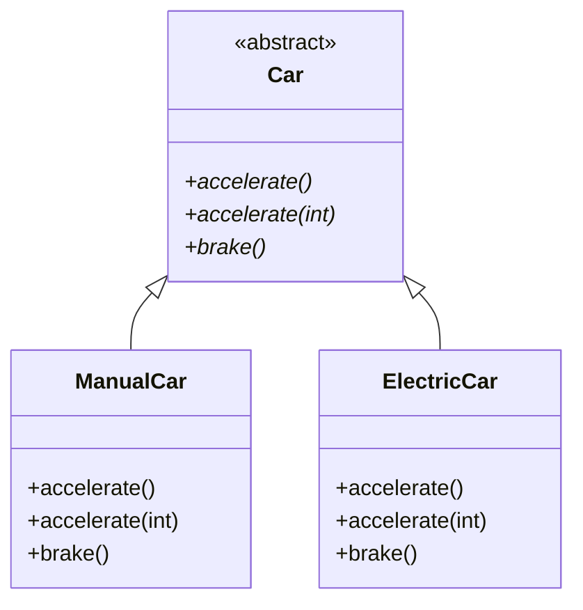
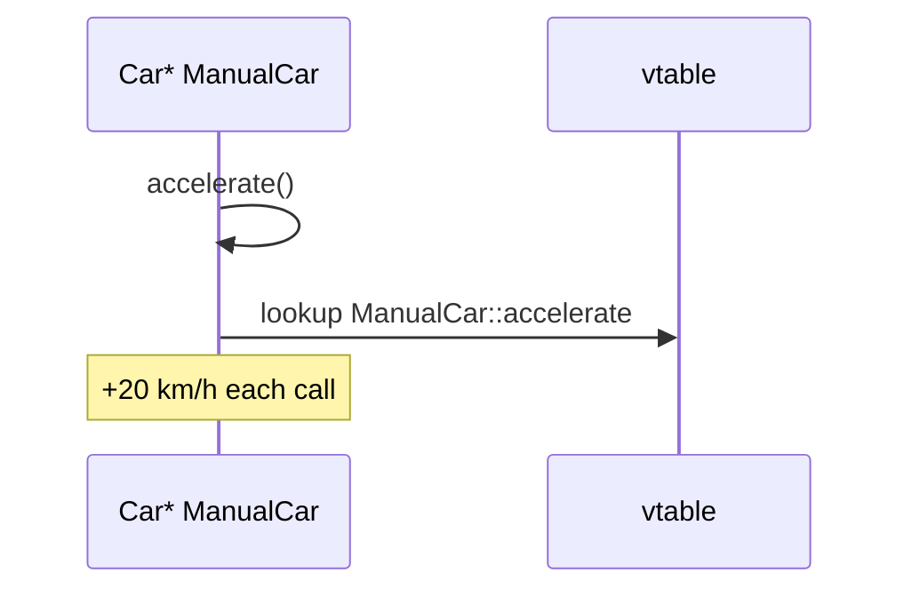

# Static + Dynamic Polymorphism Together

> **EN:** One base class can declare **multiple virtual `accelerate` overloads** — each derived class must **override all of them**. Combines compile-time overload resolution with runtime virtual dispatch.

> **Runnable demo:** [`04_Static_And_Dynamic_Polymorphism.cpp`](../C%20%2B%2B%20Code/04_Static_And_Dynamic_Polymorphism.cpp)  
> **See also:** [`02_polymorphism.md`](02_polymorphism.md) (overloading vs overriding basics) · [`03_Dynamic_Polymorphism.cpp`](../C%20%2B%2B%20Code/03_Dynamic_Polymorphism.cpp)  
> **Parent guides:** [OOPS_COMPLETE_GUIDE](../OOPS_COMPLETE_GUIDE.md)

---

## Table of Contents

1. [What this file proves](#1-what-this-file-proves)
2. [Base class — two virtual overloads](#2-base-class--two-virtual-overloads)
3. [Derived classes must override both](#3-derived-classes-must-override-both)
4. [main() flow](#4-main-flow)
5. [Static vs dynamic in one table](#5-static-vs-dynamic-in-one-table)
6. [Interview Q&A](#6-qa)

---

## 1. What this file proves

<a id="1-what-this-file-proves"></a>

| Idea | In this demo |
| ---- | ------------ |
| **Static (overload)** | `accelerate()` vs `accelerate(int speed)` — different signatures |
| **Dynamic (override)** | `ManualCar` / `ElectricCar` override **both** via `virtual` |
| **Together** | Through `Car*`, compiler picks overload; runtime picks `ManualCar` vs `ElectricCar` |

**Not the same as `02_Static_Polymorphism.cpp`** — there, overloading was **without** inheritance. Here, overloads live on an **abstract base** with `virtual`.

---

## 2. Base class — two virtual overloads

<a id="2-base-class--two-virtual-overloads"></a>

```cpp
class Car {
public:
    virtual void accelerate() = 0;
    virtual void accelerate(int speed) = 0;
    virtual void brake() = 0;
    virtual ~Car() {}
};
```

| Method | Role |
| ------ | ---- |
| `accelerate()` | Default speed behaviour — each child implements |
| `accelerate(int speed)` | Parameterized speed — **second overload**, also pure virtual |
| `virtual ~Car()` | Safe `delete` through `Car*` |

---

## 3. Derived classes must override both

<a id="3-derived-classes-must-override-both"></a>

### ManualCar

- `accelerate()` → +20 km/h fixed increment  
- `accelerate(int speed)` → adds `speed` to `currentSpeed`  
- `brake()` → −20 km/h  

### ElectricCar

- `accelerate()` → +15 km/h, drains battery  
- `accelerate(int speed)` → custom speed + extra battery drain  
- `brake()` → regenerative braking (−15 km/h)  

If you override only one `accelerate`, the class stays **abstract** and you cannot instantiate it.



---

## 4. main() flow

<a id="4-main-flow"></a>

```cpp
Car* myManualCar = new ManualCar("Ford", "Mustang");
myManualCar->startEngine();
myManualCar->accelerate();      // no-arg overload
myManualCar->accelerate();      // again +20
myManualCar->brake();
delete myManualCar;

Car* myElectricCar = new ElectricCar("Tesla", "Model S");
// same pattern — different vtable entries
```



**Note:** `main` only calls **no-arg** `accelerate()` on the pointer. To exercise `accelerate(int)`, call explicitly, e.g. `myManualCar->accelerate(30);` — overload still must exist in derived class.

---

## 5. Static vs dynamic in one table

<a id="5-static-vs-dynamic-in-one-table"></a>

| | Static part | Dynamic part |
| --- | --- | --- |
| **Mechanism** | Two signatures on `Car` | `virtual` + override in child |
| **Resolved when** | Compile time (which overload) | Runtime (which class’s override) |
| **Requires inheritance** | Overloads on base | Yes |
| **Abstract base** | Can be pure virtual both | Yes — forces both in children |
| **Typical interview line** | “Overload + override together on hierarchy” | |

Compare single demos:

| File | Focus |
| ---- | ----- |
| [`02_Static_Polymorphism.cpp`](../C%20%2B%2B%20Code/02_Static_Polymorphism.cpp) | Overload only, no virtual |
| [`03_Dynamic_Polymorphism.cpp`](../C%20%2B%2B%20Code/03_Dynamic_Polymorphism.cpp) | One `virtual accelerate()` |
| **`04_Static_And_Dynamic_Polymorphism.cpp`** | **Both overloads virtual + overridden** |

---

## 6. Interview Q&A

<a id="6-qa"></a>

<details>
<summary><strong>Why two virtual accelerate in base?</strong></summary>

To show **overloading on an interface** — callers through `Car*` can use default or parameterized accelerate; each concrete car implements **both** versions.

</details>

<details>
<summary><strong>What if derived overrides only one?</strong></summary>

Class remains **abstract** — compiler error if you try `new ManualCar` without implementing every pure virtual.

</details>

<details>
<summary><strong>Static or dynamic for accelerate(int)?</strong></summary>

**Overload choice** (static) at compile time when you write `p->accelerate(30)`. **Which implementation** (Manual vs Electric) is **dynamic** via vtable.

</details>

---

## Compile

```bash
cd "L3 OOPS_2"
./compile.sh
./bin/04_Static_And_Dynamic_Polymorphism
```
