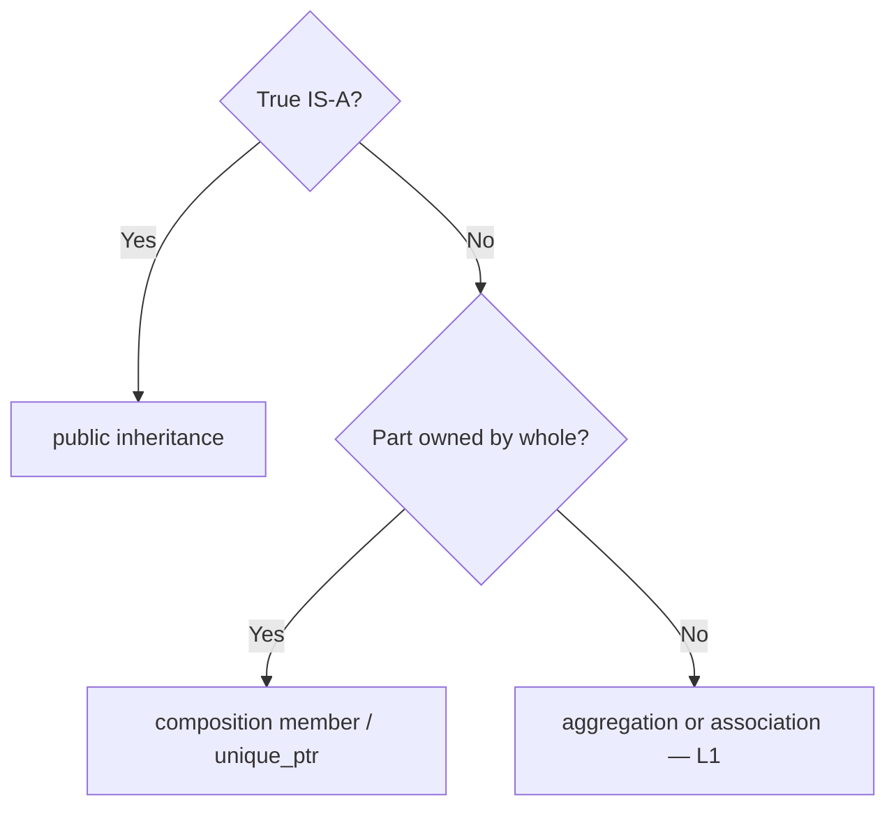
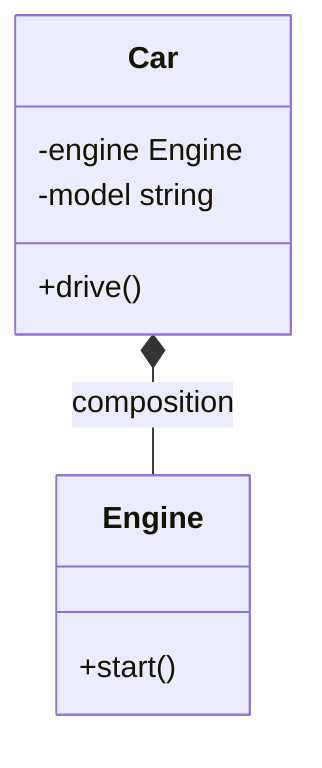

# Composition vs Inheritance — HAS-A vs IS-A

> **EN:** Use **inheritance** for true subtypes (IS-A). Use **composition** when one object **owns or contains** another (HAS-A). `Car` has an `Engine`; `Car` is not an `Engine`.

> **Runnable demo:** [`05_Composition_Vs_Inheritance.cpp`](../C++%20Code/05_Composition_Vs_Inheritance.cpp)  
> **Related:** [`L1 Composition`](../../%20L1%20Composition/) · [`L4 INHERITANCE_AND_COMPOSITION`](../../L4%20UML_Diagrams/INHERITANCE_AND_COMPOSITION.md)  
> **Parent guides:** [OOPS_COMPLETE_GUIDE](../OOPS_COMPLETE_GUIDE.md)

---

## Table of Contents

1. [Definitions](#1-definitions)
2. [Code walkthrough](#2-code-walkthrough)
3. [When to use which](#3-when-to-use-which)
4. [UML](#4-uml)
5. [Interview Q&A](#5-qa)

---

## 1. Definitions

<a id="1-definitions"></a>

| | Inheritance (IS-A) | Composition (HAS-A) |
| --- | --- | --- |
| **UML** | Hollow triangle `△` | Filled diamond `◆` on owner |
| **C++** | `class Car : public Vehicle` | `Engine engine;` inside `Car` |
| **Substitute?** | `Vehicle*` can point to `Car` | No — `Car` is not an `Engine` |
| **Lifetime** | Subtype relationship | Part often dies with whole |

**Rule of thumb:** If you cannot honestly say “X **is a** Y”, do not inherit — compose instead.

---

## 2. Code walkthrough

<a id="2-code-walkthrough"></a>

[`05_Composition_Vs_Inheritance.cpp`](../C++%20Code/05_Composition_Vs_Inheritance.cpp):

```cpp
class Car {
    Engine engine;  // HAS-A — member object
    string model;
public:
    Car(string m, string engineType) : model(m), engine(engineType) {}
    void drive() const {
        cout << model << ": ";
        engine.start();
    }
};
```

| Line / idea | Note |
| ----------- | ---- |
| `Engine engine` | **Composition** — `Engine` created/destroyed with `Car` |
| Constructor initializer list | `engine(engineType)` builds part inside `Car` |
| `drive()` | Delegates to `engine.start()` — behaviour through member |

**Wrong design (for contrast):**

```cpp
class Car : public Engine { };  // ❌ Car IS-NOT an Engine
```

---

## 3. When to use which

<a id="3-when-to-use-which"></a>

| Scenario | Prefer |
| -------- | ------ |
| `ManualCar` usable wherever `Car` expected | **Inheritance** |
| `ParkingLot` needs swappable pricing rules | **Composition** + Strategy (L8) |
| `Chair` has `Seat`, `Arms` | **Composition** |
| Code reuse only, no IS-A | **Composition** or helper — not inheritance |



---

## 4. UML

<a id="4-uml"></a>



---

## 5. Interview Q&A

<a id="5-qa"></a>

<details>
<summary><strong>Composition vs inheritance?</strong></summary>

**Composition:** has-a, owns/contain part — `Car` has `Engine`.  
**Inheritance:** is-a, subtype — `Dog` is `Animal`.

</details>

<details>
<summary><strong>Why not Car : Engine?</strong></summary>

A car is not a type of engine. HAS-A fits; IS-A does not (LSP would fail).

</details>

<details>
<summary><strong>LLD example?</strong></summary>

`ParkingLot` **has** `PricingStrategy`, not `ParkingLot : HourlyPricing`.

</details>

---

## Compile

```bash
cd "L3 OOPS_2"
./compile.sh
./bin/05_Composition_Vs_Inheritance
```

**Expected output:**

```text
Honda City: Petrol engine started.
```
