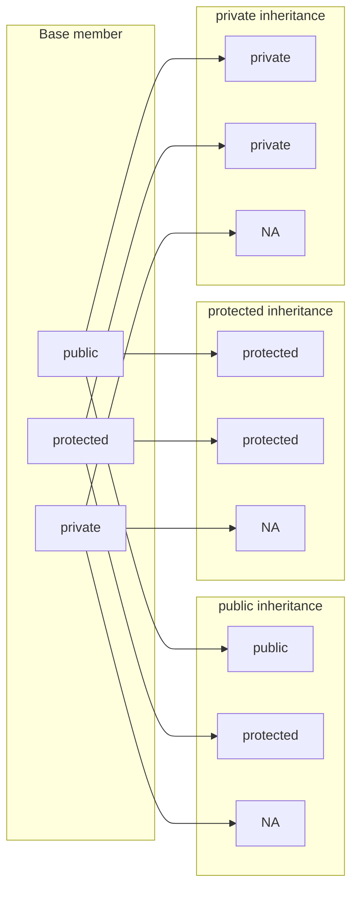
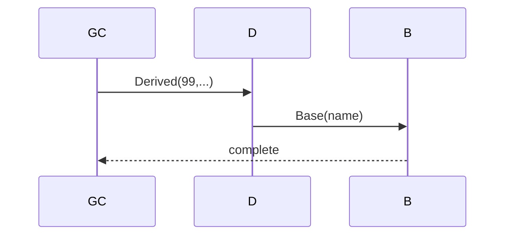

# Access Specifiers in Inheritance & Constructor Chaining

> **EN:** Inheritance mode changes effective access; ctors chain Base→Derived.

> **Runnable demo:** [`10_Access_Specifiers_Inheritance.cpp`](../C++ Code/10_Access_Specifiers_Inheritance.cpp)
> **Runnable demo:** [`11_Constructor_Chaining.cpp`](../C++ Code/11_Constructor_Chaining.cpp)
> **Parent guides:** [01_inheritance](01_inheritance.md)

---

## Table of Contents

1. [Member access](#1-member)
2. [Inheritance modes](#2-modes)
3. [10 demo](#3-10)
4. [Chaining rules](#4-chain)
5. [11 demo](#5-11)
6. [Interview Q&A](#6-qa)
7. [Cheat sheet](#7-cheat)

## 1. Member access

<a id="1-member-access"></a>

|  | Child | Outside |
|---|---|---|
| public | yes | yes |
| protected | yes | no |
| private | no | no |

## 2. Inheritance modes (access table)

<a id="2-inheritance-modes"></a>

> **Notebook rule:** Base class ka member **derived class mein** kya access ban jata hai — inheritance type par depend karta hai.
> **Private base members** child ko **accessible nahi** (sirf base ke andar) — isliye table mein **NA**.

| Base class ka access modifier | Public inheritance | Protected inheritance | Private inheritance |
| ----------------------------- | ------------------ | ------------------- | ------------------- |
| **public** | public | protected | private |
| **protected** | protected | protected | private |
| **private** | NA | NA | NA |


| Base | Public inherit | Protected inherit | Private inherit |
|------|----------------|-------------------|-----------------|
| public | public (bahar bhi) | protected (sirf child hierarchy) | private (implementation hide) |
| protected | protected | protected | private |
| private | inherit nahi hota (NA) | NA | NA |



**Default in interviews:** `class Child : public Base` — IS-A relationship.

## 3. 10 demo

<a id="3-10-demo"></a>

`PublicChild` — `pc.pub=10`, `Base* up=&pc` OK. `ProtectedChild` — pub became protected. `PrivateChild` — needs `using Base::showBase`.
## 4. Chaining rules

<a id="4-chaining-rules"></a>

Omit `Base(...)` → compiler calls `Base()` — **error** if no default ctor.
## 5. 11 demo

<a id="5-11-demo"></a>

GrandChild: `Base(string)` → `Derived body` → `GrandChild body`; destroy reverse.


## 6. Interview Q&A

<a id="6-interview-q-a"></a>

<details>
<summary><strong>public vs protected inheritance?</strong></summary>

public: IS-A visible outside; protected: base public→protected in child.


</details>

<details>
<summary><strong>Does child inherit private members?</strong></summary>

No access — they exist in base subobject only.


</details>

<details>
<summary><strong>Who calls Base ctor with args?</strong></summary>

Direct child in initializer list.


</details>

<details>
<summary><strong>GrandChild calls Base?</strong></summary>

No — only direct parent `Derived(...)`.


</details>

## 7. Cheat sheet

<a id="7-cheat-sheet"></a>

```text
public : public Base | Child() : Base(args)
construct Base→Child | destroy Child→Base
```

### Link

Also `01_Inheritance.cpp` line 72 `: Car(b,m)`.

### Link

Also `01_Inheritance.cpp` line 72 `: Car(b,m)`.

### Link

Also `01_Inheritance.cpp` line 72 `: Car(b,m)`.

### Link

Also `01_Inheritance.cpp` line 72 `: Car(b,m)`.

### Link

Also `01_Inheritance.cpp` line 72 `: Car(b,m)`.

### Link

Also `01_Inheritance.cpp` line 72 `: Car(b,m)`.

### Link

Also `01_Inheritance.cpp` line 72 `: Car(b,m)`.

### Link

Also `01_Inheritance.cpp` line 72 `: Car(b,m)`.

### Link

Also `01_Inheritance.cpp` line 72 `: Car(b,m)`.

### Link

Also `01_Inheritance.cpp` line 72 `: Car(b,m)`.

### Link

Also `01_Inheritance.cpp` line 72 `: Car(b,m)`.

### Link

Also `01_Inheritance.cpp` line 72 `: Car(b,m)`.

### Link

Also `01_Inheritance.cpp` line 72 `: Car(b,m)`.

### Link

Also `01_Inheritance.cpp` line 72 `: Car(b,m)`.

### Link

Also `01_Inheritance.cpp` line 72 `: Car(b,m)`.

### Link

Also `01_Inheritance.cpp` line 72 `: Car(b,m)`.

### Link

Also `01_Inheritance.cpp` line 72 `: Car(b,m)`.

### Link

Also `01_Inheritance.cpp` line 72 `: Car(b,m)`.

### Link

Also `01_Inheritance.cpp` line 72 `: Car(b,m)`.

### Link

Also `01_Inheritance.cpp` line 72 `: Car(b,m)`.

### Link

Also `01_Inheritance.cpp` line 72 `: Car(b,m)`.

### Link

Also `01_Inheritance.cpp` line 72 `: Car(b,m)`.

### Link

Also `01_Inheritance.cpp` line 72 `: Car(b,m)`.

### Link

Also `01_Inheritance.cpp` line 72 `: Car(b,m)`.

### Link

Also `01_Inheritance.cpp` line 72 `: Car(b,m)`.

### Link

Also `01_Inheritance.cpp` line 72 `: Car(b,m)`.

### Link

Also `01_Inheritance.cpp` line 72 `: Car(b,m)`.

### Link

Also `01_Inheritance.cpp` line 72 `: Car(b,m)`.

### Link

Also `01_Inheritance.cpp` line 72 `: Car(b,m)`.

### Link

Also `01_Inheritance.cpp` line 72 `: Car(b,m)`.

### Link

Also `01_Inheritance.cpp` line 72 `: Car(b,m)`.

### Link

Also `01_Inheritance.cpp` line 72 `: Car(b,m)`.

### Link

Also `01_Inheritance.cpp` line 72 `: Car(b,m)`.

### Link

Also `01_Inheritance.cpp` line 72 `: Car(b,m)`.

### Link

Also `01_Inheritance.cpp` line 72 `: Car(b,m)`.

### Link

Also `01_Inheritance.cpp` line 72 `: Car(b,m)`.

### Link

Also `01_Inheritance.cpp` line 72 `: Car(b,m)`.

### Link

Also `01_Inheritance.cpp` line 72 `: Car(b,m)`.

### Link

Also `01_Inheritance.cpp` line 72 `: Car(b,m)`.

### Link

Also `01_Inheritance.cpp` line 72 `: Car(b,m)`.

### Link

Also `01_Inheritance.cpp` line 72 `: Car(b,m)`.

### Link

Also `01_Inheritance.cpp` line 72 `: Car(b,m)`.

### Link

Also `01_Inheritance.cpp` line 72 `: Car(b,m)`.

### Link

Also `01_Inheritance.cpp` line 72 `: Car(b,m)`.

### Link

Also `01_Inheritance.cpp` line 72 `: Car(b,m)`.

### Link

Also `01_Inheritance.cpp` line 72 `: Car(b,m)`.

### Link

Also `01_Inheritance.cpp` line 72 `: Car(b,m)`.

### Link

Also `01_Inheritance.cpp` line 72 `: Car(b,m)`.

### Link

Also `01_Inheritance.cpp` line 72 `: Car(b,m)`.

### Link

Also `01_Inheritance.cpp` line 72 `: Car(b,m)`.

### Link

Also `01_Inheritance.cpp` line 72 `: Car(b,m)`.

### Link

Also `01_Inheritance.cpp` line 72 `: Car(b,m)`.

### Link

Also `01_Inheritance.cpp` line 72 `: Car(b,m)`.

### Link

Also `01_Inheritance.cpp` line 72 `: Car(b,m)`.

### Link

Also `01_Inheritance.cpp` line 72 `: Car(b,m)`.

### Link

Also `01_Inheritance.cpp` line 72 `: Car(b,m)`.

### Link

Also `01_Inheritance.cpp` line 72 `: Car(b,m)`.

### Link

Also `01_Inheritance.cpp` line 72 `: Car(b,m)`.

### Link

Also `01_Inheritance.cpp` line 72 `: Car(b,m)`.

### Link

Also `01_Inheritance.cpp` line 72 `: Car(b,m)`.

### Link

Also `01_Inheritance.cpp` line 72 `: Car(b,m)`.

### Link

Also `01_Inheritance.cpp` line 72 `: Car(b,m)`.

### Link

Also `01_Inheritance.cpp` line 72 `: Car(b,m)`.

### Link

Also `01_Inheritance.cpp` line 72 `: Car(b,m)`.

### Link

Also `01_Inheritance.cpp` line 72 `: Car(b,m)`.

### Link

Also `01_Inheritance.cpp` line 72 `: Car(b,m)`.

### Link

Also `01_Inheritance.cpp` line 72 `: Car(b,m)`.

### Link

Also `01_Inheritance.cpp` line 72 `: Car(b,m)`.

### Link

Also `01_Inheritance.cpp` line 72 `: Car(b,m)`.

### Link

Also `01_Inheritance.cpp` line 72 `: Car(b,m)`.

### Link

Also `01_Inheritance.cpp` line 72 `: Car(b,m)`.

### Link

Also `01_Inheritance.cpp` line 72 `: Car(b,m)`.

### Link

Also `01_Inheritance.cpp` line 72 `: Car(b,m)`.

### Link

Also `01_Inheritance.cpp` line 72 `: Car(b,m)`.

### Link

Also `01_Inheritance.cpp` line 72 `: Car(b,m)`.

### Link

Also `01_Inheritance.cpp` line 72 `: Car(b,m)`.

### Link

Also `01_Inheritance.cpp` line 72 `: Car(b,m)`.

### Link

Also `01_Inheritance.cpp` line 72 `: Car(b,m)`.

### Link

Also `01_Inheritance.cpp` line 72 `: Car(b,m)`.

### Link

Also `01_Inheritance.cpp` line 72 `: Car(b,m)`.

### Link

Also `01_Inheritance.cpp` line 72 `: Car(b,m)`.

### Link

Also `01_Inheritance.cpp` line 72 `: Car(b,m)`.

### Link

Also `01_Inheritance.cpp` line 72 `: Car(b,m)`.

### Link

Also `01_Inheritance.cpp` line 72 `: Car(b,m)`.

### Link

Also `01_Inheritance.cpp` line 72 `: Car(b,m)`.

### Link

Also `01_Inheritance.cpp` line 72 `: Car(b,m)`.

### Link

Also `01_Inheritance.cpp` line 72 `: Car(b,m)`.

### Link

Also `01_Inheritance.cpp` line 72 `: Car(b,m)`.

### Link

Also `01_Inheritance.cpp` line 72 `: Car(b,m)`.

### Link

Also `01_Inheritance.cpp` line 72 `: Car(b,m)`.

### Link

Also `01_Inheritance.cpp` line 72 `: Car(b,m)`.

### Link

Also `01_Inheritance.cpp` line 72 `: Car(b,m)`.

### Link

Also `01_Inheritance.cpp` line 72 `: Car(b,m)`.

### Link

Also `01_Inheritance.cpp` line 72 `: Car(b,m)`.

### Link

Also `01_Inheritance.cpp` line 72 `: Car(b,m)`.

### Link

Also `01_Inheritance.cpp` line 72 `: Car(b,m)`.

### Link

Also `01_Inheritance.cpp` line 72 `: Car(b,m)`.

### Link

Also `01_Inheritance.cpp` line 72 `: Car(b,m)`.

### Link

Also `01_Inheritance.cpp` line 72 `: Car(b,m)`.

### Link

Also `01_Inheritance.cpp` line 72 `: Car(b,m)`.

### Link

Also `01_Inheritance.cpp` line 72 `: Car(b,m)`.
