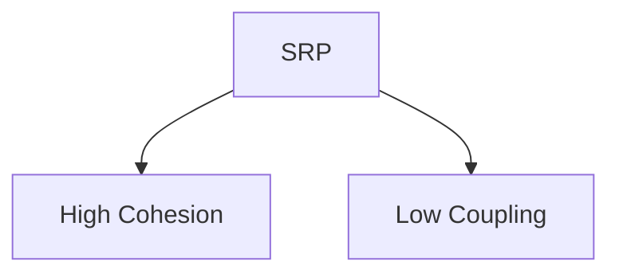
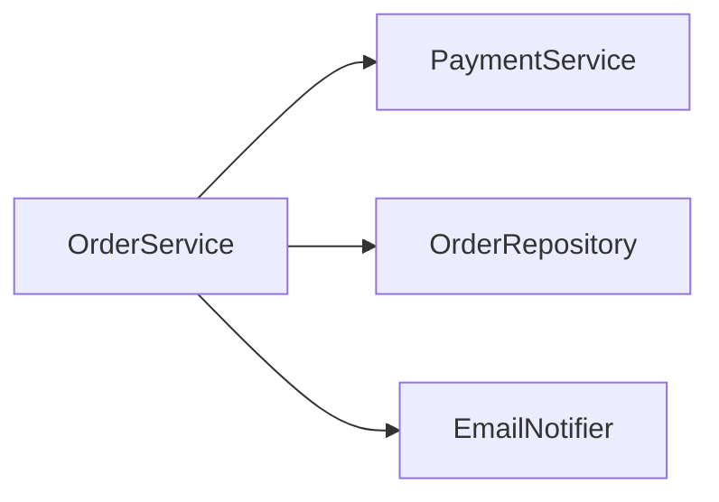

# Cohesion, Coupling & SOLID SRP

> **EN:** High cohesion inside; low coupling between; SRP splits responsibilities. **HI:** Ek class ek kaam; classes kam dependent.

> **Runnable demo:** [`14_Cohesion_Coupling.cpp`](../C++ Code/14_Cohesion_Coupling.cpp)
> **Parent guides:** [OOPS_COMPLETE_GUIDE](../OOPS_COMPLETE_GUIDE.md)

---

## Table of Contents

1. [Cohesion](#1-coh)
2. [Coupling](#2-coup)
3. [14 walkthrough](#3-14)
4. [SRP](#4-srp)
5. [Diagram](#5-diag)
6. [Interview Q&A](#6-qa)
7. [Cheat sheet](#7-cheat)

## 1. Cohesion

<a id="1-cohesion"></a>

**High cohesion** — all methods serve one purpose (`PaymentService` only pays).
## 2. Coupling

<a id="2-coupling"></a>

**Low coupling** — depend on interfaces/refs, not concrete internals.
## 3. 14 walkthrough

<a id="3-14-walkthrough"></a>

`GodOrderProcessor` — validate+DB+pay+email+log in one class. `OrderService` orchestrates three focused services.
## 4. SRP

<a id="4-srp"></a>

**Single Responsibility Principle** — one reason to change per class → naturally **high cohesion**, **lower coupling**.


## 5. Diagram

<a id="5-diagram"></a>



## 6. Interview Q&A

<a id="6-interview-q-a"></a>

<details>
<summary><strong>Cohesion vs coupling?</strong></summary>

Cohesion within class; coupling between classes.

**हिंदी:** Andar unity; bahar dependence.

</details>

<details>
<summary><strong>High cohesion good?</strong></summary>

Yes — focused class.

**हिंदी:** Haan focused.

</details>

<details>
<summary><strong>Low coupling good?</strong></summary>

Yes — easier change/test.

**हिंदी:** Haan maintainable.

</details>

<details>
<summary><strong>SRP relation?</strong></summary>

One class one job → cohesion up, coupling down.

**हिंदी:** SRP = ek kaam.

</details>

<details>
<summary><strong>God class?</strong></summary>

Low cohesion high coupling anti-pattern — 14 demo.

**हिंदी:** Sab ek class me mat karo.

</details>

## 7. Cheat sheet

<a id="7-cheat-sheet"></a>

```text
High cohesion + Low coupling
SRP: one reason to change
14_Cohesion_Coupling.cpp
```

### DI

Constructor injection reduces coupling — swap `EmailNotifier` mock in tests.

### DI

Constructor injection reduces coupling — swap `EmailNotifier` mock in tests.

### DI

Constructor injection reduces coupling — swap `EmailNotifier` mock in tests.

### DI

Constructor injection reduces coupling — swap `EmailNotifier` mock in tests.

### DI

Constructor injection reduces coupling — swap `EmailNotifier` mock in tests.

### DI

Constructor injection reduces coupling — swap `EmailNotifier` mock in tests.

### DI

Constructor injection reduces coupling — swap `EmailNotifier` mock in tests.

### DI

Constructor injection reduces coupling — swap `EmailNotifier` mock in tests.

### DI

Constructor injection reduces coupling — swap `EmailNotifier` mock in tests.

### DI

Constructor injection reduces coupling — swap `EmailNotifier` mock in tests.

### DI

Constructor injection reduces coupling — swap `EmailNotifier` mock in tests.

### DI

Constructor injection reduces coupling — swap `EmailNotifier` mock in tests.

### DI

Constructor injection reduces coupling — swap `EmailNotifier` mock in tests.

### DI

Constructor injection reduces coupling — swap `EmailNotifier` mock in tests.

### DI

Constructor injection reduces coupling — swap `EmailNotifier` mock in tests.

### DI

Constructor injection reduces coupling — swap `EmailNotifier` mock in tests.

### DI

Constructor injection reduces coupling — swap `EmailNotifier` mock in tests.

### DI

Constructor injection reduces coupling — swap `EmailNotifier` mock in tests.

### DI

Constructor injection reduces coupling — swap `EmailNotifier` mock in tests.

### DI

Constructor injection reduces coupling — swap `EmailNotifier` mock in tests.

### DI

Constructor injection reduces coupling — swap `EmailNotifier` mock in tests.

### DI

Constructor injection reduces coupling — swap `EmailNotifier` mock in tests.

### DI

Constructor injection reduces coupling — swap `EmailNotifier` mock in tests.

### DI

Constructor injection reduces coupling — swap `EmailNotifier` mock in tests.

### DI

Constructor injection reduces coupling — swap `EmailNotifier` mock in tests.

### DI

Constructor injection reduces coupling — swap `EmailNotifier` mock in tests.

### DI

Constructor injection reduces coupling — swap `EmailNotifier` mock in tests.

### DI

Constructor injection reduces coupling — swap `EmailNotifier` mock in tests.

### DI

Constructor injection reduces coupling — swap `EmailNotifier` mock in tests.

### DI

Constructor injection reduces coupling — swap `EmailNotifier` mock in tests.

### DI

Constructor injection reduces coupling — swap `EmailNotifier` mock in tests.

### DI

Constructor injection reduces coupling — swap `EmailNotifier` mock in tests.

### DI

Constructor injection reduces coupling — swap `EmailNotifier` mock in tests.

### DI

Constructor injection reduces coupling — swap `EmailNotifier` mock in tests.

### DI

Constructor injection reduces coupling — swap `EmailNotifier` mock in tests.

### DI

Constructor injection reduces coupling — swap `EmailNotifier` mock in tests.

### DI

Constructor injection reduces coupling — swap `EmailNotifier` mock in tests.

### DI

Constructor injection reduces coupling — swap `EmailNotifier` mock in tests.

### DI

Constructor injection reduces coupling — swap `EmailNotifier` mock in tests.

### DI

Constructor injection reduces coupling — swap `EmailNotifier` mock in tests.

### DI

Constructor injection reduces coupling — swap `EmailNotifier` mock in tests.

### DI

Constructor injection reduces coupling — swap `EmailNotifier` mock in tests.

### DI

Constructor injection reduces coupling — swap `EmailNotifier` mock in tests.

### DI

Constructor injection reduces coupling — swap `EmailNotifier` mock in tests.

### DI

Constructor injection reduces coupling — swap `EmailNotifier` mock in tests.

### DI

Constructor injection reduces coupling — swap `EmailNotifier` mock in tests.

### DI

Constructor injection reduces coupling — swap `EmailNotifier` mock in tests.

### DI

Constructor injection reduces coupling — swap `EmailNotifier` mock in tests.

### DI

Constructor injection reduces coupling — swap `EmailNotifier` mock in tests.

### DI

Constructor injection reduces coupling — swap `EmailNotifier` mock in tests.

### DI

Constructor injection reduces coupling — swap `EmailNotifier` mock in tests.

### DI

Constructor injection reduces coupling — swap `EmailNotifier` mock in tests.

### DI

Constructor injection reduces coupling — swap `EmailNotifier` mock in tests.

### DI

Constructor injection reduces coupling — swap `EmailNotifier` mock in tests.

### DI

Constructor injection reduces coupling — swap `EmailNotifier` mock in tests.

### DI

Constructor injection reduces coupling — swap `EmailNotifier` mock in tests.

### DI

Constructor injection reduces coupling — swap `EmailNotifier` mock in tests.

### DI

Constructor injection reduces coupling — swap `EmailNotifier` mock in tests.

### DI

Constructor injection reduces coupling — swap `EmailNotifier` mock in tests.

### DI

Constructor injection reduces coupling — swap `EmailNotifier` mock in tests.

### DI

Constructor injection reduces coupling — swap `EmailNotifier` mock in tests.

### DI

Constructor injection reduces coupling — swap `EmailNotifier` mock in tests.

### DI

Constructor injection reduces coupling — swap `EmailNotifier` mock in tests.

### DI

Constructor injection reduces coupling — swap `EmailNotifier` mock in tests.

### DI

Constructor injection reduces coupling — swap `EmailNotifier` mock in tests.

### DI

Constructor injection reduces coupling — swap `EmailNotifier` mock in tests.

### DI

Constructor injection reduces coupling — swap `EmailNotifier` mock in tests.

### DI

Constructor injection reduces coupling — swap `EmailNotifier` mock in tests.

### DI

Constructor injection reduces coupling — swap `EmailNotifier` mock in tests.

### DI

Constructor injection reduces coupling — swap `EmailNotifier` mock in tests.

### DI

Constructor injection reduces coupling — swap `EmailNotifier` mock in tests.

### DI

Constructor injection reduces coupling — swap `EmailNotifier` mock in tests.

### DI

Constructor injection reduces coupling — swap `EmailNotifier` mock in tests.

### DI

Constructor injection reduces coupling — swap `EmailNotifier` mock in tests.

### DI

Constructor injection reduces coupling — swap `EmailNotifier` mock in tests.

### DI

Constructor injection reduces coupling — swap `EmailNotifier` mock in tests.

### DI

Constructor injection reduces coupling — swap `EmailNotifier` mock in tests.

### DI

Constructor injection reduces coupling — swap `EmailNotifier` mock in tests.

### DI

Constructor injection reduces coupling — swap `EmailNotifier` mock in tests.

### DI

Constructor injection reduces coupling — swap `EmailNotifier` mock in tests.

### DI

Constructor injection reduces coupling — swap `EmailNotifier` mock in tests.

### DI

Constructor injection reduces coupling — swap `EmailNotifier` mock in tests.

### DI

Constructor injection reduces coupling — swap `EmailNotifier` mock in tests.

### DI

Constructor injection reduces coupling — swap `EmailNotifier` mock in tests.

### DI

Constructor injection reduces coupling — swap `EmailNotifier` mock in tests.

### DI

Constructor injection reduces coupling — swap `EmailNotifier` mock in tests.

### DI

Constructor injection reduces coupling — swap `EmailNotifier` mock in tests.

### DI

Constructor injection reduces coupling — swap `EmailNotifier` mock in tests.

### DI

Constructor injection reduces coupling — swap `EmailNotifier` mock in tests.

### DI

Constructor injection reduces coupling — swap `EmailNotifier` mock in tests.

### DI

Constructor injection reduces coupling — swap `EmailNotifier` mock in tests.

### DI

Constructor injection reduces coupling — swap `EmailNotifier` mock in tests.

### DI

Constructor injection reduces coupling — swap `EmailNotifier` mock in tests.

### DI

Constructor injection reduces coupling — swap `EmailNotifier` mock in tests.

### DI

Constructor injection reduces coupling — swap `EmailNotifier` mock in tests.

### DI

Constructor injection reduces coupling — swap `EmailNotifier` mock in tests.

### DI

Constructor injection reduces coupling — swap `EmailNotifier` mock in tests.

### DI

Constructor injection reduces coupling — swap `EmailNotifier` mock in tests.

### DI

Constructor injection reduces coupling — swap `EmailNotifier` mock in tests.

### DI

Constructor injection reduces coupling — swap `EmailNotifier` mock in tests.

### DI

Constructor injection reduces coupling — swap `EmailNotifier` mock in tests.

