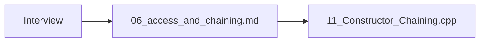
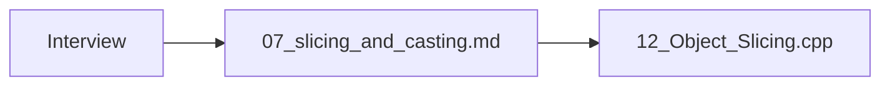
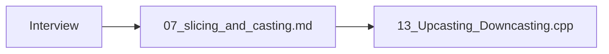
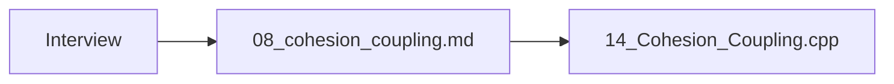

# Inheritance Interview Topics — Access, Chaining, Slicing, Casting, Cohesion

> Consolidated map to notes + runnable demos + parent guides.

> **Runnable demo:** [`10_Access_Specifiers_Inheritance.cpp`](../C++ Code/10_Access_Specifiers_Inheritance.cpp)
> **Runnable demo:** [`11_Constructor_Chaining.cpp`](../C++ Code/11_Constructor_Chaining.cpp)
> **Runnable demo:** [`12_Object_Slicing.cpp`](../C++ Code/12_Object_Slicing.cpp)
> **Runnable demo:** [`13_Upcasting_Downcasting.cpp`](../C++ Code/13_Upcasting_Downcasting.cpp)
> **Runnable demo:** [`14_Cohesion_Coupling.cpp`](../C++ Code/14_Cohesion_Coupling.cpp)
> **Parent guides:** [01_inheritance](01_inheritance.md) · [06_access](06_access_and_chaining.md) · [07_slicing](07_slicing_and_casting.md) · [08_cohesion](08_cohesion_coupling.md) · [09_mi](09_mi_rtti_conversion.md)

---

## Table of Contents

## 1. Access specifiers in inheritance

<a id="1-access-specifiers-in-inheritance"></a>

**Note:** [`06_access_and_chaining.md`](06_access_and_chaining.md) · **Run:** `./bin/10_Access_Specifiers_Inheritance`
public/protected/private members; public/protected/private **inheritance** modes.


## 2. Constructor chaining

<a id="2-constructor-chaining"></a>

**Note:** [`06_access_and_chaining.md`](06_access_and_chaining.md) · **Run:** `./bin/11_Constructor_Chaining`
`: Base(args)` in init list; order Base→Derived; GrandChild chains Derived only.



## 3. Object slicing

<a id="3-object-slicing"></a>

**Note:** [`07_slicing_and_casting.md`](07_slicing_and_casting.md) · **Run:** `./bin/12_Object_Slicing`
`Animal a = dog` slices; use ref/ptr; lambdas by value slice.



## 4. Upcasting & downcasting

<a id="4-upcasting-downcasting"></a>

**Note:** [`07_slicing_and_casting.md`](07_slicing_and_casting.md) · **Run:** `./bin/13_Upcasting_Downcasting`
Upcast implicit; downcast `dynamic_cast` + nullptr or bad_cast.



## 5. Cohesion & coupling + SRP

<a id="5-cohesion-coupling-srp"></a>

**Note:** [`08_cohesion_coupling.md`](08_cohesion_coupling.md) · **Run:** `./bin/14_Cohesion_Coupling`
God class vs OrderService orchestration; high cohesion low coupling.



## Related parent guides

<a id="related-parent-guides"></a>

| Topic | Guide | Code |
|---|---|---|
| MI ambiguity | ../MULTIPLE_INHERITANCE_AMBIGUITY.md | 15_*.cpp |
| RTTI | ../RTTI_COMPLETE.md | 16_*.cpp |
| Virtual base | ../VIRTUAL_BASE_CLASS_ADVANCED.md | 17_*.cpp |
| Covariant | ../COVARIANT_RETURN_TYPES.md | 18_*.cpp |
| Virtual dtor | Virtual_Destructor_Kyun.md | 06_*.cpp |
| Polymorphism | 02_polymorphism.md | 02–04 *.cpp |

## Cross-topic interview Q&A

<a id="cross-topic-interview-q-a"></a>

<details>
<summary><strong>public vs protected inheritance?</strong></summary>

public preserves IS-A externally; protected tightens to protected in child.

**हिंदी:** public default.

</details>

<details>
<summary><strong>Constructor order?</strong></summary>

Base then derived; destroy reverse.

**हिंदी:** Base pehle.

</details>

<details>
<summary><strong>Slicing example?</strong></summary>

Base b = derivedObj by value.

**हिंदी:** Value assign slice.

</details>

<details>
<summary><strong>Safe downcast?</strong></summary>

dynamic_cast + null check.

**हिंदी:** dynamic_cast.

</details>

<details>
<summary><strong>Cohesion vs coupling?</strong></summary>

Within vs between modules; want high/low.

**हिंदी:** Andar zyada bahar kam.

</details>

<details>
<summary><strong>SRP?</strong></summary>

One reason to change per class.

**हिंदी:** Ek class ek kaam.

</details>

<details>
<summary><strong>MI diamond?</strong></summary>

virtual inheritance shares one base.

**हिंदी:** virtual base.

</details>

<details>
<summary><strong>RTTI off?</strong></summary>

-fno-rtti — no dynamic_cast on poly types.

**हिंदी:** embedded builds.

</details>

## Master cheat sheet

<a id="master-cheat-sheet"></a>

```text
ACCESS: public/protected/private | inherit: public default
CHAIN: Child() : Base(args) | order construct Base→Child
SLICE: no Base b = d; yes Base& / Base*
CAST: upcast auto | downcast dynamic_cast
DESIGN: high cohesion, low coupling, SRP
```

<details>
<summary><strong>Access specifiers in inheritance — practice 1</strong></summary>

Open `06_access_and_chaining.md` section 1; explain aloud in Hindi then English.

**हिंदी:** `06_access_and_chaining.md` padho — pehle Hindi phir English.

</details>

<details>
<summary><strong>Access specifiers in inheritance — practice 2</strong></summary>

Open `06_access_and_chaining.md` section 2; explain aloud in Hindi then English.

**हिंदी:** `06_access_and_chaining.md` padho — pehle Hindi phir English.

</details>

<details>
<summary><strong>Access specifiers in inheritance — practice 3</strong></summary>

Open `06_access_and_chaining.md` section 3; explain aloud in Hindi then English.

**हिंदी:** `06_access_and_chaining.md` padho — pehle Hindi phir English.

</details>

<details>
<summary><strong>Access specifiers in inheritance — practice 4</strong></summary>

Open `06_access_and_chaining.md` section 4; explain aloud in Hindi then English.

**हिंदी:** `06_access_and_chaining.md` padho — pehle Hindi phir English.

</details>

<details>
<summary><strong>Access specifiers in inheritance — practice 5</strong></summary>

Open `06_access_and_chaining.md` section 5; explain aloud in Hindi then English.

**हिंदी:** `06_access_and_chaining.md` padho — pehle Hindi phir English.

</details>

<details>
<summary><strong>Access specifiers in inheritance — practice 6</strong></summary>

Open `06_access_and_chaining.md` section 6; explain aloud in Hindi then English.

**हिंदी:** `06_access_and_chaining.md` padho — pehle Hindi phir English.

</details>

<details>
<summary><strong>Access specifiers in inheritance — practice 7</strong></summary>

Open `06_access_and_chaining.md` section 7; explain aloud in Hindi then English.

**हिंदी:** `06_access_and_chaining.md` padho — pehle Hindi phir English.

</details>

<details>
<summary><strong>Access specifiers in inheritance — practice 8</strong></summary>

Open `06_access_and_chaining.md` section 8; explain aloud in Hindi then English.

**हिंदी:** `06_access_and_chaining.md` padho — pehle Hindi phir English.

</details>

<details>
<summary><strong>Constructor chaining — practice 1</strong></summary>

Open `06_access_and_chaining.md` section 1; explain aloud in Hindi then English.

**हिंदी:** `06_access_and_chaining.md` padho — pehle Hindi phir English.

</details>

<details>
<summary><strong>Constructor chaining — practice 2</strong></summary>

Open `06_access_and_chaining.md` section 2; explain aloud in Hindi then English.

**हिंदी:** `06_access_and_chaining.md` padho — pehle Hindi phir English.

</details>

<details>
<summary><strong>Constructor chaining — practice 3</strong></summary>

Open `06_access_and_chaining.md` section 3; explain aloud in Hindi then English.

**हिंदी:** `06_access_and_chaining.md` padho — pehle Hindi phir English.

</details>

<details>
<summary><strong>Constructor chaining — practice 4</strong></summary>

Open `06_access_and_chaining.md` section 4; explain aloud in Hindi then English.

**हिंदी:** `06_access_and_chaining.md` padho — pehle Hindi phir English.

</details>

<details>
<summary><strong>Constructor chaining — practice 5</strong></summary>

Open `06_access_and_chaining.md` section 5; explain aloud in Hindi then English.

**हिंदी:** `06_access_and_chaining.md` padho — pehle Hindi phir English.

</details>

<details>
<summary><strong>Constructor chaining — practice 6</strong></summary>

Open `06_access_and_chaining.md` section 6; explain aloud in Hindi then English.

**हिंदी:** `06_access_and_chaining.md` padho — pehle Hindi phir English.

</details>

<details>
<summary><strong>Constructor chaining — practice 7</strong></summary>

Open `06_access_and_chaining.md` section 7; explain aloud in Hindi then English.

**हिंदी:** `06_access_and_chaining.md` padho — pehle Hindi phir English.

</details>

<details>
<summary><strong>Constructor chaining — practice 8</strong></summary>

Open `06_access_and_chaining.md` section 8; explain aloud in Hindi then English.

**हिंदी:** `06_access_and_chaining.md` padho — pehle Hindi phir English.

</details>

<details>
<summary><strong>Object slicing — practice 1</strong></summary>

Open `07_slicing_and_casting.md` section 1; explain aloud in Hindi then English.

**हिंदी:** `07_slicing_and_casting.md` padho — pehle Hindi phir English.

</details>

<details>
<summary><strong>Object slicing — practice 2</strong></summary>

Open `07_slicing_and_casting.md` section 2; explain aloud in Hindi then English.

**हिंदी:** `07_slicing_and_casting.md` padho — pehle Hindi phir English.

</details>

<details>
<summary><strong>Object slicing — practice 3</strong></summary>

Open `07_slicing_and_casting.md` section 3; explain aloud in Hindi then English.

**हिंदी:** `07_slicing_and_casting.md` padho — pehle Hindi phir English.

</details>

<details>
<summary><strong>Object slicing — practice 4</strong></summary>

Open `07_slicing_and_casting.md` section 4; explain aloud in Hindi then English.

**हिंदी:** `07_slicing_and_casting.md` padho — pehle Hindi phir English.

</details>

<details>
<summary><strong>Object slicing — practice 5</strong></summary>

Open `07_slicing_and_casting.md` section 5; explain aloud in Hindi then English.

**हिंदी:** `07_slicing_and_casting.md` padho — pehle Hindi phir English.

</details>

<details>
<summary><strong>Object slicing — practice 6</strong></summary>

Open `07_slicing_and_casting.md` section 6; explain aloud in Hindi then English.

**हिंदी:** `07_slicing_and_casting.md` padho — pehle Hindi phir English.

</details>

<details>
<summary><strong>Object slicing — practice 7</strong></summary>

Open `07_slicing_and_casting.md` section 7; explain aloud in Hindi then English.

**हिंदी:** `07_slicing_and_casting.md` padho — pehle Hindi phir English.

</details>

<details>
<summary><strong>Object slicing — practice 8</strong></summary>

Open `07_slicing_and_casting.md` section 8; explain aloud in Hindi then English.

**हिंदी:** `07_slicing_and_casting.md` padho — pehle Hindi phir English.

</details>

<details>
<summary><strong>Upcasting & downcasting — practice 1</strong></summary>

Open `07_slicing_and_casting.md` section 1; explain aloud in Hindi then English.

**हिंदी:** `07_slicing_and_casting.md` padho — pehle Hindi phir English.

</details>

<details>
<summary><strong>Upcasting & downcasting — practice 2</strong></summary>

Open `07_slicing_and_casting.md` section 2; explain aloud in Hindi then English.

**हिंदी:** `07_slicing_and_casting.md` padho — pehle Hindi phir English.

</details>

<details>
<summary><strong>Upcasting & downcasting — practice 3</strong></summary>

Open `07_slicing_and_casting.md` section 3; explain aloud in Hindi then English.

**हिंदी:** `07_slicing_and_casting.md` padho — pehle Hindi phir English.

</details>

<details>
<summary><strong>Upcasting & downcasting — practice 4</strong></summary>

Open `07_slicing_and_casting.md` section 4; explain aloud in Hindi then English.

**हिंदी:** `07_slicing_and_casting.md` padho — pehle Hindi phir English.

</details>

<details>
<summary><strong>Upcasting & downcasting — practice 5</strong></summary>

Open `07_slicing_and_casting.md` section 5; explain aloud in Hindi then English.

**हिंदी:** `07_slicing_and_casting.md` padho — pehle Hindi phir English.

</details>

<details>
<summary><strong>Upcasting & downcasting — practice 6</strong></summary>

Open `07_slicing_and_casting.md` section 6; explain aloud in Hindi then English.

**हिंदी:** `07_slicing_and_casting.md` padho — pehle Hindi phir English.

</details>

<details>
<summary><strong>Upcasting & downcasting — practice 7</strong></summary>

Open `07_slicing_and_casting.md` section 7; explain aloud in Hindi then English.

**हिंदी:** `07_slicing_and_casting.md` padho — pehle Hindi phir English.

</details>

<details>
<summary><strong>Upcasting & downcasting — practice 8</strong></summary>

Open `07_slicing_and_casting.md` section 8; explain aloud in Hindi then English.

**हिंदी:** `07_slicing_and_casting.md` padho — pehle Hindi phir English.

</details>

<details>
<summary><strong>Cohesion & coupling + SRP — practice 1</strong></summary>

Open `08_cohesion_coupling.md` section 1; explain aloud in Hindi then English.

**हिंदी:** `08_cohesion_coupling.md` padho — pehle Hindi phir English.

</details>

<details>
<summary><strong>Cohesion & coupling + SRP — practice 2</strong></summary>

Open `08_cohesion_coupling.md` section 2; explain aloud in Hindi then English.

**हिंदी:** `08_cohesion_coupling.md` padho — pehle Hindi phir English.

</details>

<details>
<summary><strong>Cohesion & coupling + SRP — practice 3</strong></summary>

Open `08_cohesion_coupling.md` section 3; explain aloud in Hindi then English.

**हिंदी:** `08_cohesion_coupling.md` padho — pehle Hindi phir English.

</details>

<details>
<summary><strong>Cohesion & coupling + SRP — practice 4</strong></summary>

Open `08_cohesion_coupling.md` section 4; explain aloud in Hindi then English.

**हिंदी:** `08_cohesion_coupling.md` padho — pehle Hindi phir English.

</details>

<details>
<summary><strong>Cohesion & coupling + SRP — practice 5</strong></summary>

Open `08_cohesion_coupling.md` section 5; explain aloud in Hindi then English.

**हिंदी:** `08_cohesion_coupling.md` padho — pehle Hindi phir English.

</details>

<details>
<summary><strong>Cohesion & coupling + SRP — practice 6</strong></summary>

Open `08_cohesion_coupling.md` section 6; explain aloud in Hindi then English.

**हिंदी:** `08_cohesion_coupling.md` padho — pehle Hindi phir English.

</details>

<details>
<summary><strong>Cohesion & coupling + SRP — practice 7</strong></summary>

Open `08_cohesion_coupling.md` section 7; explain aloud in Hindi then English.

**हिंदी:** `08_cohesion_coupling.md` padho — pehle Hindi phir English.

</details>

<details>
<summary><strong>Cohesion & coupling + SRP — practice 8</strong></summary>

Open `08_cohesion_coupling.md` section 8; explain aloud in Hindi then English.

**हिंदी:** `08_cohesion_coupling.md` padho — pehle Hindi phir English.

</details>

