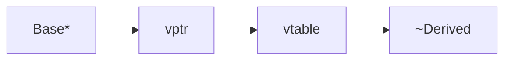
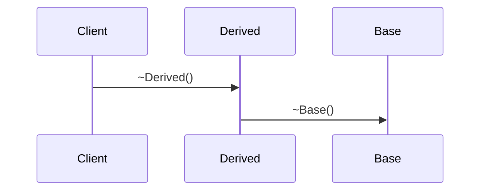

# Virtual Destructor Kyun Use Karte Hain? — Complete Guide

> **Short:** Base pointer se `delete` par non-virtual destructor → derived cleanup skip → leak. **Fix:** `virtual ~Base()`.

> **Runnable demo:** [`06_Virtual_Destructor.cpp`](../C++ Code/06_Virtual_Destructor.cpp)
> **Parent guides:** [OOPS_ADVANCED_INHERITANCE](../OOPS_ADVANCED_INHERITANCE.md) · [03_virtual_diamond](03_virtual_diamond.md)

---

## Table of Contents

1. [Problem](#1-problem)
2. [Solution](#2-solution)
3. [vtable](#3-vtable)
4. [Order](#4-order)
5. [When](#5-when)
6. [Repo](#6-repo)
7. [Smart ptrs](#7-smart)
8. [Interview Q&A](#8-qa)
9. [Cheat sheet](#9-cheat)

## 1. Problem

<a id="1-problem"></a>

```cpp
BadBase* p = new DerivedBad();
delete p;  // only ~BadBase
```

**Analogy:** Sirf upar ki floor todi — neeche derived ka saman reh gaya → **memory leak**.
| Derived resource | If ~Derived skipped |
|---|---|
| new int[100] | leak |
| FILE* | handle leak |
| mutex | deadlock risk |

## 2. Solution

<a id="2-solution"></a>

```cpp
class GoodBase { public: virtual ~GoodBase() { } };
```

Output: `~DerivedGood` then `~GoodBase` — heap freed.
## 3. vtable

<a id="3-vtable"></a>



Destructor entry in vtable — runtime picks `~Derived` when object is Derived.
## 4. Order

<a id="4-order"></a>



Construct: Base → Derived. Destroy: **reverse**.
## 5. When

<a id="5-when"></a>

| Situation | Virtual ~? |
|---|---|
| Any virtual fn | Yes |
| delete via Base* | Yes |
| Abstract interface | Yes |
| final, stack-only | Optional |

## 6. Repo

<a id="6-repo"></a>

```bash
cd "L3 OOPS_2" && ./compile.sh && ./bin/06_Virtual_Destructor
```
## 7. Smart ptrs

<a id="7-smart-ptrs"></a>

`unique_ptr<Base>` with Derived needs virtual ~Base when deleter uses base interface.
## 8. Interview Q&A

<a id="8-interview-q-a"></a>

<details>
<summary><strong>Virtual destructor kya hai?</strong></summary>

Destructor declared virtual for runtime dispatch on delete.


</details>

<details>
<summary><strong>Bina virtual problem?</strong></summary>

Only ~Base runs — derived resources leak.


</details>

<details>
<summary><strong>Already virtual methods?</strong></summary>

Class already polymorphic — add virtual ~Base too.


</details>

<details>
<summary><strong>= default safe?</strong></summary>

Yes — still dispatches to ~Derived.


</details>

<details>
<summary><strong>Cost?</strong></summary>

vptr if not already; usually already have vtable.


</details>

<details>
<summary><strong>unique_ptr without virtual?</strong></summary>

If stored as unique_ptr<Derived> only — OK; as Base* deleter needs virtual.


</details>

## 9. Cheat sheet

<a id="9-cheat-sheet"></a>

```text
Base* delete → virtual ~Base()
Order: ~Derived → ~Base
```

### One-liner EN

Virtual destructor ensures derived cleanup when deleting through base pointer.

### One-liner HI

Base* se delete par derived ka destructor chale — virtual ~Base zaroori.

### One-liner EN

Virtual destructor ensures derived cleanup when deleting through base pointer.

### One-liner HI

Base* se delete par derived ka destructor chale — virtual ~Base zaroori.

### One-liner EN

Virtual destructor ensures derived cleanup when deleting through base pointer.

### One-liner HI

Base* se delete par derived ka destructor chale — virtual ~Base zaroori.

### One-liner EN

Virtual destructor ensures derived cleanup when deleting through base pointer.

### One-liner HI

Base* se delete par derived ka destructor chale — virtual ~Base zaroori.

### One-liner EN

Virtual destructor ensures derived cleanup when deleting through base pointer.

### One-liner HI

Base* se delete par derived ka destructor chale — virtual ~Base zaroori.

### One-liner EN

Virtual destructor ensures derived cleanup when deleting through base pointer.

### One-liner HI

Base* se delete par derived ka destructor chale — virtual ~Base zaroori.

### One-liner EN

Virtual destructor ensures derived cleanup when deleting through base pointer.

### One-liner HI

Base* se delete par derived ka destructor chale — virtual ~Base zaroori.

### One-liner EN

Virtual destructor ensures derived cleanup when deleting through base pointer.

### One-liner HI

Base* se delete par derived ka destructor chale — virtual ~Base zaroori.

### One-liner EN

Virtual destructor ensures derived cleanup when deleting through base pointer.

### One-liner HI

Base* se delete par derived ka destructor chale — virtual ~Base zaroori.

### One-liner EN

Virtual destructor ensures derived cleanup when deleting through base pointer.

### One-liner HI

Base* se delete par derived ka destructor chale — virtual ~Base zaroori.

### One-liner EN

Virtual destructor ensures derived cleanup when deleting through base pointer.

### One-liner HI

Base* se delete par derived ka destructor chale — virtual ~Base zaroori.

### One-liner EN

Virtual destructor ensures derived cleanup when deleting through base pointer.

### One-liner HI

Base* se delete par derived ka destructor chale — virtual ~Base zaroori.

### One-liner EN

Virtual destructor ensures derived cleanup when deleting through base pointer.

### One-liner HI

Base* se delete par derived ka destructor chale — virtual ~Base zaroori.

### One-liner EN

Virtual destructor ensures derived cleanup when deleting through base pointer.

### One-liner HI

Base* se delete par derived ka destructor chale — virtual ~Base zaroori.

### One-liner EN

Virtual destructor ensures derived cleanup when deleting through base pointer.

### One-liner HI

Base* se delete par derived ka destructor chale — virtual ~Base zaroori.

### One-liner EN

Virtual destructor ensures derived cleanup when deleting through base pointer.

### One-liner HI

Base* se delete par derived ka destructor chale — virtual ~Base zaroori.

### One-liner EN

Virtual destructor ensures derived cleanup when deleting through base pointer.

### One-liner HI

Base* se delete par derived ka destructor chale — virtual ~Base zaroori.

### One-liner EN

Virtual destructor ensures derived cleanup when deleting through base pointer.

### One-liner HI

Base* se delete par derived ka destructor chale — virtual ~Base zaroori.

### One-liner EN

Virtual destructor ensures derived cleanup when deleting through base pointer.

### One-liner HI

Base* se delete par derived ka destructor chale — virtual ~Base zaroori.

### One-liner EN

Virtual destructor ensures derived cleanup when deleting through base pointer.

### One-liner HI

Base* se delete par derived ka destructor chale — virtual ~Base zaroori.

### One-liner EN

Virtual destructor ensures derived cleanup when deleting through base pointer.

### One-liner HI

Base* se delete par derived ka destructor chale — virtual ~Base zaroori.

### One-liner EN

Virtual destructor ensures derived cleanup when deleting through base pointer.

### One-liner HI

Base* se delete par derived ka destructor chale — virtual ~Base zaroori.

### One-liner EN

Virtual destructor ensures derived cleanup when deleting through base pointer.

### One-liner HI

Base* se delete par derived ka destructor chale — virtual ~Base zaroori.

### One-liner EN

Virtual destructor ensures derived cleanup when deleting through base pointer.

### One-liner HI

Base* se delete par derived ka destructor chale — virtual ~Base zaroori.

### One-liner EN

Virtual destructor ensures derived cleanup when deleting through base pointer.

### One-liner HI

Base* se delete par derived ka destructor chale — virtual ~Base zaroori.

### One-liner EN

Virtual destructor ensures derived cleanup when deleting through base pointer.

### One-liner HI

Base* se delete par derived ka destructor chale — virtual ~Base zaroori.

### One-liner EN

Virtual destructor ensures derived cleanup when deleting through base pointer.

### One-liner HI

Base* se delete par derived ka destructor chale — virtual ~Base zaroori.

### One-liner EN

Virtual destructor ensures derived cleanup when deleting through base pointer.

### One-liner HI

Base* se delete par derived ka destructor chale — virtual ~Base zaroori.

### One-liner EN

Virtual destructor ensures derived cleanup when deleting through base pointer.

### One-liner HI

Base* se delete par derived ka destructor chale — virtual ~Base zaroori.

### One-liner EN

Virtual destructor ensures derived cleanup when deleting through base pointer.

### One-liner HI

Base* se delete par derived ka destructor chale — virtual ~Base zaroori.

### One-liner EN

Virtual destructor ensures derived cleanup when deleting through base pointer.

### One-liner HI

Base* se delete par derived ka destructor chale — virtual ~Base zaroori.

### One-liner EN

Virtual destructor ensures derived cleanup when deleting through base pointer.

### One-liner HI

Base* se delete par derived ka destructor chale — virtual ~Base zaroori.

### One-liner EN

Virtual destructor ensures derived cleanup when deleting through base pointer.

### One-liner HI

Base* se delete par derived ka destructor chale — virtual ~Base zaroori.

### One-liner EN

Virtual destructor ensures derived cleanup when deleting through base pointer.

### One-liner HI

Base* se delete par derived ka destructor chale — virtual ~Base zaroori.

### One-liner EN

Virtual destructor ensures derived cleanup when deleting through base pointer.

### One-liner HI

Base* se delete par derived ka destructor chale — virtual ~Base zaroori.

### One-liner EN

Virtual destructor ensures derived cleanup when deleting through base pointer.

### One-liner HI

Base* se delete par derived ka destructor chale — virtual ~Base zaroori.

### One-liner EN

Virtual destructor ensures derived cleanup when deleting through base pointer.

### One-liner HI

Base* se delete par derived ka destructor chale — virtual ~Base zaroori.

### One-liner EN

Virtual destructor ensures derived cleanup when deleting through base pointer.

### One-liner HI

Base* se delete par derived ka destructor chale — virtual ~Base zaroori.

### One-liner EN

Virtual destructor ensures derived cleanup when deleting through base pointer.

### One-liner HI

Base* se delete par derived ka destructor chale — virtual ~Base zaroori.

### One-liner EN

Virtual destructor ensures derived cleanup when deleting through base pointer.

### One-liner HI

Base* se delete par derived ka destructor chale — virtual ~Base zaroori.

### One-liner EN

Virtual destructor ensures derived cleanup when deleting through base pointer.

### One-liner HI

Base* se delete par derived ka destructor chale — virtual ~Base zaroori.

### One-liner EN

Virtual destructor ensures derived cleanup when deleting through base pointer.

### One-liner HI

Base* se delete par derived ka destructor chale — virtual ~Base zaroori.

### One-liner EN

Virtual destructor ensures derived cleanup when deleting through base pointer.

### One-liner HI

Base* se delete par derived ka destructor chale — virtual ~Base zaroori.

### One-liner EN

Virtual destructor ensures derived cleanup when deleting through base pointer.

### One-liner HI

Base* se delete par derived ka destructor chale — virtual ~Base zaroori.

### One-liner EN

Virtual destructor ensures derived cleanup when deleting through base pointer.

### One-liner HI

Base* se delete par derived ka destructor chale — virtual ~Base zaroori.
