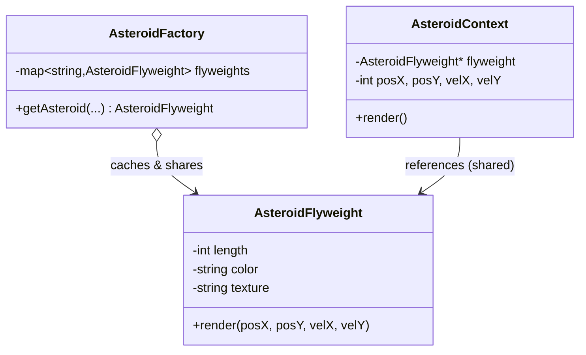

# Flyweight Design Pattern — Detailed Guide

> **Structural Design Pattern** that minimizes memory by **sharing** the common, immutable part of many objects. Heavy **intrinsic state** (texture, color, material) is stored **once** and shared; lightweight **extrinsic state** (position, velocity) is kept per instance.

**Domain example (in this repo):** A space game with **1,000,000 asteroids**. `WithFlyWeight.cpp` vs `WithoutFlyWeight.cpp` directly compare memory usage.

**Core problem it solves:** Creating millions of objects that each duplicate the same heavy fields wastes enormous amounts of memory.

---

## Table of Contents

1. [Problem — Memory Duplication at Scale](#1-problem--memory-duplication-at-scale)
2. [What is the Flyweight Pattern?](#2-what-is-the-flyweight-pattern)
3. [Intrinsic vs Extrinsic State](#3-intrinsic-vs-extrinsic-state)
4. [Real-World Analogy](#4-real-world-analogy)
5. [Key Participants (UML Roles)](#5-key-participants-uml-roles)
6. [When to Use / When to Avoid](#6-when-to-use--when-to-avoid)
7. [Pros and Cons](#7-pros-and-cons)
8. [Folder Structure](#8-folder-structure)
9. [Code Walkthrough](#9-code-walkthrough)
10. [Memory Comparison](#10-memory-comparison)
11. [Architecture Diagrams](#11-architecture-diagrams)
12. [Build & Run](#12-build--run)
13. [Flyweight vs Related Patterns](#13-flyweight-vs-related-patterns)
14. [Interview Talking Points](#14-interview-talking-points)
15. [Summary](#15-summary)

---

## 1. Problem — Memory Duplication at Scale

In `WithoutFlyWeight.cpp`, every asteroid stores its own copy of the heavy fields:

```cpp
// ❌ 1,000,000 asteroids each copy color, texture, material, size...
new Asteroid(length, width, weight, color, texture, material, posX, posY, velX, velY);
```

There are only **3 distinct asteroid types** (Red/Rocky/Iron, Blue/Metallic/Stone, Gray/Icy/Ice), yet a million full objects each duplicate that type data.

| Problem | Detail |
| ------- | ------ |
| **Duplicated heavy data** | Same texture/material stored a million times |
| **High memory** | Hundreds of MB for what is essentially 3 templates |
| **Cache pressure** | Large objects hurt locality and performance |

---

## 2. What is the Flyweight Pattern?

Split each object into a **shared** part and a **unique** part. A **factory** caches and reuses the shared flyweights:

```
AsteroidFactory (cache)  ──►  AsteroidFlyweight   (shared, intrinsic)
AsteroidContext (per instance: position + velocity, references a flyweight)
```

| Property | Detail |
| -------- | ------ |
| **Shared intrinsic state** | One `AsteroidFlyweight` per unique type |
| **Per-instance extrinsic state** | `AsteroidContext` holds position/velocity + a pointer to the flyweight |
| **Factory-managed sharing** | `AsteroidFactory::getAsteroid(...)` returns a cached flyweight |

---

## 3. Intrinsic vs Extrinsic State

| State | Meaning | Where it lives | Example |
| ----- | ------- | -------------- | ------- |
| **Intrinsic** | Shared, context-independent | `AsteroidFlyweight` (cached once) | length, width, weight, color, texture, material |
| **Extrinsic** | Unique per object | `AsteroidContext` (one per asteroid) | posX, posY, velocityX, velocityY |

The trick is recognizing which fields are **the same across many objects** (make them intrinsic/shared) versus **unique per object** (keep them extrinsic).

---

## 4. Real-World Analogy

| Analogy | Mapping |
| ------- | ------- |
| **Text editor characters** | The font glyph for `'a'` is stored once; each `'a'` on screen only stores its position |
| **Forest in a game** | One tree mesh/texture shared; thousands of trees store only x/y coordinates |
| **Chess pieces** | The model of a "pawn" is shared; only board position differs |

---

## 5. Key Participants (UML Roles)

| Role | In this demo |
| ---- | ------------ |
| **Flyweight** | `AsteroidFlyweight` — stores intrinsic state, exposes `render(pos, velocity)` |
| **Flyweight Factory** | `AsteroidFactory` — caches flyweights in an `unordered_map`, returns shared instances |
| **Context** | `AsteroidContext` — stores extrinsic state + a pointer to a flyweight |
| **Client** | `SpaceGameWithFlyweight` / `main()` — spawns asteroids, measures memory |

---

## 6. When to Use / When to Avoid

### ✅ Use when

| Scenario | Example |
| -------- | ------- |
| Huge number of similar objects | Particles, tiles, characters, map markers |
| Objects share large immutable data | Textures, glyphs, configuration blobs |
| Memory is the bottleneck | Games, rendering, large simulations |

### ❌ Avoid when

| Scenario | Reason |
| -------- | ------ |
| Few objects | Sharing overhead isn't worth it |
| State is mostly unique | Little to share → no savings |
| The shared data is tiny | The factory/indirection cost exceeds the benefit |

---

## 7. Pros and Cons

### Pros

| Benefit | Detail |
| ------- | ------ |
| **Massive memory savings** | Heavy data stored once, not per object |
| **Better cache behavior** | Small context objects iterate faster |
| **Centralized creation** | The factory controls and reuses shared state |

### Cons

| Drawback | Detail |
| -------- | ------ |
| **Complexity** | Splitting intrinsic vs extrinsic state is non-trivial |
| **Extrinsic passing** | Extrinsic state must be supplied on each call (`render(pos, vel)`) |
| **Shared mutability danger** | Flyweights must stay immutable, or sharing causes bugs |

---

## 8. Folder Structure

```
L30 Flyweight_design_pattern/
├── README.md                   ← This guide
└── C++ Code/
    ├── WithoutFlyWeight.cpp     ← Baseline: full objects (high memory)
    └── WithFlyWeight.cpp        ← Flyweight: shared intrinsic state
```

---

## 9. Code Walkthrough

**Flyweight — intrinsic state only:**

```cpp
class AsteroidFlyweight {
    int length, width, weight;
    string color, texture, material;        // shared, heavy
public:
    void render(int posX, int posY, int velX, int velY) {   // extrinsic passed in
        cout << "Rendering " << color << ", " << texture
             << " asteroid at (" << posX << "," << posY << ")\n";
    }
};
```

**Factory — caches and reuses flyweights:**

```cpp
class AsteroidFactory {
    static unordered_map<string, AsteroidFlyweight*> flyweights;
public:
    static AsteroidFlyweight* getAsteroid(int l,int w,int wt,
                                          string col,string tex,string mat) {
        string key = ...;                   // unique per type combination
        if (flyweights.find(key) == flyweights.end())
            flyweights[key] = new AsteroidFlyweight(l, w, wt, col, tex, mat);
        return flyweights[key];             // shared instance
    }
};
```

**Context — extrinsic state + flyweight pointer:**

```cpp
class AsteroidContext {
    AsteroidFlyweight* flyweight;           // shared
    int posX, posY, velocityX, velocityY;   // unique
public:
    void render() { flyweight->render(posX, posY, velocityX, velocityY); }
};
```

**Key:** 1,000,000 contexts share just **3** flyweights.

---

## 10. Memory Comparison

| Approach | Per object | 1,000,000 objects |
| -------- | ---------- | ----------------- |
| **Without flyweight** | Full struct (size + color + texture + material + pos + vel) | Hundreds of MB |
| **With flyweight** | Small context (4 ints + 1 pointer) + 3 shared flyweights | A small fraction |

`WithFlyWeight.cpp` prints the total bytes / MB so you can see the difference directly.

---

## 11. Architecture Diagrams



---

## 12. Build & Run

```bash
cd "L30 Flyweight_design_pattern/C++ Code"

g++ -std=c++17 -O2 -o without_flyweight WithoutFlyWeight.cpp && ./without_flyweight
g++ -std=c++17 -O2 -o with_flyweight WithFlyWeight.cpp && ./with_flyweight
```

> `-O2` recommended since both spawn 1,000,000 objects.

---

## 13. Flyweight vs Related Patterns

| Pattern | Intent | Difference from Flyweight |
| ------- | ------ | ------------------------- |
| **Singleton** | One instance globally | Flyweight shares *many* small immutables, not a single object |
| **Object Pool** | Reuse expensive objects | Pool recycles mutable objects; Flyweight shares immutable state |
| **Prototype** | Clone templates | Prototype *copies*; Flyweight *shares* (no copy) |
| **Proxy** | Control access to one object | Proxy is one stand-in; Flyweight is mass sharing for memory |

---

## 14. Interview Talking Points

1. **One-liner:** "Flyweight shares the common immutable part of many objects to save memory."
2. **Intrinsic vs extrinsic:** "Intrinsic = shared and context-free; extrinsic = unique and passed in at use time."
3. **Factory role:** "The factory caches flyweights so identical types are created once."
4. **Immutability:** "Shared flyweights must be immutable; otherwise one change affects everyone."
5. **Classic example:** "Glyphs in a text editor — one glyph object per character, positions stored externally."

---

## 15. Summary

| Aspect | Detail |
| ------ | ------ |
| **Pattern Type** | Structural |
| **Core Idea** | Share immutable intrinsic state; keep extrinsic state per instance |
| **Repo Example** | 1,000,000 asteroids sharing 3 flyweights |
| **Main Problem Solved** | Memory blow-up from duplicating heavy fields |
| **Key Files** | [`WithFlyWeight.cpp`](./C%20%2B%2B%20Code/WithFlyWeight.cpp), [`WithoutFlyWeight.cpp`](./C%20%2B%2B%20Code/WithoutFlyWeight.cpp) |

> **Remember:** Flyweight is like a **forest in a video game** — one tree model is loaded into memory, and each of the thousands of trees on screen only remembers *where* it stands. 🌲
